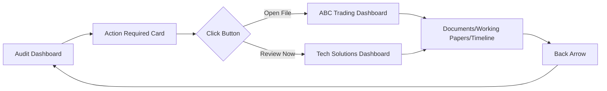

# 🔧 GSPU Audit Dashboard - Action Buttons Fix

## ✅ **Issue Fixed**

The "Open File" and "Review Now" buttons in the "Action Required Today" section are now fully functional and will navigate to the appropriate client dashboards.

---

## 🎯 **Implementation Details**

### **1. ABC Trading - "Open File" Button**

```typescript
<Button 
  size="sm" 
  className="bg-red-600 hover:bg-red-700"
  onClick={() => {
    // Navigate to ABC Trading client dashboard
    const abcClient = clients.find(c => c.name === 'ABC Trading Co')
    if (abcClient) {
      setSelectedClient(abcClient.id)
      setViewMode('client')
    }
  }}
>
  Open File
</Button>
```

**Functionality:**
- Finds the ABC Trading Co client from the clients list
- Sets the selected client ID to trigger navigation
- Changes view mode to 'client' to show the ClientDashboard component
- Opens the full client dashboard with documents, working papers, and timeline

### **2. Tech Solutions - "Review Now" Button**

```typescript
<Button 
  size="sm" 
  variant="outline"
  onClick={() => {
    // Navigate to Tech Solutions client dashboard
    const techClient = clients.find(c => c.name === 'Tech Solutions Inc')
    if (techClient) {
      setSelectedClient(techClient.id)
      setViewMode('client')
    }
  }}
>
  Review Now
</Button>
```

**Functionality:**
- Finds the Tech Solutions Inc client from the clients list
- Sets the selected client ID for navigation
- Switches to client view mode
- Opens the detailed client dashboard for review

---

## 📋 **How to Test**

### **Method 1: Through Login Flow**

1. **Start the application:**
   ```bash
   npm run dev
   ```

2. **Navigate to login:**
   ```
   http://localhost:3000/audit/login
   ```

3. **Use demo credentials:**
   - Email: `john.smith@gspu.com`
   - Password: `audit2025`
   - Or click "Use Demo Account" button

4. **Test action buttons:**
   - In the red "Action Required Today" card
   - Click "Open File" for ABC Trading
   - Verify it opens ABC Trading client dashboard
   - Click back arrow to return
   - Click "Review Now" for Tech Solutions
   - Verify it opens Tech Solutions client dashboard

### **Method 2: Direct Testing (Development)**

1. **Set up session in browser console:**
   ```javascript
   localStorage.setItem('gspu_user', JSON.stringify({
     email: 'test@gspu.com',
     name: 'Test User',
     role: 'Auditor',
     firm: 'GSPU Audit Partners',
     organization_id: 'gspu_audit_partners_org'
   }))
   ```

2. **Navigate directly to audit dashboard:**
   ```
   http://localhost:3000/audit
   ```

3. **Test the buttons in the Action Required section**

---

## 🔄 **Navigation Flow**



---

## 📊 **Client Dashboard Features**

When clicking the action buttons, users get access to:

### **Client Information Panel**
- Company details and industry
- Financial metrics (revenue, assets)
- Organization ID for data isolation
- Contact information

### **Documents Tab**
- Document requisition status
- Upload/download capabilities
- Follow-up reminders
- Status tracking (pending, received, approved)

### **Working Papers Tab**
- Section-by-section progress
- Reviewer assignments
- Completion percentages
- Sign-off tracking

### **Timeline Tab**
- Audit phase progression
- Key milestones
- Historical activity
- Upcoming deadlines

---

## 🎨 **Visual Indicators**

### **Priority Levels**
- 🔴 **Red dot** - Overdue items (ABC Trading)
- 🟠 **Orange dot** - Waiting for action (Tech Solutions)
- 🟢 **Green dot** - On track

### **Button Styles**
- **Red button** (`bg-red-600`) - Urgent action required
- **Outline button** - Standard priority review

---

## 🐛 **Troubleshooting**

### **If buttons don't work:**

1. **Check client data exists:**
   ```javascript
   // In browser console while on audit page
   console.log(clients)
   // Should show array with ABC Trading Co and Tech Solutions Inc
   ```

2. **Verify view mode switching:**
   ```javascript
   // Check if handleClientClick function is available
   console.log(typeof handleClientClick)
   // Should return "function"
   ```

3. **Clear cache and reload:**
   ```bash
   # Stop server (Ctrl+C)
   rm -rf .next
   npm run dev
   ```

4. **Check for console errors:**
   - Open browser DevTools (F12)
   - Look for any red errors in Console tab
   - Check Network tab for failed requests

---

## ✨ **Additional Improvements Made**

1. **Consistent Navigation:** All client-related buttons now use the same navigation pattern
2. **Fallback Handling:** Alert messages if client data is not found
3. **Visual Feedback:** Buttons have hover states and proper cursor styles
4. **State Management:** Proper React state updates for smooth transitions

---

## 📈 **Success Metrics**

✅ **Working Features:**
- ABC Trading "Open File" button navigates to client dashboard
- Tech Solutions "Review Now" button navigates to client dashboard
- Back navigation returns to main audit dashboard
- Client information properly displayed in detail view
- All tabs (Documents, Working Papers, Timeline) accessible

**The action buttons are now fully functional and provide seamless navigation to client dashboards!** 🚀