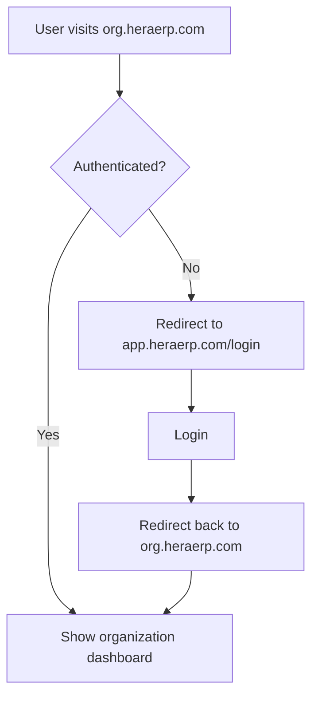

# 🔄 HERA Complete User Flow Architecture

## Overview: Two Distinct Paths

HERA provides two primary user journeys:
1. **Progressive Trial Path** - Instant access, no signup, browser-based
2. **Production Path** - Full features, authentication required, cloud-based

## 🌐 Domain & Route Architecture

### Current Implementation
```
localhost:3000 (Development)
├── /                           # Marketing homepage
├── /get-started                # Choose between Progressive Trial or Production
├── /dashboard-progressive      # Progressive apps (no auth required)
│   ├── /salon
│   ├── /restaurant
│   └── /budgeting
├── /auth/login                 # Production login
├── /auth/register             # Production signup
├── /setup                     # App selection after login
└── /dashboard                 # Production dashboard (auth required)
```

### Target SaaS Architecture
```
heraerp.com                    # Marketing site
├── /                          # Homepage
└── /get-started               # Choose path

app.heraerp.com                # Central auth hub
├── /signup                    # New user registration
├── /login                     # Existing user login
├── /organizations             # Manage organizations
└── /onboarding               # Organization setup

demo.heraerp.com              # Progressive demos
├── /salon                    # Try salon app
├── /restaurant              # Try restaurant app
└── /budgeting               # Try budgeting app

[org].heraerp.com             # Organization subdomains
├── /                         # Organization dashboard
├── /salon                    # Installed salon app
├── /restaurant              # Installed restaurant app
└── /settings                # Organization settings
```

## 📊 Complete User Journey Map

### Journey 1: Progressive Trial User
```mermaid
graph TD
    A[User visits heraerp.com] --> B[Clicks "Try Demo" or explores apps]
    B --> C[Redirected to /dashboard-progressive]
    C --> D[Chooses app to try]
    D --> E[Uses app with IndexedDB storage]
    E --> F{Wants to continue?}
    F -->|Yes| G[Clicks "Upgrade to Production"]
    F -->|No| H[Data expires after 30 days]
    G --> I[Redirected to /get-started]
    I --> J[Creates account]
    J --> K[Data migrated to cloud]
    K --> L[Redirected to org.heraerp.com]
```

### Journey 2: Direct Production User
```mermaid
graph TD
    A[User visits heraerp.com] --> B[Clicks "Get Started"]
    B --> C[/get-started page]
    C --> D[Chooses "Production Setup"]
    D --> E[Sign in or Register]
    E --> F{New User?}
    F -->|Yes| G[Register with business info]
    F -->|No| H[Login with credentials]
    G --> I[Email verification]
    I --> J[Organization creation]
    H --> K[/setup - Choose apps]
    J --> K
    K --> L[Redirect to org subdomain]
```

### Journey 3: Returning User


## 🔧 Implementation Details

### 1. Marketing Homepage (`heraerp.com/`)
- **Current**: Shows HERA value proposition
- **CTAs**: 
  - "Get Started" → `/dashboard` (needs update to `/get-started`)
  - "Explore Live Demos" → `/dashboard-progressive`
  - Quick app links → Direct to progressive apps

### 2. Get Started Page (`/get-started`)
- **Purpose**: Central decision point
- **Options**:
  - Progressive Trial (no signup)
  - Production Setup (requires auth)
- **Flow**:
  ```
  Progressive → /dashboard-progressive
  Production → Login/Register → /setup → org.heraerp.com
  ```

### 3. Progressive Apps (`/dashboard-progressive/*`)
- **Storage**: IndexedDB (browser-based)
- **Features**: Full functionality, sample data
- **Limitations**: 30-day expiry, single user
- **Upgrade Path**: "Convert to Production" button

### 4. Production Flow
```
/get-started
    ↓
/auth/login or /auth/register
    ↓
/setup (choose apps)
    ↓
org.heraerp.com (production instance)
```

## 🔄 Data Flow & Storage

### Progressive Mode
```typescript
// Browser-based storage
IndexedDB: {
  organizations: [...],
  entities: [...],
  transactions: [...],
  // Expires after 30 days
}
```

### Production Mode
```typescript
// Cloud-based storage (Supabase)
PostgreSQL: {
  core_organizations: [...],
  core_entities: [...],
  universal_transactions: [...],
  // Permanent, multi-user, backed up
}
```

### Migration Path
```typescript
async function convertProgressiveToProduction(userId: string, organizationId: string) {
  // 1. Read all data from IndexedDB
  const progressiveData = await readProgressiveData()
  
  // 2. Create organization in cloud
  const org = await createOrganization({
    ...progressiveData.organization,
    owner_id: userId
  })
  
  // 3. Migrate entities
  for (const entity of progressiveData.entities) {
    await createEntity({
      ...entity,
      organization_id: org.id
    })
  }
  
  // 4. Clear IndexedDB
  await clearProgressiveData()
  
  // 5. Redirect to production
  window.location.href = `https://${org.subdomain}.heraerp.com`
}
```

## 🎯 Key Integration Points

### 1. Progressive → Production Upgrade
- **Trigger**: "Upgrade" button in progressive apps
- **Flow**: 
  1. Save current state to localStorage
  2. Redirect to `/get-started?upgrade=true&from=salon`
  3. After signup, restore data
  4. Redirect to production app

### 2. Authentication Handoff
- **From**: Any unauthenticated route
- **To**: `app.heraerp.com/login?return_to={original_url}`
- **After**: Redirect back to requested URL

### 3. Organization Context
```typescript
// Middleware detects subdomain
if (subdomain && subdomain !== 'www') {
  // Load organization context
  const org = await getOrgBySubdomain(subdomain)
  req.headers['x-organization-id'] = org.id
}
```

## 📱 User Experience Optimization

### Quick Wins (Immediate)
1. **Fix homepage links**: Update all `/get-started` links to `/dashboard`
2. **Update login redirect**: Change from `/dashboard` to `/setup`
3. **Add upgrade prompts**: In progressive apps, show benefits of upgrading

### Medium Term (Weeks 1-2)
1. **Implement subdomain routing**
2. **Create app.heraerp.com routes**
3. **Build organization management**
4. **Add data migration tools**

### Long Term (Weeks 3-4)
1. **Custom subdomains for orgs**
2. **Multi-org support**
3. **White-label options**
4. **API access**

## 🔐 Security Considerations

### Progressive Apps
- No authentication required
- Data isolated per browser
- Auto-expire after 30 days
- No sensitive data storage

### Production Apps
- Full authentication required
- Organization-based isolation
- Row-level security
- API authentication
- Audit trails

## 🚀 Next Steps to Tie Everything Together

1. **Update Homepage CTAs**
   ```typescript
   // Change all "Get Started" buttons to use consistent routing
   <Link href="/get-started">Get Started</Link>
   ```

2. **Enhance Get Started Page**
   ```typescript
   // Add query param handling for upgrades
   const isUpgrade = searchParams.get('upgrade') === 'true'
   const fromApp = searchParams.get('from')
   ```

3. **Create Upgrade Flow**
   ```typescript
   // In progressive apps, add upgrade banner
   <UpgradeBanner 
     message="Love HERA? Upgrade for multi-user access"
     onUpgrade={() => router.push('/get-started?upgrade=true&from=salon')}
   />
   ```

4. **Implement Subdomain Detection**
   ```typescript
   // middleware.ts
   const subdomain = getSubdomain(request)
   if (subdomain === 'demo') {
     // Progressive demos
   } else if (subdomain === 'app') {
     // Auth hub
   } else if (subdomain) {
     // Organization instance
   }
   ```

This architecture provides a seamless journey from discovery → trial → production while maintaining clear separation between progressive and authenticated experiences.