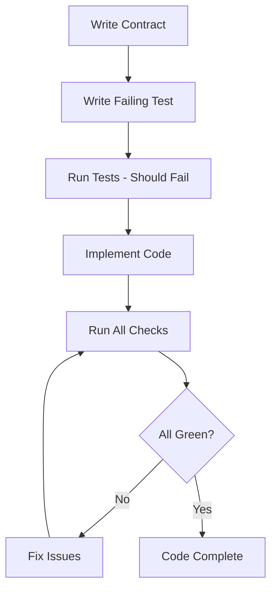

# HERA Definition of Done (DOOD)

## 🎯 **Mandatory Checklist - All Items Must Pass**

Every code change MUST satisfy ALL criteria below before it can be considered complete:

### ✅ **Contract Compliance**
- [ ] All new types defined in `src/contracts/**/*.ts` with Zod schemas
- [ ] All schemas use `.strict()` to prevent excess properties
- [ ] All external data validated with Zod schemas at runtime boundaries
- [ ] All component props use `exact<T>()` for compile-time drift prevention
- [ ] All imports from contracts use `@/contracts/*` barrel exports only

### ✅ **Type Safety**
- [ ] `pnpm tsc --noEmit --strict` passes with zero errors
- [ ] No `any`, `unknown`, or `object` types without explicit justification
- [ ] All functions have explicit return types
- [ ] All boundary literals use `exact<T>()` pattern
- [ ] No implicit returns or fallthrough cases

### ✅ **Code Quality**
- [ ] `pnpm eslint .` passes with zero errors or warnings
- [ ] No TODOs, FIXMEs, or HACK comments in production code
- [ ] No hardcoded values - use constants or configuration
- [ ] No disabled ESLint rules without documented justification
- [ ] All magic numbers replaced with named constants

### ✅ **Testing Requirements**
- [ ] `pnpm vitest run --coverage` passes with 100% success rate
- [ ] At least one negative test that fails on prop drift/contract violations
- [ ] Coverage for new/changed lines ≥ 100%
- [ ] Both positive (happy path) and negative (error) test cases
- [ ] Test names clearly describe the scenario being tested

### ✅ **TDD Process Compliance**
- [ ] Tests written BEFORE implementation (red-green-refactor)
- [ ] Negative tests exist and initially fail appropriately
- [ ] Implementation makes failing tests pass
- [ ] No implementation without corresponding tests
- [ ] Test assertions are specific and meaningful

### ✅ **Runtime Safety**
- [ ] All API endpoints validate input with Zod schemas
- [ ] All user inputs sanitized and validated
- [ ] Error boundaries handle edge cases gracefully
- [ ] No unhandled promise rejections
- [ ] All async operations have proper error handling

### ✅ **Performance & Security**
- [ ] No performance regressions (build time, bundle size, runtime)
- [ ] No new security vulnerabilities introduced
- [ ] Bundle size impact documented if >5KB increase
- [ ] Database queries optimized (no N+1, proper indexing)
- [ ] No secrets or credentials in code

### ✅ **Documentation & Integration**
- [ ] Public APIs documented with JSDoc comments
- [ ] Complex business logic has explanatory comments
- [ ] Breaking changes documented in commit message
- [ ] Integration with existing systems verified
- [ ] No broken internal links or references

### ✅ **Git & CI**
- [ ] Commit message follows conventional commits format
- [ ] Changes are focused and atomic (single responsibility)
- [ ] PR/commit description explains the "why" not just "what"
- [ ] All CI checks pass (lint, test, build, deploy-check)
- [ ] No merge conflicts with main branch

---

## 🚫 **Automatic Rejection Criteria**

Code will be automatically rejected if it contains:

- Any `any` type without explicit override comment
- Failed TypeScript compilation
- Failed ESLint validation  
- Failed test execution
- Test coverage below 100% for changed lines
- TODO/FIXME comments in production code
- Hardcoded secrets or credentials
- Disabled safety rules without justification

---

## 🔄 **TDD Process Flow**



### **Required Commands Sequence**
```bash
# 1. Contracts first
# 2. Tests that fail appropriately
# 3. Implementation
# 4. Validation (ALL must pass)
pnpm eslint .
pnpm tsc --noEmit --strict  
pnpm vitest run --coverage
pnpm build  # If applicable
```

---

## 📋 **Self-Critique Checklist for Claude**

Before marking any task as complete, Claude MUST verify:

### **Contract Adherence**
- [ ] Used only `@/contracts/*` imports for types
- [ ] All external data validated with `.strict()` Zod schemas
- [ ] All component props wrapped with `exact<T>()`
- [ ] No hardcoded types that should be in contracts

### **Implementation Quality**
- [ ] Zero TypeScript errors in strict mode
- [ ] Zero ESLint errors or warnings
- [ ] All functions have explicit return types
- [ ] No `any` types without documented justification
- [ ] Error handling for all failure scenarios

### **Testing Completeness**
- [ ] Negative test exists for prop drift detection
- [ ] Tests cover both success and failure paths
- [ ] Test descriptions clearly explain expectations
- [ ] All new code paths have test coverage
- [ ] Tests validate contracts, not just implementation

### **Runtime Validation**
- [ ] API boundaries protected with Zod validation
- [ ] User inputs sanitized appropriately
- [ ] Edge cases handled gracefully
- [ ] No potential for data corruption
- [ ] Proper error messages for users

---

## 🎖️ **Quality Metrics**

### **Minimum Standards**
- TypeScript: 0 errors in strict mode
- ESLint: 0 errors, 0 warnings
- Test Coverage: 100% of changed lines
- Build: Successful completion
- Performance: No regressions >10%

### **Excellence Indicators**
- Proactive error prevention
- Clear, maintainable code structure
- Comprehensive test scenarios
- Self-documenting code
- Performance improvements

---

## 🔧 **Tool Configuration**

### **Required Dev Dependencies**
```json
{
  "@typescript-eslint/eslint-plugin": "latest",
  "@typescript-eslint/parser": "latest", 
  "eslint": "latest",
  "vitest": "latest",
  "zod": "latest"
}
```

### **VS Code Settings**
```json
{
  "typescript.preferences.strictNullChecks": true,
  "typescript.preferences.strictFunctionTypes": true,
  "eslint.run": "onSave",
  "typescript.check.npmIsInstalled": false
}
```

---

## 📝 **Commit Message Template**

```
type(scope): brief description

Detailed explanation of changes and why they were made.

Contracts: List any new or modified contracts
Tests: Describe test coverage and negative cases
Breaking: Note any breaking changes

DOOD Checklist:
- [x] TypeScript strict mode clean
- [x] ESLint clean  
- [x] Tests passing with 100% coverage
- [x] Contracts defined and validated
- [x] No TODOs in production code
```

---

## 🚀 **Success Definition**

Code is "Done" when:
1. ✅ All checklist items are verified
2. ✅ All automated checks pass
3. ✅ Peer review approved (if applicable)
4. ✅ Integration tests pass
5. ✅ Performance benchmarks met

**Anything less than 100% compliance is NOT done.**