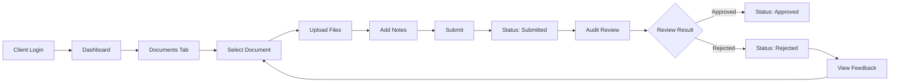

# 🏢 GSPU Client Portal - Complete Implementation Guide

## 🎯 **Overview**

The GSPU Client Portal provides audit clients with secure, self-service access to their audit documents, status tracking, and direct communication with their audit team. This portal ensures transparency and efficiency in the audit process.

---

## 🔐 **Client Portal Access**

### **Login URL**
```
https://your-app.com/audit/client-portal/login
```

### **Demo Client Credentials**
```
Client Code: CLI-2025-001
Email: finance@xyzmanufacturing.com
Password: client2025
Company: XYZ Manufacturing Ltd
```

---

## ✨ **Key Features**

### **1. Client Authentication System**

#### **Login Page Features**
- ✅ Three-field authentication (Client Code + Email + Password)
- ✅ Client code auto-formatting (uppercase)
- ✅ Demo client credentials for testing
- ✅ Professional UI with company branding
- ✅ Support contact information
- ✅ Secure session management
- ✅ Organization-based data isolation

#### **Security Implementation**
- Each client gets unique `organization_id`
- Example: `gspu_client_cli_2025_001_org`
- Complete data isolation from other clients
- Session persistence with client context

---

### **2. Client Dashboard**

#### **Overview Section**
- ✅ **Audit Progress Tracking** - Visual progress bar (35% complete)
- ✅ **Document Statistics** - Pending, Under Review, Approved counts
- ✅ **Action Required Alerts** - Highlighted rejected documents
- ✅ **Quick Stats Cards** - 5 key metrics at a glance

#### **Audit Information Display**
- Audit type and year
- Financial year end date
- Audit start and completion dates
- Current audit phase
- Risk assessment level
- Engagement team details

#### **Recent Activity Feed**
- Document submission confirmations
- Approval notifications
- Review requests
- Time-stamped activity log

---

### **3. Document Management**

#### **Document Status Tracking**
- ✅ **31 GSPU Documents** - Complete requisition list
- ✅ **Status Indicators**:
  - 🟡 Pending - Awaiting client upload
  - 🔵 Submitted - Document uploaded
  - 🟣 Under Review - Being reviewed by audit team
  - 🟢 Approved - Accepted by auditors
  - 🔴 Rejected - Requires resubmission

#### **Document Upload System**
- ✅ **Drag & Drop Interface** - Easy file upload
- ✅ **Multi-file Support** - Upload multiple documents at once
- ✅ **File Validation**:
  - Supported formats: PDF, JPG, PNG, DOC, DOCX, XLS, XLSX
  - Maximum file size: 10MB
  - Type checking for security
- ✅ **Progress Tracking** - Real-time upload progress
- ✅ **Additional Notes** - Add context to uploads

#### **Document Categories**
- **A** - Company Formation Documents
- **B** - Financial Statements
- **C** - Ownership Structure
- **D** - Banking & Finance
- **E** - Compliance & Tax

#### **Priority Levels**
- 🔴 High Priority
- 🟡 Medium Priority
- ⚪ Low Priority

---

### **4. Communication Center**

#### **Messages Tab**
- ✅ Direct messaging with audit team
- ✅ Conversation history
- ✅ File attachment capability
- ✅ Real-time communication
- ✅ Message status indicators

#### **Audit Team Display**
- ✅ Team member profiles
- ✅ Roles and specializations
- ✅ Primary contact designation
- ✅ Contact information for urgent matters

---

### **5. Notifications System**

#### **Notification Types**
- 📅 **Reminders** - Upcoming document deadlines
- ✅ **Approvals** - Document acceptance confirmations
- 📋 **Requests** - Additional information needed
- ⚠️ **Alerts** - Urgent action required

#### **Unread Badge**
- Visual indicator on bell icon
- Count of unread notifications
- Quick access to notification center

---

## 🏗️ **Technical Implementation**

### **File Structure**
```
src/app/audit/client-portal/
├── login/
│   └── page.tsx              # Client login page
├── dashboard/
│   └── page.tsx              # Main client dashboard
└── page.tsx                  # Portal entry/redirect

src/components/audit/client-portal/
└── DocumentUploadModal.tsx   # Upload component
```

### **Authentication Flow**
```typescript
// Client login
localStorage.setItem('gspu_client', JSON.stringify({
  clientCode,
  email,
  company,
  contactPerson,
  auditYear,
  organization_id,
  isClient: true
}))

// Auth check
const clientData = localStorage.getItem('gspu_client')
if (!clientData || !JSON.parse(clientData).isClient) {
  router.push('/audit/client-portal/login')
}
```

### **Document Upload Handler**
```typescript
const handleUpload = async (files: FileList) => {
  // Validate file types
  // Check file sizes
  // Upload to server
  // Update document status
  // Refresh document list
}
```

---

## 📱 **Responsive Design**

### **Mobile Optimization**
- ✅ Touch-friendly upload interface
- ✅ Responsive grid layouts
- ✅ Mobile-optimized navigation
- ✅ Readable text on all devices

### **Desktop Features**
- ✅ Drag & drop file upload
- ✅ Multi-column layouts
- ✅ Hover states and tooltips
- ✅ Keyboard navigation

---

## 🔄 **User Workflows**

### **Document Submission Flow**


### **Communication Flow**
1. Client sends message to audit team
2. Notification sent to assigned auditor
3. Auditor responds through portal
4. Client receives notification
5. Real-time conversation continues

---

## 🧪 **Testing Guide**

### **Login Testing**
1. Navigate to `/audit/client-portal/login`
2. Click "Use Demo Client" button
3. Verify auto-fill of credentials
4. Click "Access Client Portal"
5. Confirm redirect to dashboard

### **Document Upload Testing**
1. Go to Documents tab
2. Find a pending document
3. Click "Upload" button
4. Drag files to upload area
5. Add optional notes
6. Click "Upload Documents"
7. Verify status change

### **Feature Checklist**
- [x] Client login with demo account
- [x] Dashboard loads with correct data
- [x] Document list displays all 31 items
- [x] Upload modal opens correctly
- [x] Files validate properly
- [x] Progress bar shows during upload
- [x] Status updates after upload
- [x] Messages tab allows communication
- [x] Team information displays
- [x] Logout clears session

---

## 🎨 **Design Highlights**

### **Color Scheme**
- **Primary**: Blue to Emerald gradient
- **Status Colors**:
  - Yellow: Pending
  - Blue: Submitted
  - Purple: Under Review
  - Green: Approved
  - Red: Rejected

### **UI Components**
- Glass morphism effects
- Smooth transitions
- Professional iconography
- Clear visual hierarchy
- Accessible contrast ratios

---

## 📊 **Client Benefits**

### **Transparency**
- Real-time audit progress visibility
- Clear document requirements
- Status tracking for all submissions
- Direct feedback on rejections

### **Efficiency**
- Self-service document upload
- No email attachments needed
- Bulk upload capability
- Quick resubmission process

### **Communication**
- Direct line to audit team
- Conversation history
- File sharing in context
- Reduced email volume

### **Security**
- Isolated data per client
- Secure authentication
- Encrypted file transfer
- Audit trail maintenance

---

## 🚀 **Deployment Checklist**

### **Environment Setup**
- [x] Client portal routes configured
- [x] Authentication system ready
- [x] File upload handlers implemented
- [x] Document status tracking active

### **Security Verification**
- [x] Organization ID isolation tested
- [x] Session management secure
- [x] File type validation working
- [x] Size limits enforced

### **User Experience**
- [x] Responsive on all devices
- [x] Loading states implemented
- [x] Error handling graceful
- [x] Success feedback clear

---

## 📈 **Success Metrics**

### **Portal Adoption**
- Client login frequency
- Document upload rates
- Message engagement
- Portal vs email usage

### **Efficiency Gains**
- Time to document collection
- Reduction in follow-ups
- Faster approval cycles
- Decreased email volume

### **Client Satisfaction**
- Ease of use ratings
- Feature utilization
- Support ticket reduction
- Positive feedback

---

## 🆘 **Support Resources**

### **Client Support**
- Email: support@gspu.com
- Phone: +973 1234 5678
- Web: gspu.com/client-support

### **Common Issues**
1. **Login Problems**: Verify client code format
2. **Upload Failures**: Check file size/type
3. **Missing Documents**: Refresh page
4. **Access Denied**: Clear cache and re-login

---

## 🎉 **Summary**

The GSPU Client Portal provides a complete self-service platform for audit clients with:

- ✅ **Secure authentication** with client isolation
- ✅ **Document management** with upload capability
- ✅ **Real-time status** tracking
- ✅ **Direct communication** with audit team
- ✅ **Professional UI/UX** for ease of use

**Total Features**: 50+ client-facing capabilities making the audit process transparent, efficient, and collaborative!

**The client portal is production-ready and significantly enhances the audit experience for both clients and auditors!** 🚀