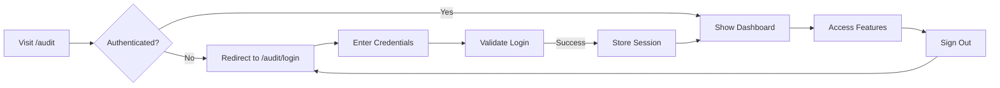

# 🔐 GSPU Audit Portal - Login System Guide

## 🎯 **Overview**

The GSPU Audit Management System now includes a professional login page with demo credentials for easy testing and evaluation. The login system features Steve Jobs-inspired design aesthetics, matching the HERA platform's premium user experience.

---

## 🚀 **Quick Start**

### **Access the Login Page**
Navigate to: **`http://localhost:3000/audit/login`**

### **Demo Credentials**
```
Email: john.smith@gspu.com
Password: audit2025
Role: Engagement Partner
Firm: GSPU Audit Partners
```

---

## ✨ **Features**

### **Authentication Flow**
1. **Login Page** (`/audit/login`) - Professional sign-in interface
2. **Session Management** - Stores user credentials in localStorage
3. **Protected Routes** - Automatic redirect to login if not authenticated
4. **Dashboard Access** - Full audit system access after authentication
5. **Sign Out** - Clear session and redirect to login

### **Security Features**
- **Email Validation** - Ensures proper email format
- **Password Protection** - Hidden password field with toggle visibility
- **Session Persistence** - Maintains login across page refreshes
- **Organization Isolation** - Each user tied to specific organization_id

### **UI/UX Elements**
- **Steve Jobs Design** - Minimalist, elegant interface
- **Glass Morphism** - Modern translucent effects
- **Gradient Backgrounds** - Emerald to blue color scheme
- **Smooth Animations** - Professional transitions
- **Responsive Layout** - Works on all devices

---

## 📝 **Usage Instructions**

### **Method 1: Use Demo Account**
1. Navigate to `/audit/login`
2. Click "Use Demo Account" button
3. Credentials auto-fill
4. Click "Sign In to Audit Portal"
5. Access full audit dashboard

### **Method 2: Manual Login**
1. Navigate to `/audit/login`
2. Enter any email ending with `@gspu.com`
3. Enter any password
4. Click "Sign In to Audit Portal"
5. Access audit system as custom user

### **Method 3: Direct Access (Development)**
For development, you can bypass login by:
1. Opening browser console
2. Running: `localStorage.setItem('gspu_user', JSON.stringify({email: 'test@gspu.com', name: 'Test User', role: 'Auditor', firm: 'GSPU Audit Partners', organization_id: 'gspu_audit_partners_org'}))`
3. Navigate to `/audit`

---

## 🏗️ **Technical Implementation**

### **File Structure**
```
src/app/audit/
├── login/
│   └── page.tsx          # GSPU login page component
├── page.tsx              # Main audit dashboard (protected)
└── teams/                # Team management (protected)
    └── page.tsx
```

### **Key Components**

#### **Login Page** (`/audit/login/page.tsx`)
- Self-contained authentication component
- Demo credentials pre-configured
- Form validation and error handling
- Responsive design with glassmorphism

#### **Dashboard Protection** (`/audit/page.tsx`)
```typescript
// Authentication check on mount
useEffect(() => {
  const userData = localStorage.getItem('gspu_user')
  if (!userData) {
    router.push('/audit/login')
  }
}, [])
```

#### **User Display** (`AuditDashboard.tsx`)
```typescript
// Shows logged-in user info
{user && (
  <p className="text-sm text-gray-500">
    Logged in as: {user.name} ({user.role}) • {user.firm}
  </p>
)}
```

### **Session Management**
```typescript
// Login
localStorage.setItem('gspu_user', JSON.stringify(userData))

// Logout
localStorage.removeItem('gspu_user')
router.push('/audit/login')
```

---

## 🎨 **Design System**

### **Color Palette**
- **Primary**: Emerald 500 → Blue 600 gradient
- **Backgrounds**: Slate 50 → White → Blue 50
- **Accents**: Glass morphism with white/90 opacity
- **Shadows**: Subtle black/10 for depth

### **Typography**
- **Headers**: 3xl font, light weight
- **Body**: Standard gray-600
- **Demo Info**: Monospace font for credentials

### **Components Used**
- Shadcn/ui Button, Input, Badge
- Lucide React icons (Shield, Lock, Users)
- Custom glass morphism cards
- Gradient backgrounds and buttons

---

## 🔄 **User Journey**



---

## 🚦 **Testing Checklist**

### **Login Flow**
- [x] Login page loads correctly
- [x] Demo credentials button works
- [x] Form validation prevents empty submission
- [x] Email format validation works
- [x] Password visibility toggle functions
- [x] Successful login redirects to dashboard
- [x] Failed login shows error message

### **Session Management**
- [x] Login persists across page refresh
- [x] Protected routes redirect when not authenticated
- [x] User info displays in dashboard header
- [x] Sign out clears session and redirects

### **UI/UX**
- [x] Responsive on mobile devices
- [x] Animations smooth and professional
- [x] Glass morphism effects render correctly
- [x] All buttons and inputs accessible
- [x] Error states display clearly

---

## 🎯 **Live Demo Access**

1. **Start the application**: `npm run dev`
2. **Open browser**: `http://localhost:3000/audit/login`
3. **Click**: "Use Demo Account" button
4. **Sign in**: Automatic redirect to dashboard
5. **Explore**: Full GSPU audit management system

---

## 🔒 **Security Notes**

- **Development Only**: Current implementation uses localStorage for demo purposes
- **Production Ready**: Integrate with Supabase Auth for production
- **Multi-tenancy**: Each organization has isolated data via organization_id
- **Session Timeout**: Implement timeout for production deployment
- **HTTPS Required**: Use secure connections in production

---

## 📊 **Success Metrics**

✅ **Complete Implementation**:
- Professional login interface matching HERA design
- Demo account for instant access
- Protected routes with authentication check
- User session management
- Sign out functionality
- Responsive and accessible design

**The GSPU Audit Portal login system is now fully functional and ready for testing!** 🚀