# 🚀 HERA ERP Delivery + MCP Orchestration Architecture

## 📊 End-to-End Delivery Flow with MCP Orchestration

```mermaid
flowchart TD
  A[Client Intake<br/>Requirements & KPIs] --> B[MCP Orchestrator<br/>Normalize + Map]
  B --> C{Smart Code Assignment<br/>HERA.{INDUSTRY}.{MODULE}.{TYPE}.{SUBTYPE}.vN}
  C --> D[Config Draft<br/>core_entities + core_dynamic_data]
  D --> E[Module Reuse Toggle<br/>Finance • Controlling • Purchasing • P2P • O2C]
  E --> F[Sandbox Provisioning<br/>client.heraerp.com/{vertical}]
  F --> G[Template Load<br/>COA, Vendors, Customers, Fiscal Calendar]
  G --> H[Sample DNA Scenarios<br/>P2P • O2C • Approvals]
  H --> I[MCP Runtime Validation<br/>Guardrails: org_id, smart_code, GL balance]
  I --> J[Client Playground & Feedback<br/>Chat-based rule tweaks]
  J --> K[Data Conversion Pilot<br/>COA, Opening Balances, Masters]
  K --> L[UAT Pack Generation<br/>Test cases per requirement]
  L --> M[Execute UAT<br/>Capture Evidence & Results]
  M --> N[UAT Sign-off<br/>universal_transactions: HERA.PROJECT.UAT.SIGNOFF.v1]
  N --> O[Cutover Readiness Check<br/>CI Guardrails block_on_error]
  O --> P[Production Copy<br/>Config + Clean Data]
  P --> Q[Go-Live Enablement<br/>client.heraerp.com/{org}]
  Q --> R[Post-Go-Live MCP<br/>Rule updates w/o schema changes]
  R --> S[Fiscal DNA Ops<br/>Period Close • Year-End Close • Consolidation]
  S --> T[Continuous Improvement<br/>Smart Code versioning .v2 .v3]

  %% Guards
  I -. hard blocks .-> X[Guardrails v2.0<br/>No new business tables<br/>No business columns on sacred tables]
  I -. multi-tenancy .-> Y[Enforce organization_id on all reads/writes]
  I -. GL .-> Z[Balance per currency]

  %% Data Backbone
  subgraph Sacred Six Tables
    D
    K
    L
    M
    N
    P
    S
  end

  style A fill:#e1f5fe,stroke:#01579b,stroke-width:2px
  style B fill:#fff3e0,stroke:#e65100,stroke-width:2px
  style C fill:#f3e5f5,stroke:#4a148c,stroke-width:2px
  style I fill:#ffebee,stroke:#b71c1c,stroke-width:3px
  style Q fill:#e8f5e9,stroke:#1b5e20,stroke-width:3px
  style X fill:#ffcdd2,stroke:#d32f2f,stroke-width:2px
  style Y fill:#ffcdd2,stroke:#d32f2f,stroke-width:2px
  style Z fill:#ffcdd2,stroke:#d32f2f,stroke-width:2px
```

---

## 🏊 Swimlanes: Roles, Hand-offs, and Artifacts

```mermaid
sequenceDiagram
  participant CL as Client Team
  participant MCP as MCP Orchestrator (Claude/OpenAI)
  participant HC as HERA Core (6 Tables)
  participant GR as Guardrails v2.0
  participant DP as Data Pipelines (ETL/MCP)
  participant UAT as UAT Council
  participant OPS as Prod Ops

  CL->>MCP: Business goals, processes (Finance/Controlling/Purchasing, P2P, O2C)
  MCP->>MCP: Normalize → Smart Codes (HERA.INDUSTRY.MODULE.TYPE.SUBTYPE.vN)
  MCP->>HC: Create core_entities + core_dynamic_data (DRAFT)
  MCP->>HC: Enable module DNA (reuse toggles, not rebuild)
  HC->>GR: Validate org isolation, smart_code presence, invariants
  GR-->>HC: OK or Errors (autofix suggestions)

  MCP->>OPS: Provision sandbox client.heraerp.com/{vertical}
  OPS-->>HC: Seed templates (COA, Vendors, Customers, Fiscal Calendar)
  MCP->>HC: Generate sample transactions (P2P/O2C) for demos
  HC->>GR: Runtime checks (GL balanced, approvals, period status)
  CL->>MCP: Feedback ("raise PO approval to $5k", etc.)
  MCP->>HC: Update JSON rules (no schema change)

  CL->>DP: Provide legacy data (Excel/Tally/POS)
  DP->>HC: Load masters & opening balances with org_id + smart_code
  HC->>GR: ETL validation (hard blocks on violations)
  MCP->>UAT: Auto-generate test pack per requirement
  UAT->>HC: Execute tests as universal_transactions (evidence linked)
  UAT-->>MCP: Sign-off decision
  MCP->>HC: Record HERA.PROJECT.UAT.SIGNOFF.v1

  MCP->>OPS: Cutover checklist → CI guardrails (block_on_error)
  OPS->>HC: Promote config + clean data to production
  OPS-->>CL: Go-live client.heraerp.com/{org}

  loop BAU
    CL->>HC: Daily ops (orders, invoices, receipts, payouts)
    HC->>GR: Continuous enforcement (multi-tenancy, GL, approvals)
    MCP->>HC: Hot-rule updates via JSON / smart_code .v(N+1)
  end

  Note over HC: Fiscal DNA: periods, closes, YE, consolidation<br/>All recorded in universal_transactions/lines
```



---

## 📋 Legend & Core Concepts

### **🏛️ Sacred Six Tables (Immutable Foundation)**
- `core_organizations` - Multi-tenant isolation
- `core_entities` - All business objects (vendors, customers, GL accounts)
- `core_dynamic_data` - Custom fields without schema changes
- `core_relationships` - Entity connections and hierarchies
- `universal_transactions` - All business events
- `universal_transaction_lines` - Transaction details

### **🛡️ Guardrails v2.0 (Always-On Enforcement)**
1. **Schema Protection**: Only six tables; no business columns on sacred tables
2. **Multi-Tenancy**: `organization_id` required on all reads/writes
3. **Smart Code Pattern**: Required on entities/transactions
4. **GL Balance**: Transactions must balance per currency
5. **Fiscal Control**: Period status enforcement

### **🧬 Module DNA Reuse**
Instead of building new modules, toggle existing DNA:
- **Finance DNA**: COA, GL posting, fiscal periods
- **Controlling DNA**: Cost centers, profit centers, analytics
- **Purchasing DNA**: Vendors, POs, 3-way match
- **P2P DNA**: Purchase-to-Pay workflow
- **O2C DNA**: Order-to-Cash workflow

### **🎯 Smart Code Architecture**
```
HERA.{INDUSTRY}.{MODULE}.{TYPE}.{SUBTYPE}.vN

Examples:
- HERA.MANUFACTURING.P2P.PO.STANDARD.v1
- HERA.RETAIL.O2C.INVOICE.TAX.v2
- HERA.HEALTHCARE.FINANCE.GL.JOURNAL.v1
```

### **📊 Key Artifacts & Checkpoints**

| Phase | Artifact | Smart Code | Storage |
|-------|----------|------------|---------|
| Requirements | Draft Config | `HERA.PROJECT.REQ.DRAFT.v1` | `core_entities` |
| Sandbox | Test Scenarios | `HERA.PROJECT.TEST.SCENARIO.v1` | `universal_transactions` |
| UAT | Test Results | `HERA.PROJECT.UAT.RESULT.v1` | `universal_transactions` |
| Sign-off | Approval Record | `HERA.PROJECT.UAT.SIGNOFF.v1` | `universal_transactions` |
| Go-Live | Cutover Record | `HERA.PROJECT.GOLIVE.SUCCESS.v1` | `universal_transactions` |

---

## 🚀 Implementation Phases

### **Phase 1: Requirement Gathering (Days 1-3)**
```typescript
// MCP captures requirements as draft entities
const requirement = {
  entity_type: 'project_requirement',
  entity_name: 'P2P Approval Workflow',
  smart_code: 'HERA.PROJECT.REQ.P2P.APPROVAL.v1',
  status: 'DRAFT',
  dynamic_data: {
    approval_limits: { level1: 1000, level2: 5000, cfo: 10000 },
    business_rules: { three_way_match: true, tolerance: 0.02 }
  }
}
```

### **Phase 2: Module Configuration (Days 4-5)**
```typescript
// Toggle existing modules instead of rebuilding
const moduleConfig = {
  finance_dna: { enabled: true, coa_template: 'IFRS_MANUFACTURING' },
  purchasing_dna: { enabled: true, approval_workflow: 'HIERARCHICAL' },
  p2p_dna: { enabled: true, match_type: 'THREE_WAY' },
  o2c_dna: { enabled: true, credit_check: 'AUTOMATIC' }
}
```

### **Phase 3: Sandbox Testing (Days 6-10)**
```typescript
// Generate test transactions
const testPO = {
  transaction_type: 'purchase_order',
  smart_code: 'HERA.MANUFACTURING.P2P.PO.TEST.v1',
  total_amount: 7500,
  approval_required: true,
  lines: [
    { entity_id: 'raw_material_001', quantity: 100, unit_price: 75 }
  ]
}
```

### **Phase 4: Data Migration (Days 11-15)**
```typescript
// ETL with guardrail validation
const migrationBatch = {
  transaction_type: 'data_migration',
  smart_code: 'HERA.PROJECT.MIGRATION.COA.v1',
  metadata: {
    source_system: 'TALLY_ERP',
    record_count: 1847,
    validation_status: 'PASSED'
  }
}
```

### **Phase 5: UAT & Sign-off (Days 16-20)**
```typescript
// UAT sign-off as transaction
const signoff = {
  transaction_type: 'project_milestone',
  smart_code: 'HERA.PROJECT.UAT.SIGNOFF.v1',
  approved_by: 'cfo_user_id',
  approval_date: '2025-09-15',
  metadata: {
    test_cases_passed: 147,
    test_cases_failed: 0,
    defects_resolved: 3
  }
}
```

### **Phase 6: Production Go-Live (Day 21)**
```typescript
// Cutover with CI guardrails
const goLive = {
  transaction_type: 'project_milestone',
  smart_code: 'HERA.PROJECT.GOLIVE.SUCCESS.v1',
  metadata: {
    cutover_duration: '4_hours',
    data_migrated: true,
    guardrails_passed: true,
    production_url: 'client.heraerp.com/manufacturing'
  }
}
```

---

## 🔄 Post Go-Live Operations

### **Continuous Rule Updates (No Schema Changes)**
```typescript
// Update approval limits via MCP chat
MCP: "Updating PO approval limit for manager role to $7,500"
const ruleUpdate = {
  entity_type: 'business_rule',
  smart_code: 'HERA.MANUFACTURING.P2P.RULE.APPROVAL.v2',
  dynamic_data: {
    approval_limits: { manager: 7500, director: 15000, cfo: 50000 }
  }
}
```

### **Fiscal DNA Operations**
```typescript
// Automated period close
const periodClose = {
  transaction_type: 'fiscal_operation',
  smart_code: 'HERA.FINANCE.PERIOD.CLOSE.2025.M09.v1',
  metadata: {
    period_closed: '2025-09',
    gl_balanced: true,
    entries_posted: 3847,
    next_open_period: '2025-10'
  }
}
```

---

## 💡 Key Success Factors

1. **Zero Schema Changes**: Everything extends through `core_dynamic_data` and JSON rules
2. **Module Reuse**: Finance/Controlling/Purchasing are toggles, not builds
3. **MCP Chat Interface**: Business users update rules conversationally
4. **Guardrail Protection**: Multi-tenancy and GL balance enforced at all times
5. **Audit Trail**: Every decision recorded as a transaction
6. **Smart Code Evolution**: Version upgrades without breaking changes

---

## 🎯 Business Benefits

| Traditional ERP | HERA with MCP |
|-----------------|---------------|
| 6-18 month implementation | 21-day go-live |
| $500K-5M cost | $50K-100K cost |
| Schema changes for customization | Zero schema changes |
| Rigid approval workflows | Chat-based rule updates |
| Manual data migration | MCP-orchestrated ETL |
| Separate test system | Integrated sandbox |
| Complex upgrade paths | Smart Code versioning |

---

## 🚦 Guardrail Enforcement Points

```yaml
Pre-Transaction:
  - organization_id: Required on every operation
  - smart_code: Must match valid pattern
  - entity_existence: Referenced entities must exist

During Transaction:
  - GL_balance: Debits = Credits per currency
  - approval_workflow: Check limits based on amount
  - fiscal_period: Must be open for posting

Post-Transaction:
  - audit_trail: Created_by, created_at captured
  - version_control: Optimistic locking updated
  - ai_insights: Pattern analysis stored
```

---

## 📈 Metrics & KPIs

### **Implementation Velocity**
- Requirements to Sandbox: < 5 days
- Sandbox to UAT: < 10 days
- UAT to Production: < 5 days
- **Total: 20 days** (vs 6-18 months traditional)

### **Quality Metrics**
- Guardrail Violations: 0 (hard blocks)
- Schema Changes: 0 (immutable)
- Module Reuse: 100%
- Test Automation: 95%+

### **Business Value**
- Time to Value: 20x faster
- Implementation Cost: 90% lower
- Operational Flexibility: Infinite (chat-based rules)
- Upgrade Risk: Zero (smart code versioning)

---

**This architecture ensures HERA delivers enterprise-grade ERP to SMBs with the speed of SaaS and the flexibility of custom development, all while maintaining the Sacred Six table architecture.**