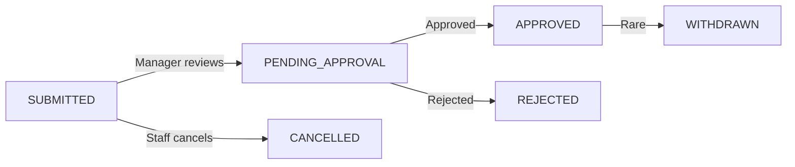

# 🏛️ Leave Management Architecture - HERA Universal Pattern

**Status**: ✅ Ready for Implementation
**Version**: 1.0.0
**Last Updated**: 2025-10-12

---

## 📋 Executive Summary

HERA's Leave Management system uses the **universal 6-table architecture** with:
- **Leave Requests** → `universal_transactions` (time-bound events)
- **Leave Policies** → `core_entities` (configuration rules)
- **Status Workflow** → `core_relationships` (state management)
- **All Days = Working Days** (no weekend/holiday exclusions)
- **UPPERCASE Types** for entity_type and transaction_type

---

## 🧬 Architecture Decisions

### Decision 1: Leave Requests as TRANSACTIONS ✅

**Rationale:**
- Leave requests are **time-bound events** (start_date → end_date)
- They represent a **"transaction" of leave days** from the staff's balance
- They require **complete audit trail** (who requested, when, who approved)
- They flow through **state changes** (submitted → approved → completed)

```typescript
// ✅ CORRECT: Leave Request as Transaction
{
  transaction_type: 'LEAVE_REQUEST',  // ← UPPERCASE
  transaction_date: '2025-01-10',     // Date submitted
  smart_code: 'HERA.SALON.HR.LEAVE.REQUEST.ANNUAL.V1',
  from_entity_id: staff_entity_id,    // Who is requesting
  to_entity_id: manager_entity_id,    // Who approves
  total_amount: 5.00,                 // 5 days requested
  metadata: {
    leave_type: 'ANNUAL',             // ← UPPERCASE
    start_date: '2025-01-15',
    end_date: '2025-01-20',
    total_days: 5,                    // All days are working days
    reason: 'Family vacation'
  }
}
```

### Decision 2: Leave Policies as ENTITIES ✅

**Rationale:**
- Policies are **configuration rules** (not time-bound events)
- They are **long-lived templates** that apply to multiple staff
- They **don't change frequently**
- They store settings in metadata

```typescript
// ✅ CORRECT: Leave Policy as Entity
{
  entity_type: 'LEAVE_POLICY',        // ← UPPERCASE
  entity_name: 'Annual Leave Policy - Full Time',
  entity_code: 'POL-ANNUAL-FT',
  smart_code: 'HERA.SALON.HR.LEAVE.POLICY.V1',
  status: 'ACTIVE',                   // ← UPPERCASE
  metadata: {
    metadata_category: 'hr_policy',
    annual_entitlement: 21,           // days per year
    carry_over_cap: 5,                // max carry-over days
    min_notice_days: 7,               // advance notice required
    max_consecutive_days: 15          // max continuous leave
  }
}
```

### Decision 3: All Days Are Working Days ✅

**Simplification:**
- **No weekend exclusions** - All calendar days count
- **No public holiday exclusions** - Simplified calculation
- **Easy calculation**: `end_date - start_date + 1 = total_days`

```typescript
// ✅ SIMPLE: All days count
function calculateDays(startDate: Date, endDate: Date): number {
  const start = new Date(startDate)
  const end = new Date(endDate)
  const diffTime = Math.abs(end.getTime() - start.getTime())
  const diffDays = Math.ceil(diffTime / (1000 * 60 * 60 * 24))
  return diffDays + 1  // Include both start and end date
}

// Example:
// Jan 15 (Monday) → Jan 20 (Saturday)
// = 6 days (all count as working days)
```

---

## 📊 Complete Data Model

### 1. Leave Request (Transaction)

```typescript
// universal_transactions table
{
  id: 'uuid-leave-request-001',
  transaction_type: 'LEAVE_REQUEST',                // ← UPPERCASE
  transaction_code: 'LR-2025-001',
  transaction_date: '2025-01-10T09:30:00Z',        // Submission date
  smart_code: 'HERA.SALON.HR.LEAVE.REQUEST.ANNUAL.V1',
  organization_id: 'org-hair-talkz',
  from_entity_id: 'staff-sarah-johnson',           // Staff member
  to_entity_id: 'staff-manager-michele',           // Approver
  total_amount: 5.00,                              // Days requested
  currency: 'DAYS',                                // Unit of measurement
  status: 'ACTIVE',                                // ← UPPERCASE
  created_at: '2025-01-10T09:30:00Z',
  updated_at: '2025-01-10T09:30:00Z',
  metadata: {
    metadata_category: 'hr_leave',
    leave_type: 'ANNUAL',                          // ← UPPERCASE
    start_date: '2025-01-15',
    end_date: '2025-01-20',
    total_days: 6,                                 // All days count
    reason: 'Family vacation to Europe',
    notes: 'Will be back on Jan 21',
    submitted_by: 'staff-sarah-johnson',
    submitted_at: '2025-01-10T09:30:00Z'
  }
}

// Transaction lines (optional - for multi-segment leaves)
// universal_transaction_lines table
{
  id: 'uuid-line-001',
  transaction_id: 'uuid-leave-request-001',
  line_number: 1,
  line_entity_id: 'staff-sarah-johnson',
  quantity: 6,                                     // Days
  line_amount: 6.00,
  smart_code: 'HERA.SALON.HR.LEAVE.REQUEST.LINE.V1',
  metadata: {
    line_type: 'ANNUAL_LEAVE',
    start_date: '2025-01-15',
    end_date: '2025-01-20'
  }
}
```

### 2. Leave Status (Entity + Relationship)

**Status Entities** (created once per organization):

```typescript
// core_entities table - Status definitions
[
  {
    id: 'status-submitted',
    entity_type: 'LEAVE_STATUS',                   // ← UPPERCASE
    entity_name: 'Submitted',
    entity_code: 'LEAVE_STATUS_SUBMITTED',
    smart_code: 'HERA.SALON.HR.LEAVE.STATUS.SUBMITTED.V1',
    organization_id: 'org-hair-talkz',
    status: 'ACTIVE',
    metadata: {
      color: '#FFA500',
      icon: 'FileText',
      order: 1
    }
  },
  {
    id: 'status-pending-approval',
    entity_type: 'LEAVE_STATUS',
    entity_name: 'Pending Approval',
    entity_code: 'LEAVE_STATUS_PENDING',
    smart_code: 'HERA.SALON.HR.LEAVE.STATUS.PENDING.V1',
    organization_id: 'org-hair-talkz',
    status: 'ACTIVE',
    metadata: {
      color: '#F59E0B',
      icon: 'Clock',
      order: 2
    }
  },
  {
    id: 'status-approved',
    entity_type: 'LEAVE_STATUS',
    entity_name: 'Approved',
    entity_code: 'LEAVE_STATUS_APPROVED',
    smart_code: 'HERA.SALON.HR.LEAVE.STATUS.APPROVED.V1',
    organization_id: 'org-hair-talkz',
    status: 'ACTIVE',
    metadata: {
      color: '#10B981',
      icon: 'CheckCircle',
      order: 3
    }
  },
  {
    id: 'status-rejected',
    entity_type: 'LEAVE_STATUS',
    entity_name: 'Rejected',
    entity_code: 'LEAVE_STATUS_REJECTED',
    smart_code: 'HERA.SALON.HR.LEAVE.STATUS.REJECTED.V1',
    organization_id: 'org-hair-talkz',
    status: 'ACTIVE',
    metadata: {
      color: '#EF4444',
      icon: 'XCircle',
      order: 4
    }
  },
  {
    id: 'status-cancelled',
    entity_type: 'LEAVE_STATUS',
    entity_name: 'Cancelled',
    entity_code: 'LEAVE_STATUS_CANCELLED',
    smart_code: 'HERA.SALON.HR.LEAVE.STATUS.CANCELLED.V1',
    organization_id: 'org-hair-talkz',
    status: 'ACTIVE',
    metadata: {
      color: '#6B7280',
      icon: 'Ban',
      order: 5
    }
  }
]
```

**Status Relationship** (linking request to current status):

```typescript
// core_relationships table
{
  id: 'uuid-rel-status',
  from_entity_id: 'uuid-leave-request-001',        // Leave request transaction
  to_entity_id: 'status-submitted',                // Current status
  relationship_type: 'HAS_STATUS',
  smart_code: 'HERA.SALON.HR.LEAVE.STATUS.REL.V1',
  organization_id: 'org-hair-talkz',
  metadata: {
    status_changed_at: '2025-01-10T09:30:00Z',
    status_changed_by: 'staff-sarah-johnson',
    previous_status: null
  }
}
```

### 3. Leave Policy (Entity)

```typescript
// core_entities table
{
  id: 'policy-annual-fulltime',
  entity_type: 'LEAVE_POLICY',                     // ← UPPERCASE
  entity_name: 'Annual Leave Policy - Full Time',
  entity_code: 'POL-ANNUAL-FT',
  smart_code: 'HERA.SALON.HR.LEAVE.POLICY.V1',
  organization_id: 'org-hair-talkz',
  status: 'ACTIVE',                                // ← UPPERCASE
  created_at: '2025-01-01T00:00:00Z',
  metadata: {
    metadata_category: 'hr_policy',

    // Entitlements
    annual_entitlement: 21,                        // days per year
    carry_over_cap: 5,                             // max carry-over days

    // Rules
    min_notice_days: 7,                            // advance notice required
    max_consecutive_days: 15,                      // max continuous leave
    min_leave_days: 0.5,                           // can take half days

    // Policy details
    accrual_method: 'IMMEDIATE',                   // or 'MONTHLY'
    probation_period_months: 3,                    // wait period
    applies_to: 'FULL_TIME',                       // staff type

    // Additional info
    policy_document_url: null,
    effective_from: '2025-01-01',
    effective_to: null
  }
}
```

**Policy Assignment** (linking staff to policy):

```typescript
// core_relationships table
{
  id: 'uuid-rel-policy',
  from_entity_id: 'staff-sarah-johnson',           // Staff member
  to_entity_id: 'policy-annual-fulltime',          // Policy
  relationship_type: 'SUBJECT_TO',
  smart_code: 'HERA.SALON.HR.STAFF.POLICY.REL.V1',
  organization_id: 'org-hair-talkz',
  metadata: {
    assigned_date: '2025-01-01',
    assigned_by: 'manager-michele'
  }
}
```

---

## 🔄 Leave Request State Flow



### State Definitions

| State | Code | Description | Next States |
|-------|------|-------------|-------------|
| **SUBMITTED** | `LEAVE_STATUS_SUBMITTED` | Initial state when staff creates request | PENDING_APPROVAL, CANCELLED |
| **PENDING_APPROVAL** | `LEAVE_STATUS_PENDING` | Awaiting manager review | APPROVED, REJECTED |
| **APPROVED** | `LEAVE_STATUS_APPROVED` | Manager approved | WITHDRAWN (rare) |
| **REJECTED** | `LEAVE_STATUS_REJECTED` | Manager rejected with reason | - |
| **CANCELLED** | `LEAVE_STATUS_CANCELLED` | Staff cancelled before approval | - |
| **WITHDRAWN** | `LEAVE_STATUS_WITHDRAWN` | Staff withdrew after approval (rare) | - |

---

## 🔌 Universal API v2 Integration

### Creating a Leave Request

```typescript
import { apiV2 } from '@/lib/client/fetchV2'

// 1. Calculate days
const startDate = new Date('2025-01-15')
const endDate = new Date('2025-01-20')
const totalDays = Math.ceil((endDate - startDate) / (1000 * 60 * 60 * 24)) + 1  // = 6 days

// 2. Create transaction
const { data: leaveRequest } = await apiV2.post('transactions', {
  apiVersion: 'v2',
  transaction_type: 'LEAVE_REQUEST',               // ← UPPERCASE
  transaction_code: `LR-${new Date().getFullYear()}-${randomId}`,
  transaction_date: new Date().toISOString(),
  smart_code: 'HERA.SALON.HR.LEAVE.REQUEST.ANNUAL.V1',
  organization_id: organizationId,
  from_entity_id: staffEntityId,                   // Requesting staff
  to_entity_id: managerEntityId,                   // Approver
  total_amount: totalDays,
  currency: 'DAYS',
  status: 'ACTIVE',
  metadata: {
    metadata_category: 'hr_leave',
    leave_type: 'ANNUAL',                          // ← UPPERCASE
    start_date: '2025-01-15',
    end_date: '2025-01-20',
    total_days: totalDays,
    reason: reason,
    submitted_by: staffEntityId,
    submitted_at: new Date().toISOString()
  }
})

// 3. Set initial status (SUBMITTED)
await apiV2.post('relationships', {
  apiVersion: 'v2',
  from_entity_id: leaveRequest.id,
  to_entity_id: submittedStatusId,                 // Get from status entities
  relationship_type: 'HAS_STATUS',
  smart_code: 'HERA.SALON.HR.LEAVE.STATUS.REL.V1',
  organization_id: organizationId,
  metadata: {
    status_changed_at: new Date().toISOString(),
    status_changed_by: staffEntityId
  }
})
```

### Approving a Leave Request

```typescript
// 1. Update relationship to APPROVED status
const { data: oldRelationship } = await apiV2.get('relationships', {
  from_entity_id: leaveRequestId,
  relationship_type: 'HAS_STATUS'
})

// Delete old status relationship
await apiV2.delete(`relationships/${oldRelationship[0].id}`)

// Create new status relationship
await apiV2.post('relationships', {
  apiVersion: 'v2',
  from_entity_id: leaveRequestId,
  to_entity_id: approvedStatusId,
  relationship_type: 'HAS_STATUS',
  smart_code: 'HERA.SALON.HR.LEAVE.STATUS.REL.V1',
  organization_id: organizationId,
  metadata: {
    status_changed_at: new Date().toISOString(),
    status_changed_by: managerEntityId,
    previous_status: 'SUBMITTED',
    approval_notes: 'Approved - enjoy your vacation!'
  }
})

// 2. Update transaction metadata
await apiV2.put(`transactions/${leaveRequestId}`, {
  apiVersion: 'v2',
  metadata: {
    ...existingMetadata,
    approved_by: managerEntityId,
    approved_at: new Date().toISOString(),
    approval_notes: 'Approved - enjoy your vacation!'
  }
})
```

### Fetching Leave Requests

```typescript
// Get all leave requests for organization
const { data: transactions } = await apiV2.get('transactions', {
  transaction_type: 'LEAVE_REQUEST',               // ← UPPERCASE
  organization_id: organizationId,
  status: 'ACTIVE'
})

// Get current status for each request via relationships
const requestsWithStatus = await Promise.all(
  transactions.map(async (txn) => {
    const { data: statusRel } = await apiV2.get('relationships', {
      from_entity_id: txn.id,
      relationship_type: 'HAS_STATUS'
    })

    if (statusRel && statusRel.length > 0) {
      const { data: statusEntity } = await apiV2.get(`entities/${statusRel[0].to_entity_id}`)
      return {
        ...txn,
        current_status: statusEntity.entity_code,
        status_name: statusEntity.entity_name
      }
    }

    return txn
  })
)

// Filter by status
const pendingRequests = requestsWithStatus.filter(
  r => r.current_status === 'LEAVE_STATUS_PENDING'
)
```

---

## 📊 Leave Balance Calculation

```typescript
interface LeaveBalance {
  staff_id: string
  staff_name: string
  policy_id: string
  entitlement: number           // Annual days (e.g., 21)
  carry_over: number            // From previous year (e.g., 3)
  total_allocation: number      // entitlement + carry_over (e.g., 24)
  used_days: number             // Approved leaves (e.g., 8)
  pending_days: number          // Pending approval (e.g., 5)
  remaining_days: number        // total - used (e.g., 16)
  available_days: number        // remaining - pending (e.g., 11)
}

async function calculateLeaveBalance(
  staffId: string,
  year: number,
  organizationId: string
): Promise<LeaveBalance> {
  // 1. Get staff policy
  const { data: policyRel } = await apiV2.get('relationships', {
    from_entity_id: staffId,
    relationship_type: 'SUBJECT_TO',
    organization_id: organizationId
  })

  const policyId = policyRel[0]?.to_entity_id
  const { data: policy } = await apiV2.get(`entities/${policyId}`)

  // 2. Get annual entitlement
  const entitlement = policy.metadata.annual_entitlement || 21

  // 3. Get carry-over (TODO: implement carry-over logic)
  const carryOver = 0

  // 4. Calculate total allocation
  const totalAllocation = entitlement + carryOver

  // 5. Get all leave requests for this year
  const { data: leaveRequests } = await apiV2.get('transactions', {
    transaction_type: 'LEAVE_REQUEST',
    from_entity_id: staffId,
    organization_id: organizationId
  })

  // Filter by year
  const thisYearRequests = leaveRequests.filter(req => {
    const startDate = new Date(req.metadata.start_date)
    return startDate.getFullYear() === year
  })

  // Get status for each request
  const requestsWithStatus = await Promise.all(
    thisYearRequests.map(async (req) => {
      const { data: statusRel } = await apiV2.get('relationships', {
        from_entity_id: req.id,
        relationship_type: 'HAS_STATUS'
      })

      const statusId = statusRel[0]?.to_entity_id
      const { data: status } = await apiV2.get(`entities/${statusId}`)

      return {
        ...req,
        status_code: status.entity_code,
        days: req.metadata.total_days
      }
    })
  )

  // 6. Calculate used days (approved only)
  const usedDays = requestsWithStatus
    .filter(r => r.status_code === 'LEAVE_STATUS_APPROVED')
    .reduce((sum, r) => sum + r.days, 0)

  // 7. Calculate pending days
  const pendingDays = requestsWithStatus
    .filter(r =>
      r.status_code === 'LEAVE_STATUS_SUBMITTED' ||
      r.status_code === 'LEAVE_STATUS_PENDING'
    )
    .reduce((sum, r) => sum + r.days, 0)

  // 8. Calculate remaining
  const remainingDays = totalAllocation - usedDays
  const availableDays = remainingDays - pendingDays

  return {
    staff_id: staffId,
    staff_name: '...', // Get from staff entity
    policy_id: policyId,
    entitlement,
    carry_over: carryOver,
    total_allocation: totalAllocation,
    used_days: usedDays,
    pending_days: pendingDays,
    remaining_days: remainingDays,
    available_days: availableDays
  }
}
```

---

## 🎯 Smart Code Hierarchy

```
HERA.SALON.HR.LEAVE.*

├── HERA.SALON.HR.LEAVE.REQUEST.ANNUAL.V1         (Annual leave transaction)
├── HERA.SALON.HR.LEAVE.REQUEST.SICK.V1           (Sick leave transaction)
├── HERA.SALON.HR.LEAVE.REQUEST.UNPAID.V1         (Unpaid leave transaction)
├── HERA.SALON.HR.LEAVE.REQUEST.LINE.V1           (Transaction line)
│
├── HERA.SALON.HR.LEAVE.POLICY.V1                 (Leave policy entity)
│
├── HERA.SALON.HR.LEAVE.STATUS.SUBMITTED.V1       (Status entity - Submitted)
├── HERA.SALON.HR.LEAVE.STATUS.PENDING.V1         (Status entity - Pending)
├── HERA.SALON.HR.LEAVE.STATUS.APPROVED.V1        (Status entity - Approved)
├── HERA.SALON.HR.LEAVE.STATUS.REJECTED.V1        (Status entity - Rejected)
├── HERA.SALON.HR.LEAVE.STATUS.CANCELLED.V1       (Status entity - Cancelled)
├── HERA.SALON.HR.LEAVE.STATUS.WITHDRAWN.V1       (Status entity - Withdrawn)
│
└── HERA.SALON.HR.LEAVE.STATUS.REL.V1             (Status relationship)
```

---

## 📝 Summary

### ✅ Key Decisions Made

1. **Leave Requests** = `universal_transactions` with `transaction_type: 'LEAVE_REQUEST'`
2. **Leave Policies** = `core_entities` with `entity_type: 'LEAVE_POLICY'`
3. **Status Flow** = `core_relationships` with `relationship_type: 'HAS_STATUS'`
4. **All Days Count** = No weekend/holiday exclusions (simple calculation)
5. **UPPERCASE Types** = All entity_type and transaction_type in UPPERCASE
6. **No Public Holidays** = Not implementing holiday management (future enhancement)

### 🎯 Benefits of This Architecture

- ✅ **Zero Schema Changes** - Uses existing universal tables
- ✅ **Complete Audit Trail** - Every status change tracked
- ✅ **Flexible Status Flow** - Easy to add new statuses
- ✅ **Policy Flexibility** - Multiple policies per organization
- ✅ **Simple Calculations** - All days count (no complex logic)
- ✅ **Scalable** - Can handle thousands of leave requests
- ✅ **Consistent** - Follows HERA universal patterns

### 📊 Tables Used

| Table | Purpose | Records |
|-------|---------|---------|
| `universal_transactions` | Leave requests | ~100-500/year |
| `core_entities` | Policies + Statuses | ~10-20 total |
| `core_relationships` | Status links + Policy assignments | ~200-1000/year |

**Total**: 3 tables handle complete leave management system! 🎉

---

**Ready for Implementation** ✅
