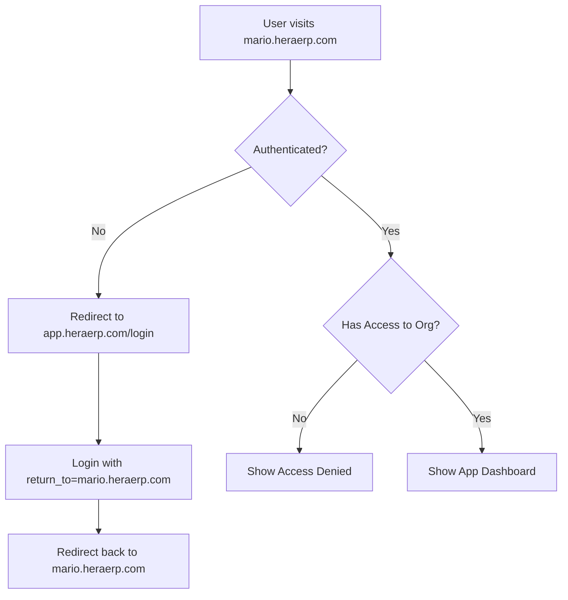

# 🔐 HERA Universal SaaS Authentication & Multi-App Flow

## 🎯 Overview

HERA is a universal SaaS ERP platform where:
- One user can have multiple organizations
- Each organization can have multiple apps
- Each organization gets its own subdomain
- Apps are accessed via subdomain + app path

## 🌐 Domain Architecture

### Platform Domains
```
heraerp.com                    # Main marketing/landing site
app.heraerp.com               # Central authentication hub
*.heraerp.com                 # Organization subdomains
```

### Organization Subdomains
```
acme.heraerp.com              # ACME Corp's instance
acme.heraerp.com/salon        # ACME's salon app
acme.heraerp.com/restaurant   # ACME's restaurant app
acme.heraerp.com/budgeting    # ACME's budgeting app

mario.heraerp.com             # Mario's Restaurant instance
mario.heraerp.com/restaurant  # Mario's restaurant app
mario.heraerp.com/budgeting   # Mario's budgeting app
```

## 🔄 Complete Authentication Flow

### 1️⃣ Initial Sign-Up Flow
```mermaid
graph TD
    A[User visits heraerp.com] --> B[Click "Get Started"]
    B --> C[Redirect to app.heraerp.com/signup]
    C --> D[Create Supabase Account]
    D --> E[Email Verification]
    E --> F[Complete Basic Profile]
    F --> G[Choose Business Type]
    G --> H[Create Organization]
    H --> I[Assign Subdomain]
    I --> J[Select Apps to Install]
    J --> K[Provision Apps]
    K --> L[Redirect to org.heraerp.com/setup]
```

### 2️⃣ Returning User Login Flow
```mermaid
graph TD
    A[User visits heraerp.com] --> B[Click "Sign In"]
    B --> C[Redirect to app.heraerp.com/login]
    C --> D[Supabase Authentication]
    D --> E{Has Organizations?}
    E -->|No| F[Create First Organization]
    E -->|Yes - Single Org| G[Redirect to org.heraerp.com]
    E -->|Yes - Multiple Orgs| H[Show Organization Selector]
    H --> I[Select Organization]
    I --> G
    G --> J[Show App Dashboard]
```

### 3️⃣ Direct Subdomain Access


## 📊 Database Schema for Multi-Tenant SaaS

### User-Organization Relationships
```sql
-- Users can belong to multiple organizations
core_relationships:
- from_entity_id: user_entity_id
- to_entity_id: organization_id
- relationship_type: 'member_of'
- metadata: {
    role: 'owner|admin|user',
    joined_at: timestamp,
    permissions: []
  }

-- Organizations have installed apps
core_relationships:
- from_entity_id: organization_id
- to_entity_id: app_entity_id
- relationship_type: 'has_installed'
- metadata: {
    installed_at: timestamp,
    config: {},
    status: 'active|trial|suspended'
  }
```

### Organization Entity
```typescript
{
  entity_type: 'organization',
  entity_name: 'ACME Corporation',
  entity_code: 'ORG-ACME',
  metadata: {
    subdomain: 'acme',
    subscription_plan: 'professional',
    billing_status: 'active',
    created_by: user_id
  }
}
```

## 🚀 Implementation Steps

### Phase 1: Central Authentication Hub (app.heraerp.com)
```typescript
// Routes needed:
/signup              # New user registration
/login               # User login
/logout              # Logout from all orgs
/verify-email        # Email verification
/forgot-password     # Password reset
/profile             # User profile management
/organizations       # List user's organizations
/organizations/new   # Create new organization
/organizations/switch # Switch between orgs
```

### Phase 2: Organization Setup Flow
```typescript
// After creating organization:
1. Check subdomain availability
2. Create organization entity
3. Create user-organization relationship
4. Provision default apps based on business type
5. Create initial data (COA, sample data)
6. Generate JWT with organization context
7. Redirect to subdomain
```

### Phase 3: Subdomain App Management
```typescript
// Each subdomain routes:
/                    # Organization dashboard
/setup               # Initial setup wizard
/apps                # Installed apps list
/apps/install        # App marketplace
/salon               # Salon app (if installed)
/restaurant          # Restaurant app (if installed)
/budgeting           # Budgeting app (if installed)
/settings            # Organization settings
/billing             # Subscription management
/users               # User management
```

## 🔐 Security Architecture

### JWT Token Structure
```typescript
{
  // Standard claims
  sub: user_id,
  email: user_email,
  
  // HERA claims
  organization_id: current_org_id,
  organization_subdomain: 'acme',
  entity_id: user_entity_id,
  role: 'owner|admin|user',
  permissions: ['apps:manage', 'users:invite', ...],
  
  // Multi-org context
  organizations: [{
    id: org_id,
    subdomain: 'acme',
    name: 'ACME Corp',
    role: 'owner'
  }],
  
  // Session info
  iat: issued_at,
  exp: expires_at,
  session_id: unique_session_id
}
```

### Cross-Subdomain Authentication
```typescript
// Shared session cookie domain
Set-Cookie: hera_session=xxx; Domain=.heraerp.com; Secure; HttpOnly; SameSite=Lax

// Organization context header
X-HERA-Organization: acme
X-HERA-Organization-ID: uuid
```

## 📱 App Installation & Management

### Available Apps Catalog
```typescript
const HERA_APPS = {
  salon: {
    id: 'salon',
    name: 'Salon Management',
    description: 'Complete salon operations',
    industries: ['beauty', 'wellness'],
    base_price: 49,
    features: ['appointments', 'inventory', 'staff'],
    setup_time: '30 seconds'
  },
  restaurant: {
    id: 'restaurant',
    name: 'Restaurant POS',
    description: 'Full restaurant management',
    industries: ['food', 'hospitality'],
    base_price: 99,
    features: ['menu', 'orders', 'kitchen'],
    setup_time: '45 seconds'
  },
  budgeting: {
    id: 'budgeting',
    name: 'Universal Budgeting',
    description: 'Enterprise budgeting',
    industries: ['all'],
    base_price: 39,
    features: ['planning', 'forecasting', 'variance'],
    setup_time: '20 seconds'
  }
}
```

### App Provisioning Process
```typescript
async function provisionApp(organizationId: string, appId: string) {
  // 1. Create app relationship
  await createRelationship({
    from_entity_id: organizationId,
    to_entity_id: appId,
    relationship_type: 'has_installed',
    metadata: { status: 'provisioning' }
  })
  
  // 2. Copy app templates
  await copyAppTemplates(organizationId, appId)
  
  // 3. Generate industry-specific data
  await generateIndustryData(organizationId, appId)
  
  // 4. Configure app settings
  await configureAppSettings(organizationId, appId)
  
  // 5. Update status
  await updateRelationship({
    status: 'active',
    provisioned_at: new Date()
  })
}
```

## 🎨 User Experience Flow

### First-Time User Journey
1. **Landing Page** (heraerp.com)
   - "Start Free Trial" → app.heraerp.com/signup

2. **Sign Up** (app.heraerp.com/signup)
   - Email/password
   - Verify email
   - Basic profile (name, phone)

3. **Business Setup** (app.heraerp.com/setup)
   - Business name
   - Industry selection
   - Choose subdomain
   - Select initial apps

4. **Provisioning** (app.heraerp.com/provisioning)
   - Creating organization...
   - Installing apps...
   - Generating sample data...

5. **Ready!** (acme.heraerp.com)
   - Organization dashboard
   - Installed apps
   - Quick start guide

### Returning User Journey
1. **Any Entry Point**
   - heraerp.com → "Sign In"
   - acme.heraerp.com → Auto-redirect if not authenticated
   - app.heraerp.com → Direct login

2. **Organization Selection** (if multiple)
   - List of organizations with roles
   - Quick switch dropdown in header

3. **App Dashboard**
   - Installed apps grid
   - Recent activity
   - Quick actions

## 🏗️ Technical Implementation

### Subdomain Routing (Next.js)
```typescript
// middleware.ts
export function middleware(request: NextRequest) {
  const hostname = request.headers.get('host')
  const subdomain = hostname?.split('.')[0]
  
  // Handle different subdomains
  if (subdomain === 'app') {
    // Central auth hub
    return NextResponse.rewrite(new URL('/auth', request.url))
  } else if (subdomain && subdomain !== 'www') {
    // Organization subdomain
    request.headers.set('x-organization-subdomain', subdomain)
    return NextResponse.rewrite(new URL('/org', request.url))
  }
  
  // Main marketing site
  return NextResponse.next()
}
```

### Organization Context Provider
```typescript
export function OrganizationProvider({ children }) {
  const [organization, setOrganization] = useState(null)
  const subdomain = getSubdomain()
  
  useEffect(() => {
    if (subdomain) {
      loadOrganizationBySubdomain(subdomain)
    }
  }, [subdomain])
  
  return (
    <OrganizationContext.Provider value={{ organization }}>
      {children}
    </OrganizationContext.Provider>
  )
}
```

## 📈 Scaling Considerations

### Multi-Region Deployment
```
app.heraerp.com      → Global (Anycast)
*.heraerp.com        → Regional (Closest to org)
api.heraerp.com      → Global API Gateway
cdn.heraerp.com      → Global CDN
```

### Data Isolation
- Each organization's data filtered by organization_id
- RLS policies enforce isolation at database level
- API middleware validates organization context
- Separate caching per organization

### Performance Optimization
- Subdomain-based routing at edge
- Organization data cached in Redis
- Static app assets on CDN
- Database connection pooling per region

## 🎯 Business Benefits

1. **True Multi-Tenancy**: Each business feels like they have their own system
2. **Flexible Pricing**: Pay only for apps you use
3. **Instant Provisioning**: New apps ready in seconds
4. **White-Label Ready**: Custom domains possible
5. **Unified Experience**: Single sign-on across all apps
6. **Enterprise Scale**: Supports unlimited organizations and apps

## 🚀 Next Steps

1. Implement central auth hub at app.heraerp.com
2. Add subdomain routing middleware
3. Create organization management APIs
4. Build app marketplace UI
5. Implement provisioning engine
6. Add billing integration
7. Deploy to edge network