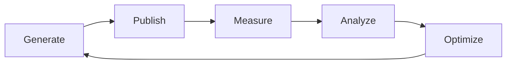

# 📈 HERA Blog Automation Scaling Guide

This guide shows how to scale from 1 post/day to 100+ posts/day while maintaining quality and avoiding Google penalties.

## 🎯 Scaling Milestones

### Phase 1: Foundation (1-5 posts/day)
**Timeline**: Month 1-2
**Goal**: Establish quality baseline and processes

```yaml
Daily Output: 1-5 posts
Cities Covered: 20 UK cities
Topics: 15 pillars
Team: 1 person part-time
Cost: ~$50/month (API costs)
```

**Actions**:
1. Run single daily generation
2. Manual review of each post
3. Track initial metrics
4. Refine prompts based on performance

### Phase 2: Growth (10-25 posts/day)
**Timeline**: Month 3-4
**Goal**: Increase volume while maintaining quality

```yaml
Daily Output: 10-25 posts
Cities Covered: 50+ UK cities + Ireland
Topics: 25+ pillars with variations
Team: 1 content manager + 1 SEO specialist
Cost: ~$200/month
```

**Technical Changes**:
```typescript
// Parallel generation
const generateBatch = async (count: number) => {
  const promises = Array(count).fill(null).map(() => 
    generatePost()
  );
  return Promise.all(promises);
};

// Implement queuing
const queue = new Queue('blog-generation', {
  concurrency: 5,
  rateLimit: 10 // per minute
});
```

### Phase 3: Scale (50-100 posts/day)
**Timeline**: Month 5-6
**Goal**: Full automation with quality control

```yaml
Daily Output: 50-100 posts
Cities Covered: UK + US + EU markets
Topics: 50+ pillars, industry-specific
Team: Content team of 3-5
Cost: ~$500/month
```

**Infrastructure**:
```typescript
// Distributed generation
const regions = ['uk', 'us', 'eu', 'apac'];
const workers = regions.map(region => 
  new Worker(`generate-${region}.js`)
);

// Content calendar
const calendar = new ContentCalendar({
  minPostsPerCity: 5,
  maxPostsPerTopic: 10,
  distributionStrategy: 'even'
});
```

## 🔧 Technical Scaling

### 1. **Database Architecture**

```sql
-- Content tracking
CREATE TABLE generated_content (
  id UUID PRIMARY KEY,
  city VARCHAR(100),
  topic VARCHAR(100),
  slug VARCHAR(255) UNIQUE,
  generated_at TIMESTAMP,
  published_at TIMESTAMP,
  performance_score FLOAT,
  INDEX idx_city_topic (city, topic)
);

-- Prevent duplicates
CREATE TABLE content_matrix (
  city VARCHAR(100),
  topic VARCHAR(100),
  last_generated TIMESTAMP,
  generation_count INT,
  PRIMARY KEY (city, topic)
);
```

### 2. **Caching Strategy**

```typescript
// Redis for deduplication
const redis = new Redis();

const checkDuplicate = async (city: string, topic: string) => {
  const key = `generated:${city}:${topic}`;
  const exists = await redis.exists(key);
  
  if (!exists) {
    await redis.setex(key, 30 * 24 * 60 * 60, Date.now()); // 30 days
    return false;
  }
  return true;
};
```

### 3. **Load Balancing**

```yaml
# docker-compose.yml
version: '3.8'
services:
  generator-1:
    build: .
    environment:
      - WORKER_ID=1
      - MAX_CONCURRENT=10
  
  generator-2:
    build: .
    environment:
      - WORKER_ID=2
      - MAX_CONCURRENT=10
  
  nginx:
    image: nginx
    volumes:
      - ./nginx.conf:/etc/nginx/nginx.conf
    ports:
      - "80:80"
```

## 🌍 Geographic Expansion

### UK → Europe Expansion

```javascript
// data/cities-eu.json
const euCities = [
  // Germany
  { city: "Berlin", country: "DE", language: "de", currency: "EUR" },
  { city: "Munich", country: "DE", language: "de", currency: "EUR" },
  
  // France  
  { city: "Paris", country: "FR", language: "fr", currency: "EUR" },
  { city: "Lyon", country: "FR", language: "fr", currency: "EUR" },
  
  // Spain
  { city: "Madrid", country: "ES", language: "es", currency: "EUR" },
  { city: "Barcelona", country: "ES", language: "es", currency: "EUR" }
];
```

### Localization System

```typescript
// lib/localization.ts
const localizeContent = (content: string, locale: Locale) => {
  return content
    .replace(/£/g, locale.currency)
    .replace(/VAT/g, locale.taxName)
    .replace(/Companies House/g, locale.businessRegistry)
    .replace(/HMRC/g, locale.taxAuthority);
};

const locales = {
  UK: { currency: "£", taxName: "VAT", taxRate: 0.20 },
  DE: { currency: "€", taxName: "MwSt", taxRate: 0.19 },
  US: { currency: "$", taxName: "Sales Tax", taxRate: 0.08 }
};
```

## 📊 Content Distribution

### 1. **Topic Rotation Algorithm**

```typescript
class TopicRotation {
  private matrix: Map<string, Map<string, Date>>;
  
  getNextTopic(city: string): string {
    const cityTopics = this.matrix.get(city) || new Map();
    const now = new Date();
    
    // Find least recently used topic
    let oldestTopic = null;
    let oldestDate = now;
    
    for (const [topic, lastUsed] of cityTopics) {
      if (lastUsed < oldestDate) {
        oldestDate = lastUsed;
        oldestTopic = topic;
      }
    }
    
    // Update last used
    cityTopics.set(oldestTopic, now);
    return oldestTopic;
  }
}
```

### 2. **Seasonal Content**

```typescript
const seasonalTopics = {
  Q1: ["Tax preparation", "New year planning", "Budget reviews"],
  Q2: ["Growth strategies", "Summer staffing", "Efficiency audits"],
  Q3: ["Back to business", "Q4 preparation", "Inventory planning"],
  Q4: ["Year-end close", "Holiday operations", "Annual planning"]
};

const getCurrentTopics = () => {
  const quarter = `Q${Math.ceil((new Date().getMonth() + 1) / 3)}`;
  return [...baseTopics, ...seasonalTopics[quarter]];
};
```

## 🤖 AI Optimization

### 1. **Prompt Engineering at Scale**

```typescript
// Dynamic prompt optimization
class PromptOptimizer {
  async optimizePrompt(basePrompt: string, performance: MetricData) {
    if (performance.avgReadTime < 2) {
      basePrompt += "\n\nMake content more engaging with stories.";
    }
    
    if (performance.bounceRate > 0.6) {
      basePrompt += "\n\nStronger hook in first paragraph.";
    }
    
    if (performance.conversionRate < 0.02) {
      basePrompt += "\n\nMore compelling CTAs throughout.";
    }
    
    return basePrompt;
  }
}
```

### 2. **Multi-Model Strategy**

```typescript
const models = {
  primary: "claude-3-opus",
  fallback: "claude-3-sonnet",
  bulk: "claude-3-haiku" // For high volume
};

const selectModel = (priority: string) => {
  switch(priority) {
    case 'high': return models.primary;
    case 'medium': return models.fallback;
    case 'bulk': return models.bulk;
  }
};
```

## 📈 Quality at Scale

### 1. **Automated Quality Checks**

```typescript
class QualityChecker {
  async checkPost(content: string, meta: PostMeta) {
    const checks = {
      length: content.length > 1000 && content.length < 2000,
      keywords: this.checkKeywordDensity(content, meta.keywords),
      readability: await this.getReadabilityScore(content) > 60,
      uniqueness: await this.checkUniqueness(content) > 0.85,
      localRelevance: content.includes(meta.city) >= 5
    };
    
    const score = Object.values(checks).filter(Boolean).length / 5;
    return { score, checks };
  }
}
```

### 2. **Human Review Pipeline**

```yaml
# Review workflow
statuses:
  - generated     # AI created
  - queued        # Awaiting review  
  - in_review     # Being reviewed
  - approved      # Ready to publish
  - published     # Live on site
  - needs_edit    # Failed QC

reviewers:
  tier_1: # Quick review (bulk content)
    - Check facts
    - Verify local relevance
    - Approve/reject
    
  tier_2: # Deep review (high-value)
    - Edit for brand voice
    - Enhance CTAs
    - Add custom insights
```

## 💰 Cost Optimization

### 1. **API Cost Management**

```typescript
const costPerModel = {
  'claude-3-opus': 0.015,    // per 1K tokens
  'claude-3-sonnet': 0.003,
  'claude-3-haiku': 0.00025
};

const optimizeCosts = (monthlyBudget: number) => {
  const dailyBudget = monthlyBudget / 30;
  const postsPerModel = {
    opus: Math.floor(dailyBudget * 0.2 / costPerModel['claude-3-opus']),
    sonnet: Math.floor(dailyBudget * 0.3 / costPerModel['claude-3-sonnet']),
    haiku: Math.floor(dailyBudget * 0.5 / costPerModel['claude-3-haiku'])
  };
  
  return postsPerModel;
};
```

### 2. **Infrastructure Costs**

| Scale | Infrastructure | Monthly Cost |
|-------|---------------|--------------|
| 1-10 posts/day | GitHub Actions | $0 |
| 10-50 posts/day | Single VPS | $40 |
| 50-200 posts/day | K8s cluster | $200 |
| 200+ posts/day | Multi-region | $500+ |

## 🚨 Avoiding Penalties

### 1. **Content Diversity Rules**

```typescript
const diversityRules = {
  minDaysBetweenSameCityTopic: 30,
  maxPostsPerDayPerCity: 2,
  minUniqueWordsPerPost: 800,
  maxSimilarityScore: 0.3,
  requiredOriginalInsights: 3
};
```

### 2. **Publishing Velocity**

```typescript
// Gradual ramp-up to avoid sudden spikes
const publishingSchedule = {
  week1: 1,  // posts per day
  week2: 2,
  week3: 5,
  week4: 10,
  week5: 15,
  week6: 20,
  // Then maintain steady state
};
```

## 🎯 Success Metrics

### KPIs by Scale

| Metric | Small (1-10) | Medium (10-50) | Large (50+) |
|--------|--------------|----------------|--------------|
| Organic Traffic | +50% MoM | +100% MoM | +200% MoM |
| Lead Conversion | 5% | 4% | 3% |
| Cost per Lead | £10 | £5 | £2 |
| Content ROI | 200% | 500% | 1000% |

### Monitoring Dashboard

```typescript
// Real-time metrics
const metrics = {
  generation: {
    postsToday: 0,
    successRate: 0,
    avgGenerationTime: 0
  },
  quality: {
    avgQualityScore: 0,
    rejectionRate: 0,
    editRate: 0
  },
  performance: {
    totalTraffic: 0,
    avgTimeOnPage: 0,
    conversionRate: 0
  }
};
```

## 🔄 Continuous Improvement

### 1. **A/B Testing Framework**

```typescript
const experiments = [
  {
    name: "CTA Positioning",
    variants: ["top", "middle", "bottom", "multiple"],
    metric: "conversion_rate"
  },
  {
    name: "Content Length",
    variants: [800, 1200, 1600, 2000],
    metric: "time_on_page"
  },
  {
    name: "Local Examples",
    variants: ["none", "one", "multiple"],
    metric: "engagement_rate"
  }
];
```

### 2. **Feedback Loop**



## 🚀 Next Steps

1. **Month 1**: Implement base system, generate 30 posts
2. **Month 2**: Add automation, scale to 100 posts  
3. **Month 3**: Expand geography, reach 500 posts
4. **Month 6**: Full scale operations, 3000+ posts

Remember: Quality > Quantity. Scale gradually and monitor impact!