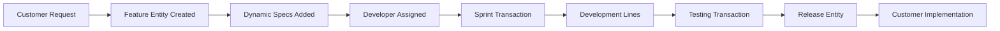

# 🏗️ Using HERA to Build HERA: The Meta Implementation Plan

## 🎯 The Revolutionary Concept

**Use HERA's own 6-table universal architecture to build, manage, and evolve HERA itself.**

This isn't just clever - it's the ultimate proof that HERA can handle infinite business complexity. If HERA can build and manage a software company, it can manage any business.

## 🗃️ HERA Meta Architecture: Mapping Software Development to Universal Tables

### Table 1: core_organizations (WHO)
```sql
-- HERA Software Company Organization Structure
INSERT INTO core_organizations VALUES
('hera_dev_team', 'HERA Development Team', 'software_company', 'active'),
('hera_customers', 'HERA Customer Organizations', 'customer_base', 'active'),
('hera_partners', 'HERA Integration Partners', 'partner_network', 'active');
```

### Table 2: core_entities (WHAT)
```sql
-- All Software Development "Things"
INSERT INTO core_entities VALUES
-- Product entities
('feature_001', 'hera_dev_team', 'feature', 'Universal Transaction API', 'FEAT-001'),
('bug_001', 'hera_dev_team', 'bug', 'Multi-tenant filter missing', 'BUG-001'),
('release_001', 'hera_dev_team', 'release', 'HERA v2.0 Universal ERP', 'REL-001'),

-- Team entities  
('dev_alice', 'hera_dev_team', 'developer', 'Alice Johnson - Full Stack', 'DEV-001'),
('customer_mario', 'hera_customers', 'customer', 'Mario\'s Restaurant', 'CUST-001'),

-- Infrastructure entities
('server_prod', 'hera_dev_team', 'server', 'Production API Server', 'SRV-001'),
('database_main', 'hera_dev_team', 'database', 'Main Supabase Instance', 'DB-001');
```

### Table 3: core_dynamic_data (HOW)
```sql
-- Unlimited Software Development Properties
INSERT INTO core_dynamic_data VALUES
-- Feature specifications
('feature_001', 'priority', 'number', 9), -- High priority
('feature_001', 'story_points', 'number', 13), -- Complexity estimate
('feature_001', 'acceptance_criteria', 'json', '{
  "criteria": [
    "API handles all transaction types",
    "Multi-tenant security enforced", 
    "Performance under 200ms"
  ]
}'),

-- Bug details
('bug_001', 'severity', 'text', 'critical'),
('bug_001', 'affected_customers', 'json', '["mario_restaurant", "smith_law_firm"]'),
('bug_001', 'reproduction_steps', 'json', '{
  "steps": ["Login as user", "Create transaction", "Missing org filter"]
}'),

-- Developer skills  
('dev_alice', 'programming_languages', 'json', '["TypeScript", "Python", "SQL"]'),
('dev_alice', 'hourly_rate', 'number', 125),
('dev_alice', 'availability', 'text', 'full_time');
```

### Table 4: core_relationships (WHY)
```sql
-- Software Development Connections
INSERT INTO core_relationships VALUES
-- Feature dependencies
('feature_001', 'feature_002', 'depends_on', 'hera_dev_team'),
('bug_001', 'feature_001', 'blocks', 'hera_dev_team'),

-- Team assignments
('dev_alice', 'feature_001', 'assigned_to', 'hera_dev_team'),
('feature_001', 'release_001', 'included_in', 'hera_dev_team'),

-- Customer relationships
('customer_mario', 'feature_001', 'requested_by', 'hera_customers'),
('bug_001', 'customer_mario', 'reported_by', 'hera_customers');
```

### Table 5: universal_transactions (WHEN)
```sql
-- ALL Software Development Activities as Transactions
INSERT INTO universal_transactions VALUES
-- Sprint planning
('sprint_001', 'hera_dev_team', 'sprint_planning', 'SPRINT-2024-01', '2024-01-15'),

-- Feature development
('dev_001', 'hera_dev_team', 'feature_development', 'DEV-FEAT-001', '2024-01-16'),

-- Bug fixes
('fix_001', 'hera_dev_team', 'bug_fix', 'FIX-BUG-001', '2024-01-17'),

-- Customer implementations  
('impl_001', 'hera_customers', 'customer_implementation', 'IMPL-MARIO-001', '2024-01-18'),

-- Releases
('rel_001', 'hera_dev_team', 'software_release', 'REL-2.0-001', '2024-01-20');
```

### Table 6: universal_transaction_lines (DETAILS)
```sql
-- Detailed Breakdown of All Development Activities
INSERT INTO universal_transaction_lines VALUES
-- Sprint planning details
('sprint_001', 'feature_001', 'Plan Universal API feature', 1, 13, 13), -- 13 story points
('sprint_001', 'bug_001', 'Fix multi-tenant security bug', 1, 8, 8),   -- 8 story points

-- Feature development breakdown
('dev_001', 'task_001', 'Design API endpoints', 1, 16, 16),     -- 16 hours
('dev_001', 'task_002', 'Implement authentication', 1, 24, 24), -- 24 hours  
('dev_001', 'task_003', 'Write unit tests', 1, 12, 12),         -- 12 hours

-- Customer implementation details
('impl_001', 'setup_001', 'Database setup', 1, 4, 4),           -- 4 hours
('impl_001', 'config_001', 'Business configuration', 1, 8, 8),  -- 8 hours
('impl_001', 'train_001', 'User training', 1, 6, 6);           -- 6 hours
```

## 🚀 The Meta Implementation: HERA Development Dashboard

```typescript
// HERA managing HERA development
const heraDevDashboard = {
  // Current sprint status
  currentSprint: await getTransaction('sprint_planning', 'current'),
  
  // Feature progress  
  features: await getEntitiesByType('feature', 'hera_dev_team'),
  
  // Developer workload
  developers: await getEntitiesWithRelationships('developer', 'assigned_to'),
  
  // Customer requests
  customerRequests: await getTransactionsByType('customer_request'),
  
  // Release pipeline
  releases: await getEntitiesByType('release', 'hera_dev_team')
}

// ALL using the same 6 universal tables!
```

## 🎯 Real-World HERA Meta Scenarios

### Scenario 1: Feature Request from Customer
```typescript
// 1. Customer requests new feature
const featureRequest = await createTransaction({
  transaction_type: 'feature_request',
  organization_id: 'hera_customers',
  source_entity_id: 'customer_mario',
  line_items: [{
    entity_id: 'new_feature_id',
    description: 'Need allergen tracking for menu items',
    priority: 'high',
    business_value: 'regulatory_compliance'
  }]
});

// 2. Feature gets created as entity
const feature = await createEntity({
  entity_type: 'feature',
  entity_name: 'Allergen Tracking System',
  organization_id: 'hera_dev_team'
});

// 3. Dynamic fields added for feature specs
await addDynamicField(feature.id, 'customer_request_id', featureRequest.id);
await addDynamicField(feature.id, 'estimated_effort', 21); // story points
await addDynamicField(feature.id, 'target_release', 'v2.1');

// 4. Feature assigned to developer
await createRelationship(feature.id, 'dev_alice', 'assigned_to');

// ALL using universal HERA patterns!
```

### Scenario 2: Sprint Planning
```typescript
// Sprint planning as a universal transaction
const sprintPlan = await createTransaction({
  transaction_type: 'sprint_planning',
  organization_id: 'hera_dev_team',
  transaction_date: '2024-01-15',
  line_items: [
    {
      entity_id: 'feature_001',
      description: 'Universal API development',
      quantity: 1,
      unit_price: 13, // story points
      line_amount: 13
    },
    {
      entity_id: 'bug_001', 
      description: 'Multi-tenant security fix',
      quantity: 1,
      unit_price: 8,
      line_amount: 8
    }
  ]
});

// Total sprint capacity: 21 story points
// Same transaction pattern as restaurant orders!
```

### Scenario 3: Customer Implementation
```typescript
// Customer onboarding as universal transaction
const implementation = await createTransaction({
  transaction_type: 'customer_implementation',
  organization_id: 'hera_customers',
  source_entity_id: 'customer_mario',
  target_entity_id: 'hera_dev_team',
  line_items: [
    {
      entity_id: 'service_database_setup',
      description: 'Set up customer database',
      quantity: 1,
      unit_price: 4, // hours
      line_amount: 500 // $500 (4 hours × $125/hour)
    },
    {
      entity_id: 'service_configuration',
      description: 'Configure restaurant-specific fields',
      quantity: 1, 
      unit_price: 8,
      line_amount: 1000
    }
  ]
});

// Same universal pattern as any service transaction!
```

## 📊 HERA Meta Analytics & Reporting

```typescript
// Development team performance dashboard
const devMetrics = {
  // Feature velocity
  sprintVelocity: await calculateVelocity('sprint_planning', 'last_6_sprints'),
  
  // Customer satisfaction
  customerSatisfaction: await getAverageRating('customer_feedback'),
  
  // Bug resolution time
  bugResolutionTime: await getAverageTime('bug_fix', 'created_to_resolved'),
  
  // Developer utilization
  developerUtilization: await calculateUtilization('developer', 'assigned_hours'),
  
  // Revenue from implementations
  implementationRevenue: await sumTransactionAmounts('customer_implementation')
}

// ALL calculated from the same universal tables!
```

## 🔄 The Meta Workflow: HERA Building HERA

### Development Workflow


### Same Universal Pattern For:
- **Restaurants**: Order → Menu Items → Kitchen → Service → Payment
- **HERA Dev**: Request → Features → Development → Testing → Release
- **Healthcare**: Symptoms → Diagnosis → Treatment → Medication → Billing
- **Manufacturing**: Order → BOM → Production → Quality → Shipping

**ONE ARCHITECTURE HANDLES EVERYTHING!**

## 🎯 Implementation Roadmap

### Phase 1: HERA Meta Foundation (Week 1)
```typescript
// Set up HERA development organization
await setupHeraDevOrganization();

// Create core software development entities
await createSoftwareEntities(['feature', 'bug', 'release', 'developer', 'customer']);

// Configure development-specific dynamic fields
await setupDevelopmentFields();
```

### Phase 2: Development Workflow (Week 2)
```typescript
// Implement sprint planning transactions
await createSprintPlanningWorkflow();

// Feature development tracking
await createFeatureDevelopmentTracking(); 

// Bug tracking and resolution
await createBugTrackingWorkflow();
```

### Phase 3: Customer Management (Week 3)
```typescript
// Customer onboarding process
await createCustomerOnboardingWorkflow();

// Implementation tracking
await createImplementationTracking();

// Support ticket management
await createSupportTicketWorkflow();
```

### Phase 4: Analytics & Intelligence (Week 4)  
```typescript
// Development team analytics
await createDevelopmentAnalytics();

// Customer success metrics
await createCustomerAnalytics();

// AI-powered insights
await enableAIInsights();
```

## 🏆 The Ultimate Proof

When HERA successfully manages its own:
- ✅ **Feature development** (complex project management)
- ✅ **Customer implementations** (service delivery)  
- ✅ **Team coordination** (resource management)
- ✅ **Financial tracking** (revenue and costs)
- ✅ **Analytics and reporting** (business intelligence)

...then we've proven HERA can manage **ANY** business complexity!

## 🚀 The Meta Demonstration Value

**For Prospects**: "This ERP system is so universal, it literally manages the software company that built it."

**For Investors**: "The development team uses their own product for everything - ultimate dogfooding."

**For Developers**: "One architecture handles software development, restaurants, hospitals, and law firms equally well."

**For the Market**: "If HERA can build and manage itself, it can handle your business too."

## 💡 Next Steps

1. **Deploy HERA instance** for HERA development team
2. **Migrate current development processes** to HERA universal patterns
3. **Document the meta-implementation** as the ultimate case study
4. **Use HERA analytics** to optimize HERA development itself
5. **Create customer demos** showing "HERA managing HERA"

The recursive beauty: Every improvement to HERA gets tracked IN HERA, creating the most sophisticated development management system ever built! 🤯

---

*This is how you prove a universal architecture - use it to build itself!* 🚀