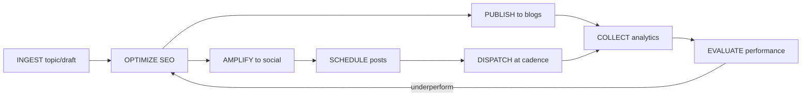

# Amplify Module Guide

## Overview

The Amplify module is an AI-powered marketing amplification engine that transforms single pieces of content into multi-channel campaigns. It uses HERA's universal 6-table architecture to manage the entire content lifecycle.

## Architecture

### Entities

1. **AMPLIFY_CAMPAIGN** - High-level marketing initiatives
2. **AMPLIFY_PERSONA** - AI voice/author styles
3. **AMPLIFY_CONTENT** - Source articles/drafts/topics
4. **AMPLIFY_ASSET** - Repurposed outputs (threads, carousels, scripts)
5. **AMPLIFY_PUBLICATION** - Published articles (Medium, WordPress, Substack)
6. **AMPLIFY_SOCIAL_POST** - Social media posts
7. **AMPLIFY_ANALYTIC_EVENT** - Performance metrics
8. **AMPLIFY_CHANNEL** - Publishing destinations
9. **AMPLIFY_TASK** - Audit log for all operations
10. **AMPLIFY_REPORT** - White-label performance reports

### Workflow



## Quick Start

### 1. Access the Module

Navigate to `/amplify` from the CRM or organization dashboard. Look for the sparkles icon.

### 2. Create Your First Campaign

```typescript
// Via UI
Navigate to /amplify/campaigns
Click "Create Campaign"
Fill in:
- Name: "Q1 Content Marketing"
- Goal: "Increase brand awareness"
- Budget: 5000
- Status: "active"

// Via API
await apiV2.post('entities', {
  entity_type: 'AMPLIFY_CAMPAIGN',
  entity_name: 'Q1 Content Marketing',
  smart_code: 'HERA.AMPLIFY.CAMPAIGN.ENTITY.V1',
  organization_id: orgId
})
```

### 3. Ingest Content

```typescript
// Via API endpoint
await fetch('/api/amplify/ingest', {
  method: 'POST',
  headers: { 'Content-Type': 'application/json' },
  body: JSON.stringify({
    campaignId: campaignId,
    organizationId: orgId,
    topicOrDraft: {
      title: '10 Ways AI is Transforming Marketing',
      body: 'AI is revolutionizing...',
      source_type: 'topic'
    }
  })
})
```

### 4. Optimize Content

The optimization step adds:
- SEO title (≤70 chars)
- Meta description (≤155 chars)
- Keywords array
- Schema.org JSON-LD
- Internal/external links

### 5. Publish & Amplify

Content flows through:
- **Blog Publishing**: Medium, WordPress, Substack
- **Social Amplification**: X, LinkedIn, Instagram, TikTok
- **Scheduling**: Optimal posting times per platform
- **Analytics**: Real-time performance tracking

## Smart Codes

All Amplify operations use smart codes for intelligent automation:

```typescript
// Campaign codes
'HERA.AMPLIFY.CAMPAIGN.ENTITY.V1'
'HERA.AMPLIFY.CAMPAIGN.REL.HAS_CONTENT.V1'

// Content codes  
'HERA.AMPLIFY.CONTENT.ENTITY.V1'
'HERA.AMPLIFY.CONTENT.DYN.STATUS.V1'

// Social codes
'HERA.AMPLIFY.SOCIAL.POST.ENTITY.V1'
'HERA.AMPLIFY.SOCIAL.POST.DYN.PLATFORM.V1'
```

## API Endpoints

### Ingest Content
```
POST /api/amplify/ingest
Body: {
  campaignId?: string
  personaId?: string
  topicOrDraft: {
    title: string
    body?: string
    source_type: 'topic' | 'draft' | 'article'
  }
  organizationId: string
}
```

### Optimize Content
```
POST /api/amplify/optimize
Body: {
  contentId: string
  organizationId: string
}
```

## Best Practices

1. **Use Personas** - Create consistent brand voices
2. **Set Channel Rules** - Respect platform posting limits
3. **Monitor Analytics** - Let AI refresh underperforming content
4. **Batch Small Posts** - Group social posts for efficiency
5. **White-Label Reports** - Generate client reports with branding

## Integration with HERA

Amplify uses HERA's universal architecture:
- **Entities** stored in `core_entities`
- **Custom fields** in `core_dynamic_data`
- **Relationships** link campaigns → content → posts
- **Audit trail** via `universal_transactions`
- **Multi-tenant** isolation by `organization_id`

No schema changes needed - infinite scalability built-in!