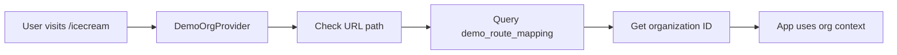

# HERA Demo Organization System

## Overview

HERA now includes an automatic organization assignment system for demo routes. When you visit a demo URL like `/icecream`, the system automatically assigns the appropriate organization ID without requiring authentication.

## 🚀 Key Features

1. **Automatic Organization Assignment**: Based on URL path
2. **HERA Universal Architecture**: Uses existing 6 tables (no custom tables)
3. **Zero Authentication Required**: Perfect for demos and showcases
4. **Easy Conversion**: Convert demo to production with full auth later
5. **Multiple Industry Demos**: Each path maps to a different organization

## 📋 Available Demo Routes

| URL Path | Organization Name | Organization ID | Industry |
|----------|------------------|-----------------|----------|
| `/icecream` | Kochi Ice Cream Manufacturing | `1471e87b-b27e-42ef-8192-343cc5e0d656` | Manufacturing |
| `/restaurant` | Mario's Authentic Italian Restaurant | `8c4f6b2d-5a91-4e8c-b3d7-1f9e8a7c6d54` | Restaurant |
| `/healthcare` | Dr. Smith Family Practice | `a2e5f8d9-7b3c-4f6e-9d1a-8c7e5b4a2f9d` | Healthcare |
| `/salon` | Bella Beauty Salon | `c7d9e4f8-3b2a-4e6d-8f1c-9a7b5c3d2e8f` | Salon |
| `/retail` | TechGear Electronics Store | `e5f8a9d7-2c3b-4f7e-8d1a-7b6c4e3f2a9d` | Retail |

## 🏗️ Architecture

### Universal Tables Used

1. **`core_entities`** - Stores demo route mappings as entities
   - `entity_type`: 'demo_route_mapping'
   - `organization_id`: HERA System Org (`f1ae3ae4-73b1-4f91-9fd5-a431cbb5b944`)

2. **`core_dynamic_data`** - Stores mapping details
   - `route_path`: The URL path (e.g., '/icecream')
   - `target_org_id`: The organization to use
   - `is_active`: Whether mapping is active

### How It Works



## 💻 Implementation

### 1. Setup Demo Mappings (One-time)

```bash
cd mcp-server
node setup-demo-org-mappings.js
```

### 2. Use in Your App

```typescript
// In your layout.tsx
import { DemoOrgProvider } from '@/components/providers/DemoOrgProvider'

export default function Layout({ children }) {
  return (
    <DemoOrgProvider>
      {children}
    </DemoOrgProvider>
  )
}

// In your page components
import { useDemoOrg } from '@/components/providers/DemoOrgProvider'

export default function MyPage() {
  const { organizationId, organizationName, isDemo } = useDemoOrg()
  
  // Use organizationId in your queries
  const { data } = await supabase
    .from('core_entities')
    .select('*')
    .eq('organization_id', organizationId)
}
```

### 3. Display Organization Info

```typescript
{isDemo && (
  <div className="p-3 bg-gray-800 rounded-lg">
    <p className="text-sm text-gray-300">
      Demo Organization: {organizationName}
    </p>
    <p className="text-xs text-gray-500">
      ID: {organizationId}
    </p>
  </div>
)}
```

## 🔄 Demo to Production Conversion

When a customer wants their own instance:

1. **Create Production Organization**
   ```typescript
   const newOrg = await createOrganization({
     name: "Customer's Business Name",
     subdomain: "customer",
     owner_id: userId
   })
   ```

2. **Copy Demo Data** (Optional)
   ```bash
   node copy-demo-to-production.js \
     --source=1471e87b-b27e-42ef-8192-343cc5e0d656 \
     --target=new-org-id
   ```

3. **Enable Authentication**
   - Customer accesses via: `customer.heraerp.com`
   - Full multi-tenant authentication enabled
   - Same UI/UX as demo

## 🎯 Benefits

1. **Instant Demos**: No login required for prospects
2. **Real Data**: Each demo has its own isolated data
3. **Easy Testing**: Developers can test with real org context
4. **Smooth Conversion**: Demo → Trial → Production path
5. **Multiple Industries**: Show different verticals easily

## 🛠️ Adding New Demo Routes

1. Update the mappings in `setup-demo-org-mappings.js`:
   ```javascript
   {
     path: '/newdemo',
     orgId: 'uuid-here',
     orgName: 'Demo Business Name',
     industry: 'industry-type'
   }
   ```

2. Run setup again:
   ```bash
   node setup-demo-org-mappings.js
   ```

3. Create your demo app at `/src/app/newdemo`

## 🔒 Security Notes

- Demo organizations have read/write access without auth
- Production organizations require full authentication
- Demo data is isolated by organization_id
- Cannot access other organizations' data

## 📊 Demo Data Management

### Create Demo Data
```bash
cd mcp-server
node generate-demo-data.js --org-id=1471e87b-b27e-42ef-8192-343cc5e0d656
```

### Reset Demo Data
```bash
node reset-demo-data.js --org-id=1471e87b-b27e-42ef-8192-343cc5e0d656
```

### Monitor Demo Usage
```sql
SELECT 
  COUNT(*) as activity_count,
  DATE(created_at) as activity_date
FROM universal_transactions
WHERE organization_id = '1471e87b-b27e-42ef-8192-343cc5e0d656'
GROUP BY DATE(created_at)
ORDER BY activity_date DESC;
```

## 🚀 Result

With this system:
- Every demo app automatically gets the right organization context
- No authentication needed for demos
- Easy conversion to production when ready
- Perfect data isolation using HERA's sacred organization_id
- Follows HERA universal architecture (no new tables!)

This makes HERA demos incredibly powerful for sales and testing!