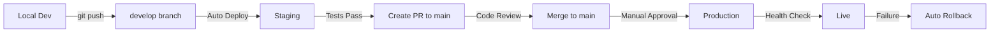

# 🚀 HERA ERP Deployment Strategy

## Overview

This document outlines the complete deployment strategy for HERA ERP to prevent production crashes and ensure smooth releases.

## 📋 Environment Structure

### 1. **Development** (Local)
- **Purpose**: Active development and testing
- **Branch**: `develop`
- **URL**: `localhost:3000`
- **Database**: Local Supabase or dev database

### 2. **Staging** (Railway)
- **Purpose**: Pre-production testing
- **Branch**: `staging` or `develop`
- **URL**: `staging.heraerp.com`
- **Database**: Staging Supabase instance
- **Auto-deploy**: On push to `develop`/`staging` branches

### 3. **Production** (Railway)
- **Purpose**: Live application
- **Branch**: `main`
- **URL**: `app.heraerp.com`, `*.heraerp.com`
- **Database**: Production Supabase
- **Deploy**: Manual approval or on merge to `main`

---

## 🔄 Deployment Workflow

### Standard Development Flow



### Step-by-Step Process

#### 1. **Local Development**
```bash
# Create feature branch
git checkout -b feature/your-feature

# Make changes
# ... code ...

# Test locally
npm run dev
npm run build  # Ensure it builds

# Commit changes
git add .
git commit -m "feat: your feature description"

# Push to develop
git checkout develop
git merge feature/your-feature
git push origin develop
```

#### 2. **Staging Deployment** (Automatic)
```bash
# Push to develop triggers staging deployment
git push origin develop

# GitHub Actions will:
# ✅ Run linting
# ✅ Run type checks
# ✅ Build application
# ✅ Deploy to staging
# ✅ Run smoke tests
# ✅ Health checks

# Monitor at: https://staging.heraerp.com
```

#### 3. **Production Deployment** (Controlled)
```bash
# Option A: Via Pull Request (Recommended)
1. Create PR from develop to main
2. Request code review
3. Merge after approval
4. GitHub Actions auto-deploys to production

# Option B: Manual Deployment
gh workflow run production-deployment.yml -f confirm=deploy

# Option C: Railway CLI
railway up --environment production
```

---

## 🛡️ Pre-deployment Checks

### Automated Checks (GitHub Actions)

1. **Code Quality**
   - ESLint validation
   - TypeScript type checking
   - Import validation

2. **Build Test**
   - Production build
   - Bundle size check
   - Asset optimization

3. **Smoke Tests**
   - Homepage loads
   - API endpoints respond
   - Auth flow works
   - Database connectivity

### Manual Checks

Before production deployment:

```bash
# 1. Run pre-deployment script
npm run predeploy

# 2. Test build locally
npm run build
npm run start

# 3. Check for console errors
# Open http://localhost:3000 in browser
# Check browser console for errors

# 4. Test critical user flows
# - Login/logout
# - Create entity
# - View dashboard
# - API calls work
```

---

## 🚨 Preventing Production Crashes

### 1. **Import Validation**
```bash
# Before committing, check for missing imports
npm run build

# Look for errors like:
# "Module not found: Can't resolve '@/components/...'"
```

### 2. **Environment Variables**
```bash
# Ensure all required env vars are set in Railway:
railway variables

# Required variables:
# - NEXT_PUBLIC_SUPABASE_URL
# - NEXT_PUBLIC_SUPABASE_ANON_KEY
# - SUPABASE_SERVICE_ROLE_KEY
# - DEFAULT_ORGANIZATION_ID
# - ... (see .env.example)
```

### 3. **Database Migrations**
```bash
# Always test migrations in staging first
# Apply to staging
# Test thoroughly
# Then apply to production
```

### 4. **Dependency Updates**
```bash
# Update dependencies in staging first
npm update
npm run build
# Deploy to staging
# Test for 24-48 hours
# Then promote to production
```

---

## 📊 Railway Setup Instructions

### Create Staging Environment

1. **In Railway Dashboard:**
   ```
   Project: heraprd
   → Environments
   → Create New Environment: "staging"
   ```

2. **Clone Production Service:**
   ```
   → Services
   → heraerp-prd
   → Clone to staging environment
   → Rename: heraerp-staging
   ```

3. **Configure Staging Domain:**
   ```
   → heraerp-staging
   → Settings
   → Domains
   → Add Custom Domain: staging.heraerp.com
   ```

4. **Set Environment Variables:**
   ```bash
   # Switch to staging environment
   railway environment --environment staging

   # Set variables (use staging database)
   railway variables set NEXT_PUBLIC_SUPABASE_URL=<staging-url>
   railway variables set NEXT_PUBLIC_SUPABASE_ANON_KEY=<staging-key>
   # ... other variables
   ```

### Link Environments to Branches

1. **Staging → develop branch:**
   ```
   → staging environment
   → Settings
   → Deploy triggers
   → Add branch: develop
   ```

2. **Production → main branch:**
   ```
   → production environment
   → Settings
   → Deploy triggers
   → Add branch: main
   → Enable "Wait for CI to pass"
   ```

---

## 🔐 GitHub Secrets Setup

Add these secrets to your GitHub repository:

```
Settings → Secrets and variables → Actions → New repository secret
```

Required secrets:
- `RAILWAY_STAGING_TOKEN` - Railway token for staging
- `RAILWAY_PRODUCTION_TOKEN` - Railway token for production
- `NEXT_PUBLIC_SUPABASE_URL` - Supabase URL
- `NEXT_PUBLIC_SUPABASE_ANON_KEY` - Supabase anon key

To get Railway tokens:
```bash
# Login to Railway
railway login

# Get token for staging
railway environment --environment staging
railway token

# Get token for production
railway environment --environment production
railway token
```

---

## 🔧 Rollback Strategy

### Automatic Rollback
GitHub Actions will automatically rollback if:
- Health checks fail
- Critical endpoints return errors
- Post-deployment tests fail

### Manual Rollback
```bash
# Via Railway CLI
railway rollback --environment production

# Or via Railway Dashboard
→ Deployments
→ Select previous successful deployment
→ Redeploy
```

---

## 📈 Monitoring & Alerts

### Health Checks
All deployments include automatic health checks:

```bash
# Staging
curl https://staging.heraerp.com/api/health

# Production
curl https://app.heraerp.com/api/health
```

### Railway Logs
```bash
# View staging logs
railway logs --environment staging

# View production logs
railway logs --environment production

# Follow live logs
railway logs --environment production --follow
```

---

## ✅ Deployment Checklist

### Before Every Production Deployment:

- [ ] All tests pass in staging
- [ ] No console errors in staging
- [ ] Database migrations completed in staging
- [ ] Critical user flows tested
- [ ] Environment variables verified
- [ ] Build succeeds locally
- [ ] No import errors
- [ ] Code reviewed by team member
- [ ] Staging running for at least 24 hours
- [ ] Rollback plan ready

### After Production Deployment:

- [ ] Health check passes
- [ ] Homepage loads successfully
- [ ] Login/auth works
- [ ] API endpoints respond
- [ ] Database queries work
- [ ] Monitor logs for 30 minutes
- [ ] Test critical features
- [ ] Verify no regressions

---

## 🚀 Quick Commands Reference

```bash
# Deploy to staging
git push origin develop

# Deploy to production (after PR merge)
git push origin main

# Manual staging deployment
railway up --environment staging

# Manual production deployment
railway up --environment production

# View logs
railway logs --environment staging
railway logs --environment production

# Rollback production
railway rollback --environment production

# Health check
curl https://staging.heraerp.com/api/health
curl https://app.heraerp.com/api/health

# Pre-deployment check
npm run predeploy
```

---

## 🎯 Best Practices

1. **Never deploy directly to production**
   - Always go through staging first
   - Test in staging for at least 24 hours

2. **Use feature flags for major changes**
   - Enable features in staging first
   - Gradually roll out to production

3. **Deploy during low-traffic periods**
   - Schedule production deploys during off-peak hours
   - Have team available for monitoring

4. **Keep deployments small**
   - Smaller changes = easier rollback
   - Deploy frequently rather than large batches

5. **Monitor after deployment**
   - Watch logs for 30 minutes after deploy
   - Check error rates and response times
   - Test critical user flows

6. **Communicate deployments**
   - Notify team before production deploy
   - Update changelog
   - Document any breaking changes

---

## 🆘 Emergency Procedures

### Production is Down

1. **Immediate rollback**
   ```bash
   railway rollback --environment production
   ```

2. **Check logs**
   ```bash
   railway logs --environment production
   ```

3. **Notify team**
   - Post in team chat
   - Update status page

4. **Fix in staging**
   - Reproduce issue in staging
   - Fix and test
   - Deploy to production when stable

### Database Issues

1. **Check connection**
   ```bash
   railway variables --environment production | grep SUPABASE
   ```

2. **Verify RLS policies**
   - Check Supabase dashboard
   - Ensure policies are active

3. **Restore from backup if needed**
   - Contact Supabase support
   - Restore to known good state

---

## 📚 Additional Resources

- [Railway Documentation](https://docs.railway.app)
- [GitHub Actions Docs](https://docs.github.com/en/actions)
- [Next.js Deployment](https://nextjs.org/docs/deployment)
- [HERA Architecture](./architecture/README.md)

---

**Remember**: Staging exists to catch problems before production. Use it!
