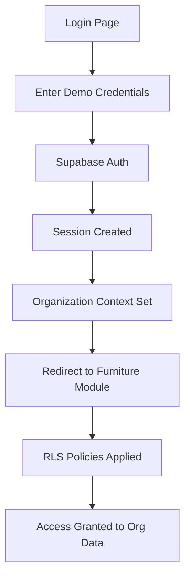

# 🪑 Furniture Module Demo User Guide

## Overview

The Furniture Module includes a pre-configured demo user for testing and demonstration purposes. This user has full access to the Kerala Furniture Works organization and all furniture-related features.

## Demo Credentials

| Field | Value |
|-------|-------|
| **Email** | demo@keralafurniture.com |
| **Password** | FurnitureDemo2025! |
| **Organization** | Kerala Furniture Works |
| **Organization ID** | f0af4ced-9d12-4a55-a649-b484368db249 |
| **Role** | Admin |

## Quick Login Methods

### Method 1: Demo Login Button
1. Go to http://localhost:3000/auth/login
2. Look for the "Demo Account" card
3. Click "Login with Demo Account"
4. You'll be automatically logged in and redirected to the furniture module

### Method 2: Manual Login
1. Go to http://localhost:3000/auth/login
2. Enter email: `demo@keralafurniture.com`
3. Enter password: `FurnitureDemo2025!`
4. Click "Sign In"

### Method 3: Direct URL
Once logged in, access the furniture module directly:
- Dashboard: http://localhost:3000/furniture
- Tender Management: http://localhost:3000/furniture/tender
- Inventory: http://localhost:3000/furniture/inventory
- Production: http://localhost:3000/furniture/production

## Features Available to Demo User

### 1. **Tender Management**
- View active tenders from Kerala Forest Department
- Create and submit bids
- Track bid status and history
- Access tender documents
- Monitor watchlist

### 2. **Inventory Management**
- View current stock levels
- Track raw materials and finished goods
- Monitor stock movements
- Generate inventory reports

### 3. **Production Management**
- View production orders
- Track work-in-progress
- Monitor quality control
- Manage production schedules

### 4. **Financial Reports**
- View financial statements (P&L, Balance Sheet)
- Track revenue and expenses
- Monitor cash flow
- Analyze profitability

### 5. **Settings & Configuration**
- Manage furniture data (products, categories)
- Configure user preferences
- Set up notifications
- Customize dashboard

## Authentication Flow



## Technical Details

### User Entity Structure
```typescript
{
  id: '91dbacdd-3e46-4f40-b75b-f6daa4e4354c',
  organization_id: 'f0af4ced-9d12-4a55-a649-b484368db249',
  entity_type: 'user',
  entity_name: 'Kerala Furniture Demo',
  entity_code: 'USER-DEMO-001',
  smart_code: 'HERA.FURNITURE.USER.ADMIN.v1',
  metadata: {
    email: 'demo@keralafurniture.com',
    role: 'admin',
    permissions: [
      'furniture:read',
      'furniture:write',
      'furniture:delete',
      'tender:manage',
      'inventory:manage',
      'reports:view'
    ]
  }
}
```

### RLS (Row Level Security)
The demo user's authentication automatically:
- Sets organization context to Kerala Furniture Works
- Applies RLS policies to filter data
- Ensures data isolation between organizations
- Provides access only to authorized data

### Session Management
- Sessions expire after 7 days of inactivity
- Refresh tokens are automatically renewed
- Organization context persists across sessions
- Multi-tab support with shared session

## Common Use Cases

### 1. **Testing Tender CRUD Operations**
```typescript
// All operations automatically include organization context
const tender = await universalApi.createEntity({
  entity_type: 'tender',
  entity_name: 'New Tender',
  // organization_id is added automatically from session
})
```

### 2. **Accessing Organization Data**
```typescript
// Queries are automatically filtered by organization
const products = await supabase
  .from('core_entities')
  .select('*')
  .eq('entity_type', 'product')
// Returns only Kerala Furniture Works products
```

### 3. **Creating Transactions**
```typescript
// Transactions include user context
const transaction = await universalApi.createTransaction({
  transaction_type: 'sale',
  // created_by is set from authenticated user
})
```

## Troubleshooting

### "Invalid login credentials"
- Ensure you're using the exact email and password
- Check for spaces before/after the email
- Password is case-sensitive

### "RLS policy violation"
- Make sure you're logged in
- Check that session is active
- Verify organization context is set

### "No data showing"
- Confirm you're accessing the furniture organization
- Check browser console for errors
- Try logging out and back in

### "Session expired"
- Log in again with demo credentials
- Sessions last 7 days by default
- Check for browser security settings

## Security Notes

- Demo user is for development/testing only
- Don't use in production environments
- Password should be changed for production use
- Demo user has admin privileges - use carefully

## Resetting Demo User

If you need to reset the demo user:

```bash
# Run the setup script again
node setup-furniture-demo-user.js
```

This will:
- Reset the password
- Restore default preferences
- Maintain existing data access
- Keep organization membership

## Next Steps

1. Log in with demo credentials
2. Explore the furniture module features
3. Test CRUD operations with proper auth
4. Build new features with confidence

The demo user ensures all your testing happens with proper authentication and RLS policies, just like production!