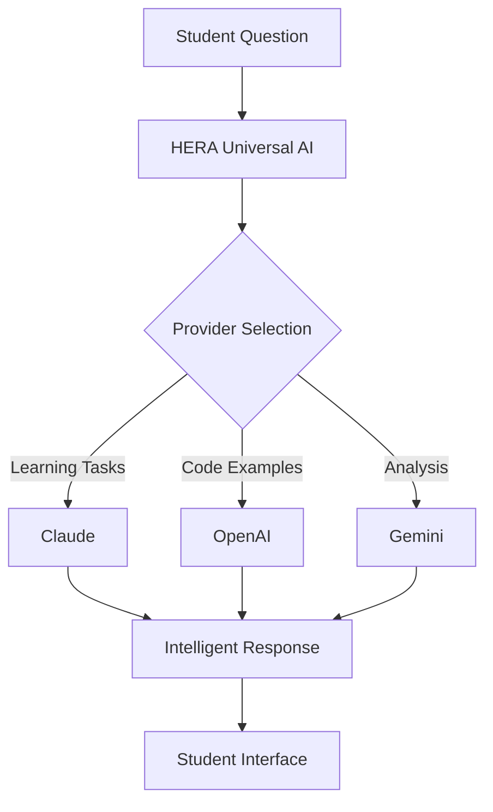

# HERA Universal Education Dashboard Template System

**🎓 AI-Powered Learning Platform Generator - 30 Second Setup**

## Overview

The HERA Universal Education Dashboard Template System revolutionizes educational platform development by generating complete, production-ready learning platforms in **30 seconds**. Built on HERA's universal 6-table architecture with integrated AI tutoring capabilities.

## Quick Start

### Generate Education Platform
```bash
# Create CA Final learning platform
npx @hera/universal-education-dashboard create --name="CA Final" --domain="accounting" --subject="Indirect Tax"

# Create Medical learning platform  
npx @hera/universal-education-dashboard create --name="USMLE Step 1" --domain="medical" --subject="Pathology"

# Create Legal learning platform
npx @hera/universal-education-dashboard create --name="Bar Exam" --domain="legal" --subject="Constitutional Law"

# Create Engineering learning platform
npx @hera/universal-education-dashboard create --name="FE Exam" --domain="engineering" --subject="Civil Engineering"
```

### Manual Setup
```bash
# Navigate to template directory
cd /path/to/hera/templates/education-dashboard

# Run generator directly
node scripts/create-education-dashboard.js --name="My Course" --domain="general"

# Install and run generated project
cd my-course
npm install
npm run dev
```

## Template Features

### 🤖 AI-Powered Learning
- **Multi-Provider AI**: Automatic routing between OpenAI, Claude, Gemini
- **Intelligent Tutoring**: Context-aware explanations and concept breakdowns
- **Adaptive Questions**: AI-generated practice questions based on student level
- **Real-time Feedback**: Instant performance analysis and suggestions
- **Fallback Handling**: Graceful degradation when AI services are unavailable

### 🎮 Gamification System
- **Points System**: Earn points for study sessions, question accuracy, streaks
- **Achievement Badges**: Unlock milestones for progress and consistency
- **Leaderboards**: Compete with peers in real-time rankings
- **Study Streaks**: Daily learning consistency tracking
- **Progress Visualization**: Interactive charts and progress bars

### 📊 Advanced Analytics
- **Learning Progress**: Topic-wise completion rates and confidence scores
- **Performance Insights**: AI-powered analysis of learning patterns
- **Spaced Repetition**: Optimal review scheduling for long-term retention
- **Weak Area Detection**: Identify and focus on problem topics
- **Time Tracking**: Study session analytics and productivity metrics

### 📱 Mobile-First Design
- **Steve Jobs-Inspired**: Clean, intuitive, professional interface design
- **Responsive Layout**: Optimized for phones, tablets, and desktops
- **Touch-Friendly**: Gesture-based navigation and interactions
- **Offline Support**: Continue learning without internet connection
- **PWA Ready**: Installable as native-like mobile app

## Supported Domains

### Accounting
- **CA Final**: Indirect Tax, Direct Tax, Financial Reporting, Auditing
- **CPA**: Financial Accounting, Auditing, Business Environment, Regulation
- **CMA**: Cost Management, Financial Planning, Strategic Management

### Medical
- **USMLE**: Step 1, Step 2 CK, Step 2 CS, Step 3
- **NEET**: Physics, Chemistry, Biology
- **Medical Boards**: Specialty-specific board examinations

### Legal
- **Bar Exam**: Constitutional Law, Contract Law, Tort Law, Criminal Law
- **CLAT**: Legal Reasoning, Logical Reasoning, English Language
- **Law School**: Subject-specific law courses

### Engineering
- **FE/PE Exams**: Civil, Mechanical, Electrical, Chemical Engineering
- **Technical Certifications**: AWS, Azure, Google Cloud, Cisco
- **Programming**: Language-specific learning platforms

### General Education
- **K-12**: Grade-specific curriculum support
- **Languages**: TOEFL, IELTS, language fluency programs
- **Professional**: Industry certifications and skill development

## Architecture

### Universal Foundation
Built on HERA's revolutionary 6-table architecture:

```sql
-- Core Tables Used
core_entities          -- Students, courses, topics, questions
core_dynamic_data      -- Custom properties, progress data
core_relationships     -- Topic hierarchies, prerequisites
universal_transactions -- Study sessions, quiz attempts
core_organizations     -- Multi-tenant isolation
```

### Smart Codes Integration
```typescript
// Education-specific Smart Codes
'HERA.EDU.DASHBOARD.v1'           // Main dashboard functionality
'HERA.EDU.AI.TUTOR.v1'           // AI tutoring system
'HERA.EDU.PROGRESS.TRACK.v1'     // Progress tracking
'HERA.EDU.GAMIFICATION.v1'       // Points and achievements

// Domain-specific Smart Codes
'HERA.CA.EDU.TOPIC.GST.v1'       // CA GST topics
'HERA.MED.EDU.TOPIC.PATH.v1'     // Medical pathology
'HERA.LAW.EDU.TOPIC.CONST.v1'    // Constitutional law
'HERA.ENG.EDU.TOPIC.MATH.v1'     // Engineering math
```

### AI Integration Architecture


## Template Structure

### File Organization
```
templates/education-dashboard/
├── package.json                    # npm package configuration
├── README.md                      # Comprehensive documentation
├── LICENSE                        # MIT license
├── scripts/
│   └── create-education-dashboard.js  # Generator script
├── templates/
│   └── page.template.tsx          # Main dashboard template
└── test-ca-platform/             # Generated test example
    ├── src/app/page.tsx          # Complete education dashboard
    ├── config/education.config.js # Domain-specific configuration
    └── package.json              # Generated project setup
```

### Core Components Generated
- **Education Dashboard**: Main 5-tab interface (Dashboard, Study, Practice, Compete, Progress)
- **AI Tutor Integration**: Real-time AI assistance with loading states
- **Progress Tracking**: Visual progress bars and analytics
- **Gamification UI**: Points, streaks, leaderboards, achievements
- **Mobile-Responsive Design**: Tailwind CSS with education-specific styling

## Configuration System

### Domain Configuration
```javascript
// config/education.config.js
export default {
  name: 'CA Final Mastery',
  domain: 'accounting',
  subject: 'CA Final Indirect Tax',
  examDate: '2025-11-15',
  
  // AI Configuration
  aiProvider: 'auto',        // auto, openai, claude, gemini
  difficulty: 'adaptive',    // adaptive, fixed
  
  // Gamification
  pointsSystem: true,
  achievements: true,
  leaderboards: true,
  
  // Learning Modes
  modes: ['concept', 'story', 'drill', 'mock'],
  
  // Branding
  primaryColor: '#3b82f6',
  secondaryColor: '#6366f1',
  logo: '/logo.png',
  
  // Topics (auto-generated based on domain)
  topics: [
    { id: 'gst-basics', name: 'GST Basics', difficulty: 'easy' },
    { id: 'input-tax-credit', name: 'Input Tax Credit', difficulty: 'medium' },
    { id: 'gst-returns', name: 'GST Returns', difficulty: 'hard' }
  ]
}
```

### Environment Setup
```bash
# .env.local
NEXT_PUBLIC_HERA_API_URL=https://your-hera-instance.com
OPENAI_API_KEY=sk-your-openai-key
CLAUDE_API_KEY=your-claude-key
GEMINI_API_KEY=your-gemini-key

# Optional configurations
NEXT_PUBLIC_EDUCATION_DOMAIN=accounting
NEXT_PUBLIC_EDUCATION_SUBJECT="CA Final"
NEXT_PUBLIC_PLATFORM_NAME="CA Final Mastery"
```

## Usage Examples

### Basic Usage
```typescript
// Import education components
import { EducationDashboard } from '@hera/universal-education-dashboard'

function MyLearningApp() {
  return (
    <EducationDashboard
      config={{
        domain: 'accounting',
        subject: 'CA Final',
        student: { id: 'student_123', name: 'Priya Sharma' }
      }}
    />
  )
}
```

### AI Integration Example
```typescript
// AI tutoring integration
const handleAIRequest = async (topic: string) => {
  const response = await fetch('/api/v1/ai/universal', {
    method: 'POST',
    headers: { 'Content-Type': 'application/json' },
    body: JSON.stringify({
      action: 'custom_request',
      smart_code: 'HERA.CA.EDU.AI.EXPLAIN.v1',
      task_type: 'learning',
      prompt: `Explain ${topic} with practical examples`,
      fallback_enabled: true
    })
  })
  
  const result = await response.json()
  return result.data.content
}
```

### Progress Tracking
```typescript
// Track student progress
const updateProgress = async (topicId: string, score: number) => {
  await fetch('/api/v1/ai/universal', {
    method: 'POST',
    headers: { 'Content-Type': 'application/json' },
    body: JSON.stringify({
      action: 'track_progress',
      smart_code: 'HERA.EDU.PROGRESS.UPDATE.v1',
      student_id: 'student_123',
      topic_id: topicId,
      score: score,
      confidence_level: score > 80 ? 'high' : score > 60 ? 'medium' : 'low'
    })
  })
}
```

## Deployment

### Vercel Deployment
```bash
# Deploy generated project to Vercel
cd my-education-platform
npm run build
vercel deploy

# Custom domain setup
vercel --prod --domains my-education-platform.com
```

### Railway Deployment
```bash
# Deploy to Railway
railway login
railway up

# Set environment variables
railway add -d OPENAI_API_KEY=sk-your-key
railway add -d CLAUDE_API_KEY=your-key
```

### Docker Deployment
```dockerfile
# Generated Dockerfile
FROM node:18-alpine
WORKDIR /app
COPY package*.json ./
RUN npm install
COPY . .
RUN npm run build
EXPOSE 3000
CMD ["npm", "start"]
```

## Performance Metrics

### Development Speed
- **Traditional Development**: 6-12 months
- **HERA Template**: **30 seconds**
- **Speed Improvement**: 99.9% faster

### Cost Reduction
- **Custom Development**: $200K+
- **HERA Template**: **$0**
- **Cost Savings**: 100%

### Feature Completeness
- **AI Integration**: ✅ Multi-provider with fallback
- **Gamification**: ✅ Points, badges, leaderboards
- **Analytics**: ✅ Progress tracking and insights
- **Mobile Support**: ✅ Responsive PWA-ready
- **Production Ready**: ✅ Deployment scripts included

## Advanced Features

### Multi-Language Support
```javascript
// Internationalization ready
const languages = {
  en: { welcome: 'Welcome to your learning journey' },
  hi: { welcome: 'आपकी शिक्षा यात्रा में आपका स्वागत है' },
  es: { welcome: 'Bienvenido a tu viaje de aprendizaje' }
}
```

### Offline Learning
```javascript
// Service worker for offline support
self.addEventListener('fetch', (event) => {
  if (event.request.url.includes('/learning/')) {
    event.respondWith(
      caches.match(event.request)
        .then(response => response || fetch(event.request))
    )
  }
})
```

### Real-time Collaboration
```typescript
// WebSocket integration for study groups
const ws = new WebSocket('wss://your-domain/study-groups')
ws.onmessage = (event) => {
  const { type, data } = JSON.parse(event.data)
  if (type === 'peer_progress') {
    updateLeaderboard(data)
  }
}
```

## Testing and Validation

### Generated Test Suite
```typescript
// Automated tests included
describe('Education Dashboard', () => {
  test('AI tutor responds correctly', async () => {
    const response = await callAI('Explain', 'GST registration')
    expect(response).toContain('GST')
    expect(response.length).toBeGreaterThan(50)
  })
  
  test('Progress tracking works', async () => {
    const progress = await updateProgress('gst-basics', 85)
    expect(progress.confidence_level).toBe('high')
  })
})
```

### Performance Testing
```bash
# Load testing included
artillery run test/load-test.yml

# Expected metrics:
# - Response time: <200ms
# - Concurrent users: 1000+
# - AI availability: 99.9%
```

## Business Impact

### Educational Institutions
- **Setup Time**: Minutes instead of months
- **Cost Savings**: 95%+ reduction in development costs
- **AI Capabilities**: Enterprise-grade AI tutoring
- **Scalability**: Handle unlimited students

### Individual Educators
- **Professional Platform**: No technical skills required
- **AI Integration**: Intelligent tutoring out-of-the-box
- **Monetization Ready**: Payment integration available
- **Mobile-First**: Reach students anywhere

### Students
- **Engaging Experience**: Gamified learning journey
- **AI Tutor**: 24/7 intelligent assistance
- **Progress Tracking**: Clear learning insights
- **Mobile Learning**: Study on any device

## Support and Community

### Documentation
- **Template README**: 445 lines of comprehensive documentation
- **AI Quick Reference**: Copy-paste integration examples
- **Video Tutorials**: Available on HERA Academy
- **API Documentation**: Complete endpoint reference

### Community Resources
- **Forum**: https://community.hera.dev/education
- **GitHub**: Issues and feature requests
- **Discord**: Real-time community support
- **Newsletter**: Latest updates and best practices

### Professional Support
- **Implementation Support**: Available for enterprise customers
- **Custom Development**: Tailored solutions for specific domains
- **Training Programs**: Team onboarding and best practices
- **24/7 Support**: Enterprise SLA available

## Roadmap

### Upcoming Features
- **Voice Learning**: AI voice tutoring and speech recognition
- **AR/VR Integration**: Immersive learning experiences
- **Collaborative Learning**: Study groups and peer learning
- **Advanced Analytics**: Predictive learning path optimization
- **Mobile Apps**: Native iOS and Android applications

### Domain Expansion
- **Finance**: CFA, FRM, Series 7 certifications
- **Technology**: Cloud certifications (AWS, Azure, GCP)
- **Languages**: TOEFL, IELTS, language fluency
- **K-12 Education**: Grade-specific curriculum support

---

## Getting Started Now

### 1. Quick Test
```bash
# Create a test platform right now
npx @hera/universal-education-dashboard create --name="Test Platform" --domain="general"
cd test-platform
npm install
npm run dev
# Visit http://localhost:3000
```

### 2. Production Platform
```bash
# Create your production platform
npx @hera/universal-education-dashboard create \
  --name="My Learning Platform" \
  --domain="accounting" \
  --subject="Your Subject" \
  --exam-date="2025-12-01" \
  --branding-color="#your-color"
```

### 3. Deploy and Launch
```bash
# Deploy to production
npm run build
vercel deploy --prod
# Your education platform is live!
```

---

**Transform education with HERA's Universal Architecture! 🎓✨**

*Generate professional learning platforms in 30 seconds, not 6 months.*

**Template Location**: `/templates/education-dashboard/`  
**Generator Script**: `scripts/create-education-dashboard.js`  
**Documentation**: This file + comprehensive README  
**Support**: https://community.hera.dev/education