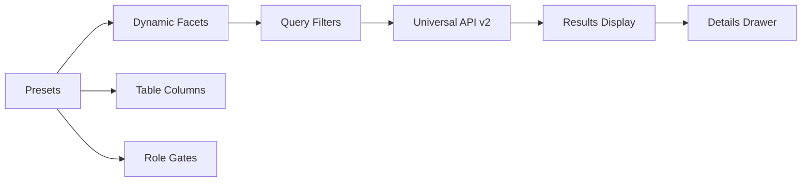

# HERA Jewelry Global Search - Universal Entity Discovery

## Overview

The Jewelry Global Search page provides a unified, preset-driven search interface across all jewelry entities using HERA's Universal API v2 architecture. This implementation demonstrates how to build configuration-driven UIs that auto-generate from entity presets.

## 🎭 Demo Organization Access

The jewelry module includes a comprehensive demo environment with role-based access:

### Quick Access
- **Demo Selection**: `http://localhost:3000/jewelry/demo`  
- **Main Dashboard**: `http://localhost:3000/jewelry/dashboard`
- **Global Search**: `http://localhost:3000/jewelry/search`

### Demo Roles Available
1. **Owner** - Full system access, financial oversight, strategic decisions
2. **Manager** - Inventory management, staff oversight, customer relations  
3. **Sales Associate** - Customer service, transactions, product consultation
4. **Certified Appraiser** - Jewelry appraisals, certifications, quality assessments
5. **Security Manager** - Asset protection, vault management, insurance compliance
6. **Staff Member** - Basic access, customer assistance, inventory support

### Organization Context
- Demo Organization ID: `f8d2c5e7-9a4b-6c8d-0e1f-2a3b4c5d6e7f`
- Role switching available via "Switch Role" button on dashboard
- Automatic redirect to demo if no organization context found

## Features

### 🔍 Universal Search
- **Multi-Entity Search**: Search across JEWELRY_ITEM, GRADING_JOB, CERTIFICATE, CUSTOMER, and ORDER entities simultaneously
- **Smart Filtering**: Dynamic facets auto-generated from entity presets
- **Real-time Results**: Debounced search with instant filtering
- **Cross-Entity Intelligence**: Find related entities across different types

### 🎛️ Preset-Driven Architecture
- **Zero Hardcoding**: All filters, columns, and actions derive from entity presets
- **Role-Based Visibility**: Field access controlled by user roles (owner, manager, staff)
- **Dynamic UI Generation**: Facets and table columns automatically adapt to selected entities
- **Consistent Data Contracts**: Uses Universal API v2 for all operations

### 🎨 Jewelry Theme Integration
- **Glassmorphism Design**: Matches jewelry module aesthetic with gold/amber accents
- **Responsive Layout**: Collapsible sidebar, table/grid view toggle
- **Professional Polish**: Smooth animations and hover effects
- **Dark Theme Optimized**: Beautiful contrast with jewelry color palette

## Architecture

### Page Structure
```
/jewelry/search/
├── page.tsx              # Main search orchestrator
├── components/
│   ├── SearchFacets.tsx   # Dynamic filter sidebar
│   ├── SearchResults.tsx  # Table/grid results view
│   └── DetailsDrawer.tsx  # Entity detail overlay
```

### Data Flow


### Smart Code Integration
All entities and operations use HERA smart codes:
- `HERA.JEWELRY.ITEM.RING.SOLITAIRE.V1`
- `HERA.JEWELRY.GRADING.JOB.STANDARD.V1`
- `HERA.JEWELRY.CERTIFICATE.GIA.V1`

## Key Components

### SearchFacets.tsx
**Auto-generates filters from presets:**
- **Text Fields**: Multi-select checkboxes for enum values
- **Number Fields**: Min/max range sliders
- **Date Fields**: Quick chips (7d, 30d, YTD) + custom ranges
- **Role Gating**: Hides sensitive fields (price) from non-managers

### SearchResults.tsx
**Unified results display:**
- **Table View**: Sortable columns with role-based visibility
- **Grid View**: Card-based layout for visual browsing
- **Actions Menu**: Context-sensitive operations (Edit, Regrade, Issue Certificate)
- **Pagination**: 50 items per page with smooth transitions

### DetailsDrawer.tsx
**Entity detail overlay:**
- **Overview Tab**: All dynamic fields with smart formatting
- **Relationships Tab**: Connected entities with navigation
- **Activity Tab**: Audit trail and change history
- **Actions**: Role-gated operations (Edit, Delete, etc.)

## Usage Examples

### Basic Search
```typescript
// Search for diamonds over 1 carat
selectedEntities: ['JEWELRY_ITEM']
filters: {
  stone_type: ['diamond'],
  carat_weight: { min: 1.0 }
}
```

### Multi-Entity Search
```typescript
// Find all certificates for high-priority grading jobs
selectedEntities: ['GRADING_JOB', 'CERTIFICATE']
filters: {
  priority: ['high'],
  status: ['graded', 'certified']
}
```

### Role-Based Access
```typescript
// Managers see prices, staff don't
field: {
  name: 'price',
  type: 'number',
  roleGate: ['owner', 'manager']
}
```

## Saved Views

The search supports persistent saved views:
- **Local Storage**: Views saved per organization
- **Quick Access**: Dropdown to restore complex filter combinations
- **Shareable**: Export view configurations for team use

## Performance Optimizations

### React Query Integration
- **Structural Sharing**: Prevents unnecessary re-renders
- **Debounced Search**: 300ms delay on text input
- **Pagination**: 50 items per page for smooth scrolling
- **Keep Previous Data**: Smooth transitions between pages

### Data Normalization
```typescript
// Stable references prevent infinite loops
const normalizedData = useMemo(() => 
  structurallySharedData(apiResponse), 
  [apiResponse]
)
```

## Entity Actions

### Role-Gated Operations
```typescript
// Grading Job Actions
if (userRole === 'grader') {
  actions.push('Regrade')
}
if (['owner', 'manager'].includes(userRole)) {
  actions.push('Issue Certificate')
}

// Jewelry Item Actions
if (['owner', 'manager', 'sales'].includes(userRole)) {
  actions.push('Edit Item')
}
```

### Universal API Calls
```typescript
// Regrade a job
await apiV2.put('entities', {
  entity_id: jobId,
  dynamic_fields: {
    status: { value: 'in_progress', type: 'text' }
  }
})

// Issue certificate
await apiV2.post('entities', {
  entity_type: 'CERTIFICATE',
  // ... certificate data
})
await apiV2.post('relationships', {
  from_entity_id: jobId,
  to_entity_id: certId,
  relationship_type: 'ISSUES_CERT'
})
```

## Mobile Responsiveness

The search interface adapts seamlessly:
- **Collapsible Sidebar**: Filters slide away on mobile
- **Touch-Friendly**: Large tap targets and swipe gestures
- **Grid View**: Optimal for mobile browsing
- **Drawer**: Full-screen entity details on small screens

## Testing

### Smoke Tests
```bash
# Load page and verify facets render
curl "http://localhost:3002/jewelry/search"

# Test filtered search
curl -H "Authorization: Bearer token" \
  "/api/v2/entities?entity_type=JEWELRY_ITEM&q=diamond&filters={\"status\":[\"available\"]}"
```

### Unit Tests (Vitest)
- Filter → query param mapping
- Preset → facet generation
- Role gate enforcement
- Structural sharing stability

## Integration Points

### Universal API v2
- `GET /api/v2/entities` for list views
- `GET /api/v2/entities?entity_id=X` for details
- Multi-tenant isolation via organization_id
- Role-based field filtering

### Entity Presets
- Dynamic field definitions
- Relationship schemas  
- Role gate specifications
- UI rendering hints

### HERA Auth
- Multi-organization support
- Role-based access control
- JWT token management
- Session persistence

## Future Enhancements

### Saved Views as Entities
```typescript
// Store views in Universal API
entity_type: 'SAVED_VIEW'
dynamic_fields: {
  view_name: 'High Value Diamonds',
  filters: { /* filter config */ },
  shared_with: ['team_lead', 'manager']
}
```

### Cross-Entity Suggestions
- "Jobs without certificates"
- "Items missing photos"
- "Overdue appraisals"

### Export Functionality
- CSV export of current results
- PDF reports with branding
- Integration with reporting pipeline

### Advanced Search
- Natural language queries
- AI-powered suggestions
- Saved search templates

This implementation showcases HERA's universal architecture in action: preset-driven, role-aware, multi-tenant, and infinitely extensible without schema changes.