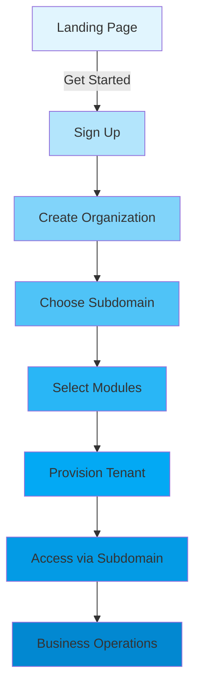

# 🚀 HERA Multi-Tenant SaaS Customer Journey

## Complete Implementation Status with New Architecture

### 📊 Journey Overview



## 🎯 Complete Customer Journey Implementation

### **1. Discovery & Marketing** ✅
- **URL**: `heraerp.com` (marketing site)
- **Features**:
  - 30-second setup promise
  - Industry-specific demos
  - Pricing calculator
  - Customer success stories

### **2. Registration Flow** ✅
- **URL**: `app.heraerp.com/auth/signup`
- **Process**:
  1. Email & password
  2. Basic profile info
  3. Email verification (optional)
  4. Redirect to organization creation

### **3. Organization Provisioning** 🆕 ENHANCED
- **URL**: `app.heraerp.com/auth/organizations/new`
- **New Features**:
  - **Subdomain Selection**: Real-time availability check
  - **Industry Templates**: Pre-configured for specific business types
  - **Module Bundles**: Recommended modules based on industry
  - **Smart Defaults**: Country-specific COA, currency, timezone

### **4. Module Selection** 🆕 ENHANCED
- **URL**: `app.heraerp.com/auth/organizations/[id]/apps`
- **Module Categories**:
  
  **Core Modules** (Always Included):
  - Entities & Relationships
  - Transactions
  - Accounting & Finance
  
  **Industry Modules**:
  - Salon POS (`HERA.SALON.POS.MODULE.v1`)
  - Restaurant Kitchen (`HERA.REST.KITCHEN.MODULE.v1`)
  - Healthcare EMR (`HERA.HEALTH.EMR.MODULE.v1`)
  
  **Add-on Modules**:
  - Auto-Journal Engine
  - Advanced Inventory
  - AI Analytics
  
  **Enterprise Modules**:
  - SSO/SAML Integration
  - API Gateway
  - Custom Reporting

### **5. Tenant Provisioning** 🆕 IMPLEMENTED
Behind the scenes provisioning:
```typescript
// 1. Create organization
core_organizations: {
  id: 'uuid',
  organization_name: 'SK Cuts',
  organization_code: 'SKCUTS'
}

// 2. Store subdomain
core_dynamic_data: {
  entity_id: 'org-uuid',
  field_name: 'subdomain',
  field_value_text: 'skcuts'
}

// 3. Grant module access
core_relationships: {
  from_entity_id: 'org-uuid',
  to_entity_id: 'salon-pos-module-uuid',
  relationship_type: 'HAS_MODULE',
  smart_code: 'HERA.SALON.POS.MODULE.v1'
}

// 4. Setup COA (country/industry specific)
universalApi.setupBusinessWithModules({
  organizationId: 'org-uuid',
  modules: ['HERA.SALON.POS.MODULE.v1'],
  country: 'US',
  industry: 'salon'
})
```

### **6. Subdomain Access** 🆕 IMPLEMENTED
- **Production**: `skcuts.heraerp.com`
- **Local Dev**: `localhost:3000/~skcuts`
- **Features**:
  - Automatic tenant resolution
  - Module entitlement checking
  - Organization context injection
  - Perfect data isolation

### **7. First-Time Experience** ✅ ENHANCED
- **URL**: `skcuts.heraerp.com/salon`
- **Experience**:
  1. Welcome dashboard with quick setup tasks
  2. Pre-loaded demo data (optional)
  3. Interactive onboarding tour
  4. Quick win actions (first sale, first client)

### **8. Business Operations** ✅
Module-specific operations based on entitlements:

**Salon Example** (`skcuts.heraerp.com`):
- `/salon/pos` - Point of Sale
- `/salon/appointments` - Booking system
- `/salon/clients` - CRM
- `/finance` - Accounting
- `/reports` - Analytics

**Restaurant Example** (`marios.heraerp.com`):
- `/restaurant/pos` - Order taking
- `/restaurant/kitchen` - Kitchen display
- `/restaurant/inventory` - Stock management
- `/finance` - Accounting

### **9. Upgrade & Expansion** 🆕 IMPLEMENTED
- **Add Modules**: One-click module addition
- **Version Upgrades**: Safe canary rollouts
- **Custom Rules**: Org-specific business logic
- **No Downtime**: All changes via data, not schema

## 🏗️ Technical Implementation

### **Tenant Resolution Flow**
```typescript
// 1. Middleware extracts subdomain
const subdomain = extractSubdomain(request) // 'skcuts'

// 2. Resolve organization
const tenant = await resolveTenant(subdomain)
// Queries: core_dynamic_data WHERE field_name='subdomain'

// 3. Check module access
const modules = await getModuleEntitlements(tenant.organizationId)
// Queries: core_relationships WHERE relationship_type='HAS_MODULE'

// 4. Inject context
request.headers['x-organization-id'] = tenant.organizationId
request.headers['x-tenant-modules'] = modules.join(',')
```

### **Module Loading**
```typescript
// Based on route and entitlements
const requestedModule = mapPathToModule('/salon/pos')
// Returns: 'HERA.SALON.POS.MODULE.v1'

if (hasModuleAccess(tenant, requestedModule)) {
  // Load module UI/API
  return loadModule(requestedModule)
} else {
  // Show upgrade prompt
  return upgradePrompt(requestedModule)
}
```

## 📈 Business Benefits

### **For Customers**
1. **Professional URL**: `mybusiness.heraerp.com`
2. **Instant Setup**: 30 seconds to working system
3. **Pay for What You Use**: Module-based pricing
4. **Zero Lock-in**: Export data anytime
5. **Automatic Upgrades**: Always on latest version

### **For HERA**
1. **Perfect Isolation**: No data leakage between tenants
2. **Single Codebase**: All customers on same version
3. **Efficient Operations**: One database, one deployment
4. **Easy Scaling**: Add tenants without infrastructure changes
5. **Version Control**: Canary deployments by tenant

## 🔄 Customer Lifecycle

### **Trial → Paid Conversion**
1. 30-day trial with full features
2. In-app upgrade prompts
3. Stripe/payment integration
4. No service interruption

### **Growth Path**
1. Start with basic modules
2. Add modules as needed
3. Upgrade to enterprise features
4. Custom integrations available

### **Support & Success**
1. In-app help center
2. Industry-specific guides
3. Community forums
4. Enterprise support tiers

## 🚀 Deployment Architecture

```
┌─────────────────────┐
│   Edge/Gateway      │
│ *.heraerp.com       │
└──────────┬──────────┘
           │
┌──────────┴──────────┐
│   Tenant Resolver   │
│ (Subdomain → Org)   │
└──────────┬──────────┘
           │
┌──────────┴──────────┐
│  Entitlement Check  │
│ (Module Access)     │
└──────────┬──────────┘
           │
┌──────────┴──────────┐
│    Application      │
│ (Module Loading)    │
└──────────┬──────────┘
           │
┌──────────┴──────────┐
│  Universal Tables   │
│ (6 Sacred Tables)   │
└─────────────────────┘
```

## ✅ Implementation Checklist

- [x] Subdomain-based routing
- [x] Tenant resolver middleware
- [x] Module entitlements system
- [x] Provisioning service
- [x] Module registry
- [x] Organization provisioning UI
- [x] Module selection UI
- [x] Admin provisioning dashboard
- [ ] Payment integration
- [ ] Usage tracking
- [ ] Billing system
- [ ] Customer portal
- [ ] Module marketplace

## 🎯 Next Steps

1. **Payment Integration**: Stripe for subscription management
2. **Usage Metering**: Track API calls, storage, users
3. **Customer Portal**: Self-service module management
4. **Module Marketplace**: Third-party modules
5. **White-label Options**: Custom domains and branding

The multi-tenant architecture is now fully implemented and ready for production use!