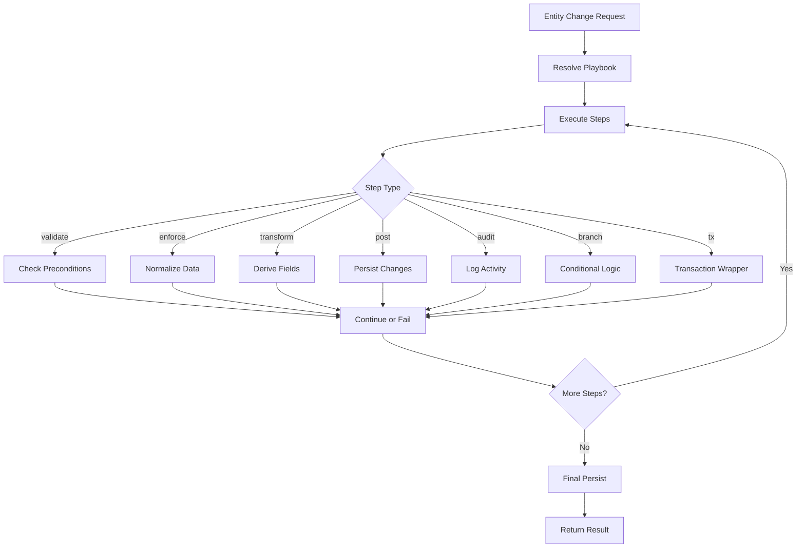

# HERA Playbook DSL Guide

## Overview

HERA Playbooks provide a declarative, versioned approach to business logic that operates on entities in the Universal Architecture. Instead of scattering business rules across multiple files and services, playbooks centralize logic in a structured, testable format.

## Architecture



## Step Types

### 1. **validate** - Precondition Checks
```typescript
validate('required:email', (ctx) => {
  const email = ctx.util.getDynamic('email');
  if (!email || !email.includes('@')) {
    throw new Error('Valid email required');
  }
})
```

### 2. **enforce** - Data Normalization
```typescript
enforce('normalize:phone', (ctx) => {
  const phone = ctx.util.getDynamic('phone');
  const normalized = phone.replace(/\D/g, '');
  ctx.util.setDynamic('phone', normalized);
})
```

### 3. **transform** - Derive New Data
```typescript
transform('calculate:tax', (ctx) => {
  const price = Number(ctx.util.getDynamic('price'));
  const tax = price * 0.08;
  ctx.util.setDynamic('tax_amount', tax);
})
```

### 4. **post** - Persist Operations
```typescript
post('save:entity', async (ctx) => {
  ctx.out.headers = {
    entity_name: ctx.entity.payload.entity_name,
    smart_code: 'HERA.MODULE.ENTITY.v1'
  };
  await ctx.util.persist();
})
```

### 5. **audit** - Activity Logging
```typescript
audit('log:update', (ctx) => {
  ctx.util.log('entity_updated', {
    entityId: ctx.entity.id,
    actorId: ctx.actor.id,
    changes: ctx.state.changes
  });
})
```

### 6. **branch** - Conditional Execution
```typescript
branch(
  'check:premium',
  (ctx) => ctx.util.getDynamic('tier') === 'premium',
  [
    // Steps if true
    transform('apply:discount', (ctx) => { /* ... */ })
  ],
  [
    // Steps if false (optional)
    validate('check:credit', (ctx) => { /* ... */ })
  ]
)
```

### 7. **tx** - Transactional Wrapper
```typescript
tx('atomic:update', [
  post('create:record', async (ctx) => { /* ... */ }),
  post('link:parent', async (ctx) => { /* ... */ }),
  post('update:status', async (ctx) => { /* ... */ })
])
```

## Context Object

The context (`ctx`) provides access to:

```typescript
interface PlaybookContext {
  // Entity being processed
  entity: {
    id?: string;
    type: string;
    payload: any; // Full entity data
  };
  
  // Actor performing the operation
  actor: {
    id: string;
    role: string;
  };
  
  // Organization context
  orgId: string;
  
  // Mutable state for passing data between steps
  state: Record<string, any>;
  
  // Output accumulator
  out: {
    headers?: any;
    dynamicFields?: any[];
    relationships?: any[];
  };
  
  // Utility functions
  util: {
    getDynamic(name: string): any;
    setDynamic(name: string, value: any, opts?: any): void;
    link(type: string, to: string, opts?: any): void;
    persist(): Promise<void>;
    log(event: string, payload?: any): void;
    tx(fn: () => Promise<void>): Promise<void>;
    fetchEntityById(id: string, opts?: any): Promise<any>;
  };
}
```

## Complete Example

```typescript
export const ORDER_PROCESSING_PLAYBOOK_V1: Playbook = {
  id: 'HERA.COMMERCE.ORDER.PLAYBOOK.v1',
  entityType: 'ORDER',
  version: 'v1',
  steps: [
    // 1. Validate required fields
    validate('required:fields', (ctx) => {
      const required = ['customer_id', 'items', 'payment_method'];
      for (const field of required) {
        if (!ctx.util.getDynamic(field)) {
          throw new Error(`${field} is required`);
        }
      }
    }),
    
    // 2. Calculate totals
    transform('calculate:totals', (ctx) => {
      const items = ctx.util.getDynamic('items') || [];
      const subtotal = items.reduce((sum, item) => 
        sum + (item.quantity * item.price), 0
      );
      const tax = subtotal * 0.08;
      const total = subtotal + tax;
      
      ctx.util.setDynamic('subtotal', subtotal);
      ctx.util.setDynamic('tax', tax);
      ctx.util.setDynamic('total', total);
    }),
    
    // 3. Check inventory (branch)
    branch(
      'check:inventory',
      async (ctx) => {
        const items = ctx.util.getDynamic('items') || [];
        // Check all items are in stock
        for (const item of items) {
          const product = await ctx.util.fetchEntityById(item.product_id);
          if (product.stock < item.quantity) return false;
        }
        return true;
      },
      [
        // If in stock, continue processing
        enforce('set:status', (ctx) => {
          ctx.util.setDynamic('status', 'confirmed');
        }),
      ],
      [
        // If not in stock, mark as pending
        enforce('set:status', (ctx) => {
          ctx.util.setDynamic('status', 'pending_stock');
        }),
      ]
    ),
    
    // 4. Persist the order
    tx('save:order', [
      post('persist:order', async (ctx) => {
        ctx.out.headers = {
          entity_type: 'ORDER',
          entity_name: `Order ${Date.now()}`,
          smart_code: 'HERA.COMMERCE.ORDER.ENTITY.v1',
        };
        await ctx.util.persist();
      }),
      
      post('link:customer', async (ctx) => {
        ctx.util.link('PLACED_BY', ctx.util.getDynamic('customer_id'));
      }),
    ]),
    
    // 5. Audit trail
    audit('log:order_created', (ctx) => {
      ctx.util.log('order_created', {
        orderId: ctx.entity.id,
        total: ctx.util.getDynamic('total'),
        status: ctx.util.getDynamic('status'),
      });
    }),
  ],
};
```

## Smart Code Convention

Playbooks follow strict smart code naming:

```
HERA.{INDUSTRY}.{MODULE}.PLAYBOOK.v{VERSION}
```

Examples:
- `HERA.SALON.PRODUCT.PLAYBOOK.v1`
- `HERA.HEALTHCARE.APPOINTMENT.PLAYBOOK.v1`
- `HERA.MANUFACTURING.PRODUCTION.PLAYBOOK.v2`

## Adapter Pattern

Playbooks are persistence-agnostic through adapters:

```typescript
const universalApiAdapter = {
  setDynamic: (ctx, field) => { /* API call */ },
  link: (ctx, rel) => { /* API call */ },
  persist: async (ctx) => { /* API call */ },
  audit: (ctx, event, payload) => { /* API call */ },
  tx: async (fn) => { /* Transaction wrapper */ },
  fetchEntityById: async (id, opts) => { /* API call */ },
};
```

## Benefits

1. **Declarative**: Business logic as data, not scattered code
2. **Versioned**: Evolution through smart codes (v1, v2, etc.)
3. **Testable**: Mock adapters for unit testing
4. **Auditable**: Built-in activity logging
5. **Reusable**: Share patterns across entities
6. **Maintainable**: Centralized business logic

## Migration Strategy

1. Identify scattered business logic in services/controllers
2. Extract to playbook steps maintaining order
3. Replace direct API calls with adapter pattern
4. Add validation and audit steps
5. Version with smart codes
6. Test with mock adapters
7. Deploy with Universal API adapter

## Future Enhancements

- Visual playbook editor
- Step composition/inheritance
- Parallel step execution
- Retry/compensation logic
- Performance metrics per step
- A/B testing different playbook versions