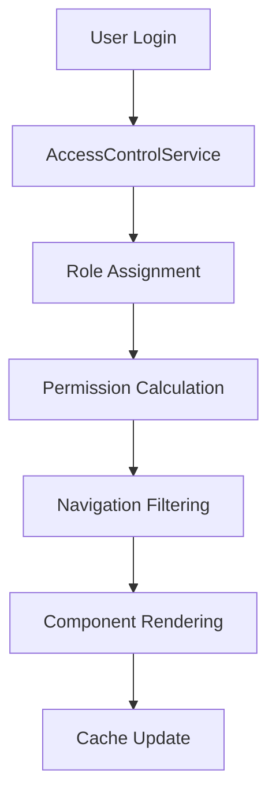

# HERA V2 Role-Based Access Control (RBAC) Documentation

## Table of Contents
1. [Overview](#overview)
2. [Architecture](#architecture)
3. [Components Reference](#components-reference)
4. [Implementation Guide](#implementation-guide)
5. [Security Patterns](#security-patterns)
6. [API Reference](#api-reference)
7. [Best Practices](#best-practices)
8. [Troubleshooting](#troubleshooting)
9. [Migration Guide](#migration-guide)

---

## Overview

The HERA V2 RBAC system implements SAP Fiori-inspired role-based access control with hierarchical permissions following the pattern:

```
Business Role → Space → Page → Section → Tile
```

### Key Features
- ✅ Hierarchical access control
- ✅ Dynamic navigation based on user roles
- ✅ Granular permission system
- ✅ Administrative role management interface
- ✅ Caching for performance optimization
- ✅ React hooks for easy integration
- ✅ Elegant access denial handling

### Supported Modules
- **Finance** (FI): Accounting, payments, assets
- **Sales** (SD): Orders, CRM, analytics
- **Human Resources** (HR): Employee management, payroll
- **Materials Management** (MM): Procurement, inventory

---

## Architecture

### Core Components

```
src/
├── types/rbac.ts                    # Type definitions
├── services/AccessControlService.ts # Core RBAC logic
├── hooks/useAccessControl.ts        # React integration
├── components/rbac/
│   ├── RoleBasedNavigation.tsx     # Navigation component
│   ├── ProtectedPage.tsx           # Page protection
│   └── ProtectedSection.tsx        # Section protection
└── app/enterprise/admin/roles/     # Admin interface
```

### Data Flow



### Permission Hierarchy

```
Executive
├── Finance Manager
│   ├── Accounts Payable Clerk
│   └── Accounts Receivable Clerk
├── Sales Manager
│   ├── Sales Representative
│   └── Customer Service
├── HR Manager
│   ├── HR Specialist
│   └── Payroll Administrator
└── Materials Manager
    ├── Procurement Specialist
    └── Warehouse Operator
```

---

## Components Reference

### 1. AccessControlService

**Location**: `src/services/AccessControlService.ts`

**Purpose**: Core service for managing all RBAC operations.

```typescript
class AccessControlService {
  // Check space access
  canAccessSpace(userId: string, spaceId: string): boolean

  // Check page access
  canAccessPage(userId: string, pageId: string): boolean

  // Get user roles
  getUserRoles(userId: string): BusinessRole[]

  // Get accessible spaces
  getAccessibleSpaces(userId: string): Space[]

  // Clear cache
  clearAccessCache(userId?: string): void
}
```

### 2. useAccessControl Hook

**Location**: `src/hooks/useAccessControl.ts`

**Purpose**: React hook for accessing RBAC functionality in components.

```typescript
const {
  userRoles,           // User's assigned roles
  accessibleSpaces,    // Spaces user can access
  canAccessSpace,      // Function to check space access
  canAccessPage,       // Function to check page access
  hasPermission,       // Function to check specific permissions
  hasRole,            // Function to check role assignment
  isLoading,          // Loading state
  refreshAccess       // Function to refresh permissions
} = useAccessControl({ userId })
```

### 3. ProtectedPage Component

**Location**: `src/components/rbac/ProtectedPage.tsx`

**Purpose**: Wraps pages that require access control.

```tsx
<ProtectedPage
  requiredSpace="finance"
  requiredPermissions={["finance.invoices"]}
  requiredRoles={["finance_manager"]}
  showAccessDenied={true}
>
  <YourPageContent />
</ProtectedPage>
```

### 4. ProtectedSection Component

**Location**: `src/components/rbac/ProtectedPage.tsx`

**Purpose**: Provides granular section-level access control.

```tsx
<ProtectedSection
  requiredPermissions={["finance.approve"]}
  requiredRoles={["finance_manager"]}
  showPlaceholder={true}
>
  <SensitiveContent />
</ProtectedSection>
```

### 5. RoleBasedNavigation Component

**Location**: `src/components/rbac/RoleBasedNavigation.tsx`

**Purpose**: Renders navigation based on user's accessible modules.

```tsx
<RoleBasedNavigation />
```

---

## Implementation Guide

### Step 1: Define Business Roles

```typescript
// In AccessControlService.ts
const businessRoles: BusinessRole[] = [
  {
    id: 'finance_manager',
    name: 'Finance Manager',
    category: 'finance',
    permissions: [
      { resource: 'finance.*', action: 'read' },
      { resource: 'finance.*', action: 'approve' }
    ],
    spaces: ['finance']
  }
]
```

### Step 2: Create Protected Pages

```tsx
// In your page component
import { ProtectedPage } from '@/components/rbac/ProtectedPage'

export default function FinancePage() {
  return (
    <ProtectedPage requiredSpace="finance">
      <FinanceContent />
    </ProtectedPage>
  )
}
```

### Step 3: Add Section-Level Protection

```tsx
// In your module home page
const sections = [
  {
    title: "Financial Documents",
    requiredPermissions: ["finance.invoices"],
    items: [
      {
        title: "Process Invoices",
        requiredRoles: ["accounts_payable_clerk"],
        href: "/finance/invoices"
      }
    ]
  }
]
```

### Step 4: Implement Navigation Protection

```tsx
// Replace standard navigation with role-based navigation
import { RoleBasedNavigation } from '@/components/rbac/RoleBasedNavigation'

export default function Layout({ children }) {
  return (
    <div>
      <RoleBasedNavigation />
      {children}
    </div>
  )
}
```

---

## Security Patterns

### 1. Defense in Depth

**Multiple layers of protection:**
- Authentication (login required)
- Authorization (role-based access)
- Page-level protection
- Section-level protection
- Component-level protection

### 2. Principle of Least Privilege

**Users get minimum required access:**
```typescript
// Only show what user can access
const accessibleModules = allModules.filter(module =>
  canAccessSpace(module.spaceId)
)
```

### 3. Fail-Safe Defaults

**Default to deny access:**
```typescript
// Default false if no permission found
if (!space || !space.isActive) {
  return false
}
```

### 4. Role-Based Segregation

**Clear separation of duties:**
- **Finance Manager**: Can approve transactions, view reports
- **AP Clerk**: Can process invoices, cannot approve
- **Sales Rep**: Can manage own customers, cannot access finance
- **Executive**: Read-only access to all modules

---

## API Reference

### Permission Resources

```typescript
const PERMISSION_RESOURCES = {
  // Finance
  'finance.invoices': 'Invoice Management',
  'finance.payments': 'Payment Processing',
  'finance.reports': 'Financial Reports',
  'finance.assets': 'Fixed Assets',
  'finance.gl': 'General Ledger',

  // Sales
  'sales.orders': 'Order Management',
  'sales.quotes': 'Quotation Management',
  'sales.customers': 'Customer Management',
  'sales.crm': 'CRM Activities',

  // HR
  'hr.employees': 'Employee Management',
  'hr.payroll': 'Payroll Processing',
  'hr.benefits': 'Benefits Administration',

  // Materials
  'materials.procurement': 'Procurement',
  'materials.inventory': 'Inventory Management',
  'materials.vendors': 'Vendor Management'
}
```

### Business Roles

```typescript
const BUSINESS_ROLES = {
  // Finance
  ACCOUNTS_PAYABLE_CLERK: 'accounts_payable_clerk',
  ACCOUNTS_RECEIVABLE_CLERK: 'accounts_receivable_clerk',
  FINANCIAL_ANALYST: 'financial_analyst',
  FINANCE_MANAGER: 'finance_manager',
  CFO: 'cfo',

  // Sales
  SALES_REP: 'sales_rep',
  SALES_MANAGER: 'sales_manager',
  CUSTOMER_SERVICE: 'customer_service',

  // HR
  HR_SPECIALIST: 'hr_specialist',
  HR_MANAGER: 'hr_manager',
  PAYROLL_ADMIN: 'payroll_admin',

  // Materials
  PROCUREMENT_SPECIALIST: 'procurement_specialist',
  INVENTORY_MANAGER: 'inventory_manager',

  // Admin
  SYSTEM_ADMIN: 'system_admin',
  EXECUTIVE: 'executive'
}
```

### Access Check Methods

```typescript
// Space-level access
canAccessSpace(userId: string, spaceId: string): boolean

// Page-level access
canAccessPage(userId: string, pageId: string): boolean

// Permission-based access
hasPermission(resource: string, action?: string): boolean

// Role-based access
hasRole(roleId: string): boolean

// Get user's accessible spaces
getAccessibleSpaces(userId: string): Space[]
```

---

## Best Practices

### 1. Security Best Practices

**Always validate on server-side:**
```typescript
// Client-side is for UX only
// Server must validate all permissions
```

**Use specific permissions:**
```typescript
// Good
requiredPermissions: ["finance.invoices.approve"]

// Avoid
requiredPermissions: ["finance.*"]
```

**Regular access reviews:**
```typescript
// Implement periodic role auditing
// Remove unused roles
// Update permissions as needed
```

### 2. Performance Best Practices

**Leverage caching:**
```typescript
// AccessControlService uses Map-based caching
// Clear cache when roles change
accessService.clearAccessCache(userId)
```

**Batch permission checks:**
```typescript
// Check multiple permissions at once
const permissions = ['finance.read', 'finance.write']
const hasAllPermissions = permissions.every(p => hasPermission(p))
```

**Lazy load navigation:**
```typescript
// Only load navigation for accessible spaces
const accessibleSpaces = getAccessibleSpaces(userId)
```

### 3. UX Best Practices

**Provide clear feedback:**
```tsx
// Show why access is denied
<div className="access-denied">
  <h1>Access Denied</h1>
  <p>You need the Finance Manager role to access this page.</p>
  <p>Current roles: {userRoles.map(r => r.name).join(', ')}</p>
</div>
```

**Progressive disclosure:**
```tsx
// Show sections user can access
// Hide sections user cannot access
// Provide upgrade path
```

**Consistent navigation:**
```tsx
// Navigation should be consistent across pages
// Show same accessible modules everywhere
```

### 4. Development Best Practices

**Type safety:**
```typescript
// Use TypeScript interfaces
interface ProtectedPageProps {
  requiredSpace?: string
  requiredPermissions?: string[]
  requiredRoles?: string[]
}
```

**Component composition:**
```tsx
// Compose protection components
<ProtectedPage requiredSpace="finance">
  <ProtectedSection requiredRole="finance_manager">
    <SensitiveData />
  </ProtectedSection>
</ProtectedPage>
```

**Testing:**
```typescript
// Test all access scenarios
describe('Finance Page Access', () => {
  it('allows finance manager access', () => {})
  it('denies sales rep access', () => {})
  it('shows appropriate error message', () => {})
})
```

---

## Troubleshooting

### Common Issues

**1. User can't access expected module**
```typescript
// Check user roles
const userRoles = accessService.getUserRoles(userId)
console.log('User roles:', userRoles)

// Check space requirements
const space = accessService.getSpace(spaceId)
console.log('Required roles:', space.requiredRoles)

// Clear cache and retry
accessService.clearAccessCache(userId)
```

**2. Navigation not updating after role change**
```typescript
// Refresh access permissions
const { refreshAccess } = useAccessControl({ userId })
refreshAccess()
```

**3. Performance issues with large user base**
```typescript
// Implement pagination in role management
// Use server-side filtering
// Optimize cache strategy
```

**4. Inconsistent permissions across components**
```typescript
// Ensure single source of truth
// Use AccessControlService consistently
// Avoid hardcoded permission checks
```

### Debug Tools

**Access Control Debug Component:**
```tsx
function AccessDebug({ userId }: { userId: string }) {
  const { userRoles, accessibleSpaces } = useAccessControl({ userId })

  return (
    <div className="debug-panel">
      <h3>Access Debug</h3>
      <p>User: {userId}</p>
      <p>Roles: {userRoles.map(r => r.name).join(', ')}</p>
      <p>Spaces: {accessibleSpaces.map(s => s.name).join(', ')}</p>
    </div>
  )
}
```

**Permission Checker:**
```tsx
function PermissionChecker() {
  const [resource, setResource] = useState('')
  const { hasPermission } = useAccessControl({ userId: 'current-user' })

  return (
    <div>
      <input
        value={resource}
        onChange={(e) => setResource(e.target.value)}
        placeholder="Enter permission resource"
      />
      <p>Has permission: {hasPermission(resource).toString()}</p>
    </div>
  )
}
```

---

## Migration Guide

### From HERA V1 to V2 RBAC

**Step 1: Update imports**
```typescript
// Old
import { checkAccess } from '@/utils/auth'

// New
import { useAccessControl } from '@/hooks/useAccessControl'
```

**Step 2: Replace permission checks**
```typescript
// Old
if (checkAccess(user, 'finance')) {
  return <FinanceComponent />
}

// New
const { canAccessSpace } = useAccessControl({ userId })
if (canAccessSpace('finance')) {
  return <FinanceComponent />
}
```

**Step 3: Update page protection**
```tsx
// Old
function FinancePage() {
  const hasAccess = checkAccess(user, 'finance')
  if (!hasAccess) return <AccessDenied />
  return <FinanceContent />
}

// New
function FinancePage() {
  return (
    <ProtectedPage requiredSpace="finance">
      <FinanceContent />
    </ProtectedPage>
  )
}
```

**Step 4: Update navigation**
```tsx
// Old
<Navigation items={filterByAccess(allItems, user)} />

// New
<RoleBasedNavigation />
```

### Breaking Changes

1. **Role structure changed**: Update role definitions
2. **Permission format changed**: Use dot notation (e.g., `finance.invoices`)
3. **Navigation component replaced**: Use `RoleBasedNavigation`
4. **Access check methods renamed**: Use `canAccessSpace` instead of `checkAccess`

---

## Examples

### Complete Page Implementation

```tsx
// src/app/enterprise/finance/invoices/page.tsx
'use client'

import React from 'react'
import { ProtectedPage, ProtectedSection } from '@/components/rbac/ProtectedPage'
import { useAccessControl } from '@/hooks/useAccessControl'
import { SapNavbar } from '@/components/sap/SapNavbar'

export default function InvoicesPage() {
  const { hasPermission, hasRole } = useAccessControl({
    userId: 'current-user'
  })

  return (
    <ProtectedPage
      requiredSpace="finance"
      requiredPermissions={["finance.invoices"]}
    >
      <div className="sap-font min-h-screen bg-gray-100">
        <SapNavbar
          title="HERA"
          breadcrumb="Finance > Invoice Management"
          showBack={true}
        />

        <main className="mt-12 p-6">
          <h1>Invoice Management</h1>

          {/* All users with finance.invoices can see this */}
          <section className="mb-6">
            <h2>Invoice List</h2>
            <InvoiceList />
          </section>

          {/* Only finance managers can approve */}
          <ProtectedSection requiredRoles={["finance_manager"]}>
            <section className="mb-6">
              <h2>Approval Queue</h2>
              <ApprovalQueue />
            </section>
          </ProtectedSection>

          {/* Only users with approve permission */}
          <ProtectedSection requiredPermissions={["finance.invoices.approve"]}>
            <section>
              <h2>Bulk Approval</h2>
              <BulkApprovalTools />
            </section>
          </ProtectedSection>
        </main>
      </div>
    </ProtectedPage>
  )
}
```

### Custom Access Control Hook

```tsx
// Custom hook for finance-specific access
function useFinanceAccess(userId: string) {
  const { hasPermission, hasRole } = useAccessControl({ userId })

  return {
    canViewInvoices: hasPermission('finance.invoices'),
    canApproveInvoices: hasPermission('finance.invoices.approve'),
    canProcessPayments: hasPermission('finance.payments'),
    isFinanceManager: hasRole('finance_manager'),
    canAccessGL: hasRole('finance_manager') || hasRole('cfo')
  }
}

// Usage
function FinanceComponent() {
  const {
    canViewInvoices,
    canApproveInvoices,
    isFinanceManager
  } = useFinanceAccess('current-user')

  return (
    <div>
      {canViewInvoices && <InvoiceSection />}
      {canApproveInvoices && <ApprovalSection />}
      {isFinanceManager && <ManagementReports />}
    </div>
  )
}
```

---

## Conclusion

The HERA V2 RBAC system provides enterprise-grade security with an intuitive developer experience. It follows SAP Fiori design patterns while maintaining flexibility for future requirements.

For questions or support, contact the HERA development team or refer to the source code documentation.

**Last Updated**: January 2024
**Version**: 2.0.0
**Maintained by**: HERA Development Team
