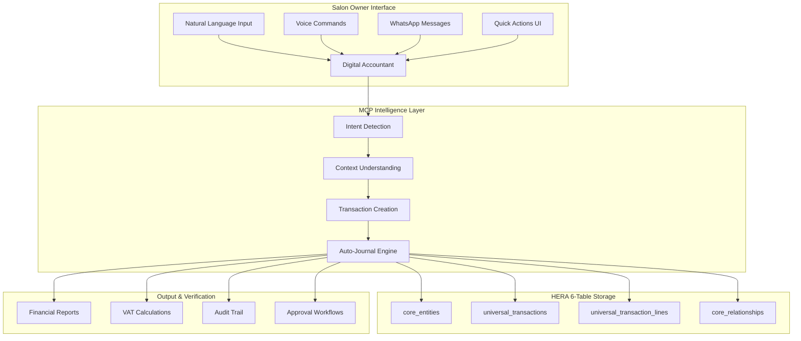

# 🤖 Salon Digital Accountant MCP Integration Plan

## Executive Summary

This document outlines a comprehensive Model Context Protocol (MCP) integration plan to make the Digital Accountant accessible for salon owners who don't understand traditional accounting. The system will use natural language processing to automate journal entries, expense recording, and financial management.

## 🎯 Vision: "Accounting Without Knowing Accounting"

Transform complex accounting into simple conversations. Salon owners can speak naturally about their business activities, and the Digital Accountant will handle all the technical accounting behind the scenes.

## 🏗️ Architecture Overview



## 🔧 MCP Tools Implementation

### 1. **Natural Language Transaction Parser**
```typescript
// MCP Tool: parse-salon-transaction
{
  name: 'parse-salon-transaction',
  description: 'Convert natural language to accounting transactions',
  input_schema: {
    message: string,
    context: {
      business_type: 'salon',
      previous_transactions?: Transaction[],
      customer_context?: Customer,
      service_context?: Service
    }
  },
  output: {
    intent: 'expense' | 'revenue' | 'payment' | 'adjustment',
    confidence: number,
    transaction_data: TransactionData,
    journal_entries: JournalEntry[]
  }
}
```

### 2. **Salon-Specific Expense Classifier**
```typescript
// MCP Tool: classify-salon-expense
{
  name: 'classify-salon-expense',
  description: 'Automatically categorize salon expenses',
  categories: {
    'PRODUCTS': ['shampoo', 'conditioner', 'color', 'treatment'],
    'EQUIPMENT': ['dryer', 'chair', 'scissors', 'brushes'],
    'UTILITIES': ['electricity', 'water', 'internet', 'phone'],
    'STAFF': ['salary', 'commission', 'tips', 'training'],
    'RENT': ['shop rent', 'parking', 'storage'],
    'MARKETING': ['instagram ads', 'flyers', 'website'],
    'SUPPLIES': ['towels', 'capes', 'gloves', 'foils']
  }
}
```

### 3. **Smart Receipt Scanner**
```typescript
// MCP Tool: scan-receipt
{
  name: 'scan-receipt',
  description: 'Extract data from photos of receipts',
  input: {
    image_url: string,
    organization_id: string
  },
  output: {
    vendor: string,
    amount: number,
    vat_amount: number,
    expense_category: string,
    line_items: LineItem[],
    suggested_journal: JournalEntry
  }
}
```

## 📱 Salon Owner User Journeys

### Journey 1: Daily Cash Expenses
```
Owner: "I paid 250 dirhams cash for hair color supplies from Beauty Depot"

Digital Accountant:
1. ✅ Recorded expense of AED 250
2. 📊 Category: Salon Supplies (Products)
3. 💰 Payment method: Cash
4. 📑 VAT: AED 11.90 (5% included)
5. 🏪 Vendor: Beauty Depot

Journal Entry Created:
DR: Salon Supplies Expense     238.10
DR: VAT Input                   11.90
    CR: Cash                          250.00

Would you like to:
[📸 Attach Receipt] [📝 Add Note] [✅ Done]
```

### Journey 2: Service Revenue
```
Owner: "Client Sarah paid 350 for hair color and treatment"

Digital Accountant:
1. 💇‍♀️ Service recorded: Hair Color & Treatment
2. 💵 Revenue: AED 350 (including VAT)
3. 👤 Client: Sarah
4. 💰 Net revenue: AED 333.33
5. 🏦 VAT collected: AED 16.67

Journal Entry Created:
DR: Cash                       350.00
    CR: Service Revenue              333.33
    CR: VAT Output                    16.67

[📱 Send Receipt via WhatsApp] [📅 Book Next Appointment]
```

### Journey 3: Staff Commissions
```
Owner: "Pay Maria 40% commission on today's services, she did 1,500 in sales"

Digital Accountant:
1. 👩‍💼 Staff: Maria
2. 💰 Total services: AED 1,500
3. 📊 Commission (40%): AED 600
4. 💸 Ready to process

Journal Entry:
DR: Commission Expense         600.00
    CR: Commission Payable           600.00

[💳 Pay Now] [📅 Add to Payroll] [📊 View Maria's Stats]
```

### Journey 4: End of Day Reconciliation
```
Owner: "Close today's cash register"

Digital Accountant Summary:
📅 Date: September 8, 2025

💰 Cash Sales: AED 3,850
💳 Card Sales: AED 2,120
📱 Total Revenue: AED 5,970

💸 Cash Expenses: AED 450
👥 Staff Tips Paid: AED 200
💵 Net Cash: AED 3,200

Automatic Journals Created:
1. Daily sales summary
2. Cash reconciliation
3. Tips distribution
4. VAT accrual

[📊 View Daily Report] [💰 Confirm Cash Count] [🔒 Close Day]
```

## 🎯 Key Features for Non-Accounting Users

### 1. **Conversational Shortcuts**
```yaml
Common Phrases:
  - "bought supplies" → Expense with VAT calculation
  - "client paid" → Revenue with automatic invoice
  - "paid staff" → Payroll/commission entry
  - "monthly rent" → Recurring expense
  - "cash missing" → Cash shortage journal
```

### 2. **Visual Confirmations**
- Show photos of receipts attached
- Display simple graphs instead of journal entries
- Use emojis and colors for categories
- Plain language summaries

### 3. **Smart Defaults**
```typescript
const SALON_DEFAULTS = {
  vat_rate: 0.05,                    // 5% UAE VAT
  cash_payment_threshold: 1000,       // Amounts under 1000 usually cash
  commission_rates: {
    junior: 0.30,
    senior: 0.40,
    specialist: 0.50
  },
  common_expenses: {
    'color': 'Salon Supplies',
    'electricity': 'Utilities',
    'towels': 'Operating Supplies'
  }
}
```

### 4. **Automated Workflows**
- **Daily**: Cash reconciliation reminder
- **Weekly**: Expense categorization review
- **Monthly**: VAT calculation and filing prep
- **Quarterly**: P&L review in simple terms

## 🔌 Integration Points

### 1. **WhatsApp Integration**
```typescript
// Salon owner sends via WhatsApp:
"Bought hair color 250 dhs"

// System responds:
"✅ Expense recorded!
Category: Salon Supplies
Amount: AED 250 (VAT included)

Reply with:
📸 to add receipt photo
📝 to add notes
✅ if complete"
```

### 2. **POS Integration**
- Automatic service revenue recording
- Real-time cash tracking
- Staff commission calculation

### 3. **Bank Feed Integration**
- Auto-match card payments
- Identify regular expenses
- Flag unusual transactions

## 🛡️ Guardrails & Validations

### 1. **Prevent Common Mistakes**
```typescript
const GUARDRAILS = {
  duplicate_prevention: {
    check_similar_amount: true,
    time_window: '5_minutes',
    alert_message: "Similar transaction just recorded. Is this a duplicate?"
  },
  
  vat_compliance: {
    auto_calculate: true,
    require_vat_number: true,
    monthly_limit_check: true
  },
  
  cash_controls: {
    daily_limit: 10000,
    require_approval_above: 5000,
    shortage_tolerance: 50
  }
}
```

### 2. **Automatic Corrections**
- Fix common spelling errors in vendor names
- Suggest correct expense categories
- Auto-complete partial client names
- Calculate VAT when forgotten

## 📊 Simplified Reporting

### 1. **Daily Dashboard**
```
Today's Summary (Simple View):
💰 Money In: AED 5,970
💸 Money Out: AED 1,650
📈 Profit: AED 4,320

Top Services:
1. Hair Color (8 clients) - AED 2,800
2. Haircut (12 clients) - AED 1,800
3. Treatment (5 clients) - AED 1,370

[See Details] [Close Day] [Share Report]
```

### 2. **Monthly Overview**
```
September 2025 Summary:
💰 Total Revenue: AED 157,000
💸 Total Expenses: AED 89,000
📊 Net Profit: AED 68,000 (43% margin)

Compared to Last Month: ⬆️ 12%

Biggest Expenses:
1. Staff (45%) - AED 40,050
2. Rent (17%) - AED 15,000
3. Supplies (13%) - AED 11,570
```

## 🚀 Implementation Phases

### Phase 1: Core Natural Language (Week 1-2)
- Basic expense and revenue recording
- Natural language parsing
- VAT calculations
- Simple confirmations

### Phase 2: Smart Categorization (Week 3-4)
- Expense category learning
- Vendor recognition
- Service type detection
- Commission calculations

### Phase 3: Automation (Week 5-6)
- Daily reconciliation
- Recurring transactions
- Bank feed matching
- Approval workflows

### Phase 4: Advanced Features (Week 7-8)
- Receipt scanning
- Voice commands
- WhatsApp integration
- Predictive suggestions

## 📱 Sample UI Components

### Quick Action Buttons
```typescript
const QUICK_ACTIONS = [
  { icon: "💰", label: "Cash Sale", prompt: "Record cash payment from client" },
  { icon: "💳", label: "Card Sale", prompt: "Record card payment" },
  { icon: "🛒", label: "Buy Supplies", prompt: "Record supply purchase" },
  { icon: "💸", label: "Pay Expense", prompt: "Record expense payment" },
  { icon: "👥", label: "Pay Staff", prompt: "Record staff payment" },
  { icon: "📊", label: "Today's Summary", prompt: "Show today's summary" }
]
```

### Conversation Starters
```typescript
const CONVERSATION_STARTERS = [
  "I bought {item} for {amount}",
  "{client} paid {amount} for {service}",
  "Pay {staff} commission for today",
  "Missing {amount} cash",
  "Show me today's total",
  "Calculate this month's VAT"
]
```

## 🎯 Success Metrics

1. **Adoption Rate**: 80% daily active usage within 30 days
2. **Accuracy**: 95% correct categorization without manual adjustment
3. **Time Savings**: 2 hours/day saved on bookkeeping
4. **Compliance**: 100% VAT compliant transactions
5. **User Satisfaction**: <30 seconds to record any transaction

## 🔐 Security & Compliance

- **Multi-tenant isolation**: Each salon's data completely separate
- **Audit trail**: Every transaction tracked with who, what, when
- **VAT compliance**: Automatic UAE VAT calculations and reporting
- **Data backup**: Automated daily backups
- **Access control**: Role-based permissions (Owner, Manager, Accountant)

## 📚 Training & Support

### 1. **Interactive Onboarding**
- 5-minute setup wizard
- Record first 3 transactions with guidance
- Personalized tips based on business type

### 2. **In-App Learning**
- Tooltips for new features
- Success celebrations for milestones
- Gentle corrections for mistakes

### 3. **Support Channels**
- WhatsApp support group
- Video tutorials in Arabic/English
- Monthly webinars for tips

## 🎉 Expected Outcomes

1. **For Salon Owners**:
   - No accounting knowledge required
   - 10x faster transaction recording
   - Real-time business insights
   - Stress-free VAT compliance

2. **For the Business**:
   - 99% accurate books
   - Reduced accountant fees
   - Better cash flow visibility
   - Data-driven decisions

3. **For HERA Platform**:
   - Proven SMB market fit
   - Scalable to other industries
   - Network effects from multi-salon chains
   - Premium subscription opportunity

---

## 🚦 Next Steps

1. **Pilot Program**: Select 5 salons for 30-day pilot
2. **Feedback Loop**: Daily check-ins during first week
3. **Iteration**: Refine based on real usage patterns
4. **Scale**: Roll out to all salons with proven playbook

The Digital Accountant will transform how salon owners think about their finances - from a dreaded chore to a natural conversation about their business. 🚀