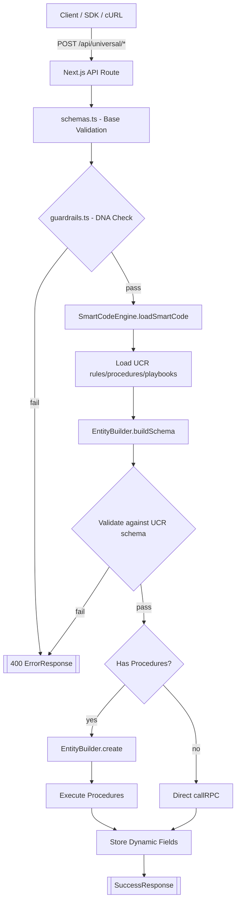
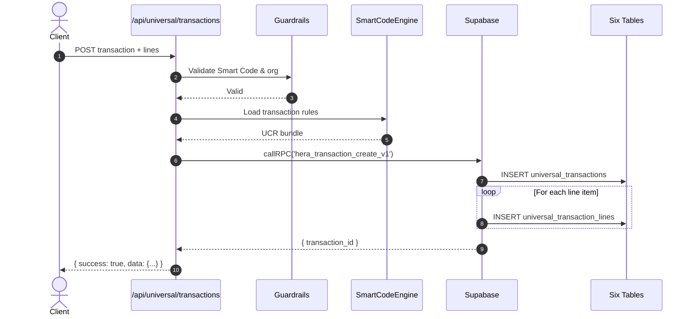

# HERA Universal API v2 — Self‑Assembling, DNA‑Driven Foundation

> **6 Universal Tables. Infinite Business Complexity. Zero Schema Changes.**

This repository contains a production‑ready, AI‑native foundation for HERA's universal platform. It enforces the **Sacred Six Tables** and uses **Smart Codes (DNA)** to self‑assemble validation, behavior, and persistence across any industry without schema changes.

---

## ✨ What You Get

* **Guardrails** that enforce HERA DNA, multi‑tenancy, auditability, and naming consistency
* **Smart Code Engine** that parses DNA (`HERA.{INDUSTRY}.{MODULE}.{TYPE}.{SUBTYPE}.{VERSION}`) and loads **UCR** bundles (rules, procedures, playbooks)
* **Entity Builder** that compiles **dynamic Zod schemas** from UCR and executes ordered procedures
* **Complete request schemas** for all RPC payloads, including **Finance DNA** fields
* **Typed Supabase client** with RLS/Service modes, `assertOrgScope`, **typed RPC map**, and batch RPC helper
* **App Router example routes** that show the self‑assembly loop end‑to‑end

---

## 🧬 HERA DNA & Sacred Six Tables

HERA's architecture never changes table shapes; all business complexity flows through six universal tables:

1. **core_organizations** — *WHO* (tenant isolation)
2. **core_entities** — *WHAT* (all business objects)
3. **core_dynamic_data** — *HOW* (unlimited custom fields)
4. **core_relationships** — *WHY* (universal connections)
5. **universal_transactions** — *WHEN* (all business events)
6. **universal_transaction_lines** — *DETAILS* (complete breakdowns)

**Smart Codes** drive context and rules everywhere: `HERA.{INDUSTRY}.{MODULE}.{TYPE}.{SUBTYPE}.{VERSION}`

---

## 🏗️ Architecture Overview

```
src/
  lib/universal/
    guardrails.ts            # DNA regex, UUID, org isolation, finance checks
    smart-code-engine.ts     # Parses DNA; loads UCR rules/procedures/playbooks
    entity-builder.ts        # Builds dynamic Zod schemas + executes procedures
    schemas.ts               # Canonical request/response schemas
    supabase.ts              # Typed client, assertOrgScope, RLS/service
  app/
    api/universal/
      entities/
        route.ts             # POST create/upsert, GET query
        [id]/route.ts        # GET/PUT/DELETE by id
```

### Core Components

#### 1. **Guardrails** (`guardrails.ts`)
- Smart Code pattern validation: `^HERA\.[A-Z0-9]{2,15}(?:\.[A-Z0-9_]{2,30}){3,8}\.v[0-9]+$`
- UUID v4 validation for all identifiers
- Organization isolation enforcement
- Entity type normalization to prevent drift
- GL balance checking for transactions
- Field placement policy enforcement

#### 2. **Smart Code Engine** (`smart-code-engine.ts`)
- Loads UCR rules from `core_dynamic_data` 
- Loads procedures from `core_entities` where `entity_type = 'procedure'`
- Loads playbooks from `core_entities` where `entity_type = 'playbook'`
- Organization-scoped caching with 5-minute TTL
- Procedure execution with parameter validation
- Playbook orchestration with error handling

#### 3. **Entity Builder** (`entity-builder.ts`)
- Dynamic Zod schema generation from UCR rules
- Validation against business rules
- Approval workflow checking
- Procedure execution in order
- Dynamic field storage in `core_dynamic_data`
- Entity normalization with metadata tracking

#### 4. **Request Schemas** (`schemas.ts`)
- Complete Zod schemas for all RPC operations
- Finance DNA currency fields included
- Proper field naming (e.g., `from_entity_id`/`to_entity_id` not source/target)
- Transaction line alignment with database schema
- Pagination and search parameters

#### 5. **Supabase Client** (`supabase.ts`)
- Server-side client with RLS and service modes
- Organization scope assertion for multi-tenancy
- Typed RPC map with overloaded `callRPC` function
- Batch RPC support for multiple operations
- Connection health checks

---

## 🔐 Multi‑Tenancy & Organization Isolation

Every payload must include `p_organization_id` (UUID). We enforce this at three layers:

1. **Schema validation** — All RPC request shapes include the field
2. **Guardrails** — Validation + regex checks
3. **Runtime assertion** — `assertOrgScope(params)` throws if missing or invalid

RLS is supported through `getDb('rls', token)`; service operations use `getDb('service')`.

---

## ⚙️ Environment Setup

Create a server‑only `.env.local` with:

```bash
SUPABASE_URL=https://your-project.supabase.co
SUPABASE_SERVICE_ROLE_KEY=eyJ...     # Required (server only)
SUPABASE_ANON_KEY=eyJ...              # Required for RLS mode
```

> ⚠️ **Security**: Never expose `SERVICE_ROLE_KEY` to the browser.

---

## 🚦 Request Validation Pipeline

### Entity Creation Flow

1. **Base parse** with `schemas.ts` validates request structure
2. **Guardrails** enforce DNA regex, UUID format, org isolation
3. **Smart Code Engine** loads UCR bundle for the Smart Code
4. **Entity Builder** compiles dynamic Zod schema from UCR rules
5. **Validation** against dynamic schema with custom business rules
6. **Procedure execution** if defined, otherwise direct RPC
7. **Dynamic field storage** for custom attributes
8. **Response** with entity ID and metadata

### Mermaid Flowchart



### Transaction Processing Sequence



---

## 🧪 API Examples

### Create an Entity with Dynamic Fields

```bash
curl -X POST http://localhost:3000/api/universal/entities \
  -H 'Content-Type: application/json' \
  -H 'Authorization: Bearer <your-jwt>' \
  -d '{
    "p_organization_id": "f47ac10b-58cc-4372-a567-0e02b2c3d479",
    "p_entity_type": "customer",
    "p_entity_name": "Acme Corp",
    "p_smart_code": "HERA.SALON.CRM.ENT.CUST.v1",
    "email": "contact@acme.com",
    "loyalty_tier": "gold"
  }'
```

Response:
```json
{
  "success": true,
  "data": {
    "entity_id": "550e8400-e29b-41d4-a716-446655440000",
    "smart_code": "HERA.SALON.CRM.ENT.CUST.v1",
    "entity_type": "customer",
    "entity_name": "Acme Corp",
    "procedures_executed": ["validate_customer_email", "assign_loyalty_tier"]
  }
}
```

### Query Entities with Pagination

```bash
curl "http://localhost:3000/api/universal/entities?organization_id=f47ac10b-58cc-4372-a567-0e02b2c3d479&entity_type=customer&page=1&limit=20"
```

Response:
```json
{
  "success": true,
  "data": [...],
  "pagination": {
    "page": 1,
    "limit": 20,
    "total": 156,
    "pages": 8
  },
  "_links": {
    "self": "/api/universal/entities?...",
    "next": "/api/universal/entities?...&page=2",
    "prev": null
  }
}
```

### Get Single Entity with Dynamic Fields

```bash
curl "http://localhost:3000/api/universal/entities/550e8400-e29b-41d4-a716-446655440000?organization_id=f47ac10b-58cc-4372-a567-0e02b2c3d479&include_dynamic=true"
```

### Update Entity

```bash
curl -X PUT "http://localhost:3000/api/universal/entities/550e8400-e29b-41d4-a716-446655440000" \
  -H 'Content-Type: application/json' \
  -H 'Authorization: Bearer <your-jwt>' \
  -d '{
    "p_organization_id": "f47ac10b-58cc-4372-a567-0e02b2c3d479",
    "p_entity_name": "Acme Corporation",
    "p_smart_code": "HERA.SALON.CRM.ENT.CUST.v1",
    "loyalty_tier": "platinum"
  }'
```

### Delete Entity

```bash
curl -X DELETE "http://localhost:3000/api/universal/entities/550e8400-e29b-41d4-a716-446655440000?organization_id=f47ac10b-58cc-4372-a567-0e02b2c3d479"
```

---

## 🔧 Typed Supabase Client

The typed client provides:

```typescript
// Choose RLS or Service mode
const db = getDb('rls', userToken);  // User context
const db = getDb('service');          // Bypass RLS

// Typed RPC calls
const result = await callRPC('hera_entity_upsert_v1', {
  p_organization_id: orgId,
  p_entity_type: 'customer',
  p_entity_name: 'Test Corp',
  p_smart_code: 'HERA.CRM.CUST.ENT.v1'
});

// Batch operations (non-transactional)
const batchResult = await callBatchRPC([
  { name: 'hera_entity_upsert_v1', params: {...} },
  { name: 'hera_dynamic_data_set_v1', params: {...} }
]);
```

Extend `RpcMap` in `supabase.ts` to add new RPC functions with full type safety.

---

## 💱 Finance DNA (Currency Fields)

Transactions include first‑class currency semantics:

```typescript
{
  p_transaction_currency_code: "USD",  // Transaction currency
  p_base_currency_code: "EUR",         // Organization base currency
  p_exchange_rate: 1.09,               // Conversion rate
  p_exchange_rate_date: "2024-01-15",  // Rate date
  p_exchange_rate_type: "daily"        // Rate type
}
```

Posting rules derive GL polarity from line types; `debit_credit` is **not** user input but calculated by Finance DNA.

---

## 📦 UCR Bundles (Rules, Procedures, Playbooks)

### UCR Structure

UCR bundles are stored in the universal tables and loaded by Smart Code:

```typescript
// Rules in core_dynamic_data
{
  field_name: "ucr_rule",
  smart_code: "HERA.SALON.CRM.ENT.CUST.v1",
  field_value_json: {
    rule_type: "validation",
    rule_config: {
      required_fields: ["email"],
      optional_fields: ["phone", "loyalty_tier"],
      validations: [
        {
          field_name: "email",
          field_type: "email",
          required: true,
          validations: {
            error_message: "Valid email required"
          }
        }
      ]
    }
  }
}

// Procedures in core_entities
{
  entity_type: "procedure",
  entity_name: "Validate Customer Email",
  smart_code: "HERA.SALON.CRM.PROC.VALIDATE_EMAIL.v1",
  business_rules: {
    procedure_type: "create",
    database_function: "hera_validate_customer_email_v1",
    parameters: {
      p_email: { type: "string", required: true }
    }
  }
}

// Playbooks in core_entities
{
  entity_type: "playbook",
  entity_name: "Customer Onboarding",
  smart_code: "HERA.SALON.CRM.PLAY.ONBOARD.v1",
  business_rules: {
    steps: [
      {
        step_number: 1,
        step_name: "Validate email",
        procedure_smart_code: "HERA.SALON.CRM.PROC.VALIDATE_EMAIL.v1"
      },
      {
        step_number: 2,
        step_name: "Assign loyalty tier",
        procedure_smart_code: "HERA.SALON.CRM.PROC.ASSIGN_TIER.v1"
      }
    ]
  }
}
```

---

## 🧩 Security Boundaries

* **Never import** `supabase.ts` or server routes into client components
* All environment keys live **server‑side only**
* App Router handlers (`route.ts`) run on the server by default
* Use `Authorization: Bearer <token>` header for RLS mode
* Service mode should only be used for system operations

---

## 📊 Error Handling

All errors follow consistent format:

```typescript
{
  success: false,
  error: "Validation failed",
  code?: "INVALID_SMART_CODE",
  details?: {
    field: "p_smart_code",
    message: "Smart code must match HERA DNA pattern"
  }
}
```

HTTP status codes:
- `400` - Validation errors, guardrail violations
- `404` - Entity not found
- `500` - Internal server errors

---

## ✅ Implementation Checklist

* [x] Guardrails enforce DNA patterns and multi-tenancy
* [x] Smart Code Engine loads UCR bundles with caching
* [x] Entity Builder generates dynamic schemas
* [x] Complete request/response schemas with Finance DNA
* [x] Typed Supabase client with RLS/Service modes
* [x] Entity routes with full CRUD operations
* [x] Pagination and filtering support
* [x] Error handling with consistent format
* [x] Organization isolation at all layers
* [x] Dynamic field support via core_dynamic_data

---

## 🚀 Next Steps

### Phase 2: Dynamic Data Endpoints
- `/api/universal/dynamic-data` routes
- Batch operations for field updates
- Field type inference and validation

### Phase 3: Relationship Management
- `/api/universal/relationships` routes
- Status workflow enforcement
- Hierarchy validation
- Circular reference prevention

### Phase 4: Transaction Processing
- `/api/universal/transactions` routes
- Auto-journal DNA integration
- Smart Code-driven GL posting
- Line item validation with Finance DNA

### Phase 5: Playbook Executor
- Server‑side orchestration RPC
- `BEGIN…COMMIT/ROLLBACK` transaction wrapping
- Multi‑step atomic processes
- Idempotency key support

---

## 📚 Additional Resources

- [UCR Rules Guide](./ucr-rules-guide.md) - Detailed UCR bundle documentation
- [Smart Code Patterns](../SMART_CODE_GUIDE.md) - HERA DNA pattern reference
- [Field Placement Policy](../playbooks/_shared/FIELD_PLACEMENT_GUIDE.md) - Dynamic data vs metadata
- [HERA Principles](../HERA-PRINCIPLES.md) - Core architectural decisions

---

This Universal API v2 provides a self-assembling foundation that adapts to any business through Smart Codes and UCR rules, maintaining the Sacred Six Tables while enabling infinite complexity.