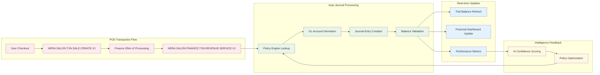
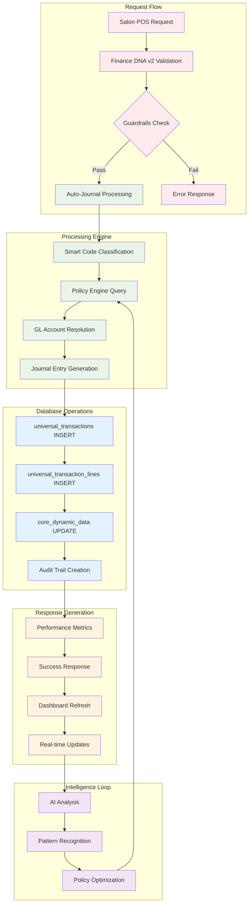
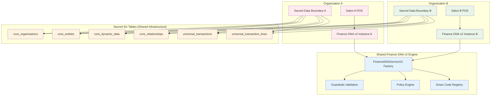
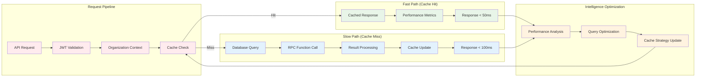
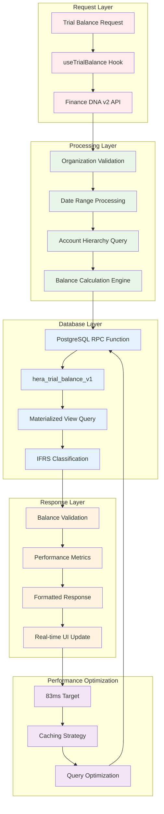

# Finance DNA v2 Architecture Diagrams

## System Integration Flow

```mermaid
graph TB
    subgraph "Salon Application Layer"
        A[POS Checkout] --> B[usePosCheckout Hook]
        C[Financial Dashboard] --> D[Finance DNA v2 Hooks]
        E[Trial Balance] --> F[useTrialBalance Hook]
    end
    
    subgraph "Finance DNA v2 Layer"
        B --> G[FinanceDNAServiceV2]
        D --> H[Financial Reporting API v2]
        F --> I[Trial Balance Engine]
        
        G --> J[Guardrails Validation]
        G --> K[Auto-Journal Processing]
        G --> L[Policy Engine]
    end
    
    subgraph "Sacred Six Tables"
        M[core_organizations]
        N[core_entities] 
        O[core_dynamic_data]
        P[core_relationships]
        Q[universal_transactions]
        R[universal_transaction_lines]
    end
    
    subgraph "Intelligence Layer"
        S[AI Confidence Scoring]
        T[Smart Code Registry]
        U[Performance Metrics]
    end
    
    J --> M
    K --> Q
    K --> R
    L --> O
    H --> N
    I --> Q
    
    G --> S
    H --> T
    I --> U
    
    classDef application fill:#e1f5fe
    classDef finance fill:#f3e5f5
    classDef database fill:#e8f5e8
    classDef intelligence fill:#fff3e0
    
    class A,B,C,D,E,F application
    class G,H,I,J,K,L finance  
    class M,N,O,P,Q,R database
    class S,T,U intelligence
```

## Smart Code Lineage Flow



## Data Flow Architecture



## Multi-Tenant Security Architecture



## Performance Optimization Flow



## Trial Balance Generation Architecture

