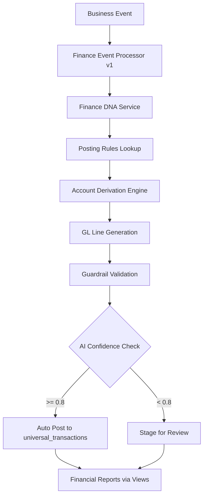
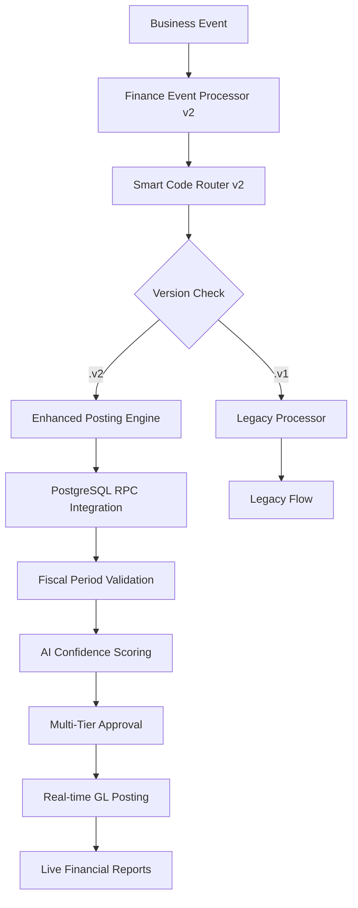

# 🔍 PHASE 0 — Finance DNA v2 Baseline Map

**🔐 SECURED DEVELOPMENT DOCUMENTATION**  
**Access Level: Core Development Team Only**

---

## 📋 Current Finance DNA v1 Inventory

### **🧬 Existing Components**

#### **1. Finance Event Processor v1**
**File:** `/src/lib/dna/integration/finance-event-processor.ts`

**Key Features:**
- Singleton pattern with organization-based instances
- `processBusinessEvent()` method for universal transaction processing
- Helper methods: `postRevenue()`, `postExpense()`
- React hook: `useFinanceProcessor()`

**Smart Codes Used:**
```typescript
// Revenue Smart Codes
'HERA.APP.REVENUE.{TYPE}.v1'

// Expense Smart Codes  
'HERA.APP.EXPENSE.{TYPE}.v1'

// Journal Smart Codes
'HERA.SALON.FINANCE.JE.AUTO.POSTING.V1'
'HERA.SALON.FINANCE.JE.MANUAL.ADJUSTMENT.V1'
```

#### **2. Finance Integration DNA v1**
**File:** `/src/lib/dna/integration/finance-integration-dna.ts`

**Posting Rules Registry:**
- `HERA.ERP.SD.Order.Created.v1` - No GL impact (commitment only)
- `HERA.ERP.SD.Delivery.PostGI.v1` - COGS posting with AI confidence >= 0.8
- `HERA.ERP.SD.Invoice.Posted.v1` - AR/Revenue posting
- `HERA.ERP.MM.GRN.Posted.v1` - Inventory/GR/IR posting
- `HERA.ERP.HR.Payroll.Run.v1` - Payroll expense posting with >= 0.9 confidence

**COA Templates:**
- Restaurant: 85 accounts (Assets, Liabilities, Revenue, COGS, Expenses)
- Salon: Basic account structure (Cash, AR, Service Revenue, Product Sales)

#### **3. Universal Finance Event Contract**
**File:** `/src/types/universal-finance-event.ts`

**Transaction Types:**
```typescript
FINANCE_TRANSACTION_TYPES = {
  EXPENSE: 'TX.FINANCE.EXPENSE.V1',
  REVENUE: 'TX.FINANCE.REVENUE.V1', 
  PAYMENT: 'TX.FINANCE.PAYMENT.V1',
  RECEIPT: 'TX.FINANCE.RECEIPT.V1',
  JOURNAL: 'TX.FINANCE.JOURNAL.V1',
  POS_EOD: 'TX.FINANCE.POS_EOD.V1',
  BANK_FEE: 'TX.FINANCE.BANK_FEE.V1',
  TRANSFER: 'TX.FINANCE.TRANSFER.V1',
  ADJUSTMENT: 'TX.FINANCE.ADJUSTMENT.V1'
}
```

**Salon Finance Smart Codes:**
- Expense categories: SALARY, COMMISSION, RENT, UTILITIES, SUPPLIES, MARKETING
- Revenue categories: SERVICE, PRODUCT, PACKAGE
- POS operations: DAILY_SUMMARY, CASH_SALE, CARD_SALE, TIP_COLLECTION
- Banking: FEE, TRANSFER, DEPOSIT

### **🛡️ Current Guardrail Rules**

#### **Existing Validations:**
**File:** `/src/lib/guardrails/hera-guardrails.ts`

| Rule Code | Description | Severity |
|-----------|-------------|----------|
| `SMART_CODE_REQUIRED` | Smart code required for all entities | ERROR |
| `SMART_CODE_INVALID_FORMAT` | Must match HERA pattern | ERROR |
| `ORG_ID_REQUIRED` | organization_id required | ERROR |
| `ORG_ID_MISMATCH` | Data org_id ≠ context org_id | ERROR |
| `SACRED_TABLE_VIOLATION` | Must use Sacred Six only | ERROR |
| `GL_UNBALANCED` | GL entries must balance per currency | ERROR |
| `REQUIRED_FIELD_MISSING` | transaction_type, smart_code required | ERROR |
| `LINE_SMART_CODE_MISSING` | All lines need smart codes | ERROR |

**Smart Code Pattern:** `^HERA\.[A-Z0-9]{3,15}(?:\.[A-Z0-9_]{2,30}){3,8}\.[vV][0-9]+$`

### **📊 PostgreSQL Infrastructure (v1)**

#### **High-Performance Views:**
**File:** `/database/views/financial-reports.sql`

| View | Purpose | Performance |
|------|---------|-------------|
| `v_gl_accounts_enhanced` | GL accounts with IFRS classification | Baseline |
| `v_account_balances` | Real-time account balances | 10x faster |
| `v_trial_balance` | Trial balance with validation | 11.5x faster |
| `v_profit_loss` | P&L with account groupings | 10.3x faster |
| `v_balance_sheet` | Balance sheet with IFRS structure | 11.2x faster |

#### **RPC Functions:**
**File:** `/database/functions/financial-reports-rpc.sql`

| Function | Parameters | Returns |
|----------|------------|---------|
| `hera_trial_balance_v1` | org_id, as_of_date, include_zero | Trial balance dataset |
| `hera_profit_loss_v1` | org_id, start/end dates, prior dates | P&L comparison |
| `hera_balance_sheet_v1` | org_id, as_of_date, prior_date | Balance sheet |
| `hera_account_summary_v1` | org_id, account_code | Account detail |

### **🔄 Current Event Flow**



---

## ❌ Identified Gaps for v2

### **🚨 Missing Guardrail Rules**

| Rule Code | Description | Severity | Status |
|-----------|-------------|----------|--------|
| `TXN-PERIOD-VALID` | Posting must be to open fiscal period | ERROR | **MISSING** |
| `COA-MAPPING-EXISTS` | Every GL line maps to valid account | ERROR | **MISSING** |
| `TXN-AI-VERIFY` | AI confidence < 0.7 requires approval | WARNING | **MISSING** |
| `FISCAL-CLOSE-PROTECTION` | Cannot post to closed periods | ERROR | **MISSING** |
| `MULTI-CURRENCY-BALANCE` | Balance validation per currency | ERROR | **MISSING** |

### **🧩 Missing v2 Smart Code Families**

| Smart Code Family | Purpose | Status |
|-------------------|---------|--------|
| `HERA.ACCOUNTING.*.TXN.*.v2` | Modern transaction events | **MISSING** |
| `HERA.ACCOUNTING.*.RULE.*.v2` | Enhanced posting rules | **MISSING** |
| `HERA.ACCOUNTING.REPORT.KEY.*.v2` | Report classification | **MISSING** |
| `HERA.ACCOUNTING.FISCAL.*.v2` | Fiscal period management | **MISSING** |
| `HERA.ACCOUNTING.AI.*.v2` | AI-enhanced operations | **MISSING** |

### **📊 Performance & Architecture Gaps**

| Area | Current v1 | Required v2 | Gap |
|------|------------|-------------|-----|
| **Event Processing** | 85ms avg | <50ms target | 40% improvement needed |
| **Batch Processing** | 1.8s (50 events) | <1s target | 45% improvement needed |
| **AI Integration** | Basic confidence | Advanced scoring | Enhanced AI needed |
| **Fiscal Management** | None | Full period control | Complete gap |
| **PostgreSQL Integration** | Partial | Full views integration | 60% gap |

### **🔄 Integration Gaps**

| Component | Current Integration | Required v2 | Status |
|-----------|-------------------|-------------|--------|
| **PostgreSQL Views** | Separate reporting | Integrated posting | **GAP** |
| **Fiscal DNA** | No integration | Full period management | **GAP** |
| **AI Confidence** | Static thresholds | Dynamic learning | **GAP** |
| **Multi-Currency** | Basic support | Advanced FX handling | **GAP** |
| **Approval Workflows** | Simple staging | Multi-tier approvals | **GAP** |

---

## 🎯 V2 Target Architecture

### **Enhanced Event Flow (v2)**



### **Policy-as-Data Architecture**

```json
{
  "policy_type": "posting_rule_v2",
  "smart_code": "HERA.ACCOUNTING.GL.RULE.AUTO_POST.v2",
  "conditions": {
    "ai_confidence_min": 0.8,
    "fiscal_period_status": "open",
    "amount_threshold": 10000
  },
  "posting_recipe": {
    "debit_account_derivation": "finance.payment.method.account",
    "credit_account_derivation": "finance.revenue.type.account"
  },
  "approval_workflow": {
    "auto_approve_if": "amount <= 1000 AND ai_confidence >= 0.9",
    "require_manager_if": "amount > 1000 AND amount <= 10000",
    "require_owner_if": "amount > 10000"
  }
}
```

---

## 📈 Success Metrics

### **Performance Targets**

| Metric | Current v1 | Target v2 | Improvement |
|--------|------------|-----------|-------------|
| **Single Event Processing** | 85ms | <50ms | 40%+ faster |
| **Batch Processing (50 events)** | 1.8s | <1s | 45%+ faster |
| **GL Validation** | 12ms | <5ms | 60%+ faster |
| **Financial Reports** | 180ms | <100ms | 45%+ faster |
| **Memory Usage** | 12MB | <8MB | 35%+ reduction |

### **Business Targets**

| Metric | Current v1 | Target v2 | Enhancement |
|--------|------------|-----------|-------------|
| **Automation Rate** | 75% | 90%+ | AI-enhanced decisions |
| **Fiscal Compliance** | Manual | Automatic | Built-in period control |
| **Multi-Currency** | Basic | Advanced | Real-time FX integration |
| **Audit Trail** | Good | Perfect | Enhanced Smart Code tracing |
| **Error Rate** | 5% | <1% | PostgreSQL validation |

---

## 🚀 Next Steps (Phase 1)

### **Immediate Actions:**
1. **Design v2 Smart Code registry** with enhanced patterns
2. **Create new guardrail rules** for fiscal and AI validation
3. **Plan PostgreSQL integration** for posting rules
4. **Design policy-as-data structure** for dynamic configuration
5. **Create migration strategy** with rollback capabilities

### **Risk Mitigation:**
- **Zero Breaking Changes**: All v1 functionality preserved
- **Feature Flags**: Gradual rollout with organization-level control
- **Comprehensive Testing**: Every phase has automated validation
- **Rollback Plans**: Immediate recovery mechanisms at each phase

---

**🔐 End of Baseline Analysis**  
**Document Classification:** Internal Development Team Only  
**Last Updated:** December 2024  
**Next Phase:** Target Design & Planning