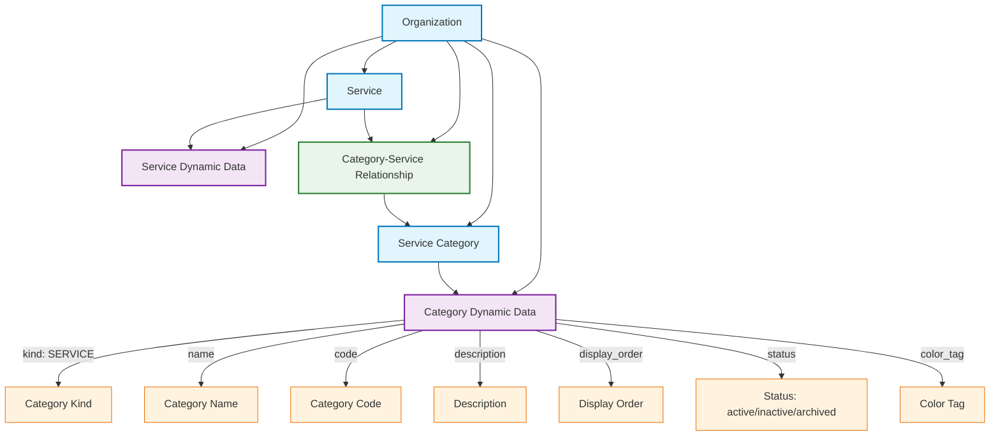
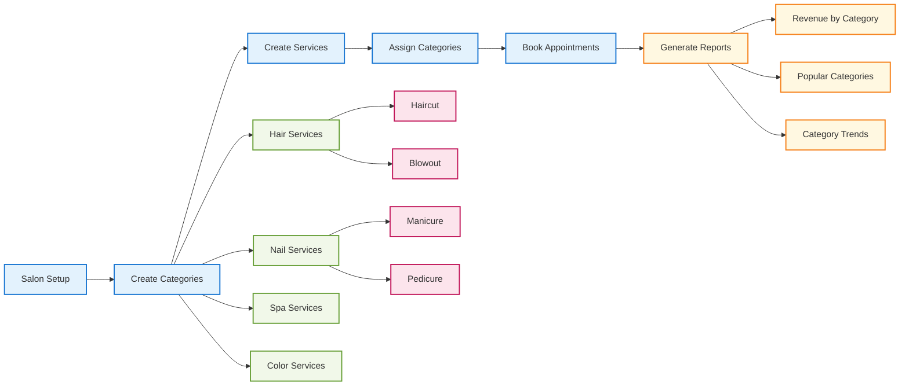
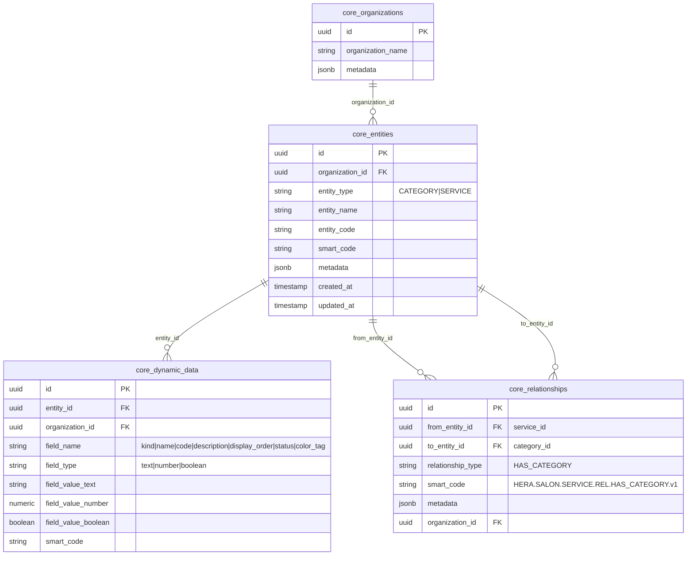
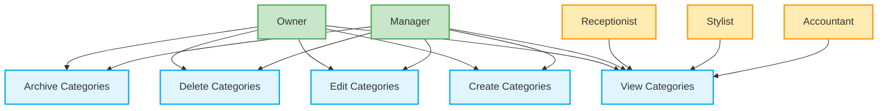
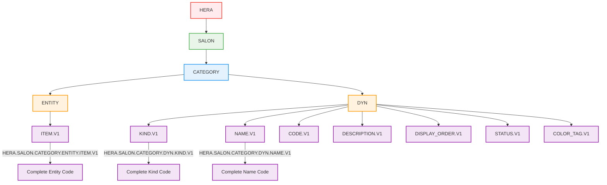

# Service Category Entity Relationships

## Service Category Flow

```mermaid
graph TD
    %% Core Entities
    ORG[Organization]
    CAT[Service Category]
    SVC[Service]
    
    %% Dynamic Data
    CAT_DYN[Category Dynamic Data]
    SVC_DYN[Service Dynamic Data]
    
    %% Relationships
    REL[Category-Service Relationship]
    
    %% Organization Boundary
    ORG --> CAT
    ORG --> SVC
    ORG --> CAT_DYN
    ORG --> SVC_DYN
    ORG --> REL
    
    %% Entity to Dynamic Data
    CAT --> CAT_DYN
    SVC --> SVC_DYN
    
    %% Service to Category Relationship
    SVC --> REL
    REL --> CAT
    
    %% Dynamic Field Details
    CAT_DYN --> |kind: SERVICE| CAT_KIND[Category Kind]
    CAT_DYN --> |name| CAT_NAME[Category Name]
    CAT_DYN --> |code| CAT_CODE[Category Code]
    CAT_DYN --> |description| CAT_DESC[Description]
    CAT_DYN --> |display_order| CAT_ORDER[Display Order]
    CAT_DYN --> |status| CAT_STATUS[Status: active/inactive/archived]
    CAT_DYN --> |color_tag| CAT_COLOR[Color Tag]
    
    %% Styling
    classDef entity fill:#e1f5fe,stroke:#0277bd,stroke-width:2px
    classDef dynamic fill:#f3e5f5,stroke:#7b1fa2,stroke-width:2px
    classDef relationship fill:#e8f5e8,stroke:#2e7d32,stroke-width:2px
    classDef field fill:#fff3e0,stroke:#ef6c00,stroke-width:1px
    
    class ORG,CAT,SVC entity
    class CAT_DYN,SVC_DYN dynamic
    class REL relationship
    class CAT_KIND,CAT_NAME,CAT_CODE,CAT_DESC,CAT_ORDER,CAT_STATUS,CAT_COLOR field
```

## Service Categories in Business Context

```mermaid
graph LR
    %% Business Workflow
    SETUP[Salon Setup] --> CREATE_CAT[Create Categories]
    CREATE_CAT --> CREATE_SVC[Create Services]
    CREATE_SVC --> ASSIGN_CAT[Assign Categories]
    ASSIGN_CAT --> BOOK_APPT[Book Appointments]
    BOOK_APPT --> REPORTS[Generate Reports]
    
    %% Category Examples
    CREATE_CAT --> HAIR[Hair Services]
    CREATE_CAT --> NAILS[Nail Services]
    CREATE_CAT --> SPA[Spa Services]
    CREATE_CAT --> COLOR[Color Services]
    
    %% Service Examples
    HAIR --> HAIRCUT[Haircut]
    HAIR --> BLOWOUT[Blowout]
    NAILS --> MANICURE[Manicure]
    NAILS --> PEDICURE[Pedicure]
    
    %% Reporting Categories
    REPORTS --> REV_BY_CAT[Revenue by Category]
    REPORTS --> POP_CAT[Popular Categories]
    REPORTS --> CAT_TRENDS[Category Trends]
    
    %% Styling
    classDef business fill:#e3f2fd,stroke:#1976d2,stroke-width:2px
    classDef category fill:#f1f8e9,stroke:#689f38,stroke-width:2px
    classDef service fill:#fce4ec,stroke:#c2185b,stroke-width:2px
    classDef report fill:#fff8e1,stroke:#f57f17,stroke-width:2px
    
    class SETUP,CREATE_CAT,CREATE_SVC,ASSIGN_CAT,BOOK_APPT business
    class HAIR,NAILS,SPA,COLOR category
    class HAIRCUT,BLOWOUT,MANICURE,PEDICURE service
    class REPORTS,REV_BY_CAT,POP_CAT,CAT_TRENDS report
```

## Data Model Architecture

```mermaid
erDiagram
    core_organizations ||--o{ core_entities : "organization_id"
    core_entities ||--o{ core_dynamic_data : "entity_id"
    core_entities ||--o{ core_relationships : "from_entity_id"
    core_entities ||--o{ core_relationships : "to_entity_id"
    
    core_organizations {
        uuid id PK
        string organization_name
        jsonb metadata
    }
    
    core_entities {
        uuid id PK
        uuid organization_id FK
        string entity_type "CATEGORY|SERVICE"
        string entity_name
        string entity_code
        string smart_code
        jsonb metadata
        timestamp created_at
        timestamp updated_at
    }
    
    core_dynamic_data {
        uuid id PK
        uuid entity_id FK
        uuid organization_id FK
        string field_name "kind|name|code|description|display_order|status|color_tag"
        string field_type "text|number|boolean"
        string field_value_text
        numeric field_value_number
        boolean field_value_boolean
        string smart_code
    }
    
    core_relationships {
        uuid id PK
        uuid from_entity_id FK "service_id"
        uuid to_entity_id FK "category_id"
        string relationship_type "HAS_CATEGORY"
        string smart_code "HERA.SALON.SERVICE.REL.HAS_CATEGORY.v1"
        jsonb metadata
        uuid organization_id FK
    }
```

## Permission Matrix

```mermaid
graph TD
    %% Roles
    OWNER[Owner]
    MANAGER[Manager]
    RECEP[Receptionist]
    STYLIST[Stylist]
    ACCOUNT[Accountant]
    
    %% Permissions
    CREATE[Create Categories]
    EDIT[Edit Categories]
    DELETE[Delete Categories]
    VIEW[View Categories]
    ARCHIVE[Archive Categories]
    
    %% Owner Permissions (Full Access)
    OWNER --> CREATE
    OWNER --> EDIT
    OWNER --> DELETE
    OWNER --> VIEW
    OWNER --> ARCHIVE
    
    %% Manager Permissions (Full Access)
    MANAGER --> CREATE
    MANAGER --> EDIT
    MANAGER --> DELETE
    MANAGER --> VIEW
    MANAGER --> ARCHIVE
    
    %% Receptionist Permissions (View Only)
    RECEP --> VIEW
    
    %% Stylist Permissions (View Only)
    STYLIST --> VIEW
    
    %% Accountant Permissions (View Only)
    ACCOUNT --> VIEW
    
    %% Styling
    classDef fullAccess fill:#c8e6c9,stroke:#4caf50,stroke-width:2px
    classDef viewOnly fill:#ffecb3,stroke:#ff9800,stroke-width:2px
    classDef permission fill:#e1f5fe,stroke:#03a9f4,stroke-width:2px
    
    class OWNER,MANAGER fullAccess
    class RECEP,STYLIST,ACCOUNT viewOnly
    class CREATE,EDIT,DELETE,VIEW,ARCHIVE permission
```

## Smart Code Hierarchy

```mermaid
graph TD
    %% Root
    HERA[HERA]
    
    %% Industry
    HERA --> SALON[SALON]
    
    %% Module
    SALON --> CATEGORY[CATEGORY]
    
    %% Function Types
    CATEGORY --> ENTITY[ENTITY]
    CATEGORY --> DYN[DYN]
    
    %% Entity Smart Codes
    ENTITY --> ITEM[ITEM.V1]
    
    %% Dynamic Field Smart Codes
    DYN --> KIND[KIND.V1]
    DYN --> NAME[NAME.V1]
    DYN --> CODE[CODE.V1]
    DYN --> DESC[DESCRIPTION.V1]
    DYN --> ORDER[DISPLAY_ORDER.V1]
    DYN --> STATUS[STATUS.V1]
    DYN --> COLOR[COLOR_TAG.V1]
    
    %% Full Smart Codes
    ITEM --> |HERA.SALON.CATEGORY.ENTITY.ITEM.V1| FULL_ENTITY[Complete Entity Code]
    KIND --> |HERA.SALON.CATEGORY.DYN.KIND.V1| FULL_KIND[Complete Kind Code]
    NAME --> |HERA.SALON.CATEGORY.DYN.NAME.V1| FULL_NAME[Complete Name Code]
    
    %% Styling
    classDef level1 fill:#ffebee,stroke:#f44336,stroke-width:2px
    classDef level2 fill:#e8f5e8,stroke:#4caf50,stroke-width:2px
    classDef level3 fill:#e3f2fd,stroke:#2196f3,stroke-width:2px
    classDef level4 fill:#fff3e0,stroke:#ff9800,stroke-width:2px
    classDef final fill:#f3e5f5,stroke:#9c27b0,stroke-width:2px
    
    class HERA level1
    class SALON level2
    class CATEGORY level3
    class ENTITY,DYN level4
    class ITEM,KIND,NAME,CODE,DESC,ORDER,STATUS,COLOR,FULL_ENTITY,FULL_KIND,FULL_NAME final
```