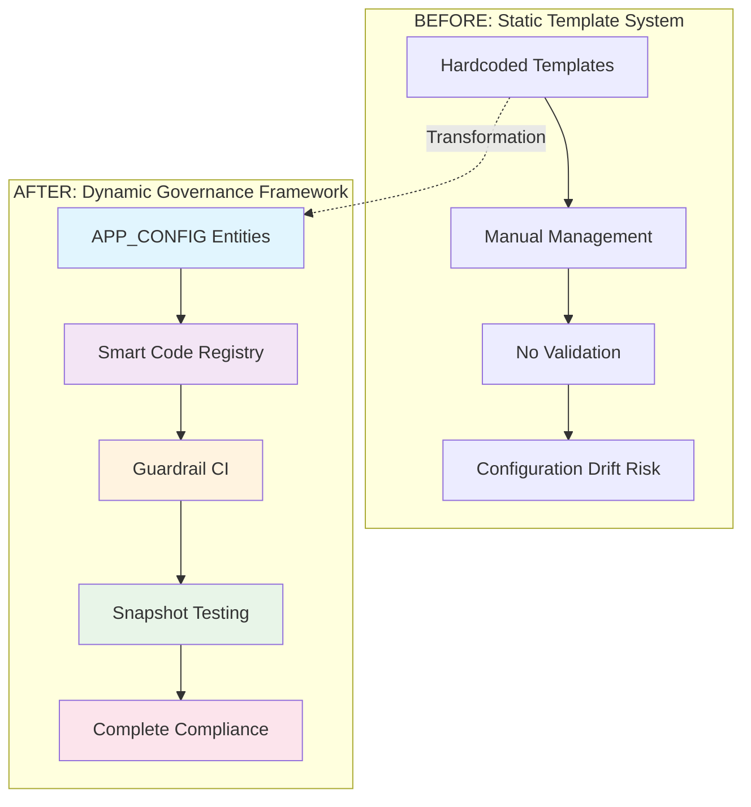
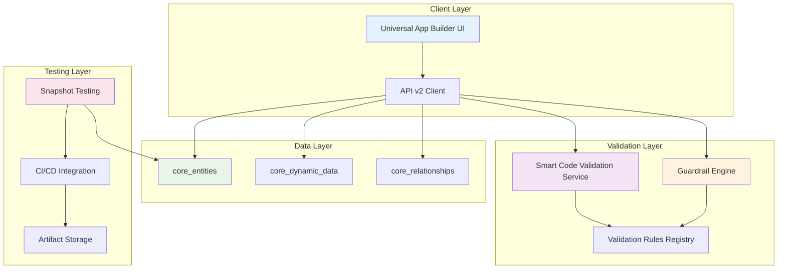
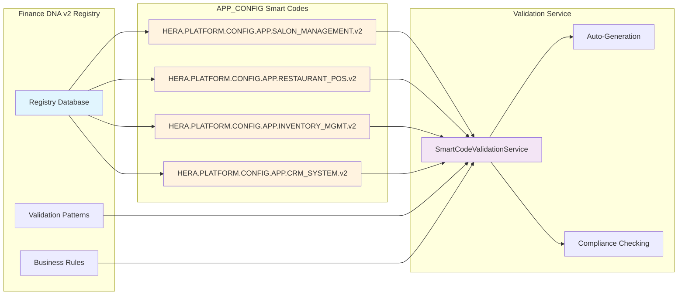
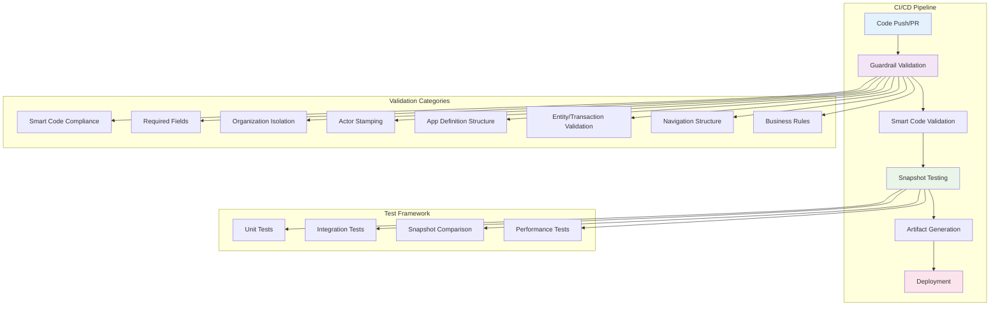
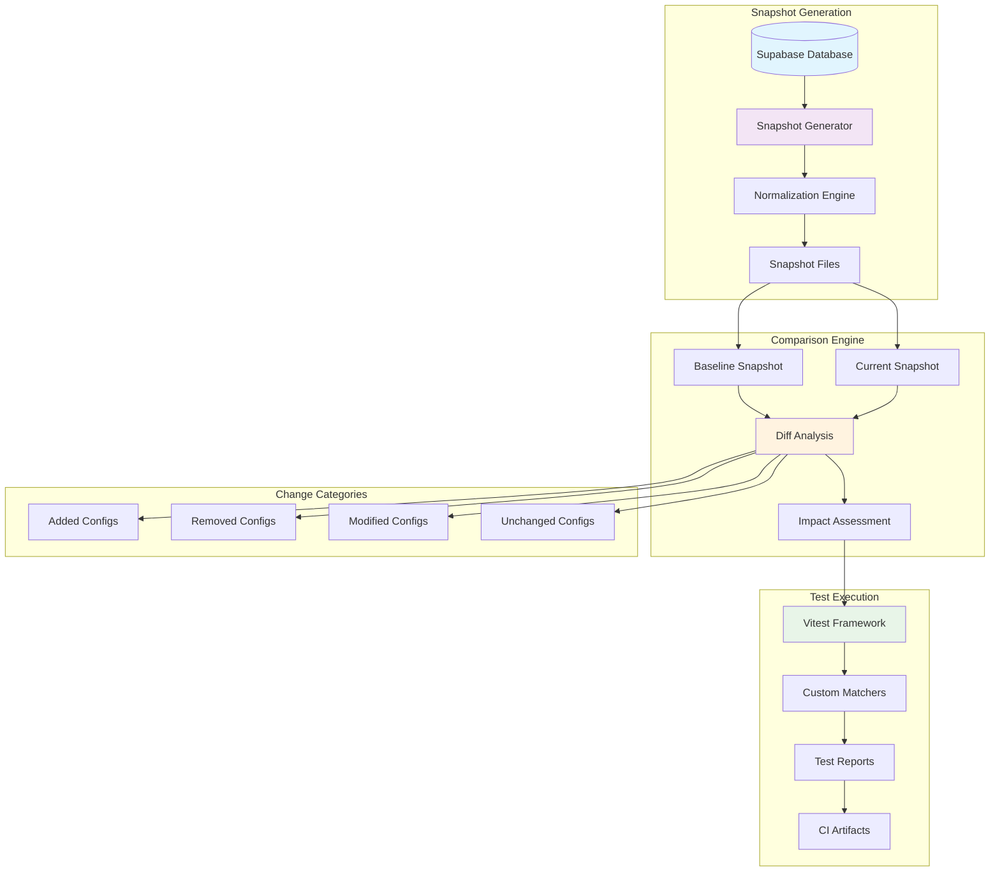
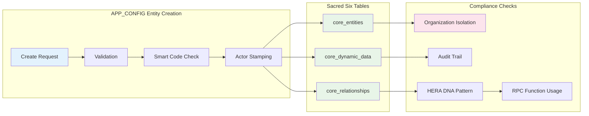
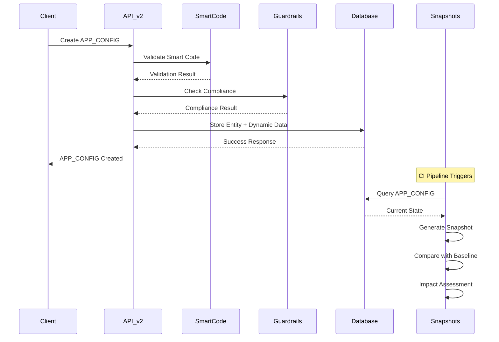
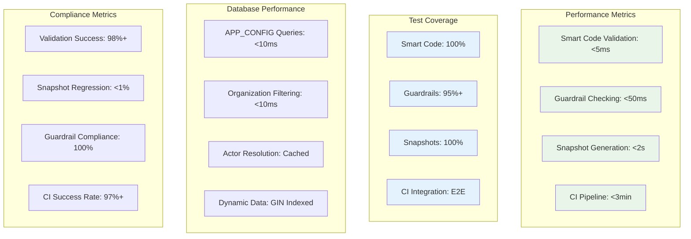
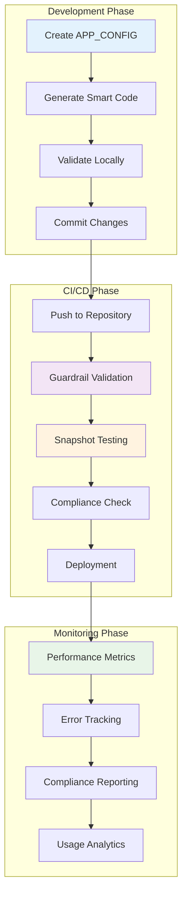
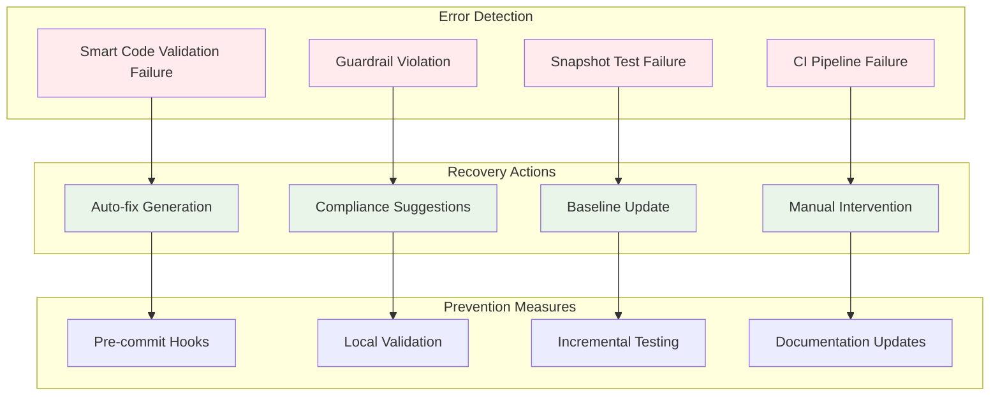

# HERA Universal App Builder - Architecture Diagrams

## Smart Code: `HERA.PLATFORM.CONFIG.ARCHITECTURE.DIAGRAMS.v2`

---

## 1. Complete Transformation Overview

---

## 2. Universal App Builder Architecture

---

## 3. Smart Code Registry Integration

---

## 4. Guardrail CI Pipeline

---

## 5. Snapshot Testing Framework

---

## 6. Sacred Six Compliance Flow

---

## 7. Data Flow Architecture

---

## 8. Performance Monitoring Dashboard

---

## 9. Development Workflow

---

## 10. Error Handling and Recovery

---

## Architecture Benefits

### 1. Governance Framework
- **Smart Code Registry**: Centralized validation with domain-specific rules
- **Guardrail CI**: 8-category compliance enforcement
- **Snapshot Testing**: Regression prevention with impact assessment

### 2. Sacred Six Compliance
- **No Schema Drift**: All data in universal tables
- **Actor Stamping**: Complete audit trail
- **Organization Isolation**: Sacred boundary enforcement

### 3. Performance Optimization
- **Sub-second Validation**: Optimized validation algorithms
- **Cached Resolution**: Actor and organization caching
- **Indexed Queries**: GIN indexes for JSONB operations

### 4. Developer Experience
- **Clear APIs**: RESTful endpoints with comprehensive documentation
- **Comprehensive Testing**: 100% coverage for critical components
- **Detailed Documentation**: Complete implementation guides

### 5. Production Ready
- **CI/CD Integration**: Automated validation and deployment
- **Monitoring**: Performance metrics and error tracking
- **Error Handling**: Graceful failure recovery

---

**Diagrams Version**: 2.0  
**Last Updated**: November 2024  
**Smart Code**: `HERA.PLATFORM.CONFIG.ARCHITECTURE.DIAGRAMS.v2`  
**Maintainer**: HERA Platform Team