# HERA Modern Digital Accountant (MDA) System

## Overview

The HERA Modern Digital Accountant (MDA) is a revolutionary accounting automation system that processes natural language finance events and generates balanced General Ledger entries automatically. Built on HERA's universal 6-table architecture, the MDA eliminates manual journal entry creation while maintaining perfect audit trails and compliance.

## Key Features

- **🤖 Natural Language Processing**: Process finance events from plain English descriptions
- **⚡ Auto-Posting Engine**: Generate balanced GL entries using policy-as-data rules
- **🛡️ Fiscal Period Protection**: Prevent posting to closed periods with validation
- **🏪 POS Integration**: Handle complex end-of-day summaries with VAT, tips, and commissions
- **🌍 Multi-Country Support**: UAE (5% VAT) and UK (20% VAT) compliance built-in
- **📊 Real-time Monitoring**: Dashboard for accountants with GL balancing validation
- **🔌 MCP Integration**: Claude Desktop integration for conversational finance operations

## Architecture Overview


## Universal Finance Event (UFE) Flow

```mermaid
sequenceDiagram
    participant User
    participant MCP as MCP Skill
    participant API as UFE API
    participant APE as Auto-Posting Engine
    participant FISCAL as Fiscal Service
    participant RULES as Rules Engine
    participant GL as GL Validation
    participant DB as HERA Database

    User->>MCP: "Paid salary AED 15,000"
    MCP->>MCP: Parse natural language
    MCP->>API: POST /api/v2/transactions/post
    
    API->>API: Validate UFE schema
    API->>FISCAL: Check fiscal period
    FISCAL-->>API: Period validation result
    
    API->>APE: Process UFE
    APE->>RULES: Load posting rules
    RULES-->>APE: Salary posting configuration
    
    APE->>APE: Generate GL lines
    APE->>GL: Validate balancing
    GL-->>APE: Balance confirmation
    
    APE->>DB: Create universal_transactions
    APE->>DB: Create universal_transaction_lines
    DB-->>APE: Transaction ID
    
    APE-->>API: Success result
    API-->>MCP: Journal entry created
    MCP-->>User: ✅ Posted: Salary AED 15,000
```



## Smart Code Classifications

### Expense Smart Codes
- `HERA.SALON.FINANCE.TXN.EXPENSE.SALARY.V1` - Staff salary payments
- `HERA.SALON.FINANCE.TXN.EXPENSE.COMMISSION.V1` - Staff commission payments  
- `HERA.SALON.FINANCE.TXN.EXPENSE.RENT.V1` - Premises rent payments
- `HERA.SALON.FINANCE.TXN.EXPENSE.UTILITIES.V1` - Electricity, water, internet
- `HERA.SALON.FINANCE.TXN.EXPENSE.SUPPLIES.V1` - Hair products and consumables
- `HERA.SALON.FINANCE.TXN.EXPENSE.MARKETING.V1` - Advertising and promotions
- `HERA.SALON.FINANCE.TXN.EXPENSE.INSURANCE.V1` - Business insurance premiums
- `HERA.SALON.FINANCE.TXN.EXPENSE.MAINTENANCE.V1` - Equipment repairs and servicing

### Revenue Smart Codes
- `HERA.SALON.FINANCE.TXN.REVENUE.SERVICE.V1` - Hair and beauty services
- `HERA.SALON.FINANCE.TXN.REVENUE.PRODUCT.V1` - Hair care product sales
- `HERA.SALON.FINANCE.TXN.REVENUE.PACKAGE.V1` - Service packages and deals

### POS Smart Codes
- `HERA.SALON.FINANCE.TXN.POS.DAILY_SUMMARY.V1` - End-of-day POS summary
- `HERA.SALON.FINANCE.TXN.POS.CASH_SALE.V1` - Individual cash sales
- `HERA.SALON.FINANCE.TXN.POS.CARD_SALE.V1` - Individual card sales

### Banking Smart Codes
- `HERA.SALON.FINANCE.TXN.BANK.FEE.V1` - Bank charges and fees
- `HERA.SALON.FINANCE.TXN.BANK.TRANSFER.V1` - Bank transfers
- `HERA.SALON.FINANCE.TXN.BANK.DEPOSIT.V1` - Bank deposits

## Posting Rules Configuration

The MDA system uses policy-as-data configuration stored in `core_dynamic_data`. Each organization can have country-specific rules:

### UAE Configuration (5% VAT)
```json
{
  "country_code": "AE",
  "currency_code": "AED", 
  "vat_config": {
    "standard_rate": 0.05,
    "vat_payable_account": "2250000",
    "vat_receivable_account": "1450000",
    "inclusive_default": true
  },
  "posting_rules": [
    {
      "smart_code": "HERA.SALON.FINANCE.TXN.EXPENSE.SALARY.V1",
      "debit_accounts": ["6100000"],
      "credit_accounts": ["1200000"]
    }
  ]
}
```

### UK Configuration (20% VAT + PAYE)
```json
{
  "country_code": "GB",
  "currency_code": "GBP",
  "vat_config": {
    "standard_rate": 0.20,
    "vat_payable_account": "2250000", 
    "vat_receivable_account": "1450000",
    "inclusive_default": true
  },
  "posting_rules": [
    {
      "smart_code": "HERA.SALON.FINANCE.TXN.EXPENSE.SALARY.V1",
      "debit_accounts": ["6100000", "6110000", "6120000"],
      "credit_accounts": ["1200000", "2400000", "2410000", "2420000"]
    }
  ]
}
```

## POS End-of-Day Processing

The MDA system handles complex POS summaries with multiple revenue streams, payment methods, VAT calculations, and staff commissions:


## Fiscal Period Management


## Error Handling and Validation

The MDA system includes comprehensive validation at multiple levels:

1. **Schema Validation**: UFE structure validation using Zod schemas
2. **Business Validation**: Amount checks, organization verification, date validation
3. **Fiscal Validation**: Period status checks, posting authorization
4. **GL Validation**: Debit/credit balancing within 0.01 tolerance
5. **Configuration Validation**: Posting rules existence, account validity

## Performance Characteristics

- **Single Transaction Processing**: < 500ms typical
- **POS EOD Summary**: < 2 seconds for full processing
- **GL Balancing**: Real-time validation with immediate feedback
- **Concurrent Processing**: Supports multiple simultaneous postings
- **Audit Trail**: Complete transaction history with Smart Code classification

## Integration Points

### MCP Integration
```typescript
// Natural language posting via Claude Desktop
await postFinanceEvent({
  organization_id: "org-uuid",
  description: "Paid stylist salary AED 15,000 from Emirates NBD on 2025-10-05"
})
```

### Direct API Integration
```typescript
// Direct UFE posting
const response = await fetch('/api/v2/transactions/post', {
  method: 'POST',
  headers: {
    'x-hera-api-version': 'v2',
    'Authorization': 'Bearer jwt-token'
  },
  body: JSON.stringify(ufePayload)
})
```

### POS Integration
```typescript
// End-of-day summary processing
const result = await processPOSDailySummary(organizationId, {
  summary_date: "2025-10-05",
  sales: { /* sales breakdown */ },
  payments: { /* payment methods */ },
  staff: [ /* commission data */ ]
})
```

## Security and Compliance

- **Multi-Tenant Isolation**: Organization-based data separation
- **RBAC Integration**: Role-based access to financial functions
- **Audit Trail**: Complete transaction logging with Smart Codes
- **Fiscal Compliance**: Country-specific VAT and tax handling
- **Data Validation**: Comprehensive input sanitization and validation

## Future Enhancements

1. **AI Learning**: Improved natural language processing based on usage patterns
2. **Predictive Analytics**: Forecast posting patterns and anomaly detection
3. **Advanced Workflows**: Multi-level approval processes for large transactions
4. **Integration Expansion**: Additional ERP system connectors
5. **Real-time Reporting**: Live financial dashboards and alerts

The HERA MDA system represents a breakthrough in accounting automation, combining the power of natural language processing with the reliability of traditional double-entry bookkeeping, all built on HERA's proven universal architecture.