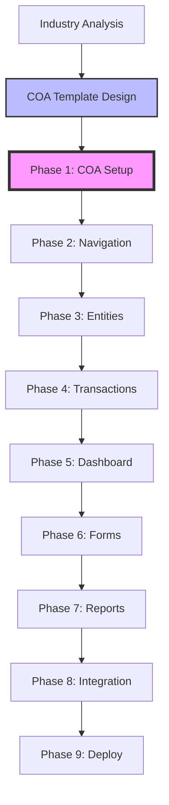

# 🎨 HERA Industry Module Visual Guide

## Module Development Flow



## COA-First Architecture

```
┌─────────────────────────────────────────────────────────┐
│                   CHART OF ACCOUNTS                      │
│                  (Financial Foundation)                  │
├─────────────────────────────────────────────────────────┤
│  Assets (1000)  │ Liabilities (2000) │ Revenue (4000)  │
│  • Cash         │ • Payables         │ • Sales         │
│  • Inventory    │ • Loans            │ • Services      │
│  • Fixed Assets │ • Tax Payable      │ • Other Income  │
├─────────────────────────────────────────────────────────┤
│                     ▼         ▼         ▼               │
│                  BUSINESS MODULES                        │
├─────────────────────────────────────────────────────────┤
│ Sales Module → Posts to Revenue Accounts (4000s)        │
│ Purchase Module → Posts to Expense Accounts (5000s)     │
│ Inventory Module → Updates Asset Accounts (1300s)       │
│ Payroll Module → Posts to Expense & Liability (5100s)   │
└─────────────────────────────────────────────────────────┘
```

## Industry Module Structure

```
🏢 INDUSTRY MODULE
├── 📊 Chart of Accounts (Foundation)
│   ├── Revenue Structure (4000-4999)
│   ├── Cost Structure (5000-5999)
│   ├── Asset Categories (1000-1999)
│   └── Liability Types (2000-2999)
│
├── 🧭 Navigation & Layout
│   ├── Industry Theme Colors
│   ├── Sidebar Navigation
│   └── Page Headers
│
├── 📋 Entity Management
│   ├── Customers
│   ├── Products/Services
│   ├── Suppliers
│   └── Custom Entities
│
├── 💰 Transaction Processing
│   ├── Sales Transactions → GL Posting
│   ├── Purchase Transactions → GL Posting
│   ├── Payment Processing → GL Posting
│   └── Journal Entries → Direct GL
│
├── 📈 Analytics & Reporting
│   ├── Financial Statements (from COA)
│   ├── Industry KPIs
│   ├── Custom Reports
│   └── Real-time Dashboards
│
└── 🤖 Automation & Integration
    ├── Auto-Journal Rules
    ├── Payment Gateway
    ├── External APIs
    └── Workflow Automation
```

## Transaction to GL Flow

```
┌─────────────────┐     ┌─────────────────┐     ┌─────────────────┐
│   Business      │     │   Smart Code    │     │   GL Posting    │
│   Transaction   │────▶│   Processing    │────▶│   to Accounts   │
└─────────────────┘     └─────────────────┘     └─────────────────┘
        │                        │                        │
        │                        │                        │
        ▼                        ▼                        ▼
┌─────────────────┐     ┌─────────────────┐     ┌─────────────────┐
│ Restaurant Sale │     │ HERA.REST.SALE  │     │ DR: Cash (1100) │
│    ₹1,000      │────▶│ posting rules   │────▶│ CR: Sales(4100) │
└─────────────────┘     └─────────────────┘     └─────────────────┘
```

## Component Hierarchy

```
App Root
├── MultiOrgAuthProvider (Authentication)
│   └── IndustryOrgContext (Organization)
│       └── IndustryLayout (Theme & Navigation)
│           ├── IndustrySidebar
│           ├── IndustryHeader
│           └── Page Content
│               ├── PageHeader
│               ├── StatCards
│               ├── DataTables
│               └── Forms
```

## Phase Dependencies

```
Phase 1: COA Setup ─────────────────┐
    │                               │
    ▼                               │
Phase 2: Navigation                 │
    │                               │
    ▼                               ▼
Phase 3: Entities ──────┐     Financial Reports
    │                   │           │
    ▼                   │           │
Phase 4: Transactions ──┴───────────┘
    │
    ▼
Phase 5-9: Features & Polish
```

## Smart Code Architecture

```
HERA.{INDUSTRY}.{MODULE}.{ENTITY}.{ACTION}.v1
     ↓         ↓        ↓        ↓         ↓
  System   Business  Feature  Object   Operation

Example Breakdown:
HERA.SALON.BOOKING.APPOINTMENT.CREATE.v1
  │     │      │         │        │
  │     │      │         │        └─── Action performed
  │     │      │         └──────────── Entity type
  │     │      └────────────────────── Module/Feature
  │     └───────────────────────────── Industry vertical
  └─────────────────────────────────── HERA system

GL Posting triggered by smart codes:
- CREATE → Generate invoice → Post to revenue
- CANCEL → Create credit note → Reverse revenue
- PAYMENT → Record payment → Update cash & receivables
```

## Multi-Tenant Isolation

```
┌─────────────────────────────────────────────────────────┐
│                    Organization A                        │
├─────────────────────────────────────────────────────────┤
│ COA: Salon-specific accounts                            │
│ Entities: Customers, Services, Staff                    │
│ Transactions: Appointments, Payments                     │
│ Reports: Salon analytics                                │
├─────────────────────────────────────────────────────────┤
│            🔒 Complete Data Isolation 🔒                │
├─────────────────────────────────────────────────────────┤
│                    Organization B                        │
├─────────────────────────────────────────────────────────┤
│ COA: Restaurant-specific accounts                        │
│ Entities: Customers, Menu Items, Tables                 │
│ Transactions: Orders, Bills                             │
│ Reports: Restaurant analytics                           │
└─────────────────────────────────────────────────────────┘
```

## Development Workflow

```
1. Setup Development
   npx create-hera-module salon

2. Configure COA
   - Edit /config/salon/coa-template.ts
   - Map industry accounts

3. Build Features
   - Follow 9-phase process
   - Test with demo org

4. Deploy
   - Run production checks
   - Deploy to organization
```

## Success Metrics Dashboard

```
┌─────────────────────────────────────────────┐
│           Module Success Metrics            │
├─────────────────────────────────────────────┤
│ ✅ COA Setup Time      │ < 5 seconds      │
│ ✅ Transaction Accuracy │ 100%             │
│ ✅ GL Posting Success  │ 100%             │
│ ✅ Report Generation   │ < 2 seconds      │
│ ✅ User Satisfaction   │ > 90%            │
│ ✅ System Uptime       │ 99.9%            │
└─────────────────────────────────────────────┘
```