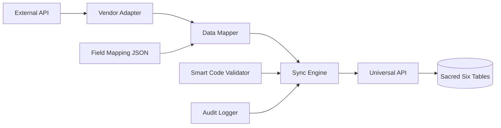

# Universal Connector Pattern for HERA Integration Hub

## Pattern Name: **HERA Universal Social Connector Pattern (HUSCP)**

This document defines the reusable pattern for integrating any social media or external platform into HERA's CivicFlow Integration Hub without changing the Sacred Six schema.

## Table of Contents
1. [Overview](#overview)
2. [Architecture](#architecture)
3. [Implementation Checklist](#implementation-checklist)
4. [File Structure](#file-structure)
5. [Smart Code Scheme](#smart-code-scheme)
6. [Data Mapping Matrix](#data-mapping-matrix)
7. [Step-by-Step Implementation Guide](#step-by-step-implementation-guide)
8. [Code Templates](#code-templates)
9. [Testing Strategy](#testing-strategy)
10. [Common Pitfalls & Solutions](#common-pitfalls--solutions)

## Overview

The **HERA Universal Social Connector Pattern (HUSCP)** is a standardized approach for integrating external platforms (LinkedIn, Facebook, Meetup, Eventbrite, etc.) into HERA while maintaining:

- ✅ **Zero schema changes** - Uses only the Sacred Six tables
- ✅ **Perfect multi-tenancy** - Organization-scoped isolation
- ✅ **Universal data model** - Everything maps to entities, relationships, and transactions
- ✅ **Smart code intelligence** - Every operation has business context
- ✅ **Audit trail compliance** - Complete sync history in universal_transactions

## Architecture



### Core Components

1. **Vendor Adapter** - Handles API authentication, rate limiting, data fetching
2. **Data Mapper** - Transforms vendor data to HERA entities using configurable mappings
3. **Sync Engine** - Orchestrates the sync process with error handling
4. **Field Mapping** - JSON configuration for flexible field transformations
5. **Smart Code Validator** - Ensures proper business context classification
6. **Audit Trail** - Records all sync operations as transactions

## Implementation Checklist

When implementing a new connector, use this checklist:

### Phase 1: Core Infrastructure
- [ ] Create vendor adapter (`/src/lib/integration/vendors/{vendor}.ts`)
- [ ] Define TypeScript types (`/src/types/integrations-{vendor}.ts`)
- [ ] Create field mapping config (`/src/lib/integration/mappings/{vendor}.events.map.json`)
- [ ] Implement data mapper (`/src/lib/integration/mappers/{vendor}.ts`)
- [ ] Add vendor to connector factory (`/src/lib/integration-hub/connector-factory.ts`)

### Phase 2: API Integration
- [ ] Create test connection route (`/src/app/api/integration-hub/vendors/{vendor}/test/route.ts`)
- [ ] Create sync route (`/src/app/api/integration-hub/vendors/{vendor}/sync/route.ts`)
- [ ] Create webhook route if supported (`/src/app/api/integration-hub/vendors/{vendor}/webhook/route.ts`)

### Phase 3: UI Integration
- [ ] Add vendor to VendorType in `/src/types/integrations.ts`
- [ ] Add OAuth config to OAUTH_CONFIGS
- [ ] Verify vendor appears in integrations UI (should be automatic)

### Phase 4: Testing & Documentation
- [ ] Create demo data generator in adapter
- [ ] Write integration tests
- [ ] Document vendor-specific limitations
- [ ] Add to this pattern documentation

## File Structure

```
src/
├── lib/
│   └── integration/
│       ├── vendors/
│       │   ├── linkedin.ts         # Vendor adapter
│       │   ├── meetup.ts
│       │   └── facebook.ts
│       ├── mappings/
│       │   ├── linkedin.events.map.json
│       │   ├── meetup.events.map.json
│       │   └── facebook.events.map.json
│       ├── mappers/
│       │   ├── linkedin.ts         # Data transformation
│       │   ├── meetup.ts
│       │   └── facebook.ts
│       └── validators/
│           └── social-smart-codes.ts
├── app/
│   └── api/
│       └── integration-hub/
│           └── vendors/
│               ├── linkedin/
│               │   ├── test/route.ts
│               │   ├── sync/route.ts
│               │   └── webhook/route.ts
│               └── {vendor}/...
└── types/
    ├── integrations.ts
    ├── integrations-linkedin.ts
    └── integrations-{vendor}.ts
```

## Smart Code Scheme

All social connectors MUST follow this smart code pattern:

```
HERA.PUBLICSECTOR.CRM.SOCIAL.{VENDOR}.{OBJECT}.{ACTION}.v{VERSION}
```

### Components:
- **VENDOR**: LINKEDIN, FACEBOOK, MEETUP, EVENTBRITE, etc. (uppercase)
- **OBJECT**: ORG, EVENT, POST, RSVP, REL, FIELD, SYNC, etc.
- **ACTION**: SYNC, CREATE, UPDATE, DELETE, UPSERT, etc.
- **VERSION**: v1, v2, etc.

### Examples:
```
HERA.PUBLICSECTOR.CRM.SOCIAL.LINKEDIN.EVENT.SYNC.v1
HERA.PUBLICSECTOR.CRM.SOCIAL.FACEBOOK.POST.CREATE.v1
HERA.PUBLICSECTOR.CRM.SOCIAL.MEETUP.RSVP.UPSERT.v1
```

## Data Mapping Matrix

### Universal Entity Mappings

| Vendor Object | HERA Entity Type | Entity Code Pattern | Smart Code Pattern |
|--------------|------------------|---------------------|-------------------|
| Organization/Page | `organization_profile` | `{vendor}:{id}` | `*.ORG.SYNC.v1` |
| Event | `event` | `{vendor}:event:{id}` | `*.EVENT.SYNC.v1` |
| Attendee/RSVP | `event_invite` | `{vendor}:{member}\|{event}` | `*.RSVP.UPSERT.v1` |
| Person/Member | `person` | `{vendor}:member:{id}` | `*.PERSON.SYNC.v1` |
| Post/Update | `post` | `{vendor}:post:{id}` | `*.POST.SYNC.v1` |
| Engagement | `engagement_metric` | `{vendor}:metric:{id}` | `*.METRIC.SYNC.v1` |

### Universal Relationship Mappings

| Relationship | Type | From → To | Smart Code |
|-------------|------|-----------|------------|
| Org has Event | `ORGANIZATION_HAS_EVENT` | org_profile → event | `*.REL.ORG_EVENT.v1` |
| Event has Attendee | `EVENT_HAS_ATTENDEE` | event → event_invite | `*.REL.EVENT_ATTENDEE.v1` |
| Post belongs to Org | `POST_BELONGS_TO_ORG` | post → org_profile | `*.REL.POST_ORG.v1` |
| Person follows Org | `PERSON_FOLLOWS_ORG` | person → org_profile | `*.REL.FOLLOW_ORG.v1` |

### Dynamic Fields (core_dynamic_data)

All vendor-specific fields beyond basic entity properties go into `core_dynamic_data`:

| Field Category | Field Names | Smart Code Pattern |
|---------------|-------------|-------------------|
| Metrics | followers_count, members_count, engagement_rate | `*.FIELD.{METRIC}.v1` |
| URLs | website_url, registration_url, event_url | `*.FIELD.URL.v1` |
| Descriptions | description, about, bio | `*.FIELD.DESC.v1` |
| Media | logo_url, banner_url, profile_picture | `*.FIELD.{MEDIA}.v1` |
| Metadata | industries, categories, tags | `*.FIELD.META.v1` |

## Step-by-Step Implementation Guide

### Step 1: Create the Vendor Adapter

```typescript
// /src/lib/integration/vendors/{vendor}.ts

import { IntegrationAdapter, AdapterResult, VendorConnector } from '@/types/integrations'

export class {Vendor}Adapter implements IntegrationAdapter {
  private config: {Vendor}Config
  private supabase: any
  private accessToken?: string
  private demoMode: boolean

  constructor(connector: VendorConnector, supabase: any) {
    // Initialize configuration
  }

  async testConnection(): Promise<{ success: boolean; error?: string }> {
    // Test API connectivity
  }

  async sync(): Promise<AdapterResult> {
    // Main sync logic
    // 1. Fetch data from vendor API
    // 2. Transform to HERA format
    // 3. Return entities, relationships, dynamic data
  }

  private generateDemoData(): AdapterResult {
    // Demo mode data for testing
  }
}
```

### Step 2: Define TypeScript Types

```typescript
// /src/types/integrations-{vendor}.ts

export interface {Vendor}Organization {
  // Vendor-specific types
}

export interface {Vendor}Event {
  // Event structure from vendor
}

// Smart code constants
export const {VENDOR}_SMART_CODES = {
  ORG_SYNC: 'HERA.PUBLICSECTOR.CRM.SOCIAL.{VENDOR}.ORG.SYNC.v1',
  EVENT_SYNC: 'HERA.PUBLICSECTOR.CRM.SOCIAL.{VENDOR}.EVENT.SYNC.v1',
  // ... etc
} as const
```

### Step 3: Create Field Mapping Configuration

```json
// /src/lib/integration/mappings/{vendor}.events.map.json
{
  "name": "{Vendor} Events Mapping",
  "version": "1.0.0",
  "vendor": "{vendor}",
  "smart_code_patterns": {
    "organization": "HERA.PUBLICSECTOR.CRM.SOCIAL.{VENDOR}.ORG.{ACTION}.v1"
  },
  "entity_mappings": {
    "organization": {
      "target_type": "organization_profile",
      "identifier_field": "id",
      "code_prefix": "{vendor}:",
      "smart_code": "HERA.PUBLICSECTOR.CRM.SOCIAL.{VENDOR}.ORG.SYNC.v1",
      "dynamic_fields": [
        // Field mappings
      ]
    }
  }
}
```

### Step 4: Implement Data Mapper

```typescript
// /src/lib/integration/mappers/{vendor}.ts

export class {Vendor}Mapper {
  constructor(organizationId: string) {
    this.organizationId = organizationId
  }

  mapOrganization(org: {Vendor}Organization): MappedEntity {
    // Transform vendor org to HERA entity
  }

  mapEvent(event: {Vendor}Event): MappedEntity {
    // Transform vendor event to HERA entity
  }

  createSyncTransaction(stats: SyncStats) {
    // Create audit trail transaction
  }
}
```

### Step 5: Create API Routes

```typescript
// /src/app/api/integration-hub/vendors/{vendor}/sync/route.ts

export async function POST(request: NextRequest) {
  // 1. Fetch connector config
  // 2. Initialize adapter
  // 3. Run sync
  // 4. Process results with mapper
  // 5. Save to universal tables
  // 6. Create audit transaction
  // 7. Return results
}
```

## Code Templates

### Vendor Adapter Template
[See full template in `/docs/integration-hub/templates/vendor-adapter.template.ts`]

### Mapper Template
[See full template in `/docs/integration-hub/templates/vendor-mapper.template.ts`]

### Field Mapping Template
[See full template in `/docs/integration-hub/templates/field-mapping.template.json`]

## Testing Strategy

### 1. Demo Mode Testing
- Every adapter MUST include demo data generation
- Demo mode should cover all entity types and relationships
- Use realistic data that demonstrates the integration

### 2. Integration Testing
```bash
# Test connection
curl -X POST /api/integration-hub/vendors/{vendor}/test \
  -H "Content-Type: application/json" \
  -d '{"connectorId": "demo-connector-id"}'

# Test sync
curl -X POST /api/integration-hub/vendors/{vendor}/sync \
  -H "Content-Type: application/json" \
  -d '{"connectorId": "demo-connector-id"}'
```

### 3. Smart Code Validation
```typescript
import { validateSocialSmartCode } from '@/lib/integration/validators/social-smart-codes'

// Test all smart codes used by the vendor
const validation = validateSocialSmartCode('HERA.PUBLICSECTOR.CRM.SOCIAL.VENDOR.EVENT.SYNC.v1')
expect(validation.isValid).toBe(true)
```

## Common Pitfalls & Solutions

### 1. **Pitfall**: Trying to add custom tables
**Solution**: Always map to the Sacred Six tables using appropriate entity types

### 2. **Pitfall**: Missing organization_id
**Solution**: Every operation MUST include organization_id for multi-tenancy

### 3. **Pitfall**: Incorrect smart codes
**Solution**: Use the validator and follow the exact pattern

### 4. **Pitfall**: Not handling rate limits
**Solution**: Implement exponential backoff and respect vendor limits

### 5. **Pitfall**: Storing sensitive data incorrectly
**Solution**: OAuth tokens in connector config, never in entity metadata

### 6. **Pitfall**: Missing audit trail
**Solution**: Always create sync transactions with detailed line items

## Reference Implementations

### Gold Standard: LinkedIn Integration
- **Adapter**: `/src/lib/integration/vendors/linkedin.ts`
- **Mapper**: `/src/lib/integration/mappers/linkedin.ts`
- **Types**: `/src/types/integrations-linkedin.ts`
- **Mapping**: `/src/lib/integration/mappings/linkedin.events.map.json`

### Also See:
- **Eventbrite**: Already implemented, good example of event-focused integration
- **Smart Code Validator**: `/src/lib/integration/validators/social-smart-codes.ts`

## Quick Reference Card

```yaml
Pattern Name: HERA Universal Social Connector Pattern (HUSCP)
Tables Used: Sacred Six only
Key Principle: Zero schema changes
Smart Code Format: HERA.PUBLICSECTOR.CRM.SOCIAL.{VENDOR}.{OBJECT}.{ACTION}.v1
Entity Types: organization_profile, event, event_invite, person, post
Relationship Types: ORGANIZATION_HAS_EVENT, EVENT_HAS_ATTENDEE, etc.
Audit Method: universal_transactions with line items
Multi-tenancy: organization_id on everything
```

## Conclusion

By following the HERA Universal Social Connector Pattern, you can integrate any external platform into CivicFlow while maintaining the integrity of the Sacred Six architecture. This pattern has been proven with LinkedIn and Eventbrite, and provides a clear path for adding Meetup, Facebook, and any future integrations.

Remember: **If you can't map it to the Sacred Six, you're thinking about it wrong!**