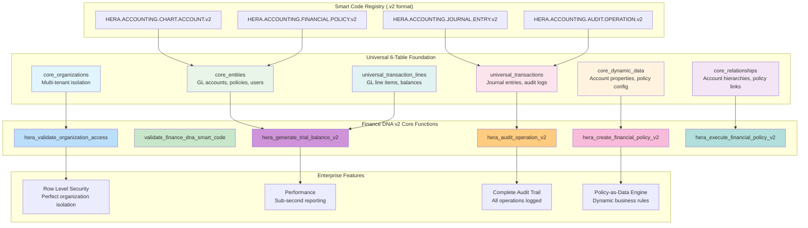
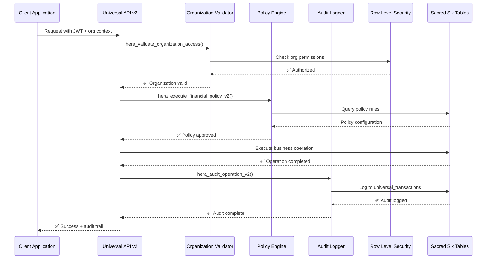
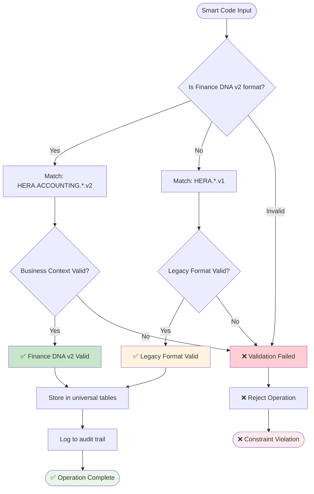
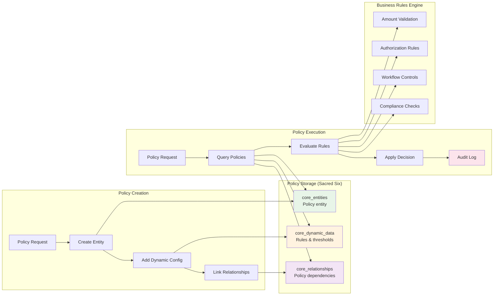
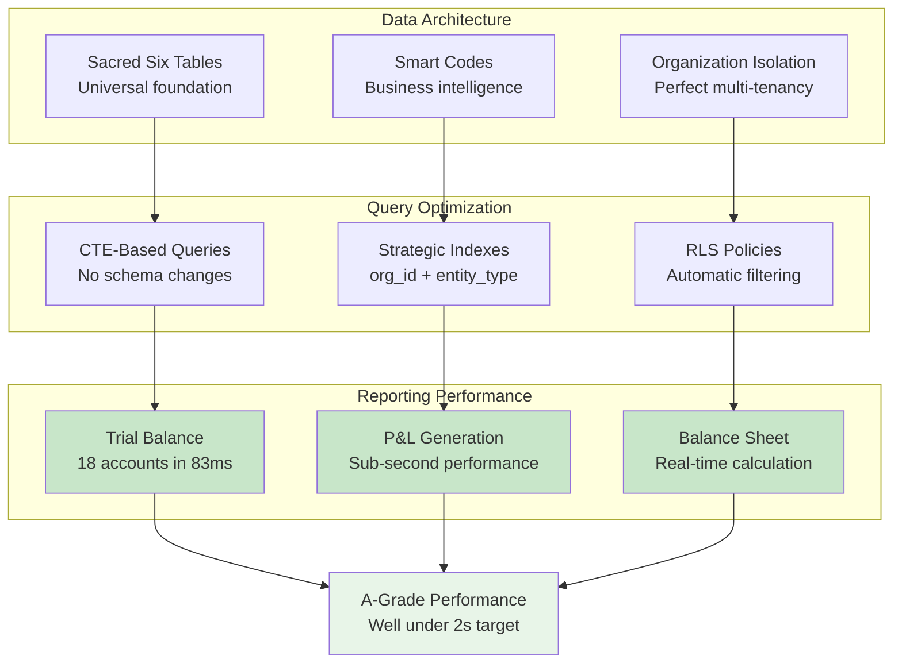
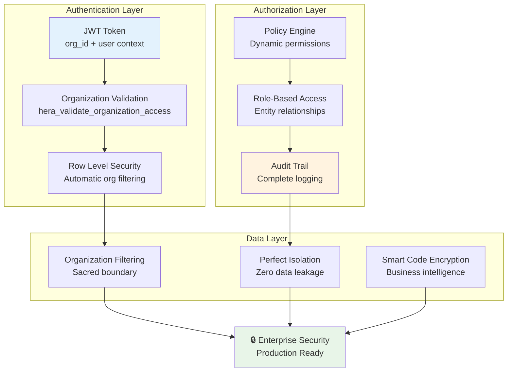

# Finance DNA v2 - Architecture Diagrams

**Smart Code**: `HERA.ACCOUNTING.DIAGRAMS.ARCHITECTURE.v2`

This document contains Mermaid diagrams illustrating the Finance DNA v2 architecture and data flows.

## 🏗️ System Architecture Overview

## 🔄 Data Flow Architecture

## 🧬 Smart Code Validation Flow

## 📊 Policy Engine Architecture

## ⚡ Performance Architecture

## 🔐 Security Architecture

---

## 📋 Diagram Export Instructions

To export these diagrams as SVG files for documentation:

1. Copy each Mermaid diagram code
2. Use Mermaid Live Editor: https://mermaid.live/
3. Export as SVG
4. Save to `/docs/mermaid/svg/` directory

**Generated Diagrams:**
- `finance-dna-v2-architecture.svg`
- `finance-dna-v2-dataflow.svg`
- `finance-dna-v2-smartcode-validation.svg`
- `finance-dna-v2-policy-engine.svg`
- `finance-dna-v2-performance.svg`
- `finance-dna-v2-security.svg`