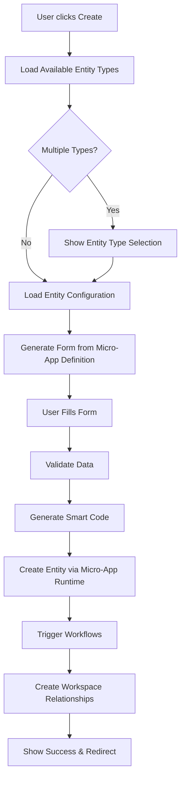

# Universal Entity Creation System

## 🎯 Overview

The Universal Entity Creation System is the first component of HERA's micro-app design philosophy, enabling dynamic entity creation through micro-app runtime with consistent UX across all workspaces.

## 🏗️ Architecture

### Core Components

1. **UniversalEntityRegistry** (`/src/lib/micro-apps/UniversalEntityRegistry.ts`)
   - Discovers entity types from installed micro-apps
   - Provides workspace-aware entity type filtering
   - Generates form configurations from micro-app definitions

2. **EntityCreationService** (`/src/lib/micro-apps/EntityCreationService.ts`)
   - Orchestrates entity creation through micro-app runtime
   - Handles smart code generation and validation
   - Triggers workflows and creates workspace relationships

3. **UniversalEntityCreator** (`/src/components/micro-apps/UniversalEntityCreator.tsx`)
   - Main UI component for entity creation
   - Integrates micro-app discovery with form generation
   - Provides entity type selection when multiple types available

4. **Enhanced HERAMasterDataTemplate** (`/src/components/hera/HERAMasterDataTemplate.tsx`)
   - Supports micro-app configurations
   - Enhanced field types (date, boolean)
   - Workspace-aware smart code generation

## 🚀 Usage

### Route Structure
```
/retail/domains/[domain]/sections/[section]/entities/new
```

### Query Parameters
- `type`: Entity type to create (optional)
- `app`: Micro-app code (optional)
- `workspace`: Workspace ID (default: 'main')

### Workspace Integration
The "Create New Item" buttons in workspace tiles automatically route to the universal entity creator:

```tsx
<button 
  onClick={() => router.push(`/retail/domains/${domain}/sections/${section}/entities/new`)}
  className="create-entity-button"
>
  Create New {section} Item
</button>
```

## 🔧 Configuration

### Micro-App Entity Definition
```typescript
interface MicroAppEntity {
  entity_type: string
  display_name: string
  display_name_plural: string
  fields: MicroAppField[]
  relationships?: MicroAppRelationship[]
}
```

### Workspace Context
```typescript
interface WorkspaceEntityContext {
  domain: string
  section: string
  workspace: string
  organization_id: string
  ui_customizations?: Record<string, any>
}
```

## ⚡ Features

### 1. **Micro-App Discovery**
- Automatically detects available entity types from installed micro-apps
- Falls back to default entity types if no micro-apps installed
- Supports workspace-specific entity filtering

### 2. **Dynamic Form Generation**
- Converts micro-app entity definitions to form configurations
- Supports multiple field types (text, number, select, date, boolean, etc.)
- Auto-generates form sections and validation rules

### 3. **Smart Code Intelligence**
- Context-aware smart code generation: `HERA.{APP_CODE}.{ENTITY_TYPE}.{VARIANT}.v1`
- Uses workspace context for intelligent defaults
- Validates smart codes against HERA DNA standards

### 4. **Workflow Integration**
- Triggers entity creation workflows defined in micro-apps
- Creates workspace relationships automatically
- Maintains complete audit trails with actor stamping

### 5. **Responsive Design**
- Mobile-first entity type selection
- Consistent form experience across devices
- Progressive disclosure for complex forms

## 🧪 Testing

To test the Universal Entity Creation System:

1. **Navigate to Workspace**
   ```
   http://localhost:3000/retail/domains/analytics/sections/ops
   ```

2. **Click "Create New Ops Item"**
   - Should route to `/retail/domains/analytics/sections/ops/entities/new`
   - Should show entity type selection or direct form

3. **Fill Out Form**
   - Form fields dynamically generated from micro-app definitions
   - Smart codes auto-generated based on workspace context

4. **Submit Entity**
   - Creates entity through micro-app runtime
   - Triggers associated workflows
   - Redirects back to workspace

## 🔄 Data Flow



## 🎯 Benefits

### For Users
- **Consistent Experience**: Same creation flow across all entity types
- **Context Awareness**: Forms adapt to workspace and business context
- **Progressive Disclosure**: Start simple, add complexity as needed

### For Developers
- **No Custom Forms**: Entity types automatically get creation interfaces
- **Micro-App Integration**: Leverage installed apps for business logic
- **Scalable Architecture**: Add new entity types by installing micro-apps

### For Organizations
- **Rapid Deployment**: New entity types available immediately when micro-apps installed
- **Business Rules**: Micro-apps enforce industry-specific validation and workflows
- **Audit Compliance**: Complete traceability through actor-based operations

## 🚀 Future Enhancements

This Universal Entity Creation system is the foundation for:

1. **Universal Entity List** - Dynamic listing of any entity type
2. **Universal Transaction Creation** - Transaction-based operations
3. **Universal Transaction List** - Transaction history and management
4. **Universal Relationships** - Entity relationship management
5. **Universal Workspace** - Dynamic workspace generation
6. **Universal Analytics** - Cross-entity analytics and reporting

## 📁 File Structure

```
/src/lib/micro-apps/
├── UniversalEntityRegistry.ts      # Entity type discovery
├── EntityCreationService.ts        # Creation orchestration
├── micro-app-client.ts            # Micro-app SDK

/src/components/micro-apps/
├── UniversalEntityCreator.tsx      # Main creation component

/src/components/hera/
├── HERAMasterDataTemplate.tsx      # Enhanced form template

/src/app/retail/domains/[domain]/sections/[section]/
├── page.tsx                        # Workspace page with create buttons
└── entities/new/page.tsx           # Universal creation route
```

## 🛡️ Security

- All operations actor-stamped with user identity
- Organization isolation enforced at runtime
- Micro-app validation prevents unauthorized operations
- Complete audit trails for compliance

## 📊 Performance

- Lazy loading of micro-app configurations
- Cached entity type discovery
- Optimistic UI updates for better UX
- Background workflow execution

The Universal Entity Creation System demonstrates HERA's vision of **6 Tables. Infinite Business Complexity. Zero Custom Forms.**