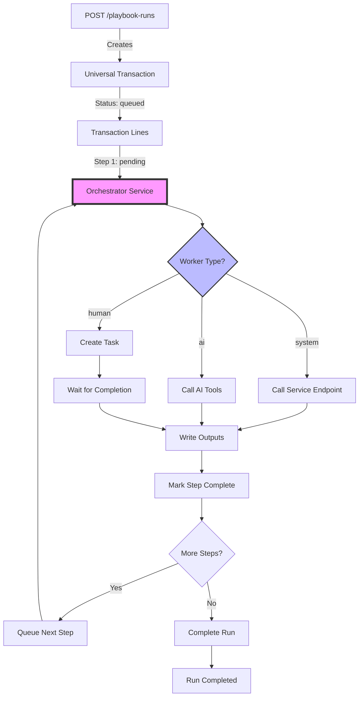

# Playbook Orchestration Logic

This document describes how playbook runs advance through their lifecycle, from creation to completion. The orchestration system is event-driven, scalable, and maintains complete audit trails using HERA's 6 sacred tables.

## 1. Orchestration Overview



## 2. Run Initialization

### 2.1 Creating a Playbook Run

When `POST /playbook-runs` is called:

```typescript
// 1. Create the run transaction
const run = await universalApi.createTransaction({
  transaction_type: 'playbook_run',
  transaction_code: generateRunCode(), // RUN-20240101-0001
  smart_code: 'HERA.GENERAL.PLAYBOOK.RUN.CUSTOMER_ONBOARDING.V1',
  organization_id: request.organization_id,
  reference_entity_id: request.playbook_id,
  subject_entity_id: request.subject_entity_id,
  status: 'queued',
  metadata: {
    inputs: request.inputs,
    correlation_id: request.correlation_id,
    priority: request.priority || 'normal',
    created_by: currentUser.id,
    created_at: new Date().toISOString()
  }
});

// 2. Get playbook steps
const steps = await getPlaybookSteps(request.playbook_id);

// 3. Create transaction lines for all steps
const lines = await Promise.all(
  steps.map((step, index) => 
    universalApi.createTransactionLine({
      transaction_id: run.id,
      line_number: index + 1,
      line_entity_id: step.id,
      smart_code: generateStepSmartCode(step),
      quantity: 1,
      metadata: {
        sequence: step.sequence,
        status: index === 0 ? 'pending' : 'queued',
        worker_type: step.worker_type,
        service_endpoint: step.service_endpoint,
        sla_seconds: step.sla_seconds,
        retry_policy: step.retry_policy,
        permissions_required: step.permissions_required,
        created_at: new Date().toISOString()
      }
    })
  )
);

// 4. Emit orchestration event
await emitEvent({
  type: 'PLAYBOOK_RUN_CREATED',
  run_id: run.id,
  first_step_id: lines[0].id
});
```

### 2.2 Initial State

After creation:
- **Run**: Status = `queued`, will transition to `in_progress` when first step starts
- **Step 1**: Status = `pending`, ready for orchestrator pickup
- **Other Steps**: Status = `queued`, waiting for prerequisites

## 3. Orchestrator Service Architecture

### 3.1 Core Components

```typescript
export class PlaybookOrchestrator {
  private readonly pollInterval = 5000; // 5 seconds
  private readonly maxConcurrentSteps = 10;
  private activeSteps = new Map<string, StepExecution>();
  
  async start(): Promise<void> {
    // Start polling loop
    setInterval(() => this.processPendingSteps(), this.pollInterval);
    
    // Start signal listener
    this.listenForSignals();
    
    // Start health monitoring
    this.startHealthMonitor();
  }
  
  private async processPendingSteps(): Promise<void> {
    try {
      // Find pending steps with met prerequisites
      const pendingSteps = await this.findExecutableSteps();
      
      for (const step of pendingSteps) {
        if (this.activeSteps.size >= this.maxConcurrentSteps) {
          break; // At capacity
        }
        
        // Process step asynchronously
        this.processStep(step).catch(error => 
          this.handleStepError(step, error)
        );
      }
    } catch (error) {
      console.error('Orchestrator poll error:', error);
    }
  }
}
```

### 3.2 Finding Executable Steps

```typescript
private async findExecutableSteps(): Promise<StepExecutionLine[]> {
  // Query for pending steps
  const query = `
    SELECT 
      tl.*,
      t.status as run_status,
      t.metadata->>'priority' as priority
    FROM universal_transaction_lines tl
    JOIN universal_transactions t ON t.id = tl.transaction_id
    WHERE 
      tl.organization_id = $1
      AND t.transaction_type = 'playbook_run'
      AND t.status = 'in_progress'
      AND tl.metadata->>'status' = 'pending'
      AND NOT EXISTS (
        SELECT 1 FROM active_executions ae 
        WHERE ae.step_id = tl.id
      )
    ORDER BY 
      CASE t.metadata->>'priority'
        WHEN 'critical' THEN 1
        WHEN 'high' THEN 2
        WHEN 'normal' THEN 3
        WHEN 'low' THEN 4
      END,
      t.created_at,
      (tl.metadata->>'sequence')::int
    LIMIT 10
  `;
  
  const steps = await db.query(query, [this.organizationId]);
  
  // Check prerequisites for each step
  const executableSteps = [];
  for (const step of steps) {
    if (await this.checkPrerequisites(step)) {
      executableSteps.push(step);
    }
  }
  
  return executableSteps;
}

private async checkPrerequisites(step: StepExecutionLine): Promise<boolean> {
  // Check sequence-based prerequisites
  const previousSteps = await this.getPreviousSteps(step);
  
  for (const prevStep of previousSteps) {
    const status = prevStep.metadata?.status;
    if (status !== 'completed' && status !== 'skipped') {
      return false; // Previous step not done
    }
  }
  
  // Check signal-based prerequisites
  const requiredSignals = step.metadata?.required_signals || [];
  for (const signal of requiredSignals) {
    if (!await this.hasSignal(step.transaction_id, signal)) {
      return false;
    }
  }
  
  // Check time-based prerequisites
  const earliestStart = step.metadata?.earliest_start_time;
  if (earliestStart && new Date(earliestStart) > new Date()) {
    return false; // Too early
  }
  
  return true;
}
```

## 4. Worker Type Processing

### 4.1 System Worker

For `worker_type: 'system'`:

```typescript
private async processSystemStep(step: StepExecutionLine): Promise<void> {
  const startTime = Date.now();
  
  try {
    // Update step to running
    await this.updateStepStatus(step.id, 'running', {
      started_at: new Date().toISOString(),
      worker_id: 'system-orchestrator'
    });
    
    // Prepare request
    const endpoint = step.metadata.service_endpoint;
    const inputs = await this.resolveInputs(step);
    
    // Call service endpoint
    const response = await axios.post(endpoint, {
      step_id: step.id,
      run_id: step.transaction_id,
      inputs: inputs,
      context: {
        organization_id: step.organization_id,
        correlation_id: step.metadata.correlation_id
      }
    }, {
      timeout: (step.metadata.sla_seconds || 300) * 1000,
      headers: {
        'X-Idempotency-Key': this.getIdempotencyKey(step),
        'Authorization': `Bearer ${this.getServiceToken()}`
      }
    });
    
    // Validate outputs
    const outputs = response.data.outputs;
    await this.validateOutputs(step, outputs);
    
    // Update step as completed
    await this.completeStep(step.id, {
      outputs: outputs,
      latency_ms: Date.now() - startTime,
      response_metadata: response.data.metadata
    });
    
  } catch (error) {
    await this.handleStepFailure(step, error, startTime);
  }
}
```

### 4.2 AI Worker

For `worker_type: 'ai'`:

```typescript
private async processAIStep(step: StepExecutionLine): Promise<void> {
  const startTime = Date.now();
  
  try {
    // Update step to running
    await this.updateStepStatus(step.id, 'running', {
      started_at: new Date().toISOString(),
      worker_id: 'ai-orchestrator'
    });
    
    // Prepare AI request
    const inputs = await this.resolveInputs(step);
    const aiModel = step.metadata.ai_model_preference || 'gpt-4';
    
    // Build prompt from step definition
    const prompt = await this.buildAIPrompt(step, inputs);
    
    // Call AI service
    const aiResponse = await this.aiService.process({
      model: aiModel,
      prompt: prompt,
      input_schema: step.metadata.input_contract,
      output_schema: step.metadata.output_contract,
      temperature: 0.7,
      max_tokens: 2000
    });
    
    // Extract and validate outputs
    const outputs = aiResponse.outputs;
    const confidence = aiResponse.confidence || 0.85;
    const insights = aiResponse.insights || '';
    
    await this.validateOutputs(step, outputs);
    
    // Update step as completed with AI metadata
    await this.completeStep(step.id, {
      outputs: outputs,
      ai_confidence: confidence,
      ai_insights: insights,
      ai_model_used: aiModel,
      latency_ms: Date.now() - startTime,
      token_usage: aiResponse.usage
    });
    
  } catch (error) {
    await this.handleStepFailure(step, error, startTime);
  }
}

private async buildAIPrompt(
  step: StepExecutionLine, 
  inputs: any
): Promise<string> {
  const stepDef = await this.getStepDefinition(step.line_entity_id);
  
  return `
    Task: ${stepDef.entity_name}
    Description: ${stepDef.metadata.description}
    
    Inputs:
    ${JSON.stringify(inputs, null, 2)}
    
    Expected Output Schema:
    ${JSON.stringify(step.metadata.output_contract, null, 2)}
    
    Instructions:
    1. Process the inputs according to the task description
    2. Generate outputs that match the expected schema
    3. Provide confidence score (0-1) for your response
    4. Include any relevant insights or reasoning
  `;
}
```

### 4.3 Human Worker

For `worker_type: 'human'`:

```typescript
private async processHumanStep(step: StepExecutionLine): Promise<void> {
  try {
    // Update step to running
    await this.updateStepStatus(step.id, 'running', {
      started_at: new Date().toISOString(),
      worker_id: 'human-task-creator'
    });
    
    // Resolve assignee
    const assignee = await this.resolveAssignee(step);
    
    // Create human task
    const task = await this.createHumanTask({
      step_id: step.id,
      run_id: step.transaction_id,
      assignee_id: assignee.id,
      title: `Complete: ${step.metadata.step_name}`,
      description: step.metadata.description,
      inputs: await this.resolveInputs(step),
      input_schema: step.metadata.input_contract,
      output_schema: step.metadata.output_contract,
      due_at: this.calculateDueDate(step),
      priority: step.metadata.priority,
      skills_required: step.metadata.human_skills_required
    });
    
    // Update step with task reference
    await this.updateStepMetadata(step.id, {
      task_id: task.id,
      assignee: assignee.email,
      assigned_at: new Date().toISOString(),
      due_at: task.due_at
    });
    
    // Send notification
    await this.notifyAssignee(assignee, task);
    
    // Task completion will be handled by POST /complete endpoint
    
  } catch (error) {
    await this.handleStepFailure(step, error, Date.now());
  }
}

private async createHumanTask(params: any): Promise<Task> {
  // Create task entity
  const task = await universalApi.createEntity({
    entity_type: 'playbook_task',
    entity_name: params.title,
    smart_code: 'HERA.PLAYBOOK.TASK.HUMAN.V1',
    organization_id: this.organizationId,
    metadata: {
      step_id: params.step_id,
      run_id: params.run_id,
      assignee_id: params.assignee_id,
      status: 'open',
      inputs: params.inputs,
      schemas: {
        input: params.input_schema,
        output: params.output_schema
      },
      due_at: params.due_at,
      priority: params.priority
    }
  });
  
  // Create assignment relationship
  await universalApi.createRelationship({
    from_entity_id: task.id,
    to_entity_id: params.assignee_id,
    relationship_type: 'assigned_to',
    smart_code: 'HERA.PLAYBOOK.REL.TASK_ASSIGNED.V1'
  });
  
  return task;
}
```

## 5. Step Completion and Advancement

### 5.1 Completing a Step

```typescript
private async completeStep(
  stepId: string, 
  completion: StepCompletion
): Promise<void> {
  // Begin transaction
  await db.transaction(async (trx) => {
    // 1. Update step status
    await this.updateStepStatus(stepId, 'completed', {
      completed_at: new Date().toISOString(),
      outputs: completion.outputs,
      latency_ms: completion.latency_ms,
      ai_confidence: completion.ai_confidence,
      ai_insights: completion.ai_insights,
      ...completion
    }, trx);
    
    // 2. Update run progress
    const run = await this.getRunForStep(stepId, trx);
    const progress = await this.calculateRunProgress(run.id, trx);
    
    await this.updateRunMetadata(run.id, {
      completed_steps: progress.completed,
      total_steps: progress.total,
      last_completed_step: stepId,
      last_activity_at: new Date().toISOString()
    }, trx);
    
    // 3. Check if run should complete
    if (progress.completed === progress.total) {
      await this.completeRun(run.id, trx);
    } else {
      // 4. Queue next steps
      await this.queueNextSteps(stepId, run.id, trx);
    }
    
    // 5. Create completion audit record
    await this.createAuditRecord({
      type: 'step_completed',
      step_id: stepId,
      run_id: run.id,
      completion_data: completion
    }, trx);
  });
  
  // Remove from active executions
  this.activeSteps.delete(stepId);
  
  // Emit completion event
  await this.emitEvent({
    type: 'STEP_COMPLETED',
    step_id: stepId,
    outputs: completion.outputs
  });
}
```

### 5.2 Queuing Next Steps

```typescript
private async queueNextSteps(
  completedStepId: string,
  runId: string,
  trx: Transaction
): Promise<void> {
  // Get completed step details
  const completedStep = await this.getStep(completedStepId, trx);
  const sequence = completedStep.metadata.sequence;
  
  // Find dependent steps
  const dependentSteps = await this.findDependentSteps(
    runId, 
    sequence, 
    trx
  );
  
  for (const step of dependentSteps) {
    // Check if all prerequisites are met
    if (await this.checkPrerequisites(step, trx)) {
      // Transition from queued to pending
      await this.updateStepStatus(step.id, 'pending', {
        prerequisites_met_at: new Date().toISOString(),
        triggered_by_step: completedStepId
      }, trx);
      
      // Emit event for orchestrator pickup
      await this.emitEvent({
        type: 'STEP_READY',
        step_id: step.id,
        run_id: runId
      });
    }
  }
}

private async findDependentSteps(
  runId: string,
  completedSequence: number,
  trx: Transaction
): Promise<StepExecutionLine[]> {
  return await trx.query(`
    SELECT * FROM universal_transaction_lines
    WHERE 
      transaction_id = $1
      AND metadata->>'status' = 'queued'
      AND (
        -- Direct sequence dependency
        (metadata->>'sequence')::int = $2 + 1
        OR
        -- Explicit dependency
        metadata->'depends_on' ? $3
      )
  `, [runId, completedSequence, completedStepId]);
}
```

## 6. Error Handling and Retry Logic

### 6.1 Step Failure Handling

```typescript
private async handleStepFailure(
  step: StepExecutionLine,
  error: Error,
  startTime: number
): Promise<void> {
  const attempt = (step.metadata.attempt || 0) + 1;
  const retryPolicy = step.metadata.retry_policy || {
    max_attempts: 3,
    backoff_seconds: [5, 30, 120]
  };
  
  // Record failure
  const failureData = {
    error: {
      code: error.code || 'UNKNOWN_ERROR',
      message: error.message,
      stack: error.stack,
      details: error.details || {}
    },
    attempt: attempt,
    latency_ms: Date.now() - startTime,
    failed_at: new Date().toISOString()
  };
  
  // Check retry policy
  if (attempt < retryPolicy.max_attempts) {
    // Schedule retry
    const backoffSeconds = retryPolicy.backoff_seconds[attempt - 1] || 60;
    
    await this.updateStepStatus(step.id, 'pending', {
      ...failureData,
      retry_scheduled_at: new Date(
        Date.now() + backoffSeconds * 1000
      ).toISOString(),
      status_reason: `Retry ${attempt}/${retryPolicy.max_attempts} scheduled`
    });
    
    // Create retry event
    await this.scheduleRetry(step.id, backoffSeconds);
    
  } else {
    // Max retries exceeded - fail the step
    await this.updateStepStatus(step.id, 'failed', {
      ...failureData,
      status_reason: 'Max retries exceeded'
    });
    
    // Check if step is critical
    if (step.metadata.critical) {
      // Fail the entire run
      await this.failRun(step.transaction_id, {
        failed_step_id: step.id,
        failure_reason: `Critical step failed: ${error.message}`
      });
    } else {
      // Continue with next steps if possible
      await this.queueNextSteps(step.id, step.transaction_id);
    }
  }
  
  // Remove from active executions
  this.activeSteps.delete(step.id);
}
```

### 6.2 Escalation to Blocked State

```typescript
private async escalateToBlocked(
  step: StepExecutionLine,
  reason: string
): Promise<void> {
  // Update step status
  await this.updateStepStatus(step.id, 'blocked', {
    blocked_at: new Date().toISOString(),
    blocked_reason: reason
  });
  
  // Update run status
  await this.updateRunStatus(step.transaction_id, 'blocked', {
    blocked_by_step: step.id,
    blocked_reason: reason
  });
  
  // Create escalation
  const escalation = await this.createEscalation({
    run_id: step.transaction_id,
    step_id: step.id,
    reason: reason,
    severity: 'high',
    escalation_path: await this.determineEscalationPath(step)
  });
  
  // Notify stakeholders
  await this.notifyEscalation(escalation);
}
```

## 7. Signal Processing

### 7.1 Signal Listener

```typescript
private async listenForSignals(): Promise<void> {
  // Subscribe to signal events
  this.eventBus.on('PLAYBOOK_SIGNAL', async (signal: Signal) => {
    try {
      await this.processSignal(signal);
    } catch (error) {
      console.error('Signal processing error:', error);
    }
  });
}

private async processSignal(signal: Signal): Promise<void> {
  switch (signal.type) {
    case 'STEP_READY':
      // External system indicating readiness
      await this.handleStepReadySignal(signal);
      break;
      
    case 'TIMEOUT_WARNING':
      // SLA approaching
      await this.handleTimeoutWarning(signal);
      break;
      
    case 'ESCALATION_REQUIRED':
      // Manual escalation request
      await this.handleEscalationSignal(signal);
      break;
      
    case 'EXTERNAL_UPDATE':
      // External system state change
      await this.handleExternalUpdate(signal);
      break;
      
    case 'PAUSE_REQUESTED':
      // Pause run execution
      await this.pauseRun(signal.run_id);
      break;
      
    case 'RESUME_REQUESTED':
      // Resume paused run
      await this.resumeRun(signal.run_id);
      break;
  }
}
```

## 8. Complete Orchestration Example

Here's a complete example of a playbook run advancing through multiple steps:

```typescript
// Example: Customer Onboarding Playbook
const steps = [
  { 
    sequence: 1, 
    name: 'Validate Identity', 
    worker_type: 'system',
    service_endpoint: 'https://api.identity.com/verify'
  },
  { 
    sequence: 2, 
    name: 'Credit Check', 
    worker_type: 'system',
    service_endpoint: 'https://api.credit.com/check',
    depends_on: [1]
  },
  { 
    sequence: 3, 
    name: 'Review Application', 
    worker_type: 'human',
    skills_required: ['credit_analysis'],
    depends_on: [2]
  },
  { 
    sequence: 4, 
    name: 'Generate Welcome Package', 
    worker_type: 'ai',
    ai_model_preference: 'gpt-4',
    depends_on: [3]
  },
  { 
    sequence: 5, 
    name: 'Send Welcome Email', 
    worker_type: 'system',
    service_endpoint: 'https://api.email.com/send',
    depends_on: [4]
  }
];

// Orchestration flow:
// 1. Run created with all steps
// 2. Step 1 (Validate Identity) - pending, others queued
// 3. Orchestrator picks up Step 1, calls identity service
// 4. Step 1 completes, Step 2 becomes pending
// 5. Step 2 (Credit Check) executes
// 6. Step 2 completes, Step 3 becomes pending
// 7. Step 3 (Review) creates human task, waits
// 8. Human completes review via POST /complete
// 9. Step 4 (AI Welcome) generates content
// 10. Step 5 (Email) sends welcome package
// 11. Run marked as completed
```

## 9. Monitoring and Observability

### 9.1 Key Metrics

```typescript
export class OrchestratorMetrics {
  // Performance metrics
  stepExecutionDuration: Histogram;
  stepQueueDepth: Gauge;
  activeStepsCount: Gauge;
  
  // Success metrics
  stepsCompletedTotal: Counter;
  stepsFailedTotal: Counter;
  stepsRetriedTotal: Counter;
  
  // SLA metrics
  slaMissedTotal: Counter;
  slaWarningsTotal: Counter;
  
  // Worker metrics
  systemCallDuration: Histogram;
  aiCallDuration: Histogram;
  humanTaskDuration: Histogram;
}
```

### 9.2 Health Checks

```typescript
private async checkOrchestratorHealth(): Promise<HealthStatus> {
  const checks = await Promise.all([
    this.checkDatabaseConnection(),
    this.checkServiceEndpoints(),
    this.checkAIServiceAvailability(),
    this.checkQueueDepth(),
    this.checkStalledSteps()
  ]);
  
  return {
    status: checks.every(c => c.healthy) ? 'healthy' : 'degraded',
    checks: checks,
    metrics: {
      active_steps: this.activeSteps.size,
      queue_depth: await this.getQueueDepth(),
      uptime_seconds: process.uptime()
    }
  };
}
```

## 10. Benefits of This Architecture

1. **Scalability**: Multiple orchestrator instances can run concurrently
2. **Reliability**: Retry logic and error handling built-in
3. **Observability**: Complete audit trail in universal_transactions
4. **Flexibility**: Support for any worker type (system/AI/human)
5. **Extensibility**: New worker types via smart codes without schema changes
6. **Multi-tenancy**: Organization isolation maintained throughout
7. **Event-driven**: Reactive to signals and state changes
8. **Cost tracking**: Execution costs captured per step
9. **SLA management**: Built-in timeout and escalation handling
10. **No schema changes**: Uses only HERA's 6 sacred tables