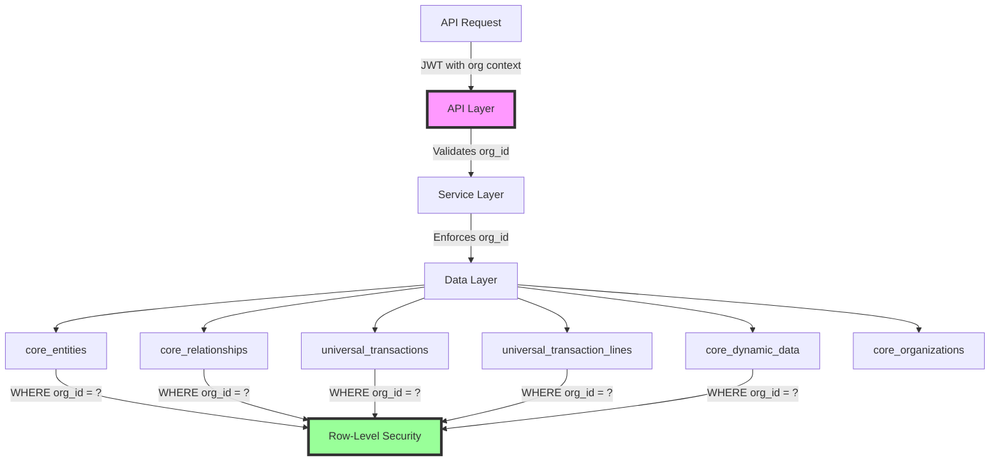

# Playbook Security & Multi-Tenancy

This document defines the security model and multi-tenant architecture for the HERA Playbook system. All security is enforced at multiple layers to ensure complete data isolation and access control.

## 1. Multi-Tenancy Architecture

### 1.1 Organization Isolation

Every table in HERA includes `organization_id` as a sacred field:



### 1.2 JWT Token Structure

```typescript
interface PlaybookJWTClaims {
  // Standard claims
  sub: string;           // User ID
  iat: number;           // Issued at
  exp: number;           // Expiration
  
  // HERA claims
  organization_id: string;    // Sacred boundary
  entity_id: string;          // User as entity
  roles: string[];            // User roles
  permissions: string[];      // Granted permissions
  
  // Playbook claims
  playbook_permissions?: {
    can_create: boolean;
    can_execute: boolean;
    can_approve: boolean;
    max_cost_per_run?: number;
  };
}
```

### 1.3 Organization Context Enforcement

```typescript
// Middleware to enforce organization context
export async function enforceOrganizationContext(
  request: Request,
  context: { organizationId: string }
): Promise<void> {
  const requestOrgId = request.body?.organization_id || 
                      request.query?.organization_id ||
                      request.params?.organization_id;
  
  if (requestOrgId && requestOrgId !== context.organizationId) {
    throw new SecurityError(
      'ORGANIZATION_MISMATCH',
      'Request organization does not match token context'
    );
  }
  
  // Inject organization_id into all queries
  request.organizationId = context.organizationId;
}
```

## 2. Row-Level Security (RLS)

### 2.1 Database Policies

All HERA tables have RLS policies that enforce organization isolation:

```sql
-- Example: Playbook definitions RLS
CREATE POLICY playbook_definitions_isolation ON core_entities
  FOR ALL
  USING (
    organization_id = current_setting('app.current_org')::uuid
    AND entity_type = 'playbook_definition'
  );

-- Example: Playbook runs RLS
CREATE POLICY playbook_runs_isolation ON universal_transactions
  FOR ALL
  USING (
    organization_id = current_setting('app.current_org')::uuid
    AND transaction_type = 'playbook_run'
  );

-- Function to set organization context
CREATE OR REPLACE FUNCTION set_organization_context(org_id uuid)
RETURNS void AS $$
BEGIN
  PERFORM set_config('app.current_org', org_id::text, true);
END;
$$ LANGUAGE plpgsql SECURITY DEFINER;
```

### 2.2 API Layer Enforcement

```typescript
export class SecurePlaybookAPI {
  private async executeQuery<T>(
    queryFn: () => Promise<T>,
    organizationId: string
  ): Promise<T> {
    // Set organization context for RLS
    await db.query('SELECT set_organization_context($1)', [organizationId]);
    
    try {
      // Execute query with RLS active
      return await queryFn();
    } finally {
      // Clear context
      await db.query('SELECT set_organization_context(NULL)');
    }
  }
  
  async getPlaybook(
    playbookId: string,
    organizationId: string
  ): Promise<PlaybookEntity> {
    return this.executeQuery(async () => {
      const result = await db.query(
        `SELECT * FROM core_entities 
         WHERE id = $1 
         AND organization_id = $2
         AND entity_type = 'playbook_definition'`,
        [playbookId, organizationId]
      );
      
      if (!result.rows[0]) {
        throw new NotFoundError('Playbook not found');
      }
      
      return result.rows[0];
    }, organizationId);
  }
}
```

## 3. Permission System

### 3.1 Permission Model

```typescript
// Permission structure
interface Permission {
  resource: string;      // e.g., 'playbook', 'playbook_run'
  action: string;        // e.g., 'create', 'read', 'update', 'execute'
  constraints?: {        // Optional constraints
    own_only?: boolean;  // Can only access own resources
    max_cost?: number;   // Maximum cost allowed
    allowed_types?: string[];  // Specific types allowed
  };
}

// Example permissions
const PLAYBOOK_PERMISSIONS = {
  // Playbook definition permissions
  'playbook:create': 'Can create playbook definitions',
  'playbook:read': 'Can view playbook definitions',
  'playbook:update': 'Can update playbook definitions',
  'playbook:delete': 'Can delete playbook definitions',
  'playbook:publish': 'Can publish playbooks',
  'playbook:archive': 'Can archive playbooks',
  
  // Playbook execution permissions
  'playbook_run:create': 'Can start playbook runs',
  'playbook_run:read': 'Can view playbook runs',
  'playbook_run:cancel': 'Can cancel playbook runs',
  'playbook_run:approve': 'Can approve human tasks',
  
  // Step permissions
  'playbook_step:complete': 'Can complete manual steps',
  'playbook_step:skip': 'Can skip optional steps',
  'playbook_step:retry': 'Can retry failed steps',
  
  // Administrative permissions
  'playbook:admin': 'Full playbook administration',
  'playbook:audit': 'Can view all audit logs'
};
```

### 3.2 Permission Checking

```typescript
export class PermissionService {
  async checkPermission(
    userId: string,
    permission: string,
    context?: Record<string, any>
  ): Promise<boolean> {
    // Get user's permissions from token or database
    const userPermissions = await this.getUserPermissions(userId);
    
    // Check direct permission
    if (userPermissions.includes(permission)) {
      return true;
    }
    
    // Check wildcard permissions
    const [resource, action] = permission.split(':');
    if (userPermissions.includes(`${resource}:*`)) {
      return true;
    }
    
    // Check admin permission
    if (userPermissions.includes('playbook:admin')) {
      return true;
    }
    
    return false;
  }
  
  async enforceStepPermissions(
    step: StepExecutionLine,
    userId: string
  ): Promise<void> {
    const requiredPermissions = step.metadata?.permissions_required || [];
    
    for (const permission of requiredPermissions) {
      const hasPermission = await this.checkPermission(
        userId,
        permission,
        { stepId: step.id }
      );
      
      if (!hasPermission) {
        throw new ForbiddenError(
          `Missing required permission: ${permission}`
        );
      }
    }
  }
}
```

### 3.3 Step-Level Permission Enforcement

```typescript
// In step execution
async function executeStep(
  step: StepExecutionLine,
  userId: string
): Promise<void> {
  // Check step permissions
  const permissionService = new PermissionService();
  await permissionService.enforceStepPermissions(step, userId);
  
  // Check worker type specific permissions
  switch (step.metadata.worker_type) {
    case 'human':
      await permissionService.checkPermission(
        userId,
        'playbook_step:complete'
      );
      break;
      
    case 'system':
      await permissionService.checkPermission(
        userId,
        'playbook:execute_system'
      );
      break;
      
    case 'ai':
      await permissionService.checkPermission(
        userId,
        'playbook:execute_ai'
      );
      break;
  }
  
  // Execute step...
}
```

## 4. Idempotency Implementation

### 4.1 Idempotency Key Management

```typescript
interface IdempotencyRecord {
  key: string;
  organization_id: string;
  endpoint: string;
  request_hash: string;
  response: any;
  status_code: number;
  created_at: Date;
  expires_at: Date;
}

export class IdempotencyService {
  private readonly DEFAULT_TTL = 24 * 60 * 60 * 1000; // 24 hours
  
  async processIdempotentRequest(
    key: string,
    organizationId: string,
    endpoint: string,
    request: any,
    handler: () => Promise<any>
  ): Promise<{ response: any; cached: boolean }> {
    // Generate request hash
    const requestHash = this.hashRequest(request);
    
    // Check for existing record
    const existing = await this.findIdempotencyRecord(
      key,
      organizationId,
      endpoint
    );
    
    if (existing) {
      // Validate request hasn't changed
      if (existing.request_hash !== requestHash) {
        throw new ConflictError(
          'Idempotency key used with different request'
        );
      }
      
      // Return cached response
      return {
        response: existing.response,
        cached: true
      };
    }
    
    // Execute request
    try {
      const response = await handler();
      
      // Store idempotency record
      await this.storeIdempotencyRecord({
        key,
        organization_id: organizationId,
        endpoint,
        request_hash: requestHash,
        response,
        status_code: 200,
        created_at: new Date(),
        expires_at: new Date(Date.now() + this.DEFAULT_TTL)
      });
      
      return { response, cached: false };
    } catch (error) {
      // Store error response for idempotency
      await this.storeIdempotencyRecord({
        key,
        organization_id: organizationId,
        endpoint,
        request_hash: requestHash,
        response: { error: error.message },
        status_code: error.statusCode || 500,
        created_at: new Date(),
        expires_at: new Date(Date.now() + this.DEFAULT_TTL)
      });
      
      throw error;
    }
  }
  
  private async findIdempotencyRecord(
    key: string,
    organizationId: string,
    endpoint: string
  ): Promise<IdempotencyRecord | null> {
    // Query from core_dynamic_data
    const result = await universalApi.queryDynamicData({
      entity_type: 'idempotency_record',
      field_name: 'idempotency_key',
      field_value_text: key,
      organization_id: organizationId,
      metadata: { endpoint }
    });
    
    if (!result.length) return null;
    
    const record = result[0];
    
    // Check expiration
    if (new Date(record.metadata.expires_at) < new Date()) {
      return null;
    }
    
    return {
      key,
      organization_id: organizationId,
      endpoint,
      request_hash: record.metadata.request_hash,
      response: record.metadata.response,
      status_code: record.metadata.status_code,
      created_at: new Date(record.created_at),
      expires_at: new Date(record.metadata.expires_at)
    };
  }
  
  private async storeIdempotencyRecord(
    record: IdempotencyRecord
  ): Promise<void> {
    // Store in core_dynamic_data
    await universalApi.setDynamicField(
      'idempotency_record',
      'idempotency_key',
      record.key,
      {
        organization_id: record.organization_id,
        metadata: {
          endpoint: record.endpoint,
          request_hash: record.request_hash,
          response: record.response,
          status_code: record.status_code,
          expires_at: record.expires_at.toISOString()
        }
      }
    );
  }
  
  private hashRequest(request: any): string {
    const crypto = require('crypto');
    const normalized = JSON.stringify(request, Object.keys(request).sort());
    return crypto.createHash('sha256').update(normalized).digest('hex');
  }
}
```

### 4.2 API Middleware

```typescript
export function idempotencyMiddleware(
  idempotencyService: IdempotencyService
): Middleware {
  return async (req: Request, res: Response, next: NextFunction) => {
    const idempotencyKey = req.headers['idempotency-key'] as string;
    
    if (!idempotencyKey) {
      return next(); // No idempotency requested
    }
    
    try {
      const { response, cached } = await idempotencyService.processIdempotentRequest(
        idempotencyKey,
        req.organizationId,
        req.path,
        req.body,
        () => next() // Execute the actual handler
      );
      
      // Set cache header if response was cached
      if (cached) {
        res.setHeader('X-Idempotent-Replay', 'true');
      }
      
      return res.json(response);
    } catch (error) {
      next(error);
    }
  };
}
```

## 5. Secure API Implementation

### 5.1 Complete Security Middleware Stack

```typescript
export function createSecurePlaybookAPI(app: Express) {
  // 1. Authentication
  app.use(authenticateJWT());
  
  // 2. Organization context
  app.use(extractOrganizationContext());
  
  // 3. Rate limiting per organization
  app.use(organizationRateLimiter({
    windowMs: 60 * 1000, // 1 minute
    max: 100 // 100 requests per minute per org
  }));
  
  // 4. Idempotency
  const idempotencyService = new IdempotencyService();
  app.use(idempotencyMiddleware(idempotencyService));
  
  // 5. Request validation
  app.use(validateRequestSchema());
  
  // 6. Audit logging
  app.use(auditLogger());
  
  // Define routes with permission checks
  app.post('/playbooks', 
    requirePermission('playbook:create'),
    createPlaybookHandler
  );
  
  app.post('/playbook-runs',
    requirePermission('playbook_run:create'),
    validateRunBudget(),
    startPlaybookRunHandler
  );
  
  app.post('/playbook-runs/:runId/steps/:sequence/complete',
    requirePermission('playbook_step:complete'),
    validateStepOwnership(),
    completeStepHandler
  );
}
```

### 5.2 Secure Query Builder

```typescript
export class SecureQueryBuilder {
  constructor(
    private organizationId: string,
    private userId: string,
    private permissions: string[]
  ) {}
  
  buildPlaybookQuery(filters?: any): QueryConfig {
    const query = {
      table: 'core_entities',
      where: {
        organization_id: this.organizationId,
        entity_type: 'playbook_definition',
        ...filters
      },
      select: ['*']
    };
    
    // Apply permission-based filters
    if (!this.permissions.includes('playbook:read_all')) {
      // Only show published playbooks to non-admins
      query.where['metadata->status'] = 'published';
    }
    
    return query;
  }
  
  buildRunQuery(filters?: any): QueryConfig {
    const query = {
      table: 'universal_transactions',
      where: {
        organization_id: this.organizationId,
        transaction_type: 'playbook_run',
        ...filters
      },
      select: ['*']
    };
    
    // Apply permission-based filters
    if (!this.permissions.includes('playbook_run:read_all')) {
      // Only show own runs
      query.where['metadata->created_by'] = this.userId;
    }
    
    return query;
  }
}
```

## 6. Security Best Practices

### 6.1 Input Validation

```typescript
const createPlaybookSchema = z.object({
  organization_id: z.string().uuid(),
  industry: z.string().regex(/^[A-Z]+$/),
  module: z.string().regex(/^[A-Z]+$/),
  name: z.string().regex(/^[A-Z_]+$/),
  version: z.string().regex(/^V\d+$/),
  inputs: z.record(z.any()),
  outputs: z.record(z.any()),
  steps: z.array(z.object({
    name: z.string(),
    sequence: z.number().int().positive(),
    worker_type: z.enum(['human', 'ai', 'system', 'external']),
    permissions_required: z.array(z.string()).optional()
  }))
});

export function validateCreatePlaybook(data: any): CreatePlaybookRequest {
  return createPlaybookSchema.parse(data);
}
```

### 6.2 Output Sanitization

```typescript
export function sanitizePlaybookResponse(
  playbook: PlaybookEntity,
  permissions: string[]
): any {
  const sanitized = {
    id: playbook.id,
    name: playbook.entity_name,
    status: playbook.metadata.status,
    created_at: playbook.created_at,
    version: playbook.metadata.version
  };
  
  // Include sensitive fields based on permissions
  if (permissions.includes('playbook:read_sensitive')) {
    sanitized.owner = playbook.metadata.owner;
    sanitized.cost_estimate = playbook.metadata.cost_estimate;
  }
  
  if (permissions.includes('playbook:read_internal')) {
    sanitized.internal_notes = playbook.metadata.internal_notes;
  }
  
  return sanitized;
}
```

### 6.3 Audit Trail

```typescript
export async function createSecurityAuditLog(
  action: string,
  userId: string,
  organizationId: string,
  resourceId: string,
  details: any
): Promise<void> {
  await universalApi.createTransaction({
    transaction_type: 'security_audit',
    smart_code: 'HERA.SECURITY.AUDIT.PLAYBOOK.V1',
    organization_id: organizationId,
    from_entity_id: userId,
    reference_entity_id: resourceId,
    metadata: {
      action,
      details,
      ip_address: details.ip_address,
      user_agent: details.user_agent,
      timestamp: new Date().toISOString(),
      success: details.success
    }
  });
}
```

## 7. Example: Complete Secure Request Flow

```typescript
// POST /playbook-runs with full security
async function handleCreatePlaybookRun(req: Request, res: Response) {
  const startTime = Date.now();
  const idempotencyKey = req.headers['idempotency-key'] as string;
  
  try {
    // 1. Extract JWT claims
    const claims = req.user as PlaybookJWTClaims;
    
    // 2. Validate request
    const validated = validateStartRun(req.body);
    
    // 3. Check organization match
    if (validated.organization_id !== claims.organization_id) {
      throw new ForbiddenError('Organization mismatch');
    }
    
    // 4. Check permissions
    const hasPermission = await permissionService.checkPermission(
      claims.sub,
      'playbook_run:create'
    );
    
    if (!hasPermission) {
      throw new ForbiddenError('Insufficient permissions');
    }
    
    // 5. Check cost budget
    const playbook = await getPlaybook(
      validated.playbook_id,
      claims.organization_id
    );
    
    const estimatedCost = playbook.metadata.cost_estimate || 0;
    if (estimatedCost > (claims.playbook_permissions?.max_cost_per_run || Infinity)) {
      throw new ForbiddenError('Exceeds cost limit');
    }
    
    // 6. Process with idempotency
    const result = await idempotencyService.processIdempotentRequest(
      idempotencyKey,
      claims.organization_id,
      '/playbook-runs',
      validated,
      async () => {
        // Create run with RLS active
        return await secureAPI.createPlaybookRun(
          validated,
          claims.organization_id,
          claims.sub
        );
      }
    );
    
    // 7. Audit log
    await createSecurityAuditLog(
      'playbook_run.create',
      claims.sub,
      claims.organization_id,
      result.response.id,
      {
        playbook_id: validated.playbook_id,
        estimated_cost: estimatedCost,
        ip_address: req.ip,
        user_agent: req.headers['user-agent'],
        success: true,
        latency_ms: Date.now() - startTime
      }
    );
    
    // 8. Return sanitized response
    res.status(201).json({
      id: result.response.id,
      status: result.response.status,
      created_at: result.response.created_at,
      _links: {
        self: `/playbook-runs/${result.response.id}`,
        playbook: `/playbooks/${validated.playbook_id}`
      }
    });
    
  } catch (error) {
    // Audit failure
    await createSecurityAuditLog(
      'playbook_run.create',
      req.user?.sub || 'anonymous',
      req.body.organization_id,
      null,
      {
        error: error.message,
        ip_address: req.ip,
        user_agent: req.headers['user-agent'],
        success: false,
        latency_ms: Date.now() - startTime
      }
    );
    
    throw error;
  }
}
```

## 8. Security Checklist

### 8.1 API Security
- ✅ JWT authentication required on all endpoints
- ✅ Organization context validated on every request
- ✅ Permissions checked before operations
- ✅ Rate limiting per organization
- ✅ Input validation with strict schemas
- ✅ Output sanitization based on permissions

### 8.2 Database Security
- ✅ RLS policies on all tables
- ✅ Organization ID included in all queries
- ✅ No direct database access from API
- ✅ Prepared statements to prevent SQL injection
- ✅ Sensitive data encrypted at rest

### 8.3 Operational Security
- ✅ All actions logged to audit trail
- ✅ Idempotency for critical operations
- ✅ Error messages don't leak sensitive data
- ✅ Security headers (CORS, CSP, etc.)
- ✅ TLS required for all connections

## 9. Benefits of This Security Model

1. **Perfect Isolation**: Organizations can never access each other's data
2. **Defense in Depth**: Multiple layers of security checks
3. **Audit Compliance**: Complete trail of all operations
4. **Idempotent Operations**: Safe retries without duplicates
5. **Performance**: RLS policies optimized with proper indexes
6. **Flexibility**: Permission model extensible via smart codes
7. **Zero Trust**: Every operation validated and authenticated
8. **Cost Control**: Budget limits enforced at API layer
9. **Compliance Ready**: GDPR/SOC2/HIPAA compatible design
10. **No Custom Tables**: Security using only HERA's 6 sacred tables