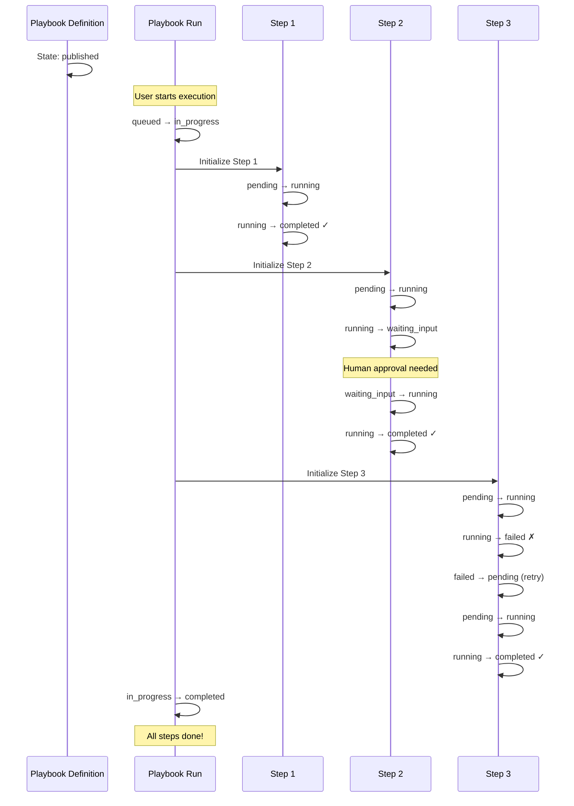

# Playbook State Machine Diagrams

Visual representations of the three state machines in the HERA Playbook system.

## 1. Playbook Definition State Machine

```mermaid
stateDiagram-v2
    [*] --> draft: Create New Playbook
    
    draft --> draft: Update/Edit
    draft --> published: Publish
    note right of published: Validation Required:\n- Schemas valid\n- Steps defined\n- Permissions set
    
    published --> archived: Archive
    note left of archived: Check:\n- No active runs\n- Or force archive
    
    published --> draft: Create New Version
    archived --> draft: Create New Version
    
    archived --> [*]: End of Life

    classDef draftState fill:#f9f,stroke:#333,stroke-width:2px
    classDef publishedState fill:#9f9,stroke:#333,stroke-width:2px
    classDef archivedState fill:#999,stroke:#333,stroke-width:2px
    
    class draft draftState
    class published publishedState
    class archived archivedState
```

## 2. Playbook Run State Machine

```mermaid
stateDiagram-v2
    [*] --> queued: Start Run
    
    queued --> in_progress: Process
    note right of in_progress: Requirements:\n- Playbook published\n- Inputs valid\n- Resources available
    
    in_progress --> in_progress: Step Complete
    in_progress --> blocked: Step Blocked
    note right of blocked: Reasons:\n- Human input needed\n- External dependency\n- Approval required
    
    blocked --> in_progress: Unblock
    blocked --> failed: Timeout
    blocked --> cancelled: Cancel
    
    in_progress --> completed: All Steps Done
    note left of completed: Validate:\n- All steps complete\n- Output contract met
    
    in_progress --> failed: Fatal Error
    in_progress --> cancelled: Cancel Request
    
    completed --> [*]: Success
    failed --> [*]: Failure
    cancelled --> [*]: Cancelled

    classDef activeState fill:#9cf,stroke:#333,stroke-width:2px
    classDef blockedState fill:#fc9,stroke:#333,stroke-width:2px
    classDef successState fill:#9f9,stroke:#333,stroke-width:2px
    classDef errorState fill:#f99,stroke:#333,stroke-width:2px
    
    class queued,in_progress activeState
    class blocked blockedState
    class completed successState
    class failed,cancelled errorState
```

## 3. Step Execution State Machine

```mermaid
stateDiagram-v2
    [*] --> pending: Step Queued
    
    pending --> running: Start Execution
    note right of running: Check:\n- Previous steps done\n- Worker available\n- Within SLA
    
    pending --> skipped: Conditional Skip
    
    running --> waiting_input: Need Input
    note right of waiting_input: Types:\n- Human approval\n- External data\n- System callback
    
    waiting_input --> running: Input Provided
    waiting_input --> skipped: Timeout/Skip
    
    running --> completed: Success
    note left of completed: Validate:\n- Output contract\n- Side effects
    
    running --> failed: Error
    note left of failed: Actions:\n- Check retry policy\n- Record error
    
    running --> skipped: Dynamic Skip
    
    failed --> pending: Retry
    note right of pending: If:\n- Retries remaining\n- Error recoverable
    
    completed --> [*]: Done
    failed --> [*]: Max Retries
    skipped --> [*]: Skipped

    classDef pendingState fill:#ccf,stroke:#333,stroke-width:2px
    classDef runningState fill:#9cf,stroke:#333,stroke-width:2px
    classDef waitingState fill:#fc9,stroke:#333,stroke-width:2px
    classDef completedState fill:#9f9,stroke:#333,stroke-width:2px
    classDef failedState fill:#f99,stroke:#333,stroke-width:2px
    classDef skippedState fill:#ccc,stroke:#333,stroke-width:2px
    
    class pending pendingState
    class running runningState
    class waiting_input waitingState
    class completed completedState
    class failed failedState
    class skipped skippedState
```

## 4. State Transition Smart Codes

### Playbook Definition Transitions
```
HERA.PLAYBOOK.TRANSITION.PUBLISH.V1     draft → published
HERA.PLAYBOOK.TRANSITION.ARCHIVE.V1     published → archived
HERA.PLAYBOOK.TRANSITION.UPDATE.V1      draft → draft
HERA.PLAYBOOK.TRANSITION.VERSION.V1     published → draft (new version)
HERA.PLAYBOOK.TRANSITION.REVIVE.V1      archived → draft (new version)
```

### Run Transitions
```
HERA.PLAYBOOK.RUN.TRANSITION.START.V1      queued → in_progress
HERA.PLAYBOOK.RUN.TRANSITION.BLOCK.V1      in_progress → blocked
HERA.PLAYBOOK.RUN.TRANSITION.UNBLOCK.V1    blocked → in_progress
HERA.PLAYBOOK.RUN.TRANSITION.COMPLETE.V1   in_progress → completed
HERA.PLAYBOOK.RUN.TRANSITION.FAIL.V1       in_progress → failed
HERA.PLAYBOOK.RUN.TRANSITION.CANCEL.V1     * → cancelled
HERA.PLAYBOOK.RUN.TRANSITION.TIMEOUT.V1    blocked → failed
```

### Step Transitions
```
HERA.PLAYBOOK.STEP.TRANSITION.START.V1     pending → running
HERA.PLAYBOOK.STEP.TRANSITION.WAIT.V1      running → waiting_input
HERA.PLAYBOOK.STEP.TRANSITION.RESUME.V1    waiting_input → running
HERA.PLAYBOOK.STEP.TRANSITION.COMPLETE.V1  running → completed
HERA.PLAYBOOK.STEP.TRANSITION.FAIL.V1      running → failed
HERA.PLAYBOOK.STEP.TRANSITION.RETRY.V1     failed → pending
HERA.PLAYBOOK.STEP.TRANSITION.SKIP.V1      * → skipped
```

## 5. Concurrent State Example

A complete playbook execution showing all three state machines in action:



## 6. Audit Trail Example

Every state transition creates an audit record:

```json
{
  "transaction_type": "state_transition",
  "smart_code": "HERA.PLAYBOOK.RUN.TRANSITION.START.V1",
  "organization_id": "org_123",
  "reference_entity_id": "run_456",
  "from_entity_id": "user_789",
  "created_at": "2024-01-01T10:00:00Z",
  "metadata": {
    "entity_type": "run",
    "from_state": "queued",
    "to_state": "in_progress",
    "transition_reason": "Resources available, starting execution",
    "transition_data": {
      "worker_pool": "default",
      "priority": "normal",
      "input_validation": "passed"
    },
    "timestamp": "2024-01-01T10:00:00Z"
  }
}
```