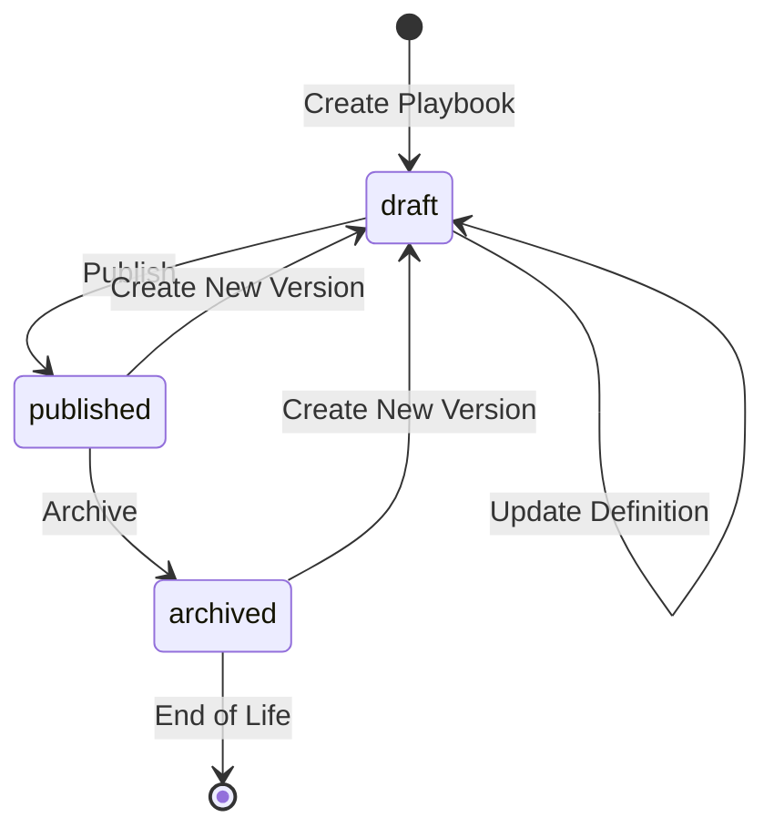
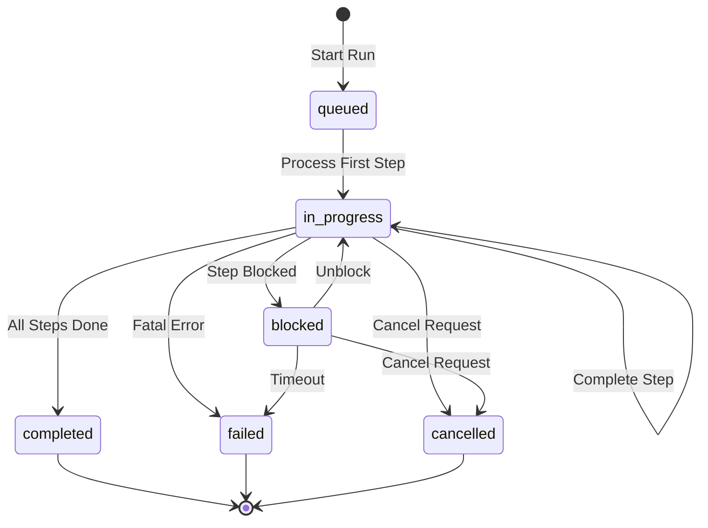
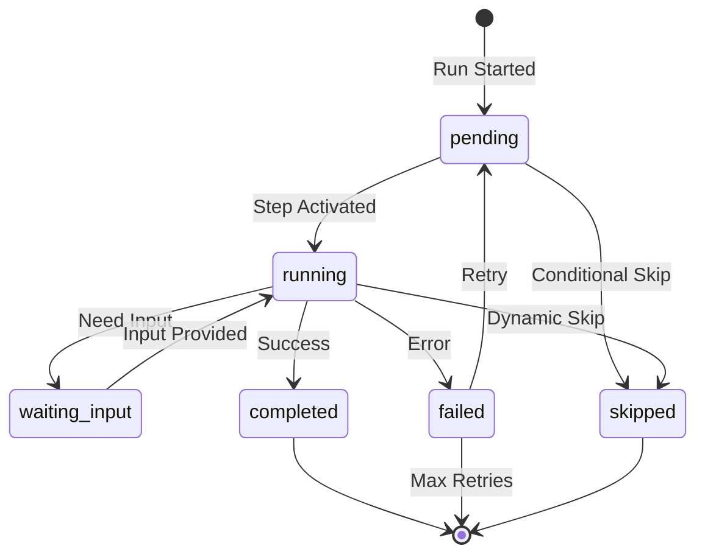

# Playbook State Machines

This document defines the state machines for the HERA Playbook system. All state transitions are enforced through smart code rules and recorded as transactions for complete audit trails.

## 1. Playbook Definition State Machine

### States


### State Definitions

| State | Description | Allowed Actions |
|-------|-------------|-----------------|
| **draft** | Playbook being designed/edited | Edit, Add/Remove Steps, Test, Publish |
| **published** | Active and available for execution | Execute, Create New Version, Archive |
| **archived** | No longer available for new runs | View History, Create New Version |

### Transition Rules

#### draft → published
- **Smart Code**: `HERA.PLAYBOOK.TRANSITION.PUBLISH.V1`
- **Validations**:
  - All required fields must be populated
  - Input/output schemas must be valid JSON Schema
  - At least one step must be defined
  - All steps must have valid contracts
  - No duplicate step sequences
- **Actions**:
  - Set `published_at` timestamp
  - Create relationship to previous version if exists
  - Notify subscribed users

#### published → archived
- **Smart Code**: `HERA.PLAYBOOK.TRANSITION.ARCHIVE.V1`
- **Validations**:
  - No active runs in progress
  - Or force archive with active run handling
- **Actions**:
  - Cancel or migrate active runs
  - Set `archived_at` timestamp
  - Remove from active playbook listings

### Implementation Pattern

```typescript
// State transition recorded as a transaction
{
  transaction_type: 'playbook_state_transition',
  smart_code: 'HERA.PLAYBOOK.TRANSITION.PUBLISH.V1',
  reference_entity_id: playbook_id,
  from_entity_id: current_user_id,
  metadata: {
    from_state: 'draft',
    to_state: 'published',
    transition_reason: 'Ready for production use',
    validation_results: {
      schema_valid: true,
      steps_valid: true,
      permissions_checked: true
    }
  }
}

// Update playbook entity metadata
{
  entity_id: playbook_id,
  metadata: {
    ...existing_metadata,
    status: 'published',
    published_at: '2024-01-01T10:00:00Z',
    published_by: user_entity_id
  }
}
```

## 2. Playbook Run State Machine

### States


### State Definitions

| State | Description | Allowed Actions |
|-------|-------------|-----------------|
| **queued** | Run created, waiting to start | Cancel, Update Priority |
| **in_progress** | Actively executing steps | Pause, Cancel, Signal |
| **blocked** | Waiting for external input/condition | Provide Input, Cancel, Force Continue |
| **completed** | All steps successfully completed | View Results, Generate Report |
| **failed** | Fatal error occurred | View Error, Retry, Create Incident |
| **cancelled** | Manually or system cancelled | View Reason, Analyze Partial Results |

### Transition Rules

#### queued → in_progress
- **Smart Code**: `HERA.PLAYBOOK.RUN.TRANSITION.START.V1`
- **Validations**:
  - Playbook is in published state
  - Required inputs provided
  - User has execution permissions
  - Resource capacity available
- **Actions**:
  - Set `started_at` timestamp
  - Initialize first step as pending
  - Send start notifications

#### in_progress → blocked
- **Smart Code**: `HERA.PLAYBOOK.RUN.TRANSITION.BLOCK.V1`
- **Triggers**:
  - Step requires human input
  - External dependency unavailable
  - Approval required
  - Resource constraint
- **Actions**:
  - Set `blocked_at` timestamp
  - Record blocking reason
  - Send escalation notifications
  - Start SLA timer

#### in_progress → completed
- **Smart Code**: `HERA.PLAYBOOK.RUN.TRANSITION.COMPLETE.V1`
- **Validations**:
  - All required steps completed
  - No pending error retries
  - Output contract satisfied
- **Actions**:
  - Set `completed_at` timestamp
  - Calculate total cost
  - Trigger downstream workflows
  - Archive execution data

#### in_progress → failed
- **Smart Code**: `HERA.PLAYBOOK.RUN.TRANSITION.FAIL.V1`
- **Triggers**:
  - Critical step failed after retries
  - Timeout exceeded
  - Unrecoverable error
  - Policy violation
- **Actions**:
  - Set `failed_at` timestamp
  - Record error details
  - Execute failure handlers
  - Send failure notifications

### Implementation Pattern

```typescript
// Run state transition as transaction
{
  transaction_type: 'run_state_transition',
  smart_code: 'HERA.PLAYBOOK.RUN.TRANSITION.START.V1',
  reference_entity_id: run_id,
  metadata: {
    from_state: 'queued',
    to_state: 'in_progress',
    triggered_by: 'scheduler',
    transition_data: {
      worker_pool: 'default',
      priority_boost: false
    }
  }
}

// Update run transaction status
UPDATE universal_transactions
SET status = 'in_progress',
    metadata = jsonb_set(metadata, '{started_at}', '"2024-01-01T10:00:00Z"')
WHERE id = run_id;
```

## 3. Step Execution State Machine

### States


### State Definitions

| State | Description | Allowed Actions |
|-------|-------------|-----------------|
| **pending** | Step queued for execution | Skip, Change Priority |
| **running** | Step actively executing | Monitor, Send Signal |
| **waiting_input** | Paused for human/external input | Provide Input, Timeout, Skip |
| **completed** | Step finished successfully | View Output, Validate |
| **failed** | Step encountered error | Retry, Skip, Investigate |
| **skipped** | Step bypassed by condition/manual | View Reason |

### Transition Rules

#### pending → running
- **Smart Code**: `HERA.PLAYBOOK.STEP.TRANSITION.START.V1`
- **Validations**:
  - Previous steps completed (unless parallel)
  - Required inputs available
  - Worker available
  - Within SLA window
- **Actions**:
  - Assign to worker
  - Set `started_at` timestamp
  - Lock required resources
  - Start execution timer

#### running → waiting_input
- **Smart Code**: `HERA.PLAYBOOK.STEP.TRANSITION.WAIT.V1`
- **Triggers**:
  - Human approval required
  - External system callback needed
  - Missing required data
- **Actions**:
  - Create input request
  - Notify assigned user
  - Pause execution timer
  - Set due date

#### running → completed
- **Smart Code**: `HERA.PLAYBOOK.STEP.TRANSITION.COMPLETE.V1`
- **Validations**:
  - Output contract satisfied
  - No validation errors
  - Side effects confirmed
- **Actions**:
  - Record outputs
  - Calculate cost
  - Update run progress
  - Trigger next steps

#### running → failed
- **Smart Code**: `HERA.PLAYBOOK.STEP.TRANSITION.FAIL.V1`
- **Triggers**:
  - Exception/error thrown
  - Timeout exceeded
  - Validation failed
  - External system error
- **Actions**:
  - Record error details
  - Check retry policy
  - Send error notifications
  - Update attempt counter

### Implementation Pattern

```typescript
// Step state transition as line metadata update
{
  line_id: step_execution_line_id,
  metadata: {
    ...existing_metadata,
    status: 'running',
    state_history: [
      ...existing_history,
      {
        from_state: 'pending',
        to_state: 'running',
        transitioned_at: '2024-01-01T10:00:00Z',
        smart_code: 'HERA.PLAYBOOK.STEP.TRANSITION.START.V1',
        triggered_by: 'scheduler',
        worker_assigned: 'worker_123'
      }
    ]
  }
}

// Audit trail transaction
{
  transaction_type: 'step_state_transition',
  smart_code: 'HERA.PLAYBOOK.STEP.TRANSITION.START.V1',
  reference_entity_id: step_execution_line_id,
  from_entity_id: worker_entity_id,
  metadata: {
    run_id: playbook_run_id,
    step_sequence: 1,
    from_state: 'pending',
    to_state: 'running',
    transition_context: {
      attempt_number: 1,
      assigned_worker: 'worker_123',
      estimated_duration_ms: 5000
    }
  }
}
```

## 4. State Transition Matrix

### Playbook Definition States

| From State | To State | Smart Code | Condition |
|------------|----------|------------|-----------|
| draft | published | HERA.PLAYBOOK.TRANSITION.PUBLISH.V1 | Validation passed |
| published | archived | HERA.PLAYBOOK.TRANSITION.ARCHIVE.V1 | No active runs |
| draft | draft | HERA.PLAYBOOK.TRANSITION.UPDATE.V1 | Edit in progress |
| published | draft | HERA.PLAYBOOK.TRANSITION.VERSION.V1 | New version created |
| archived | draft | HERA.PLAYBOOK.TRANSITION.REVIVE.V1 | New version from archive |

### Run States

| From State | To State | Smart Code | Condition |
|------------|----------|------------|-----------|
| queued | in_progress | HERA.PLAYBOOK.RUN.TRANSITION.START.V1 | Resources available |
| in_progress | blocked | HERA.PLAYBOOK.RUN.TRANSITION.BLOCK.V1 | Blocking condition |
| blocked | in_progress | HERA.PLAYBOOK.RUN.TRANSITION.UNBLOCK.V1 | Condition resolved |
| in_progress | completed | HERA.PLAYBOOK.RUN.TRANSITION.COMPLETE.V1 | All steps done |
| in_progress | failed | HERA.PLAYBOOK.RUN.TRANSITION.FAIL.V1 | Fatal error |
| in_progress | cancelled | HERA.PLAYBOOK.RUN.TRANSITION.CANCEL.V1 | Manual cancel |
| blocked | cancelled | HERA.PLAYBOOK.RUN.TRANSITION.CANCEL.V1 | Cancel while blocked |
| blocked | failed | HERA.PLAYBOOK.RUN.TRANSITION.TIMEOUT.V1 | Timeout exceeded |

### Step States

| From State | To State | Smart Code | Condition |
|------------|----------|------------|-----------|
| pending | running | HERA.PLAYBOOK.STEP.TRANSITION.START.V1 | Worker assigned |
| running | waiting_input | HERA.PLAYBOOK.STEP.TRANSITION.WAIT.V1 | Input required |
| waiting_input | running | HERA.PLAYBOOK.STEP.TRANSITION.RESUME.V1 | Input provided |
| running | completed | HERA.PLAYBOOK.STEP.TRANSITION.COMPLETE.V1 | Success |
| running | failed | HERA.PLAYBOOK.STEP.TRANSITION.FAIL.V1 | Error occurred |
| failed | pending | HERA.PLAYBOOK.STEP.TRANSITION.RETRY.V1 | Retry allowed |
| pending | skipped | HERA.PLAYBOOK.STEP.TRANSITION.SKIP.V1 | Condition not met |
| running | skipped | HERA.PLAYBOOK.STEP.TRANSITION.SKIP.V1 | Dynamic skip |

## 5. Audit Trail Pattern

Every state transition creates an immutable audit record:

```typescript
// Generic state transition audit record
interface StateTransitionAudit {
  transaction_type: 'state_transition';
  smart_code: string; // Specific transition smart code
  organization_id: string;
  reference_entity_id: string; // Entity transitioning
  from_entity_id: string; // User/system initiating
  metadata: {
    entity_type: 'playbook' | 'run' | 'step';
    from_state: string;
    to_state: string;
    transition_reason?: string;
    transition_data?: Record<string, any>;
    validation_results?: Record<string, boolean>;
    error_details?: Record<string, any>;
    timestamp: string;
    ai_confidence?: number;
    ai_insights?: string;
  };
}

// Query audit trail
SELECT 
  t.created_at,
  t.smart_code,
  t.metadata->>'from_state' as from_state,
  t.metadata->>'to_state' as to_state,
  t.metadata->>'transition_reason' as reason,
  u.entity_name as initiated_by
FROM universal_transactions t
LEFT JOIN core_entities u ON u.id = t.from_entity_id
WHERE t.transaction_type = 'state_transition'
  AND t.reference_entity_id = $1
  AND t.organization_id = $2
ORDER BY t.created_at DESC;
```

## 6. State Machine Implementation Service

```typescript
export class PlaybookStateMachine {
  // Validate state transition
  async canTransition(
    entityType: 'playbook' | 'run' | 'step',
    fromState: string,
    toState: string,
    context: Record<string, any>
  ): Promise<{ allowed: boolean; reason?: string }> {
    const transitionKey = `${fromState}->${toState}`;
    const rules = this.getTransitionRules(entityType, transitionKey);
    
    if (!rules) {
      return { allowed: false, reason: 'Invalid transition' };
    }
    
    // Execute validation rules
    for (const rule of rules.validations) {
      const result = await rule(context);
      if (!result.valid) {
        return { allowed: false, reason: result.reason };
      }
    }
    
    return { allowed: true };
  }
  
  // Execute state transition with audit
  async transition(
    entityType: 'playbook' | 'run' | 'step',
    entityId: string,
    toState: string,
    context: {
      organizationId: string;
      userId: string;
      reason?: string;
      data?: Record<string, any>;
    }
  ): Promise<void> {
    const currentState = await this.getCurrentState(entityType, entityId);
    
    // Validate transition
    const canTransition = await this.canTransition(
      entityType,
      currentState,
      toState,
      context
    );
    
    if (!canTransition.allowed) {
      throw new Error(`State transition not allowed: ${canTransition.reason}`);
    }
    
    // Create audit transaction
    const smartCode = this.getTransitionSmartCode(
      entityType,
      currentState,
      toState
    );
    
    await universalApi.createTransaction({
      transaction_type: 'state_transition',
      smart_code: smartCode,
      organization_id: context.organizationId,
      reference_entity_id: entityId,
      from_entity_id: context.userId,
      metadata: {
        entity_type: entityType,
        from_state: currentState,
        to_state: toState,
        transition_reason: context.reason,
        transition_data: context.data,
        timestamp: new Date().toISOString()
      }
    });
    
    // Update entity state
    await this.updateEntityState(entityType, entityId, toState);
    
    // Execute post-transition actions
    await this.executePostTransitionActions(
      entityType,
      entityId,
      currentState,
      toState,
      context
    );
  }
}
```

## 7. Benefits of State Machine Approach

1. **Predictable Behavior**: Clear rules for all state transitions
2. **Complete Audit Trail**: Every transition recorded as transaction
3. **Business Rule Enforcement**: Smart codes enforce valid transitions
4. **Error Recovery**: Clear paths for handling failures and retries
5. **Observability**: Easy to track current state and history
6. **Extensibility**: New states/transitions via smart codes without schema changes
7. **Multi-tenant Safety**: State transitions respect organization boundaries
8. **AI Integration**: State changes can trigger AI analysis and insights