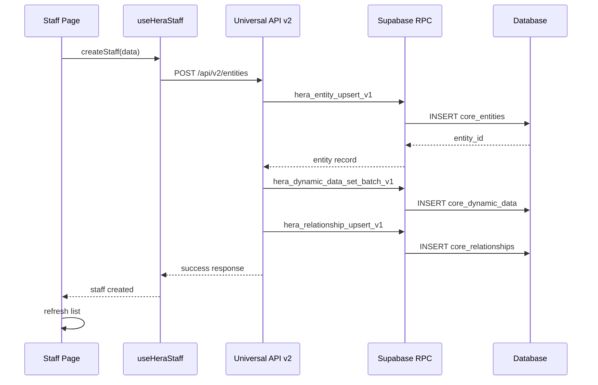

# HERA Salon Staff Management

## Overview

The HERA Salon Staff Management system provides enterprise-grade staff management using Universal Entity v2 architecture with RPC-first approach. It follows HERA DNA standards with complete multi-tenant isolation and role-based access control.

## Architecture

### Universal Entity v2 Integration
- **Staff Entity**: `entity_type = 'STAFF'`
- **Role Entity**: `entity_type = 'ROLE'`
- **Dynamic Fields**: All staff data stored in `core_dynamic_data`
- **Relationships**: Staff-Role associations via `core_relationships`
- **Smart Codes**: All operations tagged with HERA DNA smart codes

### RPC-First Approach
All database operations use standardized RPC functions:
- `hera_entity_upsert_v1` - Create/update entities
- `hera_dynamic_data_set_batch_v1` - Set dynamic fields
- `hera_entities_list_v1` - List entities with filters
- `hera_relationship_upsert_v1` - Create relationships
- `hera_entity_delete_v1` - Hard delete (rare)

## Smart Codes

### Staff Entity
- **Main Entity**: `HERA.SALON.STAFF.ENTITY.PERSON.V1`

### Dynamic Fields
- `HERA.SALON.STAFF.DYN.FIRST_NAME.V1` - First name (required)
- `HERA.SALON.STAFF.DYN.LAST_NAME.V1` - Last name (required)
- `HERA.SALON.STAFF.DYN.EMAIL.V1` - Email address (required)
- `HERA.SALON.STAFF.DYN.PHONE.V1` - Phone number
- `HERA.SALON.STAFF.DYN.ROLE_TITLE.V1` - Denormalized role title
- `HERA.SALON.STAFF.DYN.STATUS.V1` - Status (active/inactive/on_leave)
- `HERA.SALON.STAFF.DYN.HIRE_DATE.V1` - Hire date
- `HERA.SALON.STAFF.DYN.HOURLY_COST.V1` - Internal cost (restricted)
- `HERA.SALON.STAFF.DYN.DISPLAY_RATE.V1` - Customer-facing rate
- `HERA.SALON.STAFF.DYN.SKILLS.V1` - Skills array
- `HERA.SALON.STAFF.DYN.BIO.V1` - Professional biography
- `HERA.SALON.STAFF.DYN.AVATAR_URL.V1` - Profile picture URL

### Relationships
- `HERA.SALON.STAFF.REL.HAS_ROLE.V1` - Staff → Role (1:1)
- `HERA.SALON.STAFF.REL.CAN_SERVICE.V1` - Staff → Service (M:N)
- `HERA.SALON.STAFF.REL.MEMBER_OF.V1` - Staff → Location (1:1)
- `HERA.SALON.STAFF.REL.REPORTS_TO.V1` - Staff → Staff (optional)

### Role Entity
- **Main Entity**: `HERA.SALON.ROLE.ENTITY.POSITION.V1`
- **Dynamic Fields**:
  - `HERA.SALON.ROLE.DYN.TITLE.V1` - Role title
  - `HERA.SALON.ROLE.DYN.DESCRIPTION.V1` - Role description
  - `HERA.SALON.ROLE.DYN.PERMISSIONS.V1` - Permissions array
  - `HERA.SALON.ROLE.DYN.RANK.V1` - Seniority rank
  - `HERA.SALON.ROLE.DYN.ACTIVE.V1` - Active status

## Data Flow

```mermaid
classDiagram
    class Staff {
        +string id
        +string entity_name
        +string smart_code
        +DynamicFields dynamic_fields
        +Relationships relationships
    }
    
    class Role {
        +string id
        +string entity_name
        +string title
        +string[] permissions
        +number rank
    }
    
    class Service {
        +string id
        +string entity_name
        +number price
        +number duration
    }
    
    class Location {
        +string id
        +string entity_name
        +string address
    }
    
    Staff ||--|| Role : STAFF_HAS_ROLE
    Staff ||--o{ Service : STAFF_CAN_SERVICE
    Staff ||--o| Location : STAFF_MEMBER_OF
    Staff ||--o| Staff : STAFF_REPORTS_TO
```

## CRUD Operations

### Create Staff
```typescript
const staffData = {
  first_name: "Maya",
  last_name: "Pereira", 
  email: "maya@salon.com",
  phone: "+971 50 123 4567",
  role_id: "role-uuid",
  role_title: "Senior Stylist",
  status: "active",
  hire_date: "2024-01-15",
  display_rate: 180,
  skills: ["Hair Cutting", "Hair Coloring"],
  bio: "Professional stylist with 5+ years experience"
}

const result = await createStaff(staffData)
```

### Update Staff
```typescript
const updateData = {
  status: "on_leave",
  display_rate: 200,
  skills: [...existingSkills, "Balayage"]
}

const result = await updateStaff(staffId, updateData)
```

### Archive Staff (Soft Delete)
```typescript
await archiveStaff(staffId)
// Sets status to 'archived' via dynamic fields
```

### Hard Delete (Owner/Manager Only)
```typescript
await deleteStaff(staffId, true)
// Unlinks all relationships then deletes
```

## Sequence Diagram



## Permission System

### Role-Based Access
- **Owner**: Full access to all features including hourly costs
- **Manager**: Can manage staff, view costs, assign roles
- **Receptionist**: Can view staff, limited editing
- **Staff**: Read-only access to basic info

### Field-Level Security
- `hourly_cost`: Only visible to Owner/Manager
- Personal info: All roles can view
- Skills/Bio: All roles can view
- Employment dates: All roles can view

## File Structure

```
src/
├── hooks/
│   ├── entityPresets.ts         # ROLE_PRESET & STAFF_PRESET
│   ├── useHeraStaff.ts         # Staff management hook
│   └── useHeraRoles.ts         # Role management hook
├── app/salon/staff1/
│   └── page.tsx                # Main staff page
├── components/salon/
│   └── StaffForm.tsx           # Staff create/edit form
└── api/v2/entities/
    ├── route.ts                # Universal CRUD API
    └── [id]/route.ts           # Individual entity ops

scripts/seed/
└── salon-staff.ts              # Seed script for roles & staff

docs/
└── salon-staff.md              # This documentation
```

## Usage Examples

### Initialize Hooks
```typescript
// In your component
const {
  staff,
  isLoading,
  createStaff,
  updateStaff,
  archiveStaff,
  deleteStaff,
  filterSensitiveFields
} = useHeraStaff({
  filters: {
    include_dynamic: true,
    include_relationships: true,
    status: 'active'
  }
})

const { roles, getActiveRoles } = useHeraRoles()
```

### Create New Staff Member
```typescript
const handleCreateStaff = async (formData) => {
  try {
    await createStaff({
      first_name: formData.first_name,
      last_name: formData.last_name,
      email: formData.email,
      phone: formData.phone,
      role_id: formData.role_id,
      service_ids: formData.service_ids,
      location_id: formData.location_id,
      display_rate: formData.display_rate,
      skills: formData.skills,
      bio: formData.bio
    })
    
    toast({ title: 'Staff created successfully' })
    refetchStaff()
  } catch (error) {
    toast({ title: 'Error', description: error.message })
  }
}
```

### Role-Based Field Filtering
```typescript
const filteredStaff = filterSensitiveFields(staff, userRole)
// Removes hourly_cost for non-managers
```

### Link Staff to Services
```typescript
await linkServices(staffId, ['service-1', 'service-2'])
// Creates STAFF_CAN_SERVICE relationships
```

## Seed Data

Run the seed script to populate initial data:

```bash
npx ts-node scripts/seed/salon-staff.ts
```

Creates:
- **6 Roles**: Owner, Manager, Senior Stylist, Junior Stylist, Therapist, Receptionist
- **10 Staff Members**: Realistic Hair Talkz team with proper relationships

## Testing

### Unit Tests
- Entity creation with proper smart codes
- Dynamic field validation
- Relationship linking
- Permission-based field filtering

### Integration Tests
- Full CRUD workflow
- Role-based access control
- Multi-tenant isolation
- RPC function integration

### E2E Tests
- Staff creation flow
- Edit staff information
- Archive/restore operations
- Permission gates for sensitive data

## Best Practices

1. **Always use smart codes** for all operations
2. **Validate organization context** before any operation
3. **Use soft delete by default** (archive vs hard delete)
4. **Filter sensitive fields** based on user role
5. **Maintain relationship integrity** when updating
6. **Use RPC functions directly** for consistency
7. **Handle errors gracefully** with user-friendly messages

## Troubleshooting

### Common Issues
1. **Missing organization_id**: Ensure authenticated context
2. **Invalid smart codes**: Use exact format with .V1 suffix
3. **Relationship errors**: Verify target entities exist
4. **Permission denied**: Check user role and permissions

### Debug Tips
```typescript
// Check organization context
console.log('Org ID:', organization?.id)

// Verify smart codes
console.log('Smart code valid:', /^HERA\.[A-Z]+(\.[A-Z_]+){4,}\.V\d+$/.test(smartCode))

// Test RPC functions directly
const { data, error } = await supabase.rpc('hera_entities_list_v1', {
  p_organization_id: orgId,
  p_entity_type: 'STAFF'
})
```

## Performance Considerations

- Use pagination for large staff lists
- Include only necessary relationships
- Cache role data for dropdown performance
- Filter data on server side when possible
- Use optimistic updates for better UX

## Security Notes

- All operations are organization-scoped
- Sensitive fields (hourly_cost) are role-gated
- RLS policies enforced at database level
- JWT tokens include organization context
- Audit trail via universal_transactions (optional)