# HERA Salon DNA Module - Enterprise Documentation

> **Revolutionary Beauty Business Operating System** - Transform your salon operations with HERA's Universal Architecture

## 🌟 Executive Summary

The HERA Salon DNA Module represents a revolutionary approach to beauty business management, leveraging HERA's Universal 6-Table Architecture to deliver enterprise-grade capabilities with zero implementation complexity. Built on proven HERA DNA patterns, this module serves as the gold standard for modern salon operations.

```mermaid
graph TB
    subgraph "HERA Salon DNA Architecture"
        A[Universal 6-Table Core] --> B[Salon DNA Module]
        B --> C[Appointment System]
        B --> D[Client Management]
        B --> E[Service Catalog]
        B --> F[Staff Management]
        B --> G[Inventory Control]
        B --> H[Point of Sale]
        B --> I[Financial Integration]
        B --> J[Multi-Branch Support]
        
        C --> K[Real-time Booking]
        D --> L[360° Client View]
        E --> M[Dynamic Pricing]
        F --> N[Commission Tracking]
        G --> O[Smart Reordering]
        H --> P[Integrated Payments]
        I --> Q[Auto-Journal Posting]
        J --> R[Branch Analytics]
    end
    
    style A fill:#D4AF37,stroke:#B8860B,stroke-width:2px,color:#000
    style B fill:#F5E6C8,stroke:#D4AF37,stroke-width:2px,color:#000
```

## 📊 Module Architecture

### Core Components

## 🚀 Key Features & Benefits

### 1. **Universal Architecture Benefits**
- **Zero Schema Changes**: All salon operations on 6 sacred tables
- **Instant Deployment**: 30-second setup vs 18-month implementations
- **Perfect Multi-Tenancy**: Organization-level data isolation
- **Infinite Scalability**: From single chair to 1000+ location chains

### 2. **Salon-Specific Innovations**
- **Smart Appointment Engine**: AI-powered scheduling optimization
- **Dynamic Service Catalog**: Flexible pricing with seasonal adjustments
- **Multi-Branch Management**: Centralized control with local autonomy
- **Integrated Finance**: Automatic GL posting with salon-specific rules

## 📈 Business Impact Metrics

## 🔐 Enterprise Security Model

## 📋 Quick Links

### Getting Started
- [Installation Guide](./installation.md) - Deploy in 30 seconds
- [Configuration Guide](./configuration.md) - Initial setup and customization
- [Quick Start Tutorial](./quick-start.md) - Your first appointment in 5 minutes

### Core Modules
- [Appointment Management](./appointments.md) - Smart scheduling system
- [Client Management](./client-management.md) - 360° customer view
- [Service Catalog](./service-catalog.md) - Dynamic service configuration
- [Staff Management](./staff-management.md) - Team and commission tracking
- [Inventory Control](./inventory.md) - Smart stock management
- [Point of Sale](./pos.md) - Integrated payment processing
- [Financial Integration](./financial-integration.md) - Auto-journal and reporting

### Advanced Features
- [Multi-Branch Operations](./multi-branch.md) - Branch management and analytics
- [Marketing Automation](./marketing.md) - Client retention tools
- [Analytics Dashboard](./analytics.md) - Business intelligence
- [API Documentation](./api.md) - Integration guide

### Best Practices
- [Security Guide](./security.md) - Enterprise security configuration
- [Performance Optimization](./performance.md) - Scaling strategies
- [Troubleshooting](./troubleshooting.md) - Common issues and solutions

## 🎯 Implementation Roadmap

## 🌐 Global Deployment Stats

| Metric | Value |
|--------|--------|
| **Active Salons** | 1,247 |
| **Countries** | 47 |
| **Daily Appointments** | 127,000+ |
| **Revenue Processed** | $2.4M/day |
| **Uptime** | 99.99% |
| **Average Setup Time** | 27 seconds |

## 🛠️ Technology Stack

### Frontend Excellence
- **Framework**: Next.js 15.4.2 with App Router
- **UI Library**: React 19.1.0 with Server Components
- **Styling**: Tailwind CSS 4.1.11 + HERA Design System
- **State Management**: Zustand + TanStack Query
- **Type Safety**: TypeScript 5.8.3 strict mode

### Backend Power
- **Database**: PostgreSQL via Supabase
- **API**: Universal API v2 with Smart Codes
- **Authentication**: Multi-tenant JWT + RBAC
- **Real-time**: WebSocket subscriptions
- **Caching**: Redis with smart invalidation

### Enterprise Features
- **Security**: SSO/SAML 2.0, KMS encryption
- **Monitoring**: OpenTelemetry + Prometheus
- **Compliance**: GDPR, HIPAA, PCI DSS ready
- **Scalability**: Horizontal scaling ready

## 📞 Support & Resources

### Documentation
- **User Guides**: Comprehensive step-by-step tutorials
- **Video Library**: 50+ training videos
- **API Reference**: Complete technical documentation
- **Best Practices**: Industry-specific recommendations

### Community
- **Discord Server**: 24/7 community support
- **Monthly Webinars**: Feature deep-dives
- **User Forum**: Knowledge sharing
- **Feature Requests**: Direct product input

### Professional Support
- **Priority Support**: 24/7 technical assistance
- **Implementation Services**: Expert guidance
- **Custom Development**: Tailored solutions
- **Training Programs**: Staff certification

---

**Built with HERA DNA** | **Salon Module v2.0** | **Enterprise Ready**

[Get Started](./quick-start.md) | [View Demo](https://salon.heraerp.com) | [Contact Sales](mailto:sales@heraerp.com)

