# HERA Salon Architecture Guide

> **Enterprise-Grade Architecture on Universal Foundation**

## 🏗️ System Architecture Overview

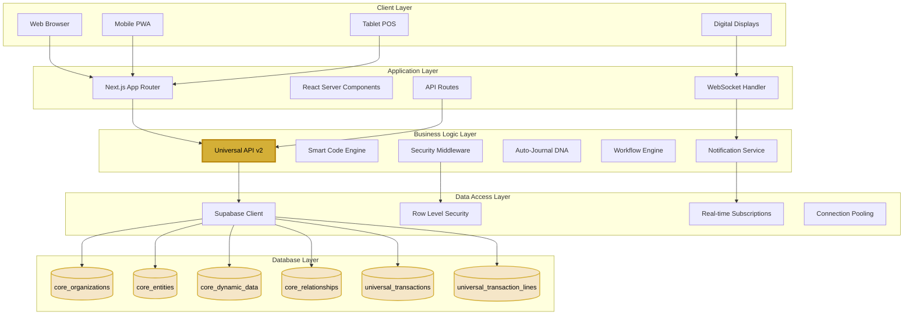

## 📊 Data Model Architecture

### Universal Entity Model for Salon

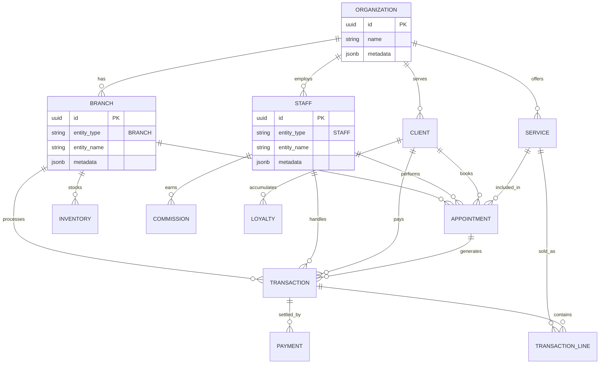

## 🔄 Request Flow Architecture

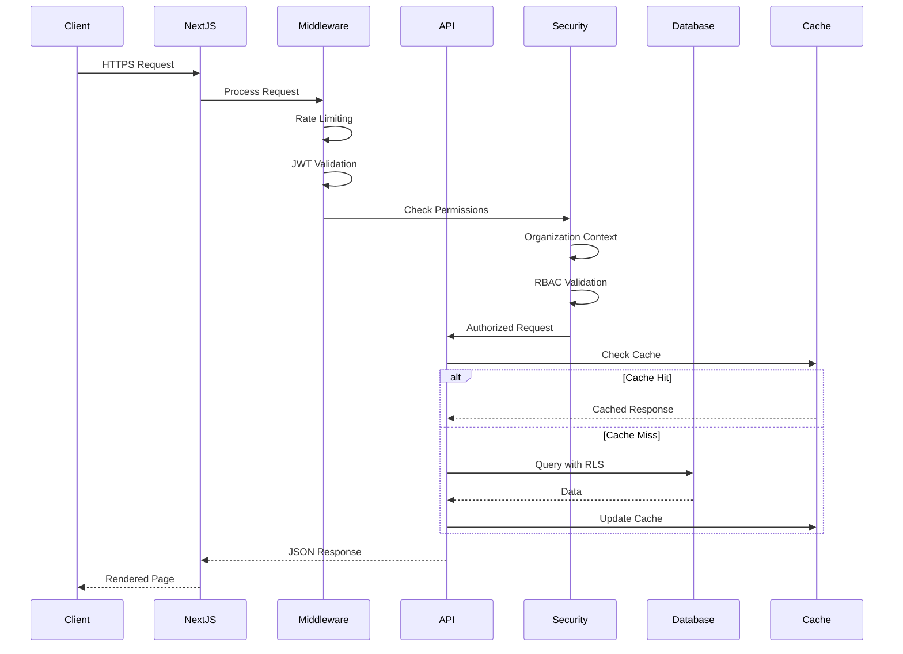

## 🎯 Component Architecture

### Frontend Component Hierarchy

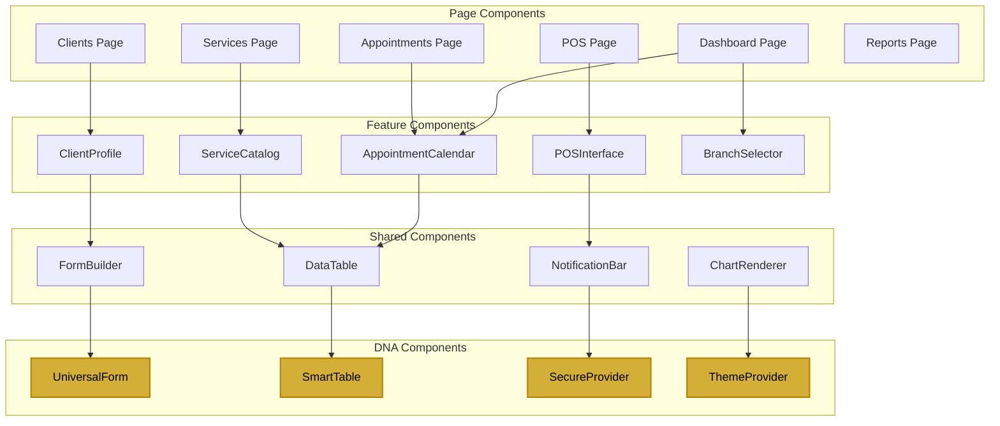

## 🔐 Security Architecture

### Multi-Layer Security Model

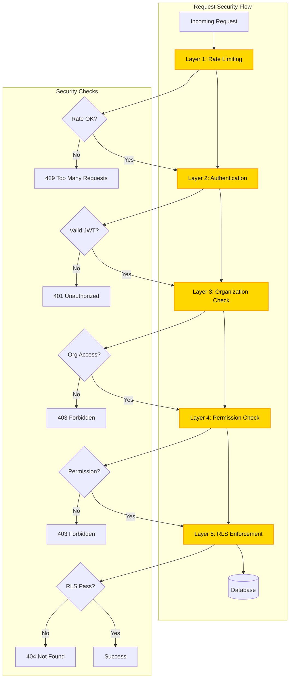

## 🚀 Performance Architecture

### Caching Strategy

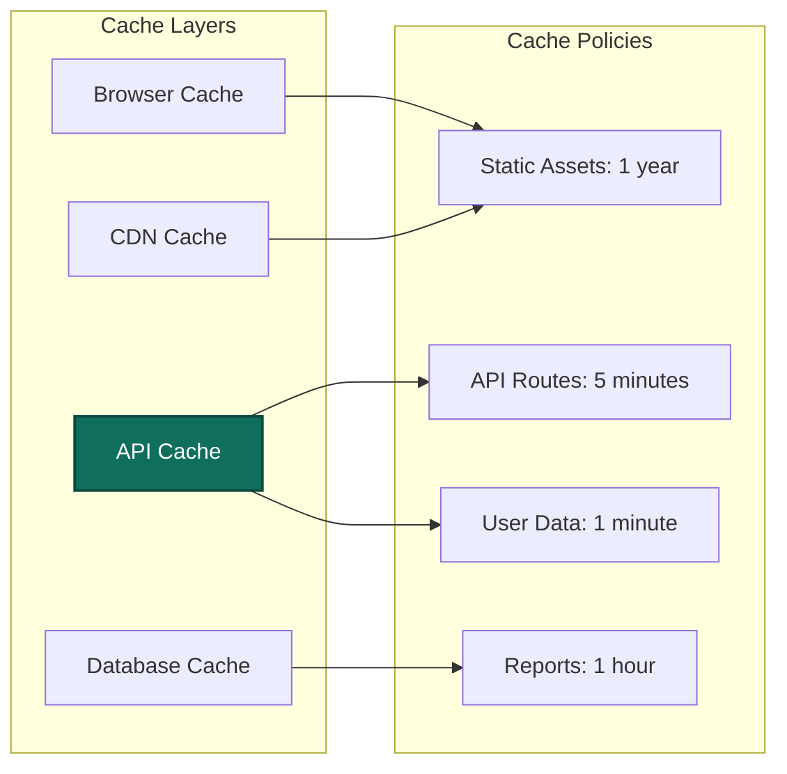

### Load Distribution

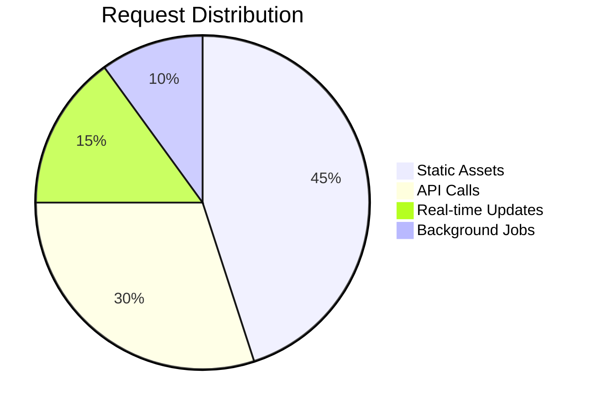

## 📈 Scalability Architecture

### Horizontal Scaling Model

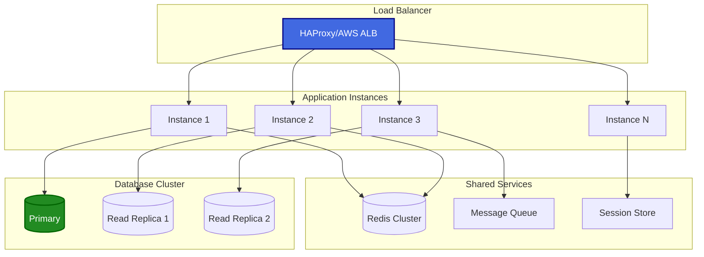

## 🔄 Integration Architecture

### External System Integration

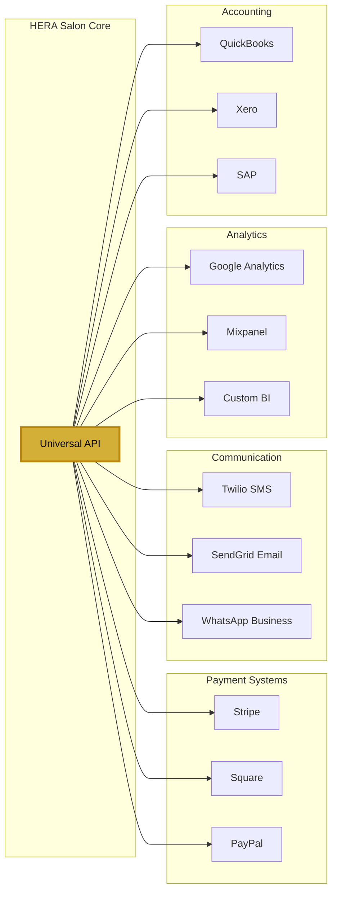

## 🎯 Deployment Architecture

### Production Deployment Model

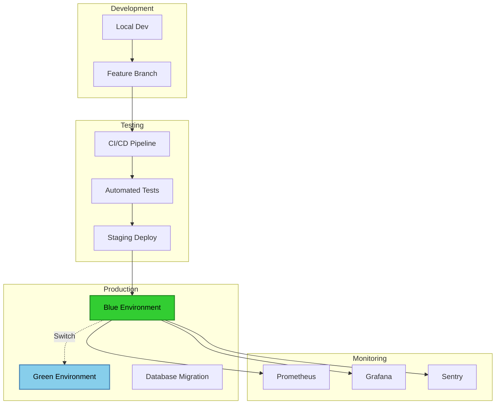

## 📋 Architecture Principles

### 1. **Universal-First Design**
- All data stored in 6 sacred tables
- No custom schemas or migrations
- Infinite flexibility through dynamic fields

### 2. **Security by Default**
- Organization isolation at every layer
- Role-based access control
- Automatic audit trails

### 3. **Performance Optimization**
- Intelligent caching strategies
- Database query optimization
- Lazy loading and code splitting

### 4. **Scalability Built-In**
- Stateless application design
- Horizontal scaling ready
- Multi-region support

### 5. **Developer Experience**
- Type safety throughout
- Consistent API patterns
- Comprehensive documentation

## 🔧 Technology Decisions

| Component | Technology | Rationale |
|-----------|------------|-----------|
| **Frontend Framework** | Next.js 15.4 | Server components, App Router, optimal performance |
| **UI Library** | React 19.1 | Latest features, concurrent rendering |
| **Database** | PostgreSQL | ACID compliance, JSON support, proven scale |
| **API Layer** | Universal API v2 | Consistent interface, automatic security |
| **Authentication** | JWT + RBAC | Stateless, scalable, flexible permissions |
| **Real-time** | WebSockets | Low latency updates, connection management |
| **Caching** | Redis | In-memory performance, pub/sub support |
| **Monitoring** | OpenTelemetry | Vendor agnostic, comprehensive insights |

## 📈 Performance Metrics

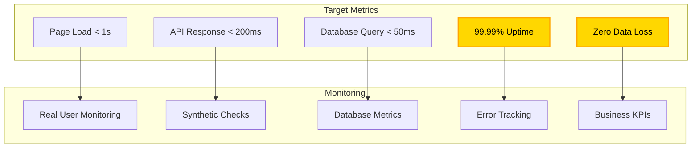

---

**Architecture Excellence** | **Built for Scale** | **Enterprise Ready**

[← Back to Overview](./README.md) | [Security Guide →](./security.md)

