# Financial Integration Guide

> **Enterprise-Grade Financial Management with Auto-Journal DNA**

## 💰 Overview

The HERA Salon Financial Integration provides seamless accounting automation with real-time GL posting, multi-branch consolidation, and comprehensive financial reporting. Built on the Auto-Journal DNA component, it eliminates manual bookkeeping while maintaining audit-grade accuracy.

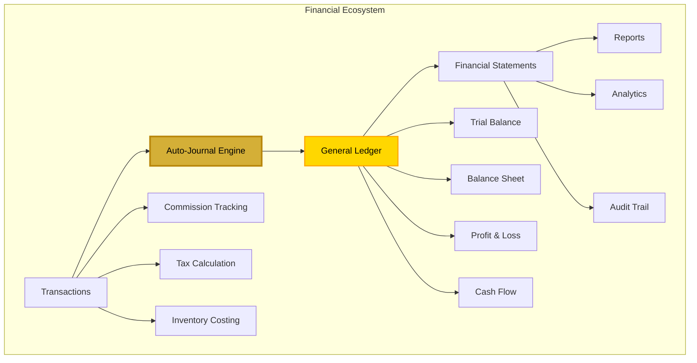

## 📊 Chart of Accounts Structure

### Salon-Specific COA

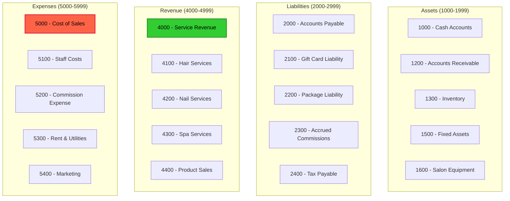

## 🔄 Auto-Journal Processing

### Transaction Flow to GL

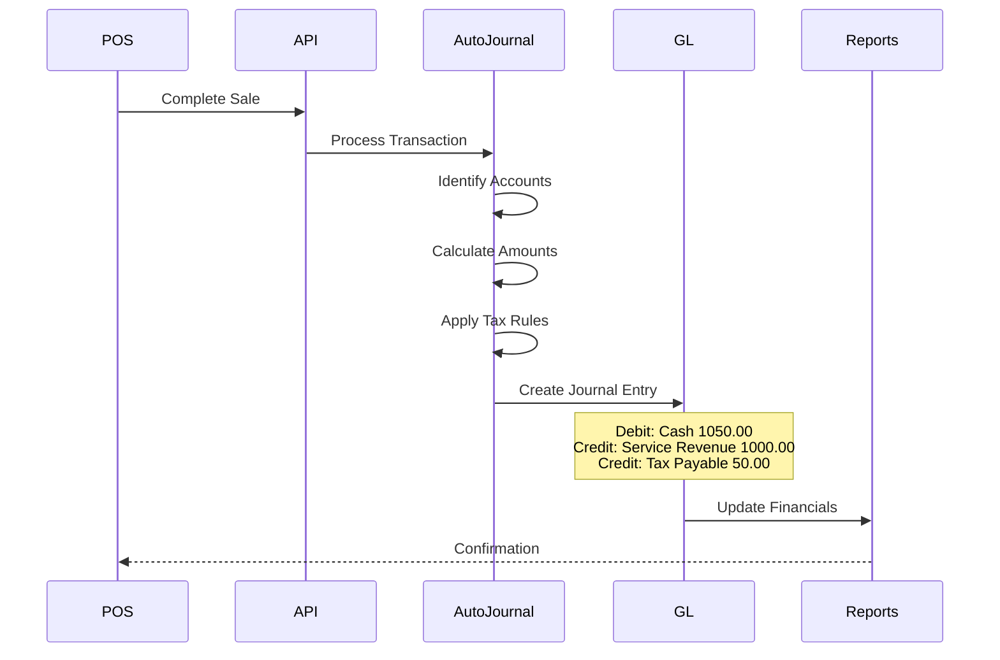

### Smart Code Mapping

```typescript
// Auto-Journal Configuration for Salon
const salonJournalRules = {
  // Service Sale
  'HERA.SALON.POS.TXN.SALE.V1': {
    debitAccounts: ['1000'], // Cash
    creditAccounts: ['4100', '2400'], // Service Revenue, Tax
    splitRules: {
      tax: { account: '2400', rate: 0.05 },
      commission: { account: '2300', rate: 0.40 }
    }
  },
  
  // Product Sale
  'HERA.SALON.POS.LINE.PRODUCT.V1': {
    debitAccounts: ['1000'], // Cash
    creditAccounts: ['4400', '2400'], // Product Sales, Tax
    costOfSale: {
      debitAccount: '5000', // COGS
      creditAccount: '1300' // Inventory
    }
  },
  
  // Gift Card Sale
  'HERA.SALON.GC.TXN.SALE.V1': {
    debitAccounts: ['1000'], // Cash
    creditAccounts: ['2100'] // Gift Card Liability
  },
  
  // Commission Payment
  'HERA.SALON.HR.TXN.COMMISSION.V1': {
    debitAccounts: ['2300'], // Accrued Commission
    creditAccounts: ['1000'] // Cash
  }
}
```

## 💹 Financial Reporting

### Real-Time Dashboards

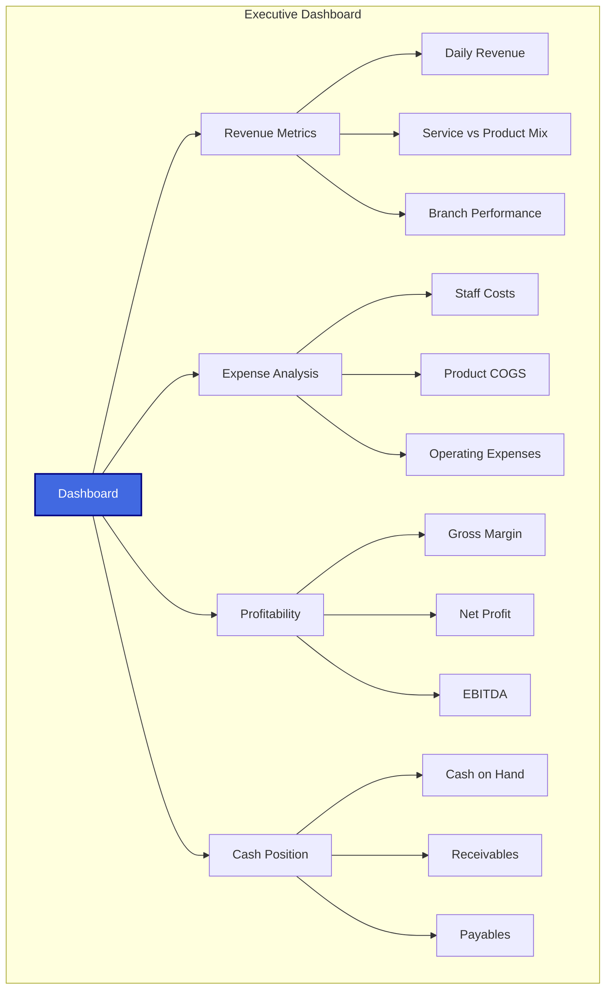

### Profit & Loss Statement

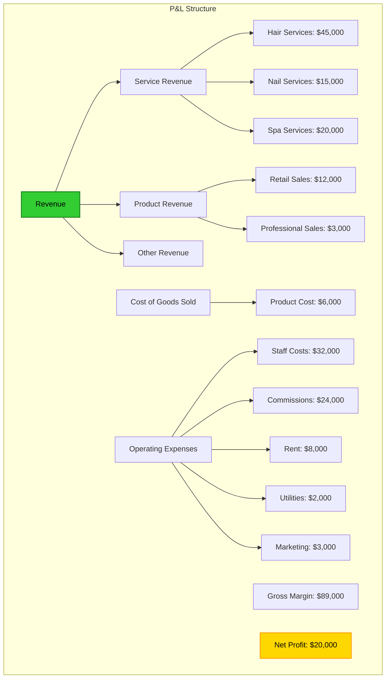

## 📈 Commission Management

### Commission Calculation Engine

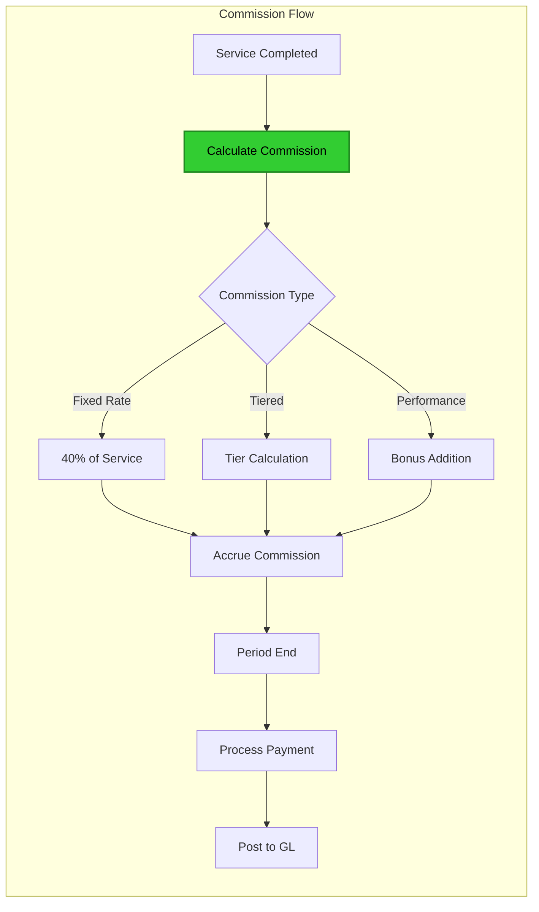

### Commission Tracking

```typescript
// Commission calculation and tracking
const trackCommission = async (transaction: Transaction) => {
  for (const line of transaction.lines) {
    if (line.staff_id && line.commissionable) {
      const commission = {
        staff_id: line.staff_id,
        transaction_id: transaction.id,
        line_id: line.id,
        amount: line.amount * 0.40, // 40% commission
        status: 'accrued',
        pay_period: getCurrentPayPeriod(),
        smart_code: 'HERA.SALON.HR.COMMISSION.ACCRUED.V1'
      }
      
      // Create commission record
      await apiV2.post('entities', {
        entity_type: 'COMMISSION',
        ...commission
      })
      
      // Update GL
      await apiV2.post('auto-journal/process', {
        smart_code: 'HERA.SALON.HR.COMMISSION.ACCRUAL.V1',
        amount: commission.amount,
        metadata: commission
      })
    }
  }
}
```

## 🏦 Cash Management

### Daily Cash Flow

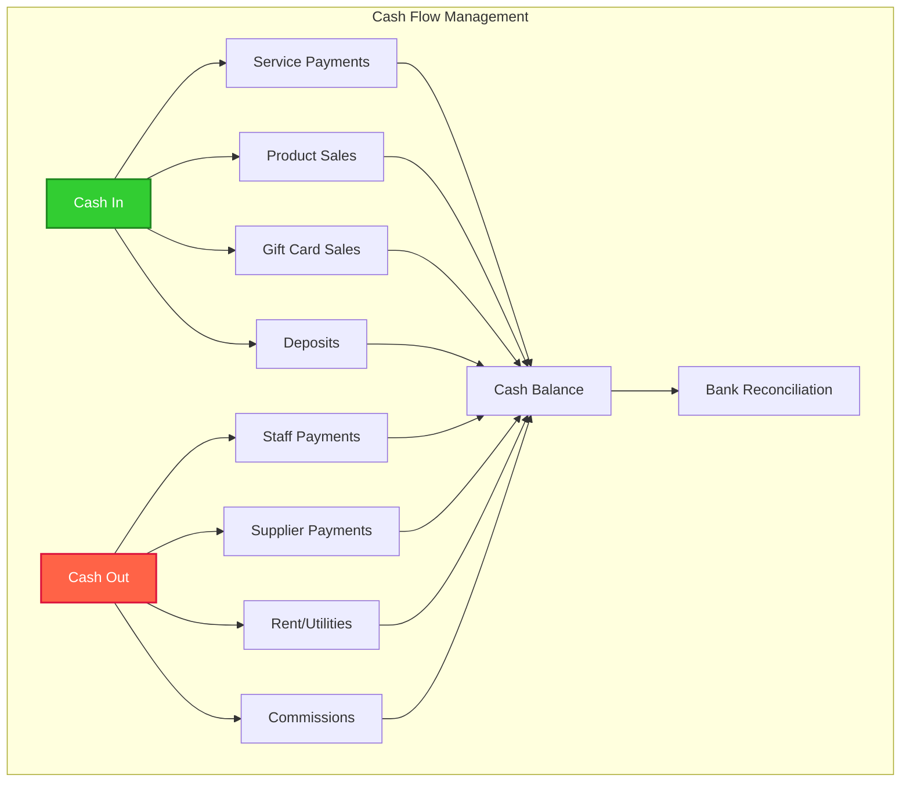

### Cash Reconciliation

```typescript
// Daily cash reconciliation
const reconcileCash = async (date: Date, branchId: string) => {
  // Get all cash transactions
  const cashTxns = await apiV2.get('transactions', {
    filters: {
      payment_method: 'cash',
      transaction_date: date,
      branch_id: branchId
    }
  })
  
  // Calculate totals
  const summary = {
    opening_balance: await getOpeningBalance(date, branchId),
    cash_sales: cashTxns.filter(t => t.type === 'sale').reduce((sum, t) => sum + t.amount, 0),
    cash_refunds: cashTxns.filter(t => t.type === 'refund').reduce((sum, t) => sum + t.amount, 0),
    cash_expenses: cashTxns.filter(t => t.type === 'expense').reduce((sum, t) => sum + t.amount, 0),
    expected_closing: 0,
    actual_closing: 0,
    variance: 0
  }
  
  summary.expected_closing = summary.opening_balance + summary.cash_sales - summary.cash_refunds - summary.cash_expenses
  
  return summary
}
```

## 📊 Tax Compliance

### VAT/Sales Tax Handling

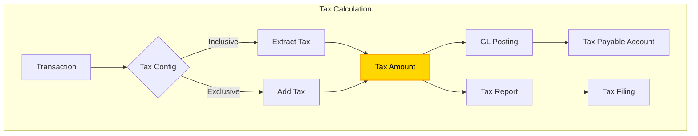

### Tax Reporting

```typescript
// Generate tax report
const generateTaxReport = async (period: Period) => {
  const taxTransactions = await apiV2.get('transactions', {
    filters: {
      date_range: period,
      has_tax: true
    }
  })
  
  const report = {
    period,
    total_sales: 0,
    taxable_sales: 0,
    exempt_sales: 0,
    tax_collected: 0,
    tax_payable: 0,
    details: []
  }
  
  for (const txn of taxTransactions) {
    report.total_sales += txn.amount
    if (txn.tax_amount > 0) {
      report.taxable_sales += txn.amount - txn.tax_amount
      report.tax_collected += txn.tax_amount
    } else {
      report.exempt_sales += txn.amount
    }
  }
  
  return report
}
```

## 📈 Inventory Valuation

### Cost Tracking

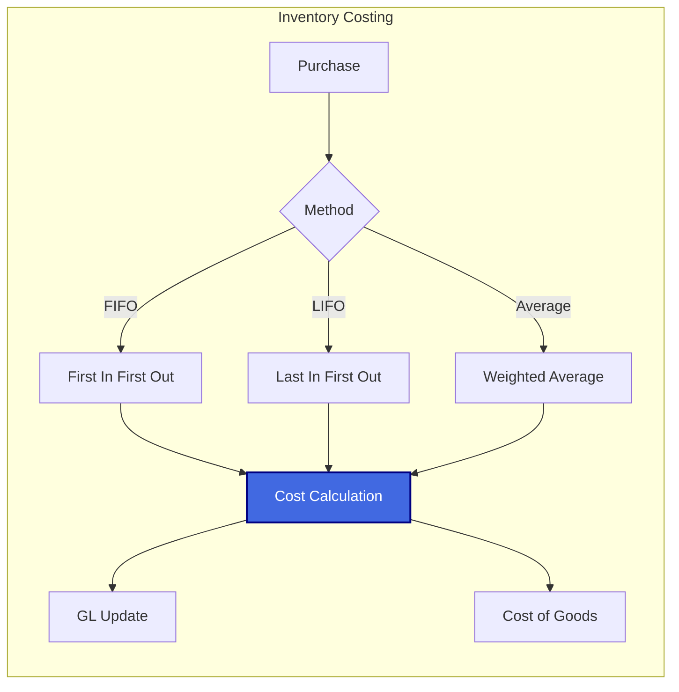

## 🎯 Financial Controls

### Approval Workflows

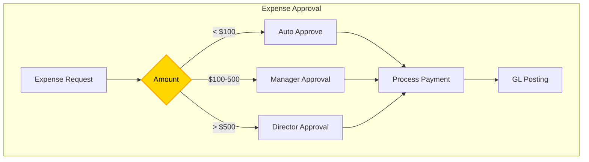

### Audit Trail

```typescript
// Complete audit trail
interface AuditEntry {
  transaction_id: string
  timestamp: Date
  user_id: string
  action: string
  old_values: any
  new_values: any
  ip_address: string
  smart_code: string
}

// Every financial transaction tracked
const auditLog = async (entry: AuditEntry) => {
  await apiV2.post('audit-log', {
    ...entry,
    smart_code: 'HERA.SALON.FIN.AUDIT.ENTRY.V1'
  })
}
```

## 📊 Multi-Branch Consolidation

### Branch P&L Consolidation

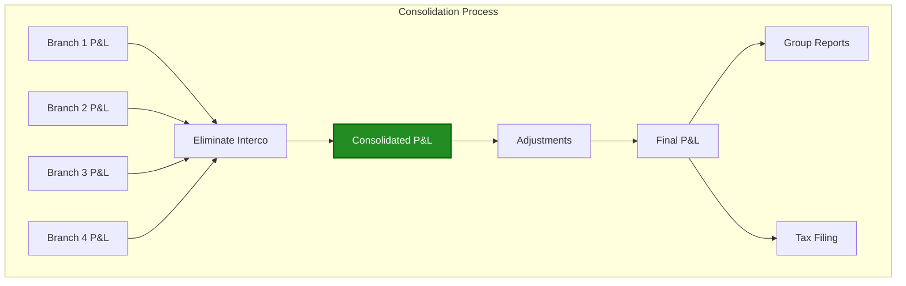

## 🚀 Best Practices

### 1. **Daily Operations**
- Morning cash count
- Transaction monitoring
- Exception handling
- End-of-day close

### 2. **Month-End Process**
- Commission calculation
- Inventory count
- Accrual entries
- Financial close

### 3. **Compliance**
- Tax filing schedules
- Audit preparation
- Document retention
- Internal controls

### 4. **Reporting**
- Daily flash reports
- Weekly summaries
- Monthly financials
- Quarterly analysis

---

<div align="center">

**Financial Excellence** | **Automated Accuracy** | **Real-Time Insights**

[← Back to Overview](./README.md) | [Analytics Dashboard →](./analytics.md)

</div>