# Multi-Branch Operations Guide

> **Enterprise-Scale Branch Management with Universal Architecture**

## 🏢 Overview

The HERA Salon Multi-Branch system enables seamless management of multiple salon locations while maintaining centralized control and local autonomy. Built on the Universal Entity architecture, it provides infinite scalability without schema changes.

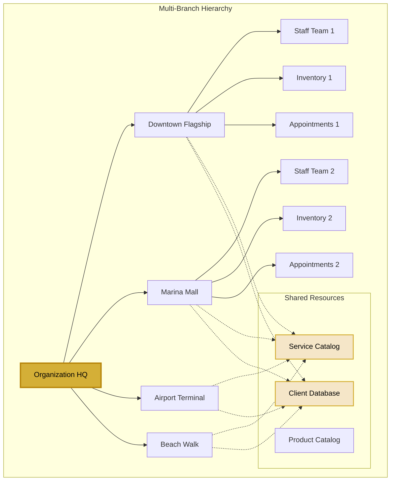

## 📊 Branch Data Model

### Entity Relationships

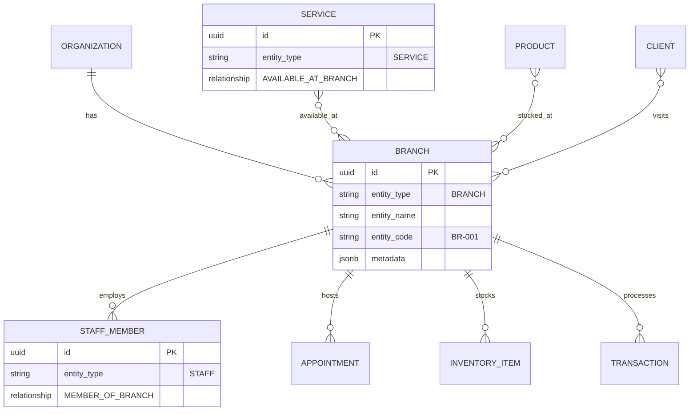

## 🔄 Branch Setup Process

### Step-by-Step Branch Creation

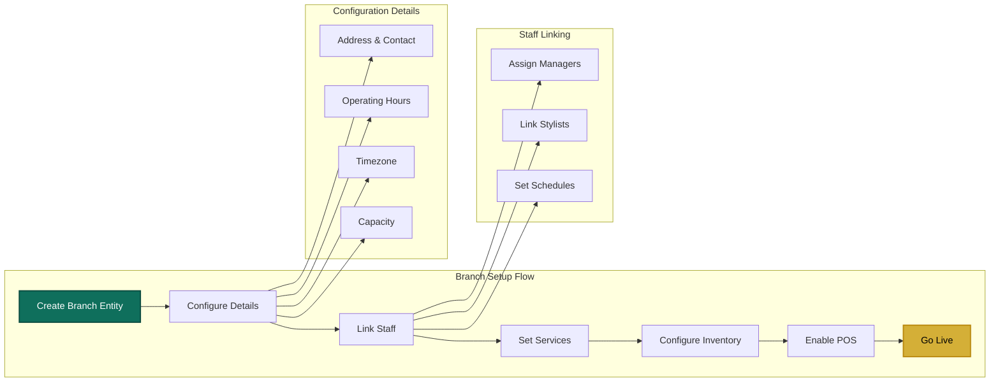

## 🎯 Branch Management Features

### 1. **Centralized Control Panel**

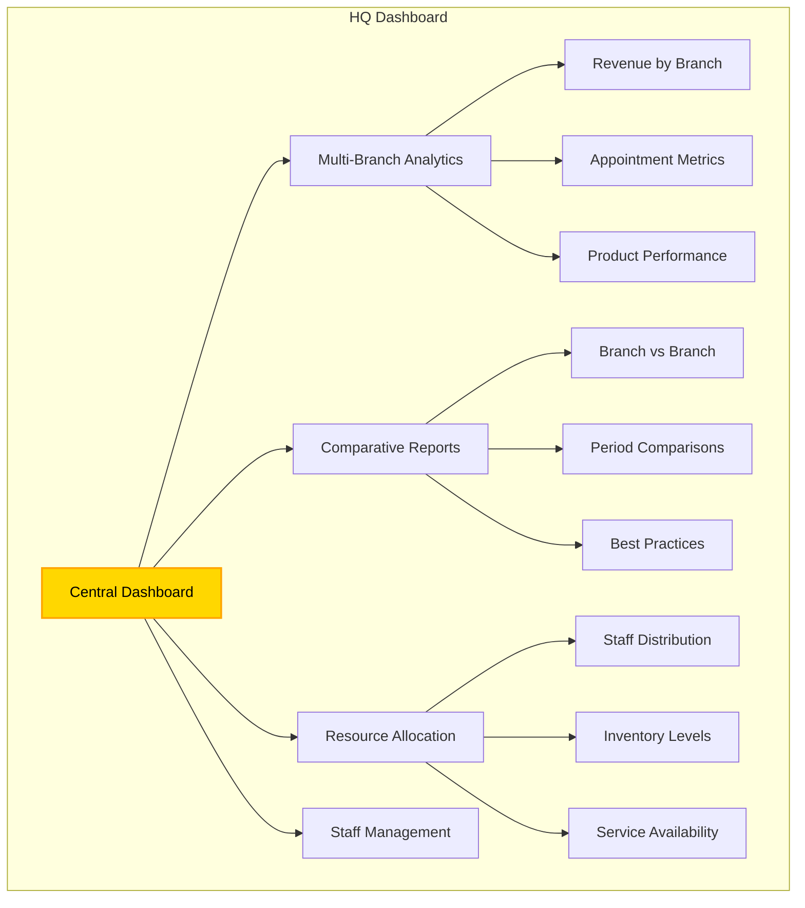

### 2. **Branch-Specific Operations**

Each branch operates with local autonomy while maintaining organization standards:

- **Independent Scheduling**: Branch-specific appointment books
- **Local Inventory**: Separate stock levels and reordering
- **Custom Pricing**: Location-based price adjustments
- **Staff Schedules**: Branch-specific working hours
- **Local Promotions**: Targeted marketing campaigns

### 3. **Cross-Branch Features**

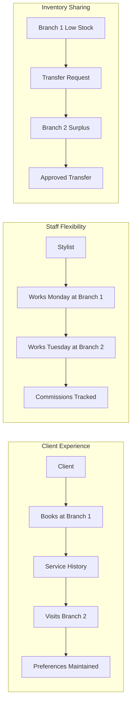

## 📈 Branch Analytics

### Performance Metrics Dashboard

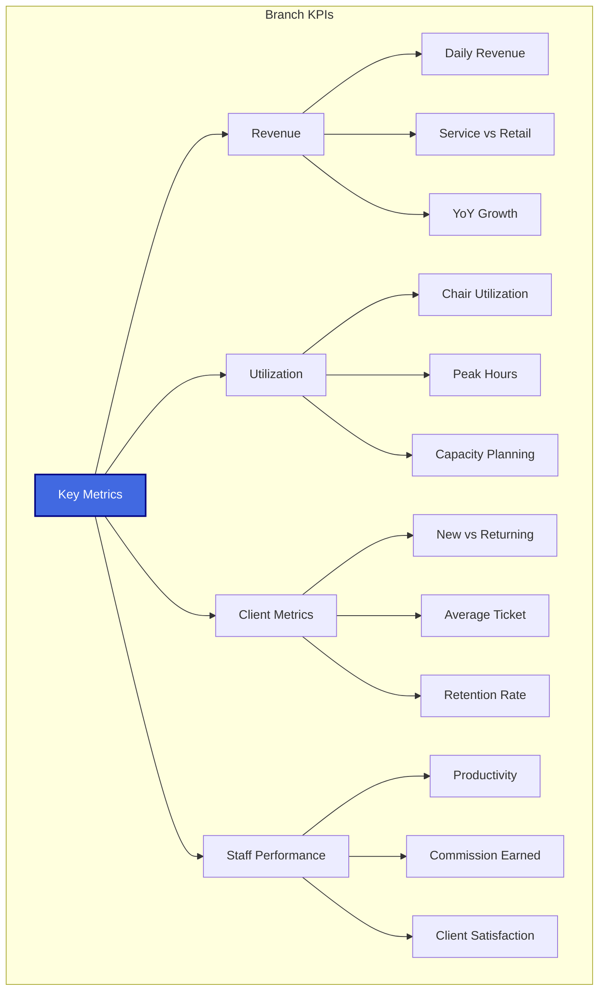

### Comparative Analysis

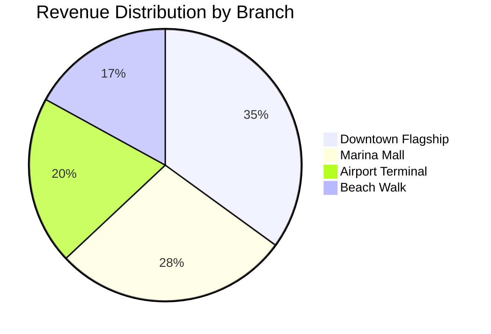

## 🔐 Branch Security Model

### Access Control Matrix

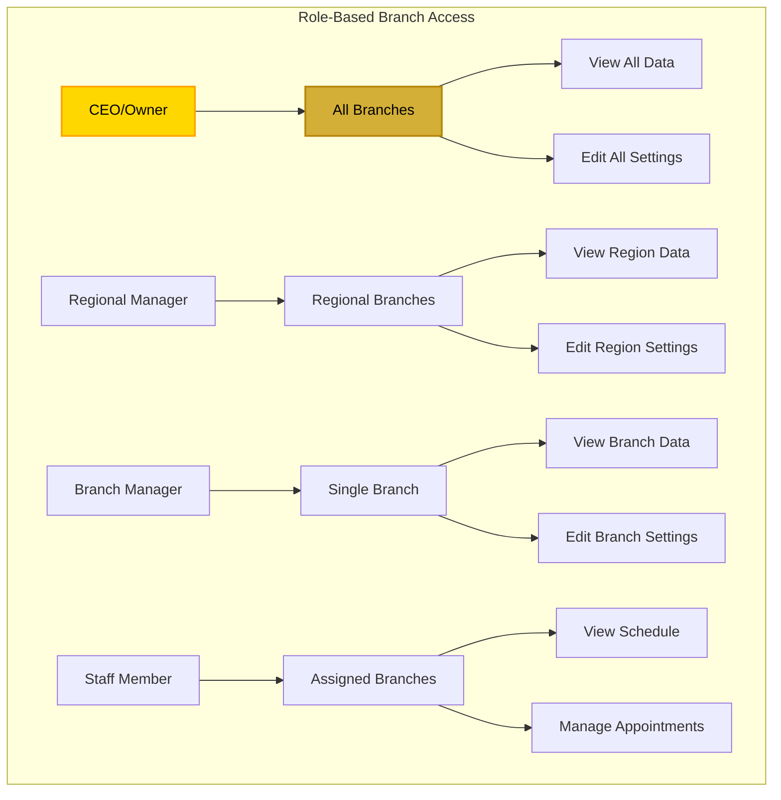

## 🚀 Implementation Guide

### Phase 1: Initial Setup

```typescript
// Create Branch Entity
const branch = await apiV2.post('entities', {
  entity_type: 'BRANCH',
  entity_name: 'Downtown Flagship',
  entity_code: 'BR-001',
  organization_id: orgId,
  smart_code: 'HERA.SALON.LOCATION.ENTITY.BRANCH.V1',
  metadata: {
    is_flagship: true,
    capacity: 12,
    operating_hours: {
      monday: { open: '09:00', close: '21:00' },
      // ... other days
    }
  }
})

// Set Dynamic Fields
await apiV2.post('entities/dynamic-data', {
  entity_id: branch.id,
  field_name: 'address',
  field_value: '123 Main Street, Downtown Dubai',
  field_type: 'text',
  smart_code: 'HERA.SALON.LOCATION.DYN.ADDRESS.V1'
})
```

### Phase 2: Staff Assignment

```typescript
// Link Staff to Branch
await apiV2.post('relationships', {
  from_entity_id: staffId,
  to_entity_id: branchId,
  relationship_type: 'STAFF_MEMBER_OF',
  organization_id: orgId,
  smart_code: 'HERA.SALON.STAFF.REL.MEMBER_OF.V1'
})
```

### Phase 3: Service Configuration

```typescript
// Make Services Available at Branch
await apiV2.post('relationships', {
  from_entity_id: serviceId,
  to_entity_id: branchId,
  relationship_type: 'SERVICE_AVAILABLE_AT',
  organization_id: orgId,
  smart_code: 'HERA.SALON.SERVICE.REL.AVAILABLE_AT.V1',
  metadata: {
    branch_specific_price: 150,
    branch_specific_duration: 60
  }
})
```

## 📊 Branch Reporting

### Financial Consolidation

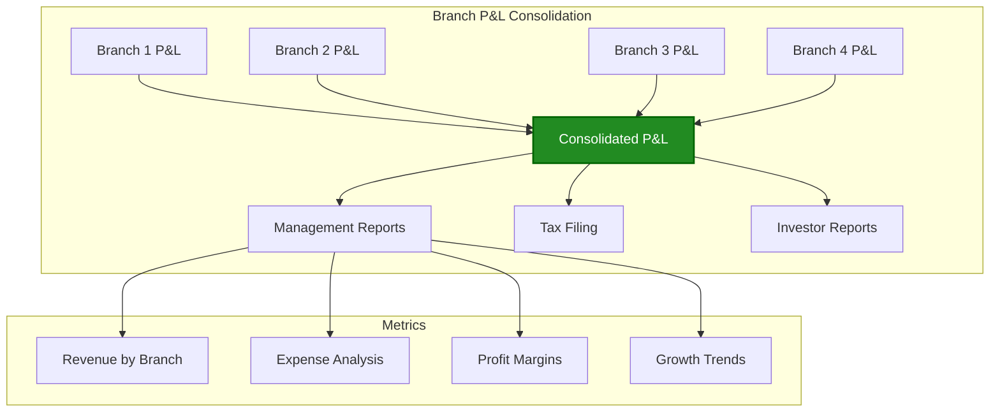

### Operational Reports

- **Daily Branch Summary**: Opening/closing stats
- **Weekly Performance**: Comparative analysis
- **Monthly Consolidation**: Full financial picture
- **Quarterly Reviews**: Strategic planning data
- **Annual Reports**: Compliance and growth metrics

## 🎯 Best Practices

### 1. **Branch Naming Convention**
```
Format: BR-XXX (e.g., BR-001, BR-002)
Name: Location Descriptor (e.g., "Downtown Flagship")
```

### 2. **Service Standardization**
- Maintain core service menu across branches
- Allow branch-specific add-ons
- Coordinate pricing strategies
- Sync service updates

### 3. **Inventory Management**
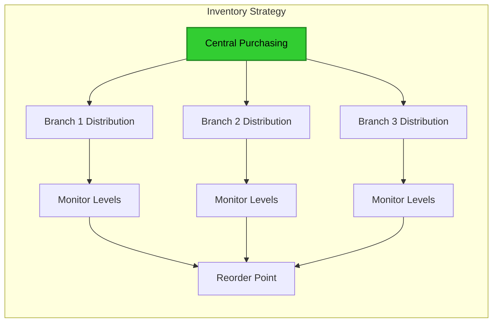

### 4. **Staff Scheduling**
- Central schedule visibility
- Cross-branch coverage
- Skill-based allocation
- Commission consistency

## 🔧 Troubleshooting

### Common Issues

| Issue | Solution |
|-------|----------|
| **Branch not visible** | Check relationship status and user permissions |
| **Services not showing** | Verify SERVICE_AVAILABLE_AT relationships |
| **Staff can't access** | Confirm STAFF_MEMBER_OF relationship active |
| **Inventory mismatch** | Run branch inventory reconciliation |
| **Reports incomplete** | Ensure all transactions have branch_id |

## 📈 Scaling Considerations

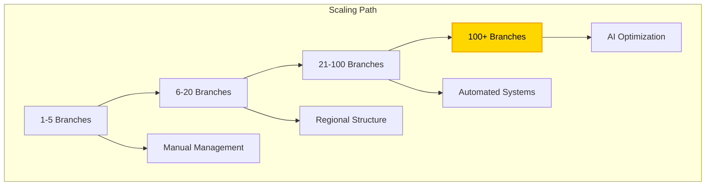

## 🚀 Advanced Features

### 1. **Smart Staff Allocation**
- AI-powered scheduling across branches
- Skill-based routing
- Demand prediction

### 2. **Inventory Optimization**
- Automatic transfer recommendations
- Predictive ordering
- Waste reduction analytics

### 3. **Dynamic Pricing**
- Location-based adjustments
- Demand-based pricing
- Competitor analysis integration

### 4. **Client Journey Tracking**
- Cross-branch visit patterns
- Preference synchronization
- Targeted marketing by location

---

<div align="center">

**Multi-Branch Excellence** | **Infinite Scalability** | **Zero Complexity**

[← Back to Overview](./README.md) | [Branch Analytics →](./analytics.md)

</div>