# Point of Sale (POS) System Guide

> **Enterprise-Grade POS with Universal Architecture Integration**

## 💳 Overview

The HERA Salon POS system delivers a seamless checkout experience with integrated inventory, commission tracking, and automatic financial posting. Built on the Universal Transaction architecture, it handles complex salon scenarios with elegance.

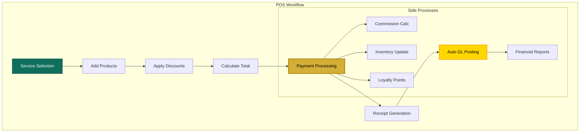

## 🎯 POS Interface Layout

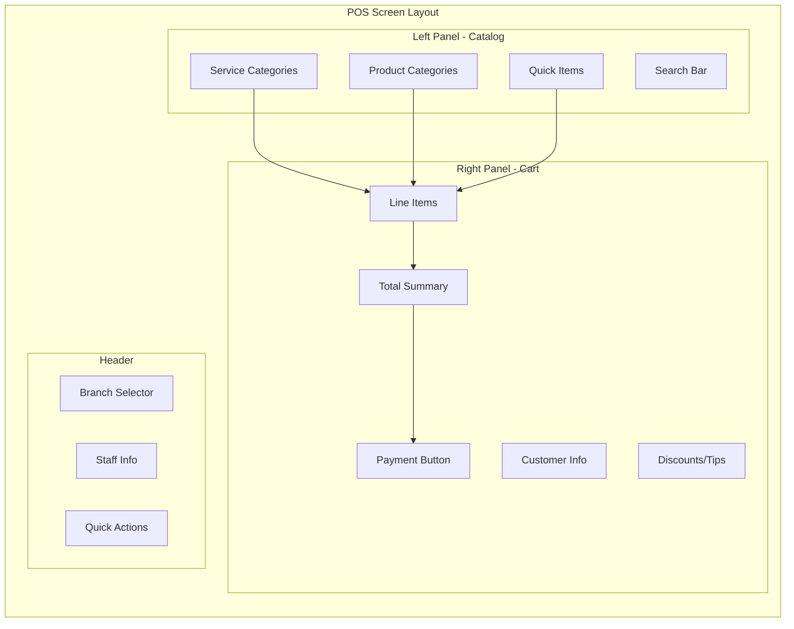

## 📊 Transaction Data Flow

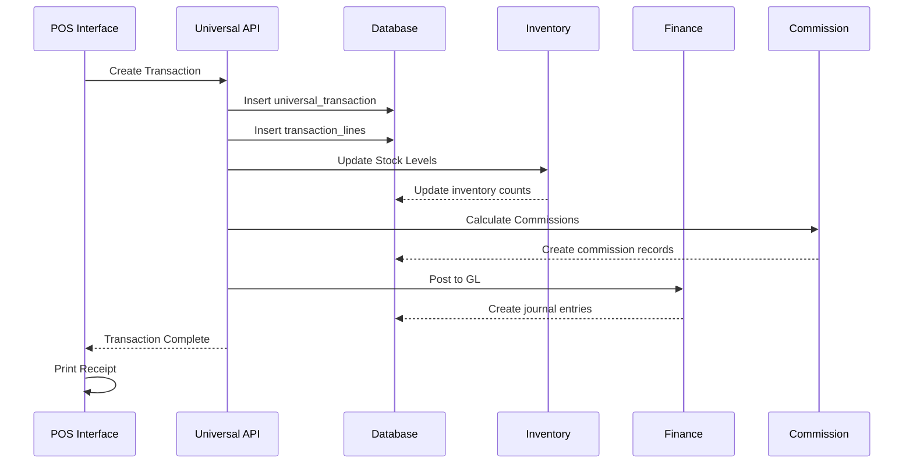

## 💰 Payment Processing

### Supported Payment Methods

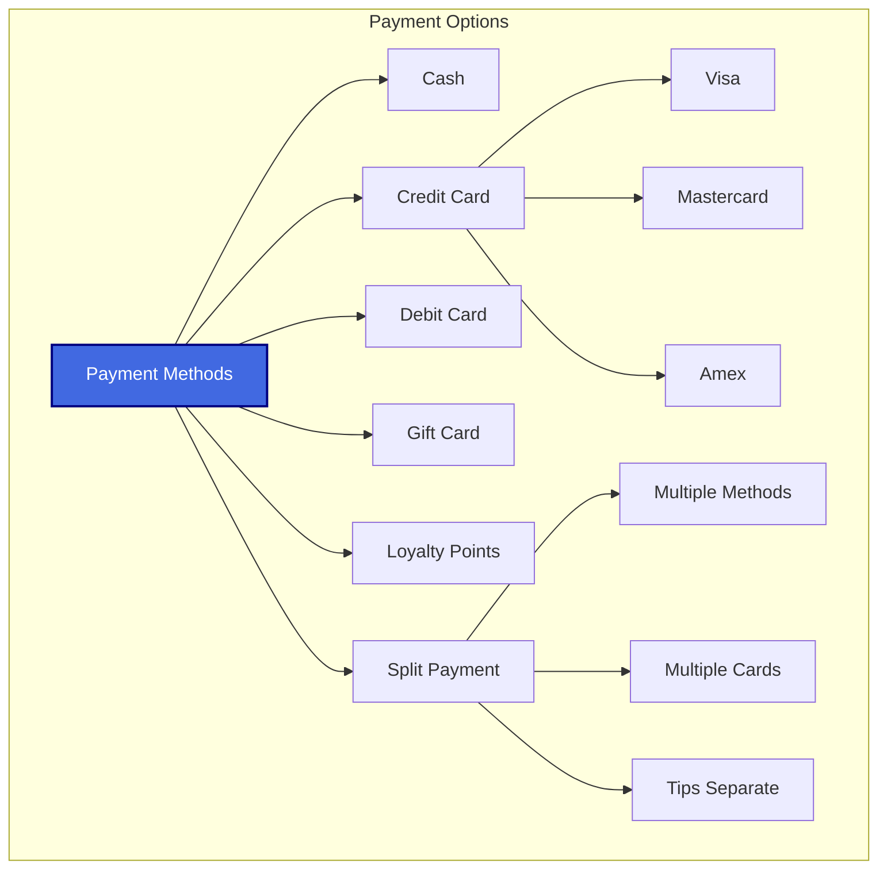

### Payment Flow Implementation

```typescript
// Process Payment
const processPayment = async (paymentData: PaymentData) => {
  // Create transaction
  const transaction = await apiV2.post('transactions', {
    transaction_type: 'SALE',
    transaction_code: generateTransactionCode(),
    organization_id: orgId,
    branch_id: selectedBranchId,
    total_amount: cartTotal,
    smart_code: 'HERA.SALON.POS.TXN.SALE.V1',
    metadata: {
      customer_id: customerId,
      payment_method: paymentData.method,
      staff_id: currentStaffId
    }
  })
  
  // Add line items
  for (const item of cartItems) {
    await apiV2.post('transaction-lines', {
      transaction_id: transaction.id,
      line_entity_id: item.entity_id,
      quantity: item.quantity,
      unit_price: item.price,
      line_amount: item.total,
      smart_code: item.type === 'service' 
        ? 'HERA.SALON.POS.LINE.SERVICE.V1'
        : 'HERA.SALON.POS.LINE.PRODUCT.V1'
    })
  }
  
  // Process payment gateway
  if (paymentData.method === 'card') {
    await processCardPayment(paymentData.cardDetails)
  }
  
  // Auto-post to GL
  await apiV2.post('auto-journal/process', {
    transaction_id: transaction.id
  })
  
  return transaction
}
```

## 🧮 Commission Calculation

### Commission Structure

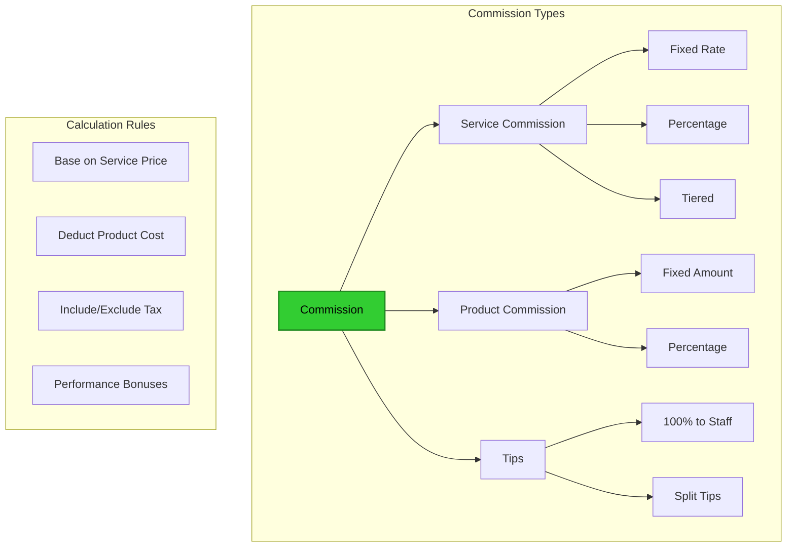

### Commission Tracking

```typescript
// Commission calculation example
const calculateCommission = (lineItem: TransactionLine): Commission => {
  const staff = getStaff(lineItem.staff_id)
  const commissionRate = staff.commission_rate || 0.40 // 40% default
  
  let commissionAmount = 0
  
  if (lineItem.type === 'service') {
    commissionAmount = lineItem.amount * commissionRate
  } else if (lineItem.type === 'product') {
    const productCommissionRate = 0.10 // 10% on products
    commissionAmount = lineItem.amount * productCommissionRate
  } else if (lineItem.type === 'tip') {
    commissionAmount = lineItem.amount // 100% of tips
  }
  
  return {
    staff_id: staff.id,
    transaction_line_id: lineItem.id,
    commission_amount: commissionAmount,
    commission_rate: commissionRate,
    smart_code: 'HERA.SALON.HR.COMMISSION.EARNED.V1'
  }
}
```

## 📱 POS Features

### 1. **Quick Sale Mode**

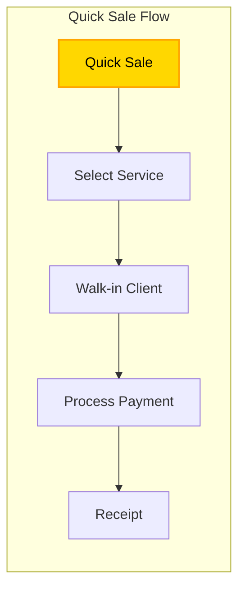

### 2. **Appointment Integration**

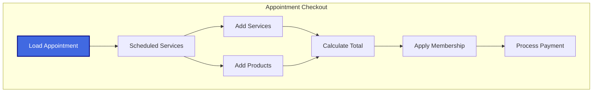

### 3. **Product Bundles**

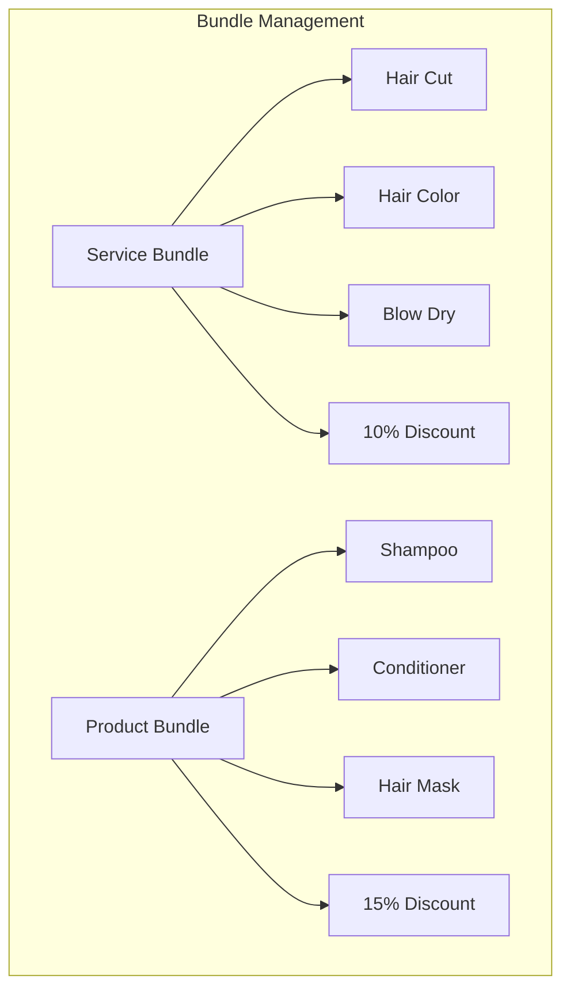

## 💳 Gift Cards & Packages

### Gift Card Processing

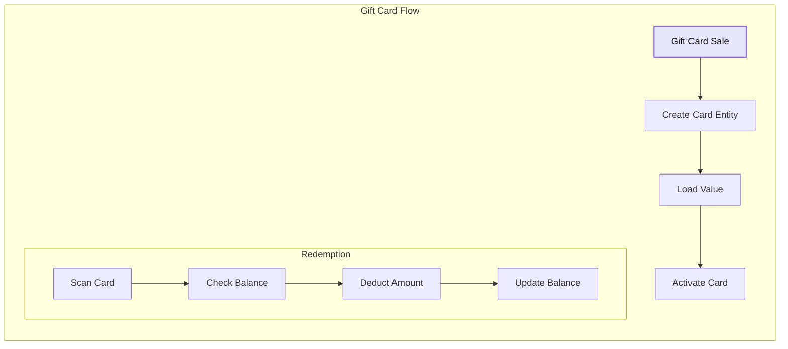

### Package Management

```typescript
// Package sale example
const sellPackage = async (packageData: Package) => {
  // Create package entity
  const package = await apiV2.post('entities', {
    entity_type: 'PACKAGE',
    entity_name: packageData.name,
    organization_id: orgId,
    smart_code: 'HERA.SALON.PKG.ENTITY.V1'
  })
  
  // Set package details
  await apiV2.post('entities/dynamic-data', [
    {
      entity_id: package.id,
      field_name: 'services_included',
      field_value: JSON.stringify(packageData.services),
      smart_code: 'HERA.SALON.PKG.DYN.SERVICES.V1'
    },
    {
      entity_id: package.id,
      field_name: 'expiry_date',
      field_value: packageData.expiryDate,
      smart_code: 'HERA.SALON.PKG.DYN.EXPIRY.V1'
    }
  ])
  
  return package
}
```

## 📊 Sales Reports

### Daily Cash Reconciliation

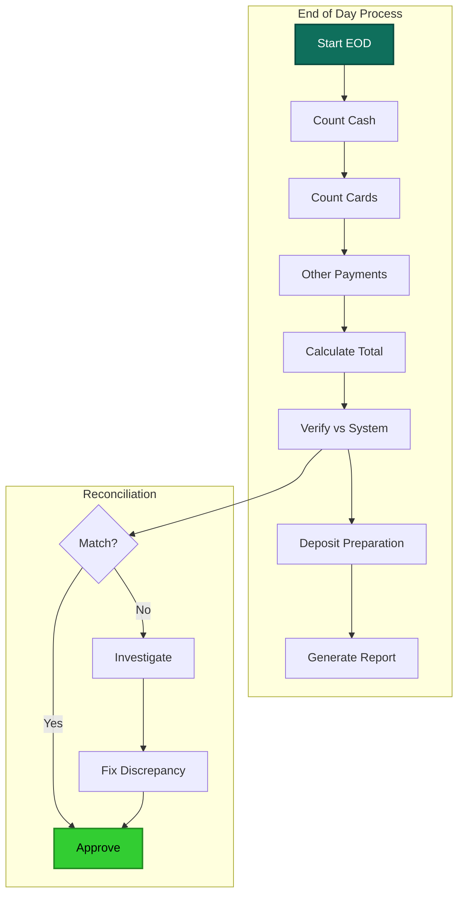

### Sales Analytics

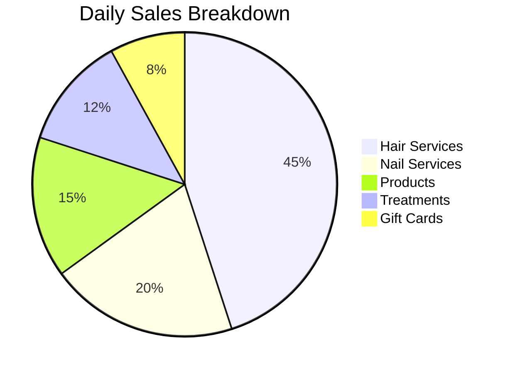

## 🔧 POS Configuration

### Setup Requirements

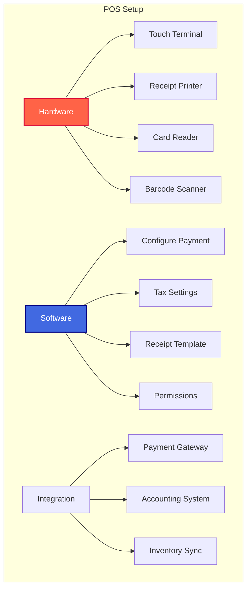

### Tax Configuration

```typescript
// Tax setup example
const configureTax = async (branchId: string) => {
  await apiV2.post('entities/dynamic-data', {
    entity_id: branchId,
    field_name: 'tax_config',
    field_value: JSON.stringify({
      sales_tax_rate: 0.05,  // 5% VAT
      tax_included_in_price: false,
      tax_account_code: '2250000',
      tax_exemption_types: ['medical_treatment']
    }),
    smart_code: 'HERA.SALON.BRANCH.DYN.TAX.V1'
  })
}
```

## 🚨 Error Handling

### Payment Failures

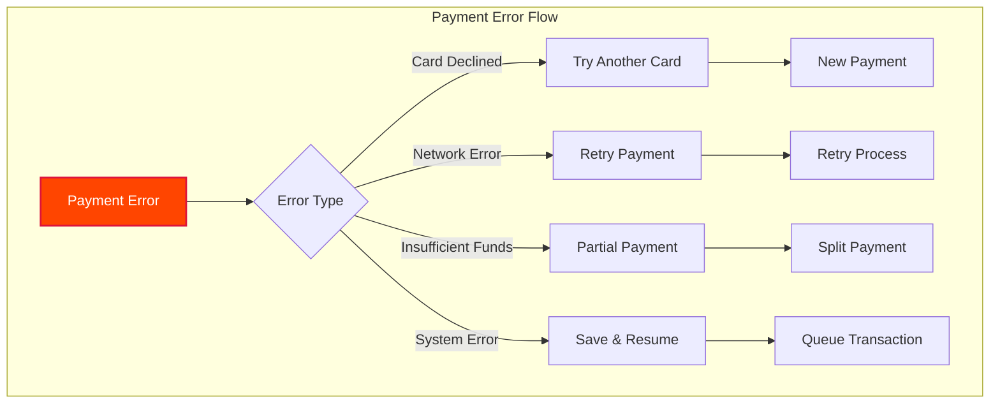

### Recovery Procedures

1. **Saved Transactions**: Auto-save cart state every 30 seconds
2. **Offline Mode**: Queue transactions for later processing
3. **Duplicate Prevention**: Idempotency keys on all payments
4. **Audit Trail**: Complete log of all attempts

## 📈 Performance Optimization

### Speed Metrics

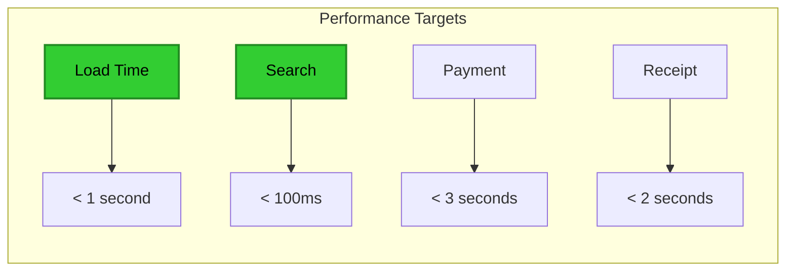

### Optimization Strategies

- **Catalog Caching**: Preload frequently used items
- **Lazy Loading**: Load categories on demand
- **Debounced Search**: Prevent excessive queries
- **Optimistic Updates**: Immediate UI feedback
- **Background Sync**: Non-blocking operations

## 🔒 Security Features

### PCI Compliance

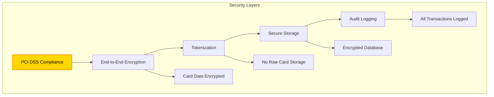

### Access Controls

- **Role-Based**: Cashier vs Manager permissions
- **Time-Based**: Shift-specific access
- **Amount Limits**: Authorization thresholds
- **Audit Trail**: Who did what when

## 🎯 Best Practices

### 1. **Daily Operations**
- Start with cash count
- Regular sync checks
- Hourly reports review
- End-of-day reconciliation

### 2. **Customer Experience**
- Quick checkout process
- Multiple payment options
- Clear receipt format
- Email receipt option

### 3. **Staff Training**
- Common operations guide
- Error handling procedures
- Security protocols
- Customer service standards

### 4. **System Maintenance**
- Daily backups
- Regular updates
- Performance monitoring
- Security audits

---

<div align="center">

**Enterprise POS** | **Lightning Fast** | **Rock Solid**

[← Back to Overview](./README.md) | [Financial Integration →](./financial-integration.md)

</div>