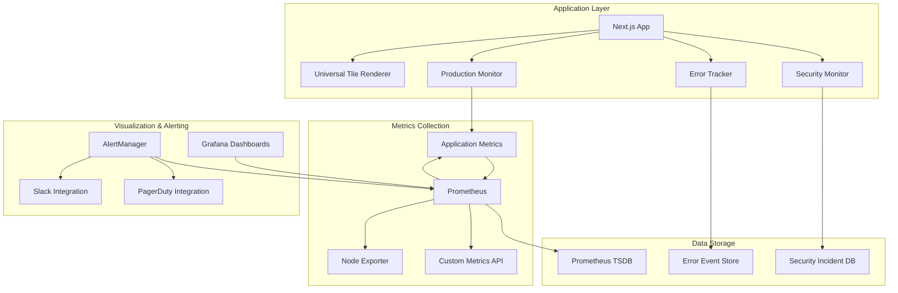

# HERA Universal Tile System - Monitoring Architecture

**Smart Code:** `HERA.DOCS.MONITORING.ARCHITECTURE.v1`

## 🎯 Overview

The HERA Universal Tile System includes a comprehensive monitoring architecture designed for enterprise production environments. This document outlines the complete monitoring strategy, implementation details, and operational procedures.

## 🏗️ Architecture Overview

### Monitoring Stack Components



## 📊 Monitoring Components

### 1. Production Monitor (`ProductionMonitor.ts`)

**Purpose:** Real-time application performance and business metrics monitoring

**Key Features:**
- Performance metrics collection (render times, memory usage, cache hit rates)
- Business KPI tracking (tiles rendered, user engagement, revenue impact)
- Automated performance optimization triggers
- Real-time alerting with configurable thresholds
- Performance grade calculation (A+ to D)

**Metrics Collected:**
```typescript
interface ProductionMetrics {
  performance: {
    averageRenderTime: number      // Target: < 16ms
    p95RenderTime: number         // Target: < 25ms
    p99RenderTime: number         // Target: < 50ms
    memoryUsage: number           // Target: < 50MB
    cpuUsage: number              // Target: < 5%
    networkLatency: number        // Target: < 100ms
    cacheHitRate: number          // Target: > 70%
  }
  
  userExperience: {
    activeUsers: number
    sessionDuration: number
    bounceRate: number            // Target: < 30%
    errorRate: number             // Target: < 1%
    satisfactionScore: number     // Target: > 4.0
  }
  
  business: {
    tilesRendered: number
    actionsPerformed: number
    workspacesAccessed: number
    conversionRate: number
    revenueImpact: number
  }
}
```

### 2. Error Tracker (`ErrorTracker.ts`)

**Purpose:** Comprehensive error detection, categorization, and automated recovery

**Key Features:**
- Global error interception and categorization
- Intelligent error pattern detection
- Automated error recovery with retry logic
- Security-aware error monitoring
- Critical error escalation workflows

**Error Categories:**
```typescript
type ErrorType = 
  | 'javascript'     // Runtime JS errors
  | 'api'           // API/Network errors
  | 'network'       // Connectivity issues
  | 'tile'          // Tile rendering errors
  | 'security'      // Security-related errors
  | 'performance'   // Performance threshold violations
  | 'business'      // Business logic errors
```

**Auto-Recovery Actions:**
```typescript
type RecoveryAction = 
  | 'retry'         // Automatic retry with backoff
  | 'fallback'      // Graceful degradation
  | 'reload'        // Page reload for critical errors
  | 'redirect'      // Redirect to safe location
  | 'notification'  // User-friendly notification
```

### 3. Security Monitor (`SecurityMonitor.ts`)

**Purpose:** Real-time security threat detection and automated mitigation

**Key Features:**
- SQL injection and XSS detection
- Brute force attack protection
- Automated IP blocking and rate limiting
- Security incident management
- Coordinated attack detection

**Threat Types:**
```typescript
type SecurityThreatType = 
  | 'brute_force'           // Login brute force attacks
  | 'sql_injection'         // SQL injection attempts
  | 'xss'                   // Cross-site scripting
  | 'csrf'                  // Cross-site request forgery
  | 'data_breach'           // Data exfiltration attempts
  | 'unauthorized_access'   // Unauthorized access attempts
  | 'suspicious_activity'   // Unusual behavior patterns
```

**Auto-Mitigation Strategies:**
```typescript
interface MitigationStrategy {
  brute_force: {
    action: 'block_ip'
    duration: '15 minutes'
    threshold: 5
  }
  
  sql_injection: {
    action: 'block_ip'
    duration: '30 minutes'
    log: 'detailed_request'
  }
  
  unauthorized_access: {
    action: 'block_ip'
    duration: '1 hour'
    alert: 'critical'
  }
}
```

## 📈 Metrics & KPIs

### Performance Metrics

#### Core Web Vitals
- **First Contentful Paint (FCP):** < 2.0s
- **Largest Contentful Paint (LCP):** < 3.0s
- **Cumulative Layout Shift (CLS):** < 0.1
- **First Input Delay (FID):** < 100ms
- **Total Blocking Time (TBT):** < 300ms

#### Tile-Specific Metrics
```prometheus
# Tile render performance
hera_tile_render_duration_seconds{tile_id, workspace_id}
hera_tile_render_count_total{tile_id, workspace_id, status}

# Cache performance
hera_cache_hit_rate{cache_type}
hera_cache_miss_count_total{cache_type}

# Memory usage
hera_memory_usage_bytes{component}
hera_memory_gc_duration_seconds

# User engagement
hera_active_users_total{workspace_id}
hera_session_duration_seconds{workspace_id}
hera_bounce_rate{workspace_id}
```

### Business Metrics
```prometheus
# Business KPIs
hera_tiles_rendered_total{workspace_id, tile_type}
hera_user_actions_total{action_type, workspace_id}
hera_conversion_rate{workspace_id}
hera_revenue_impact_total{workspace_id}

# Operational metrics
hera_api_requests_total{endpoint, method, status}
hera_database_queries_total{query_type, duration_bucket}
hera_background_jobs_total{job_type, status}
```

### Security Metrics
```prometheus
# Threat detection
hera_security_threats_total{threat_type, severity, status}
hera_blocked_ips_total{reason}
hera_failed_auth_attempts_total{endpoint}

# Security score
hera_security_score{component}
hera_security_incidents_total{severity, status}
```

## 🚨 Alerting Strategy

### Alert Severity Levels

#### Critical (5-minute response)
- Application completely down
- Security breach detected
- Data corruption or loss
- Critical performance degradation (>500ms response time)

#### High (15-minute response)
- High error rate (>5%)
- Memory usage >400MB
- P95 render time >100ms
- Multiple security threats

#### Medium (1-hour response)
- Moderate error rate (1-5%)
- Cache hit rate <50%
- Performance degradation (>200ms response time)
- Suspicious security activity

#### Low (4-hour response)
- Low error rate (<1%)
- Performance warnings
- Security monitoring events
- Capacity planning alerts

### Alert Routing

```yaml
routes:
  # Critical alerts - immediate escalation
  - match:
      severity: critical
    receiver: 'critical-alerts'
    group_wait: 0s
    repeat_interval: 5m
    routes:
      - match:
          alertname: SecurityIncident
        receiver: 'security-team'
      - match:
          alertname: DatabaseDown
        receiver: 'dba-team'

  # High severity alerts
  - match:
      severity: high
    receiver: 'high-alerts'
    group_wait: 30s
    repeat_interval: 30m

  # Standard alerts
  - match:
      severity: medium|low
    receiver: 'standard-alerts'
    group_wait: 5m
    repeat_interval: 2h
```

### Notification Channels

#### Slack Integration
```yaml
slack_configs:
  - api_url: "${SLACK_WEBHOOK_URL}"
    channel: '#hera-alerts'
    title: 'HERA Production Alert'
    text: |
      *Alert:* {{ .GroupLabels.alertname }}
      *Severity:* {{ .GroupLabels.severity }}
      *Environment:* {{ .GroupLabels.environment }}
      *Description:* {{ range .Alerts }}{{ .Annotations.description }}{{ end }}
    actions:
      - type: button
        text: 'View Dashboard'
        url: 'https://grafana.heraerp.com/dashboard'
      - type: button
        text: 'Acknowledge'
        url: 'https://alerts.heraerp.com/ack/{{ .GroupKey }}'
```

#### PagerDuty Integration
```yaml
pagerduty_configs:
  - routing_key: "${PAGERDUTY_INTEGRATION_KEY}"
    description: |
      HERA Alert: {{ range .Alerts }}{{ .Annotations.title }}{{ end }}
    details:
      environment: '{{ .GroupLabels.environment }}'
      severity: '{{ .GroupLabels.severity }}'
      component: '{{ .GroupLabels.component }}'
    links:
      - href: 'https://grafana.heraerp.com'
        text: 'View Metrics'
```

## 🎛️ Dashboard Configuration

### Executive Dashboard

**Purpose:** High-level business metrics and system health overview

**Key Panels:**
- Overall System Health Score
- Active Users and Engagement Metrics
- Revenue Impact and Conversion Rates
- Critical Alerts Summary
- Performance Grade Trending

### Operations Dashboard

**Purpose:** Detailed technical metrics for operations teams

**Key Panels:**
- Application Performance Metrics
- Error Rate and Types
- Database Performance
- Cache Hit Rates
- Resource Utilization

### Security Dashboard

**Purpose:** Security monitoring and threat analysis

**Key Panels:**
- Security Threat Timeline
- Blocked IP Addresses
- Failed Authentication Attempts
- Security Score Trending
- Incident Response Status

### Developer Dashboard

**Purpose:** Code-level metrics for development teams

**Key Panels:**
- API Response Times by Endpoint
- Error Breakdown by Component
- Performance Budget Compliance
- Code Quality Metrics
- Deployment Success Rates

## 🔧 Configuration Management

### Environment-Specific Configuration

#### Development
```yaml
monitoring:
  enabled: true
  collection_interval: 10s
  retention: 1d
  alerting: false
  
performance:
  budgets:
    render_time: 100ms    # Relaxed for development
    memory_usage: 100MB
    
security:
  monitoring: true
  auto_mitigation: false  # Manual review in dev
```

#### Staging
```yaml
monitoring:
  enabled: true
  collection_interval: 5s
  retention: 7d
  alerting: true
  
performance:
  budgets:
    render_time: 25ms     # Production-like targets
    memory_usage: 75MB
    
security:
  monitoring: true
  auto_mitigation: true   # Test auto-mitigation
```

#### Production
```yaml
monitoring:
  enabled: true
  collection_interval: 5s
  retention: 30d
  alerting: true
  
performance:
  budgets:
    render_time: 16ms     # Strict production targets
    memory_usage: 50MB
    
security:
  monitoring: true
  auto_mitigation: true
  incident_response: true
```

## 📚 Runbooks

### Performance Issues

#### High Render Time
1. **Investigation:**
   - Check tile complexity and data volume
   - Verify cache hit rates
   - Analyze network latency

2. **Immediate Actions:**
   - Enable tile virtualization
   - Increase cache TTL
   - Reduce tile density

3. **Long-term Solutions:**
   - Optimize tile rendering algorithms
   - Implement progressive loading
   - Add performance budgets

#### Memory Leaks
1. **Detection:**
   - Monitor memory usage trends
   - Check garbage collection frequency
   - Analyze heap dumps

2. **Mitigation:**
   - Restart affected services
   - Reduce cache size
   - Implement memory cleanup

3. **Resolution:**
   - Identify memory leak sources
   - Fix component lifecycle issues
   - Add memory monitoring

### Security Incidents

#### SQL Injection Detected
1. **Immediate Response:**
   - Block attacking IP automatically
   - Review affected queries
   - Check data integrity

2. **Investigation:**
   - Analyze attack vectors
   - Review application logs
   - Verify parameterized queries

3. **Remediation:**
   - Patch vulnerable code
   - Update security rules
   - Enhance input validation

#### Brute Force Attack
1. **Auto-Mitigation:**
   - IP blocking (15 minutes)
   - Rate limiting enforcement
   - Account lockout if applicable

2. **Manual Review:**
   - Check attack patterns
   - Verify legitimate users not affected
   - Extend blocking if needed

3. **Prevention:**
   - Implement CAPTCHA
   - Add two-factor authentication
   - Monitor for coordinated attacks

## 📊 Reporting

### Automated Reports

#### Daily Operations Report
- System health summary
- Performance metrics vs targets
- Error summary and trends
- Security events overview
- Capacity utilization

#### Weekly Business Report
- User engagement metrics
- Revenue impact analysis
- Feature usage statistics
- Performance improvements
- Operational achievements

#### Monthly Executive Report
- Business KPI dashboard
- System reliability metrics
- Security posture summary
- Performance optimization ROI
- Strategic recommendations

### Custom Report Generation
```typescript
// Generate custom performance report
const report = productionMonitor.generateReport()

// Export options
report.exportToPDF()
report.exportToCSV()
report.exportToJSON()
report.sendEmail(['executives@heraerp.com'])
```

## 🔄 Continuous Improvement

### Performance Optimization Cycle
1. **Monitor:** Collect performance metrics
2. **Analyze:** Identify optimization opportunities
3. **Optimize:** Implement performance improvements
4. **Validate:** Measure improvement impact
5. **Document:** Update performance baselines

### Security Enhancement Cycle
1. **Threat Intelligence:** Monitor new threat patterns
2. **Detection Rules:** Update security rules
3. **Response Procedures:** Enhance incident response
4. **Testing:** Validate security measures
5. **Training:** Update team knowledge

### Monitoring Evolution
1. **Metric Review:** Assess metric relevance
2. **Dashboard Updates:** Improve visualization
3. **Alert Tuning:** Reduce false positives
4. **Tool Evaluation:** Assess new monitoring tools
5. **Process Improvement:** Enhance operational procedures

---

*Last updated: 2024-11-14 | Version: 1.0 | Architecture: Production-Ready*