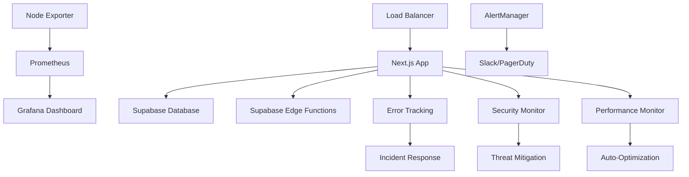

# HERA Universal Tile System - Production Deployment Guide

**Smart Code:** `HERA.DOCS.DEPLOYMENT.PRODUCTION.GUIDE.v1`

## 🎯 Overview

This guide provides comprehensive instructions for deploying the HERA Universal Tile System to production environments with enterprise-grade monitoring, security, and performance optimization.

## 📋 Prerequisites

### System Requirements
- **Node.js:** 18.0.0 or higher
- **Memory:** 4GB RAM minimum, 8GB recommended
- **Storage:** 10GB available space minimum
- **Network:** Stable internet connection for API calls

### Required Tools
- **Docker & Docker Compose** (for monitoring stack)
- **Git** (for version control)
- **NPM/Yarn** (for dependency management)

### Environment Setup
```bash
# Required environment variables
export NODE_ENV=production
export NEXT_PUBLIC_SUPABASE_URL=your_supabase_url
export SUPABASE_SERVICE_ROLE_KEY=your_service_key
export SUPABASE_PROJECT_REF=your_project_ref

# Optional monitoring variables
export SLACK_WEBHOOK_URL=your_slack_webhook
export PAGERDUTY_INTEGRATION_KEY=your_pagerduty_key
export SENTRY_DSN=your_sentry_dsn
export GRAFANA_ADMIN_PASSWORD=secure_password
```

## 🚀 Deployment Process

### Step 1: Pre-Deployment Validation

```bash
# Navigate to project root
cd /path/to/heraerp-dev

# Run comprehensive pre-deployment checks
./scripts/production/deploy-universal-tiles.sh --validate-only

# Expected output:
# ✅ Deployment configuration validated
# ✅ Pre-deployment checks completed
# ✅ Performance budget validated
```

### Step 2: Production Build & Deployment

```bash
# Full production deployment
./scripts/production/deploy-universal-tiles.sh

# With specific hosting platform
HOSTING_PLATFORM=vercel ./scripts/production/deploy-universal-tiles.sh

# Skip migrations (if needed)
RUN_MIGRATIONS=false ./scripts/production/deploy-universal-tiles.sh
```

### Step 3: Monitoring Stack Setup

```bash
# Setup monitoring infrastructure
cd scripts/monitoring
./setup-production-monitoring.sh

# Start monitoring services
./start-monitoring.sh

# Verify monitoring health
./check-monitoring-health.sh
```

## 🏗️ Deployment Architecture

### Infrastructure Components



### Service Dependencies

| Service | Port | Purpose | Dependencies |
|---------|------|---------|--------------|
| Next.js App | 3000 | Main Application | Supabase, Monitoring |
| Prometheus | 9090 | Metrics Collection | Node Exporter |
| Grafana | 3001 | Visualization | Prometheus |
| AlertManager | 9093 | Alert Routing | Prometheus |
| Node Exporter | 9100 | System Metrics | None |

## 📊 Performance Budgets

### Response Time Targets
```javascript
{
  "first-contentful-paint": "2000ms",
  "largest-contentful-paint": "3000ms", 
  "cumulative-layout-shift": "0.1",
  "total-blocking-time": "300ms",
  "speed-index": "3000ms"
}
```

### Resource Size Limits
```javascript
{
  "script": "400KB",
  "stylesheet": "150KB",
  "image": "300KB",
  "total": "1000KB"
}
```

### Tile Performance Requirements
- **Average Render Time:** < 16ms (60 FPS)
- **P95 Render Time:** < 25ms
- **Memory Usage:** < 50MB per workspace
- **Cache Hit Rate:** > 70%

## 🛡️ Security Configuration

### Security Headers (Auto-configured)
```nginx
Content-Security-Policy: default-src 'self'; script-src 'self' 'unsafe-inline';
X-Frame-Options: DENY
X-Content-Type-Options: nosniff
Strict-Transport-Security: max-age=31536000; includeSubDomains
X-XSS-Protection: 1; mode=block
```

### Threat Detection Rules
```yaml
rules:
  - name: "SQL Injection Detection"
    pattern: "union select|or 1=1|drop table"
    severity: "high"
    action: "block"
    
  - name: "XSS Detection" 
    pattern: "<script|javascript:|on\\w+="
    severity: "medium"
    action: "alert"
    
  - name: "Brute Force Detection"
    threshold: 5
    timeWindow: "5m"
    action: "block"
```

## 📈 Monitoring & Alerting

### Alert Thresholds

#### Performance Alerts
```yaml
alerts:
  - name: "High Tile Render Time"
    condition: "hera_tile_render_duration_seconds > 0.05"
    severity: "warning"
    duration: "5m"
    
  - name: "Critical Memory Usage"
    condition: "process_resident_memory_bytes > 500MB"
    severity: "critical" 
    duration: "5m"
```

#### Security Alerts
```yaml
alerts:
  - name: "Security Incident"
    condition: "hera_security_threats_total > 3"
    severity: "critical"
    duration: "1m"
    
  - name: "High Error Rate"
    condition: "rate(hera_errors_total[5m]) > 0.01"
    severity: "warning"
    duration: "2m"
```

### Dashboard Access Points
- **Production Dashboard:** `https://your-domain.com/admin/monitoring`
- **Grafana:** `http://localhost:3001` (admin/admin)
- **Prometheus:** `http://localhost:9090`
- **AlertManager:** `http://localhost:9093`

## 🔧 Configuration Files

### Production Environment (.env.production.local)
```bash
# Application
NODE_ENV=production
NEXT_PUBLIC_APP_URL=https://your-domain.com

# Database
NEXT_PUBLIC_SUPABASE_URL=https://your-project.supabase.co
SUPABASE_SERVICE_ROLE_KEY=your_service_role_key
SUPABASE_PROJECT_REF=your_project_ref

# Monitoring
MONITORING_ENABLED=true
METRICS_ENDPOINT=https://metrics.your-domain.com
ERROR_TRACKING_ENDPOINT=https://errors.your-domain.com

# Security
SECURITY_MONITORING_ENABLED=true
CRITICAL_ALERT_WEBHOOK=https://alerts.your-domain.com
SECURITY_INCIDENT_WEBHOOK=https://security.your-domain.com

# Performance
PERFORMANCE_BUDGET_ENABLED=true
AUTO_OPTIMIZATION_ENABLED=true
CACHE_TTL=300
```

### Next.js Production Configuration (next.config.js)
```javascript
/** @type {import('next').NextConfig} */
const nextConfig = {
  // Production optimizations
  experimental: {
    optimizeCss: true,
    scrollRestoration: true,
  },
  
  // Performance monitoring
  onDemandEntries: {
    maxInactiveAge: 25 * 1000,
    pagesBufferLength: 2,
  },
  
  // Security headers
  async headers() {
    return [
      {
        source: '/(.*)',
        headers: [
          {
            key: 'X-Frame-Options',
            value: 'DENY',
          },
          {
            key: 'X-Content-Type-Options',
            value: 'nosniff',
          },
          {
            key: 'Strict-Transport-Security',
            value: 'max-age=31536000; includeSubDomains',
          },
        ],
      },
    ]
  },
}

module.exports = nextConfig
```

## 🚨 Incident Response

### Escalation Matrix

| Severity | Response Time | Escalation | Channels |
|----------|--------------|------------|----------|
| Critical | 5 minutes | Immediate | PagerDuty, Phone |
| High | 15 minutes | 30 minutes | Slack, Email |
| Medium | 1 hour | 2 hours | Slack |
| Low | 4 hours | Next business day | Email |

### Runbook Links
- **High Render Time:** `/docs/runbooks/high-render-time.md`
- **Memory Issues:** `/docs/runbooks/memory-issues.md`
- **Security Incidents:** `/docs/runbooks/security-incidents.md`
- **Database Problems:** `/docs/runbooks/database-issues.md`

## 🔍 Health Checks

### Application Health Endpoint
```bash
# Basic health check
curl https://your-domain.com/api/health

# Expected response:
{
  "status": "healthy",
  "timestamp": "2024-01-01T12:00:00.000Z",
  "services": {
    "database": "healthy",
    "cache": "healthy",
    "monitoring": "healthy"
  }
}
```

### Monitoring Health Checks
```bash
# Check all monitoring services
cd scripts/monitoring
./check-monitoring-health.sh

# Individual service checks
curl http://localhost:9090/-/healthy  # Prometheus
curl http://localhost:3001/api/health # Grafana
curl http://localhost:9093/-/healthy  # AlertManager
```

## 📝 Deployment Checklist

### Pre-Deployment
- [ ] All tests passing (`npm run test`)
- [ ] No TypeScript errors (`npm run typecheck`)
- [ ] No linting issues (`npm run lint`)
- [ ] Performance budget validated
- [ ] Security scan completed
- [ ] Environment variables configured

### During Deployment
- [ ] Database migrations executed
- [ ] Static assets deployed
- [ ] Edge functions deployed
- [ ] DNS records updated
- [ ] SSL certificates valid

### Post-Deployment
- [ ] Health checks passing
- [ ] Monitoring dashboards active
- [ ] Error tracking operational
- [ ] Security monitoring enabled
- [ ] Performance metrics within budget
- [ ] Smoke tests completed

## 🔄 Rollback Procedures

### Automatic Rollback Triggers
- Health check failures > 2 minutes
- Error rate > 5% for 1 minute
- Critical performance degradation
- Security incident detection

### Manual Rollback
```bash
# Emergency rollback to previous version
ROLLBACK_VERSION=previous ./scripts/production/rollback.sh

# Specific version rollback
ROLLBACK_VERSION=v1.2.3 ./scripts/production/rollback.sh
```

## 🛠️ Troubleshooting

### Common Issues

#### Deployment Failures
```bash
# Check deployment logs
tail -f /tmp/hera-tiles-deploy-*.log

# Verify environment variables
env | grep -E "(SUPABASE|NODE_ENV)"

# Test database connectivity
npm run db:test-connection
```

#### Performance Issues
```bash
# Check resource usage
docker stats

# View performance metrics
curl http://localhost:9090/metrics | grep hera_

# Generate performance report
npm run performance:report
```

#### Security Alerts
```bash
# View security incidents
curl http://localhost:3000/api/security/incidents

# Check blocked IPs
curl http://localhost:3000/api/security/blocked-ips

# Review security logs
tail -f /var/log/hera/security.log
```

## 📞 Support Contacts

- **DevOps Team:** devops@heraerp.com
- **Security Team:** security@heraerp.com
- **On-Call Engineer:** +1-555-HERA-OPS
- **Incident Commander:** incident-commander@heraerp.com

## 📚 Additional Resources

- [Performance Optimization Guide](./PERFORMANCE-OPTIMIZATION-GUIDE.md)
- [Security Monitoring Setup](./SECURITY-MONITORING-SETUP.md)
- [Error Tracking Configuration](./ERROR-TRACKING-CONFIGURATION.md)
- [Monitoring Dashboard Setup](./MONITORING-DASHBOARD-SETUP.md)

---

*Last updated: 2024-11-14 | Version: 1.0 | Deployment ID: Phase-7-Complete*