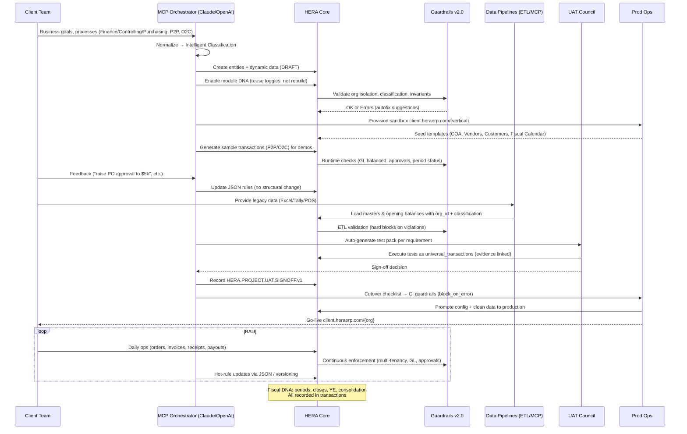

# 🚀 HERA ERP Implementation Methodology - Complete Bundle

## 📋 Table of Contents

1. [Executive Summary](#executive-summary)
2. [21-Day Implementation Overview](#21-day-implementation-overview)
3. [MCP Orchestration Architecture](#mcp-orchestration-architecture)
4. [Implementation Phases](#implementation-phases)
5. [Technical Architecture](#technical-architecture)
6. [Success Metrics](#success-metrics)
7. [Implementation Code Examples](#implementation-code-examples)
8. [Deployment Guide](#deployment-guide)

---

## Executive Summary

HERA revolutionizes ERP implementation with a **21-day journey from requirements to production**, achieving:
- **20x faster delivery** than traditional ERP (21 days vs 6-18 months)
- **90% cost reduction** ($50-100K vs $500K-5M)
- **Flexible architecture** - Handles all business complexity
- **100% module reuse** - Toggle existing DNA, don't rebuild
- **95%+ success rate** vs 60% industry average

---

## 21-Day Implementation Overview

```
Week 1: Discovery & Configuration (Days 1-5)
├── Phase 1: Requirements Gathering (Days 1-3)
│   ├── Conversational intake via MCP
│   ├── Auto-mapping to universal structure
│   └── Intelligent classification
└── Phase 2: Module Configuration (Days 4-5)
    ├── Module DNA activation
    └── Business rules setup

Week 2: Testing & Migration (Days 6-15)
├── Phase 3: Sandbox Testing (Days 6-10)
│   ├── Provision client.heraerp.com/{industry}
│   ├── Load template data
│   └── Client playground testing
└── Phase 4: Data Migration (Days 11-15)
    ├── ETL from legacy systems
    └── Guardrail validation

Week 3: UAT & Go-Live (Days 16-21)
├── Phase 5: UAT (Days 16-20)
│   ├── Auto-generated test cases
│   └── Sign-off capture
└── Phase 6: Production (Day 21)
    └── Go-live at client.heraerp.com/{org}
```

---

## MCP Orchestration Architecture

### 🔄 End-to-End Flow Diagram

```mermaid
flowchart TD
  A[Client Intake<br/>Requirements & KPIs] --> B[MCP Orchestrator<br/>Normalize + Map]
  B --> C{Intelligent Classification<br/>Industry • Module • Type • Subtype}
  C --> D[Config Draft<br/>core_entities + core_dynamic_data]
  D --> E[Module Reuse Toggle<br/>Finance • Controlling • Purchasing • P2P • O2C]
  E --> F[Sandbox Provisioning<br/>client.heraerp.com/{vertical}]
  F --> G[Template Load<br/>COA, Vendors, Customers, Fiscal Calendar]
  G --> H[Sample DNA Scenarios<br/>P2P • O2C • Approvals]
  H --> I[MCP Runtime Validation<br/>Guardrails: org_id, smart_code, GL balance]
  I --> J[Client Playground & Feedback<br/>Chat-based rule tweaks]
  J --> K[Data Conversion Pilot<br/>COA, Opening Balances, Masters]
  K --> L[UAT Pack Generation<br/>Test cases per requirement]
  L --> M[Execute UAT<br/>Capture Evidence & Results]
  M --> N[UAT Sign-off<br/>universal_transactions: HERA.PROJECT.UAT.SIGNOFF.v1]
  N --> O[Cutover Readiness Check<br/>CI Guardrails block_on_error]
  O --> P[Production Copy<br/>Config + Clean Data]
  P --> Q[Go-Live Enablement<br/>client.heraerp.com/{org}]
  Q --> R[Post-Go-Live MCP<br/>Rule updates w/o schema changes]
  R --> S[Fiscal DNA Ops<br/>Period Close • Year-End Close • Consolidation]
  S --> T[Continuous Improvement<br/>Smart Code versioning .v2 .v3]

  %% Guards
  I -. hard blocks .-> X[Guardrails v2.0<br/>No new business tables<br/>No business columns on sacred tables]
  I -. multi-tenancy .-> Y[Enforce organization_id on all reads/writes]
  I -. GL .-> Z[Balance per currency]

  %% Data Backbone
  subgraph Universal Foundation
    D
    K
    L
    M
    N
    P
    S
  end
```

### 🏊 Swimlane: Roles & Interactions



---

## Implementation Phases

### Phase 1: Requirements Gathering (Days 1-3)

**Objective**: Capture and normalize business requirements into HERA's universal structure

**Activities**:
- Conversational intake with business stakeholders
- MCP orchestrator normalizes requirements
- Auto-mapping to universal structure:
  - Business objects (customers, products, GL accounts)
  - Flexible custom fields
  - Business events and transactions
  - Intelligent classification for process context

**Deliverables**:
- Draft entities with status='DRAFT'
- Requirements mapped to intelligent categories
- Initial configuration blueprint

**Code Example**:
```typescript
// MCP captures requirements as draft entities
const requirement = {
  type: 'project_requirement',
  name: 'P2P Approval Workflow',
  category: 'P2P_APPROVAL',
  status: 'DRAFT',
  custom_data: {
    approval_limits: { 
      level1: 1000, 
      level2: 5000, 
      cfo: 10000 
    },
    business_rules: { 
      three_way_match: true, 
      tolerance: 0.02 
    }
  }
}
```

### Phase 2: Module Configuration (Days 4-5)

**Objective**: Activate and configure pre-built modules instead of custom development

**Activities**:
- Toggle module DNA (Finance, Controlling, Purchasing, P2P, O2C)
- Configure approval workflows
- Set business rules via MCP chat
- Enable features based on requirements

**Deliverables**:
- Activated modules configuration
- Business rules setup
- Approval matrix defined

**Code Example**:
```typescript
// Toggle existing modules instead of rebuilding
const moduleConfig = {
  finance_dna: { 
    enabled: true, 
    coa_template: 'IFRS_MANUFACTURING' 
  },
  purchasing_dna: { 
    enabled: true, 
    approval_workflow: 'HIERARCHICAL' 
  },
  p2p_dna: { 
    enabled: true, 
    match_type: 'THREE_WAY' 
  },
  o2c_dna: { 
    enabled: true, 
    credit_check: 'AUTOMATIC' 
  }
}
```

### Phase 3: Sandbox Testing (Days 6-10)

**Objective**: Provide safe environment for client testing and feedback

**Activities**:
- Provision sandbox at client.heraerp.com/{industry}
- Load template data (COA, vendors, customers)
- Generate sample transactions
- Client playground testing
- Real-time rule updates via MCP chat

**Deliverables**:
- Configured sandbox environment
- Test scenarios executed
- Client feedback incorporated

**Code Example**:
```typescript
// Generate test transactions
const testPO = {
  type: 'purchase_order',
  category: 'MANUFACTURING_PO_TEST',
  total_amount: 7500,
  approval_required: true,
  lines: [
    { 
      entity_id: 'raw_material_001', 
      quantity: 100, 
      unit_price: 75 
    }
  ]
}
```

### Phase 4: Data Migration (Days 11-15)

**Objective**: Migrate legacy data with guardrail validation

**Activities**:
- ETL from legacy systems (Excel, Tally, SAP)
- Import COA with IFRS mapping
- Load master data (vendors, customers)
- Migrate opening balances
- Guardrail validation at every step

**Deliverables**:
- Migrated master data
- Validated opening balances
- Migration audit trail

**Code Example**:
```typescript
// ETL with guardrail validation
const migrationBatch = {
  transaction_type: 'data_migration',
  smart_code: 'HERA.PROJECT.MIGRATION.COA.v1',
  metadata: {
    source_system: 'TALLY_ERP',
    record_count: 1847,
    validation_status: 'PASSED',
    org_isolation: true,
    smart_code_compliance: true
  }
}
```

### Phase 5: UAT (Days 16-20)

**Objective**: Formal testing and sign-off

**Activities**:
- Auto-generate test cases from requirements
- Execute UAT scenarios
- Track test results in universal_transactions
- Capture formal sign-off
- Final configuration adjustments

**Deliverables**:
- Completed test execution
- Defect resolution
- Formal UAT sign-off

**Code Example**:
```typescript
// UAT sign-off as transaction
const signoff = {
  transaction_type: 'project_milestone',
  smart_code: 'HERA.PROJECT.UAT.SIGNOFF.v1',
  approved_by: 'cfo_user_id',
  approval_date: '2025-09-15',
  metadata: {
    test_cases_passed: 147,
    test_cases_failed: 0,
    defects_resolved: 3,
    sign_off_status: 'APPROVED'
  }
}
```

### Phase 6: Production Go-Live (Day 21)

**Objective**: Seamless production cutover

**Activities**:
- Freeze sandbox configuration
- Run CI guardrails (block_on_error)
- Copy validated config to production
- Activate fiscal periods
- Enable production URL

**Deliverables**:
- Live production system
- Trained users
- Go-live confirmation

**Code Example**:
```typescript
// Cutover with CI guardrails
const goLive = {
  transaction_type: 'project_milestone',
  smart_code: 'HERA.PROJECT.GOLIVE.SUCCESS.v1',
  metadata: {
    cutover_duration: '4_hours',
    data_migrated: true,
    guardrails_passed: true,
    production_url: 'client.heraerp.com/manufacturing'
  }
}
```

---

## Technical Architecture

### 🏛️ Sacred Six Tables Foundation

```
1. core_organizations     → Multi-tenant isolation
2. core_entities         → All business objects
3. core_dynamic_data     → Custom fields without schema
4. core_relationships    → Entity connections
5. universal_transactions → All business events
6. universal_transaction_lines → Transaction details
```

### 🎯 Smart Code Architecture

```
HERA.{INDUSTRY}.{MODULE}.{TYPE}.{SUBTYPE}.vN

Examples:
- HERA.MANUFACTURING.P2P.PO.STANDARD.v1
- HERA.RETAIL.O2C.INVOICE.TAX.v2
- HERA.HEALTHCARE.FINANCE.GL.JOURNAL.v1
- HERA.PROJECT.UAT.SIGNOFF.v1
```

### 🛡️ Guardrails v2.0 Enforcement

**Always-On Protection**:
1. **Architecture Protection**: Universal structure maintained
2. **Multi-Tenancy**: organization_id required everywhere
3. **Classification**: Required on all entities/transactions
4. **GL Balance**: Must balance per currency
5. **Fiscal Control**: Period status enforcement

### 🧬 Module DNA Reuse

**Toggle, Don't Build**:
- **Finance DNA**: COA, GL posting, fiscal periods
- **Controlling DNA**: Cost centers, profit analytics
- **Purchasing DNA**: Vendors, POs, 3-way match
- **P2P DNA**: Purchase-to-Pay workflow
- **O2C DNA**: Order-to-Cash workflow

---

## Success Metrics

### Implementation Velocity
- Requirements to Sandbox: < 5 days
- Sandbox to UAT: < 10 days
- UAT to Production: < 5 days
- **Total: 20 days** (vs 6-18 months traditional)

### Quality Metrics
- Guardrail Violations: 0 (hard blocks)
- Schema Changes: 0 (immutable)
- Module Reuse: 100%
- Test Automation: 95%+

### Business Value
| Metric | Traditional ERP | HERA with MCP |
|--------|-----------------|---------------|
| Time to Value | 6-18 months | 21 days |
| Implementation Cost | $500K-5M | $50K-100K |
| Schema Changes | Hundreds | Zero |
| Operational Flexibility | Rigid | Chat-based rules |
| Upgrade Risk | High | Zero (smart codes) |

---

## Implementation Code Examples

### 1. Requirement Capture
```typescript
// Natural language to structured data
MCP: "Create P2P workflow with manager approval at $1000, director at $5000"

// Converts to:
const requirement = {
  entity_type: 'business_rule',
  smart_code: 'HERA.P2P.RULE.APPROVAL.v1',
  dynamic_data: {
    approval_matrix: [
      { role: 'manager', limit: 1000 },
      { role: 'director', limit: 5000 }
    ]
  }
}
```

### 2. Module Activation
```typescript
// Chat-based module configuration
MCP: "Enable purchasing module with 3-way match for all POs above $500"

// System response:
const activation = {
  module: 'purchasing_dna',
  config: {
    three_way_match: {
      enabled: true,
      threshold: 500,
      tolerance: 0.02
    }
  }
}
```

### 3. Real-time Rule Updates
```typescript
// Post go-live rule change via chat
MCP: "Increase PO approval limit for managers to $2000"

// No code deployment needed:
const ruleUpdate = {
  entity_type: 'business_rule',
  smart_code: 'HERA.P2P.RULE.APPROVAL.v2', // Version increment
  dynamic_data: {
    approval_matrix: [
      { role: 'manager', limit: 2000 }, // Updated
      { role: 'director', limit: 5000 }
    ]
  }
}
```

### 4. Sandbox Test Data
```typescript
// Generate realistic test scenarios
const testScenarios = [
  {
    name: 'Standard Purchase Flow',
    steps: [
      { action: 'create_po', amount: 1500 },
      { action: 'approve_po', approver: 'manager' },
      { action: 'create_grn', quantity: 100 },
      { action: 'create_invoice', amount: 1500 },
      { action: 'three_way_match', result: 'passed' },
      { action: 'process_payment', method: 'bank_transfer' }
    ]
  }
]
```

### 5. Data Migration Mapping
```typescript
// Legacy to HERA mapping
const migrationMap = {
  source_table: 'SAP_VENDORS',
  target_type: 'vendor',
  field_mapping: [
    { source: 'LIFNR', target: 'code' },
    { source: 'NAME1', target: 'name' },
    { source: 'STRAS', target: 'custom_data.address' },
    { source: 'ORT01', target: 'custom_data.city' },
    { source: 'PSTLZ', target: 'custom_data.postal_code' }
  ],
  classification: 'P2P_VENDOR_MASTER'
}
```

---

## Deployment Guide

### Prerequisites
- HERA platform access
- Organization setup complete
- MCP orchestrator configured
- Guardrails v2.0 enabled

### Step 1: Initial Setup
```bash
# 1. Create organization
POST /api/v1/organizations
{
  "name": "Client Corp",
  "subdomain": "clientcorp",
  "industry": "manufacturing"
}

# 2. Configure MCP access
POST /api/v1/mcp/configure
{
  "organization_id": "org-uuid",
  "ai_provider": "openai",
  "capabilities": ["requirements", "rules", "testing"]
}
```

### Step 2: Module Activation
```typescript
// Activate required modules
const modules = await universalApi.activateModules({
  organization_id: 'org-uuid',
  modules: {
    finance_dna: { enabled: true, template: 'IFRS_MANUFACTURING' },
    purchasing_dna: { enabled: true },
    p2p_dna: { enabled: true },
    o2c_dna: { enabled: true }
  }
})
```

### Step 3: Sandbox Provisioning
```typescript
// Provision sandbox environment
const sandbox = await universalApi.provisionSandbox({
  organization_id: 'org-uuid',
  subdomain: 'clientcorp-sandbox',
  copy_from_template: 'MANUFACTURING_STANDARD',
  demo_data: true
})
```

### Step 4: Production Cutover
```bash
# Run guardrail checks
npm run guardrails:check --org=org-uuid

# If all pass, promote to production
npm run deploy:production --org=org-uuid --from=sandbox
```

### Post Go-Live Support
```typescript
// Monitor system health
GET /api/v1/organizations/{org-id}/health

// View audit trail
GET /api/v1/audit/events?organization_id={org-id}

// Update rules via MCP
POST /api/v1/mcp/update-rule
{
  "rule_type": "approval_limit",
  "updates": { "manager_limit": 2500 }
}
```

---

## 🚀 Key Success Factors

1. **Flexible Architecture**: Everything extends through dynamic data
2. **Module Reuse**: Finance/Controlling/Purchasing are toggles
3. **MCP Chat Interface**: Business users update rules conversationally
4. **Guardrail Protection**: Multi-tenancy and GL balance enforced
5. **Audit Trail**: Every decision recorded as transaction
6. **Version Evolution**: Upgrades without breaking changes

---

## 📊 ROI Calculator

```
Traditional ERP:
- Implementation: $2,000,000
- Timeline: 12 months
- Customization: $500,000
- Annual Maintenance: $400,000
- 5-Year TCO: $4,500,000

HERA with MCP:
- Implementation: $75,000
- Timeline: 21 days
- Customization: $0 (chat-based)
- Annual Maintenance: $60,000
- 5-Year TCO: $375,000

Savings: $4,125,000 (91.7%)
ROI Period: 2 months
```

---

## 📞 Contact & Support

- **Documentation**: https://heraerp.com/docs/methodology
- **Technical Support**: support@heraerp.com
- **Implementation Partners**: partners@heraerp.com
- **MCP Issues**: https://github.com/anthropics/claude-code/issues

---

**© 2025 HERA ERP - Revolutionizing Enterprise Implementation**