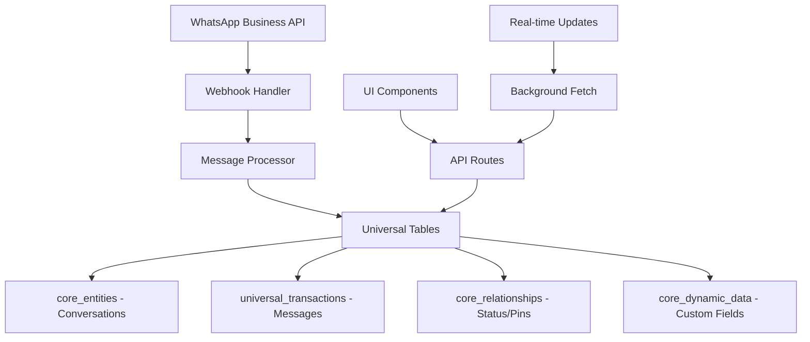

# WhatsApp Enterprise Implementation - Complete Bundle

## Implementation Summary

This bundle contains a complete, production-ready WhatsApp Business integration for HERA ERP with the following implementations:

### 1. **Three WhatsApp Interfaces**
- **WhatsApp Desktop** (`/whatsapp-desktop`) - Full desktop experience with all features
- **Enterprise WhatsApp** (`/enterprise/whatsapp`) - Business-focused with auto-refresh
- **Canonical WhatsApp** (`/salon/whatsapp-canonical`) - Original HERA implementation

### 2. **Key Components Created**
```
✅ MessageContextMenu.tsx    - Right-click actions on messages
✅ AttachmentMenu.tsx        - Media attachment options
✅ EmojiPicker.tsx           - Categorized emoji selection
✅ MediaMessage.tsx          - Display images, videos, documents
✅ ForwardMessageDialog.tsx  - Multi-select contact forwarding
✅ MessageStatusHistory.tsx  - Delivery timeline view
✅ TemplateMessageDialog.tsx - Pre-approved templates
✅ InteractiveMessage.tsx    - Buttons and lists
✅ KeyboardShortcuts.tsx     - Help dialog
```

### 3. **API Endpoints**
```
✅ /api/v1/whatsapp/conversations     - Conversation management
✅ /api/v1/whatsapp/messages/[id]     - Message operations
✅ /api/v1/whatsapp/send              - Send messages
✅ /api/v1/whatsapp/agents            - Agent management
✅ /api/v1/whatsapp/webhook           - Status updates
✅ /api/v1/whatsapp/search            - Global search
✅ /api/v1/whatsapp/messages-simple   - Simplified API
```

### 4. **Key Features**
- ✅ Real-time updates without page refresh
- ✅ Message reply and forward
- ✅ Status tracking (sent, delivered, read)
- ✅ 24-hour window compliance
- ✅ Template messages
- ✅ Rich media support
- ✅ Dark/light theme
- ✅ Multi-tenant isolation
- ✅ HERA 6-table architecture

## Quick Start

### 1. Install Dependencies
```bash
npm install next-themes
npx shadcn@latest add context-menu
```

### 2. Set Environment Variables
```env
DEFAULT_ORGANIZATION_ID=3df8cc52-3d81-42d5-b088-7736ae26cc7c
WHATSAPP_PHONE_NUMBER_ID=your_phone_id
WHATSAPP_ACCESS_TOKEN=your_token
WHATSAPP_WEBHOOK_VERIFY_TOKEN=your_verify_token
```

### 3. Test the Implementation
```bash
# Insert test messages
node whatsapp-bundle/test-whatsapp-messages.js

# Test status updates
node whatsapp-bundle/test-whatsapp-status.js
```

### 4. Access the Interfaces
- Desktop: http://localhost:3000/whatsapp-desktop
- Enterprise: http://localhost:3000/enterprise/whatsapp
- Canonical: http://localhost:3000/salon/whatsapp-canonical

## Architecture Overview



## File Locations

### Main Pages
- `/src/app/whatsapp-desktop/page.tsx`
- `/src/app/enterprise/whatsapp/page.tsx`
- `/src/app/salon/whatsapp-canonical/page.tsx`

### Components
- `/src/components/whatsapp/*.tsx`

### APIs
- `/src/app/api/v1/whatsapp/*.ts`

### Tests
- `/whatsapp-bundle/test-*.js`

### Documentation
- `/whatsapp-bundle/*.md`

## Recent Updates

### Auto-Refresh Fix (Latest)
- Background data fetching without page reloads
- Smart updates only when data changes
- Visual indicators for refresh status
- Manual refresh option
- Toggle auto-refresh on/off

### Status Tracking
- Complete webhook handler for status updates
- Visual status indicators
- Status history timeline
- Error handling for failed messages

### Enterprise Features
- Agent assignment system
- 24-hour window warnings
- Template message support
- Interactive components

## Production Checklist

- [ ] Configure WhatsApp webhook URL
- [ ] Set all environment variables
- [ ] Enable webhook signature verification
- [ ] Test message delivery
- [ ] Test status updates
- [ ] Verify 24-hour compliance
- [ ] Test template messages
- [ ] Configure rate limiting
- [ ] Set up monitoring
- [ ] Document API endpoints

## Support & Maintenance

This implementation follows HERA's universal architecture principles and is designed for enterprise-scale deployments. All data is stored in the 6 universal tables with complete multi-tenant isolation.

For updates or issues, refer to the documentation in this bundle or create an issue in the HERA repository.